# Claude Code 512K 泄露源码里藏着 Agent 架构的终极答案

> 2026 年 3 月 31 日，安全研究员在 npm 的 `@anthropic-ai/claude-code` 包里发现了一个 59.8 MB 的 sourcemap 文件——Bun 打包器默认生成，Anthropic 忘了在 `.npmignore` 里排除 `*.map`。512,000 行未混淆的 TypeScript 源码全部泄露。
>
> 这是目前为止最详细的生产级 Agent 架构标本。本文把这份"X 光片"拆开，对照行业主流方案，回答一个工程问题：**当你的系统接口不再由人触发，而是被 Agent 调用时，你的架构该怎么变？**

---

## 一、为什么要讨论这个问题

过去，你的后端 API 被前端页面调用，请求模式是可预测的：用户点击 → 发请求 → 等响应。

现在，调用你 API 的可能是一个 Agent。它的行为模式完全不同：

```
传统调用方：                     Agent 调用方：
├── 一次请求，一个明确意图          ├── 一个循环，多轮试探
├── 参数来自表单/URL               ├── 参数由 LLM 生成（可能有幻觉）
├── 调用频率可预测                  ├── 可能突然并行调 10 个接口
├── 出错了用户自己重试              ├── 出错了 Agent 自动重试（可能死循环）
├── 一个用户一个会话                ├── 一个 Agent 可能 fork 5 个子 Agent
└── 调用链路简单                    └── Agent → SubAgent → Tool → 你的 API
```

**如果你不理解 Agent 是怎么调用工具的，你设计的 API 就不是为 Agent 时代准备的。**

这不是理论问题。Claude Code 泄露的源码让我们第一次看到了一个生产级 Agent 的完整调用架构——从请求进入到工具调用到结果返回的每一个环节。结合 OpenAI Agents SDK、LangGraph、MCP 协议等主流方案，我们可以提炼出一套行业通用的 Agent 调用层设计模式。

---

## 二、Claude Code 的核心发现：8 步循环 + 38 个工具 + 6 层安全

### 2.1 Agent Loop——令人意外的简单

512,000 行代码的核心是一个 `query.ts` 文件（约 1,730 行），里面是一个 **8 步 while 循环**：

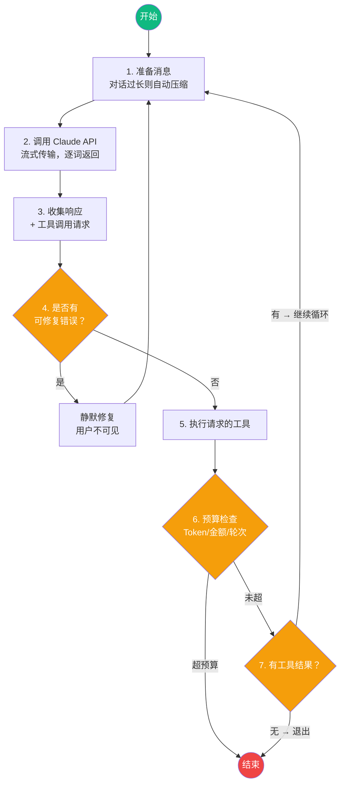

**注意这里面没有什么：**
- 没有意图分类器
- 没有任务路由器
- 没有 RAG 管道
- 没有 DAG 编排引擎
- 没有计划器/执行器拆分

**模型本身决定调用什么工具、什么时候调、什么时候停。** 所有"智能"都在模型的推理里，工程层只负责把工具注册好、把结果喂回去。

这是 2026 年 Agent 架构最重要的设计哲学：

> **框架越简单，模型能力越能释放。过度编排反而约束了模型的推理空间。**

### 2.2 工具调度——不是全给模型，而是分层加载

Claude Code 注册了 38+ 个工具，但不是每次都全部暴露给模型。它使用了一个精妙的**三层加载策略**：

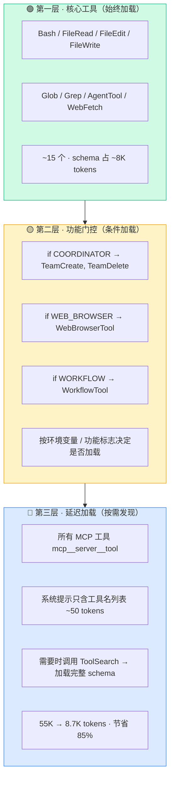

**为什么这个设计值得学习？** 因为当你有 100+ 个 MCP 工具时，全部加载 schema 会吃掉几万 tokens 的上下文窗口。Claude Code 的解法是：**只让模型知道工具名字，需要用时再查 schema。** 这就像你知道公司有个"报销系统"，但不需要提前记住所有表单字段——用的时候再查。

### 2.3 并行 vs 串行执行——不是全部并行

当模型同时请求多个工具时，执行器做了一个关键判断：

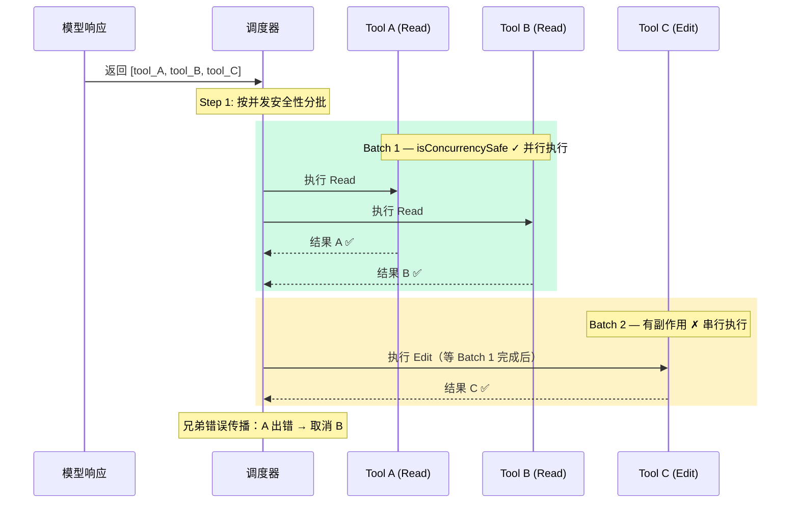

**每个工具接口上有一个关键属性：**

```typescript
interface Tool {
  name: string
  description: string
  inputJSONSchema: JSONSchema
  call(input, context): Promise<Result>

  isConcurrencySafe(input): boolean  // ← 能否并行？
  isReadOnly?: boolean               // ← 无副作用？
  validateInput?(input): ValidationResult
  checkPermissions?(input, context): PermissionResult
}
```

这给我们的 API 设计提了一个要求：**你的接口要明确声明自己是只读还是有副作用。** Agent 需要这个信息来决定能不能并行调你。

### 2.4 安全管道——6 层纵深防御

Claude Code 的每一次工具调用都要过 6 层安检：

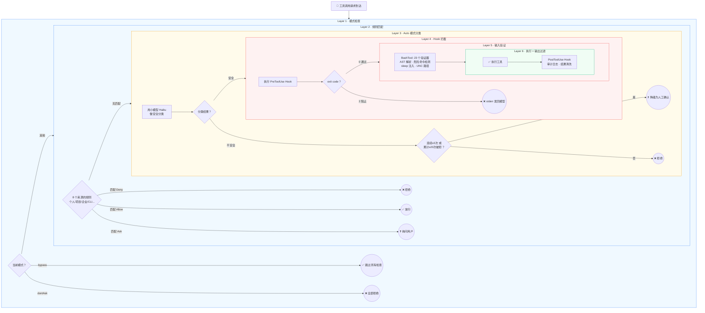

**核心启示：** Agent 调用你的 API 时，你不能只靠 API Key 做鉴权。你需要的是一套**工具级别的权限管控**——哪些工具允许 Agent 自主调用、哪些需要人工审批、哪些在特定条件下触发告警。

### 2.5 Hook 系统——13 个生命周期事件

Claude Code 的 Hook 系统覆盖了 Agent 生命周期的每个关键节点：

| 阶段 | 事件 | 用途 |
|------|------|------|
| 会话 | `SessionStart` | Agent 启动时初始化环境 |
| 输入 | `UserPromptSubmit` | 拦截/修改用户输入 |
| 工具调用前 | `PreToolUse` | 权限检查、参数修改、阻止执行 |
| 工具调用后 | `PostToolUse` | 审计日志、结果验证 |
| 工具失败 | `PostToolUseFail` | 错误上报、降级策略 |
| 子代理 | `SubagentStart/Stop` | 子任务追踪 |
| 权限 | `PermissionDenied` | 安全告警 |
| 配置 | `ConfigChange` | 动态配置更新 |

**5 种 Hook 实现方式：**

| 类型 | 怎么执行 | 适用场景 |
|------|---------|---------|
| **Command** | Shell 命令，JSON 通过 stdin 传入 | 简单脚本拦截 |
| **Prompt** | 用小模型（Haiku）评估条件 | AI 驱动的动态判断 |
| **Agent** | 带工具访问的完整子代理 | 复杂审查逻辑 |
| **HTTP** | POST 到外部端点 | 对接企业审批系统 |
| **Function** | TypeScript 回调 | 内存级别的会话拦截 |

配置示例：

```json
{
  "hooks": {
    "PreToolUse": [
      {
        "matcher": "Bash",
        "hooks": [{
          "type": "command",
          "command": "/path/to/validate-command.sh"
        }]
      }
    ],
    "PostToolUse": [
      {
        "matcher": "*",
        "hooks": [{
          "type": "http",
          "url": "https://audit.internal.com/agent-actions"
        }]
      }
    ]
  }
}
```

---

## 三、MCP vs Skill vs Function Calling vs Hook——到底该用哪个

看完 Claude Code 的架构后，一个核心取舍问题浮出水面：**你的系统接入 Agent 调用层时，该选哪种技术方案？**

这四种机制不是互斥的，它们在不同的层级解决不同的问题：

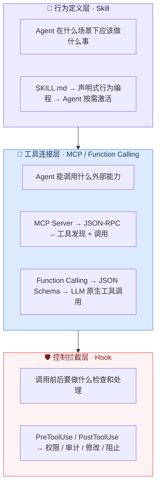

### 3.1 四种机制的精确对比

| 维度 | MCP | Skill | Function Calling | Hook |
|------|-----|-------|-----------------|------|
| **解决什么问题** | Agent 如何发现和调用外部工具 | Agent 在什么场景用什么流程 | LLM 如何输出结构化工具调用 | 工具调用的拦截/审计/控制 |
| **类比** | USB 接口标准 | 员工操作手册 | 函数签名 | 中间件/拦截器 |
| **定义方式** | JSON-RPC Server + Tool Schema | Markdown 文件（SKILL.md） | JSON Schema 注册 | 配置文件 + 脚本 |
| **触发方式** | Agent 主动调用 | Agent 根据场景自动激活 | LLM 生成 tool_use 指令 | 工具调用前后自动触发 |
| **标准化程度** | 高（Anthropic 发起，Linux Foundation 托管） | 中（agentskills.io 格式规范，无质量标准） | 高（各 LLM 厂商 API 规范） | 低（各框架自定义） |
| **跨平台** | 是（Cursor/Claude/Codex/Gemini 均支持） | 是（多编辑器支持） | 绑定 LLM 厂商 API | 绑定特定 Agent 框架 |
| **Token 成本** | Schema 一次加载，固定成本 | 发现阶段永远消耗 + 激活时额外消耗 | Schema 每次请求携带 | 不消耗 Token |
| **适合谁用** | 工具/API 提供方 | Agent 行为设计者 | 应用开发者 | 平台/安全团队 |

### 3.2 什么时候用什么

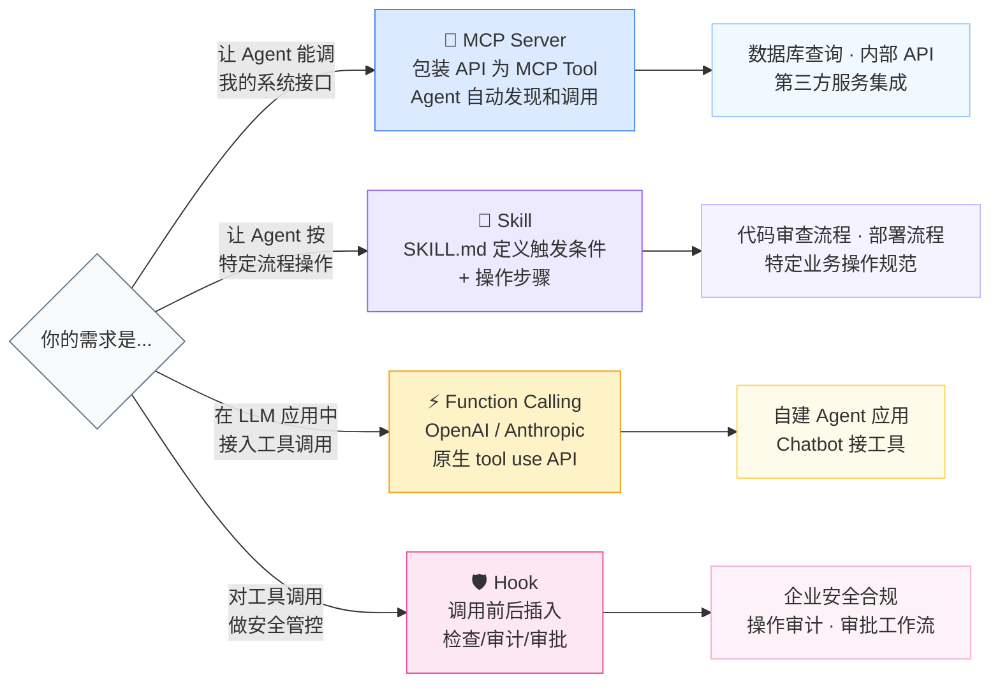

### 3.3 实际系统中的组合使用

在真实生产环境中，这四种机制是**分层叠加**使用的：

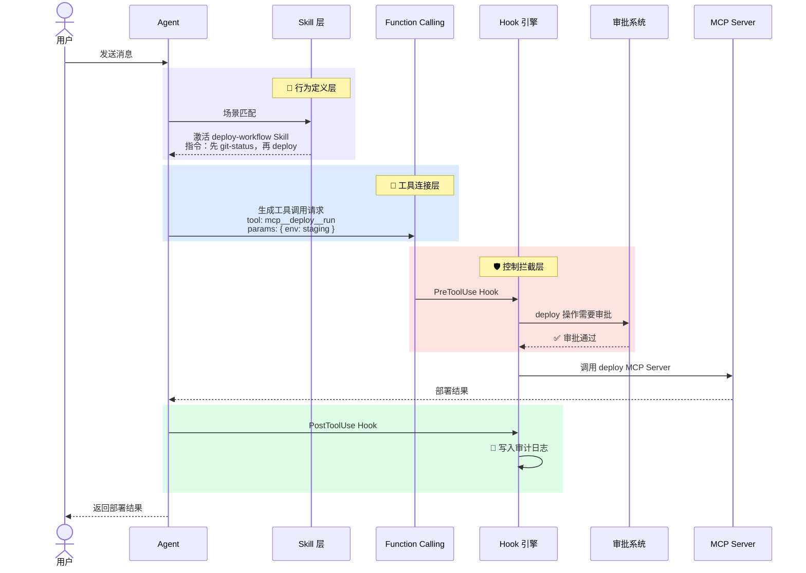

---

## 四、行业通用 Agent 调用层架构设计

基于 Claude Code 源码、OpenAI Agents SDK、LangGraph、MCP 协议等方案，提炼出以下通用架构。

### 4.1 整体架构

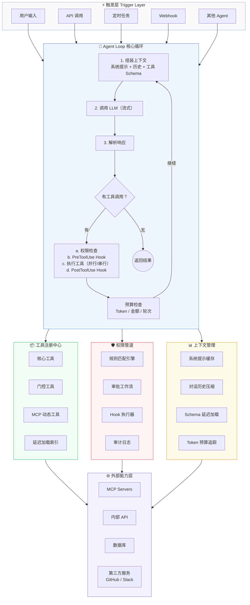

### 4.2 各模块设计详解

#### 模块一：Agent Loop（核心循环）

Claude Code 的实践告诉我们：**循环越简单越好。** 不要在循环里加入路由器、分类器、计划器——让模型自己决定。

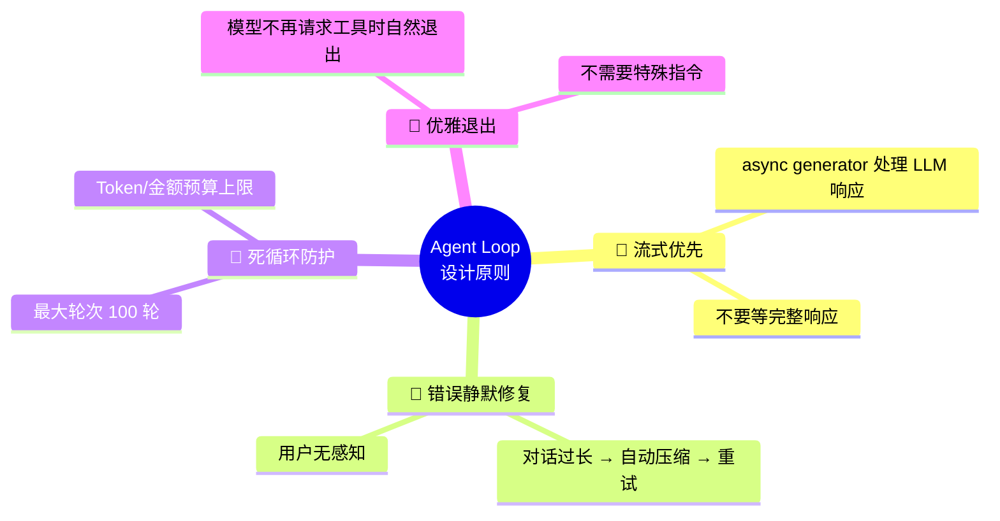

什么时候需要在循环外加编排？**只有当任务确定性很高、步骤固定不变时**，才需要 Plan-and-Execute 模式。大多数场景下，让模型自由推理 + 调用工具的 ReAct 循环就够了。

| 编排模式 | 适用场景 | 复杂度 |
|---------|---------|--------|
| **纯 ReAct 循环** | 1-5 步工具调用，大多数日常任务 | 低 |
| **Plan-and-Execute** | 5+ 步、有并行机会的复杂任务 | 中 |
| **Supervisor-Worker** | 多 Agent 协作，需要协调 | 高 |
| **Swarm** | 开放式探索，Agent 间自由交接 | 高 |

Claude Code 选的是纯 ReAct + 可选的子代理 fork。这对大多数场景已经够了。

#### 模块二：工具注册中心（Tool Registry）

从 Claude Code 的三层加载策略中，提炼出通用设计：

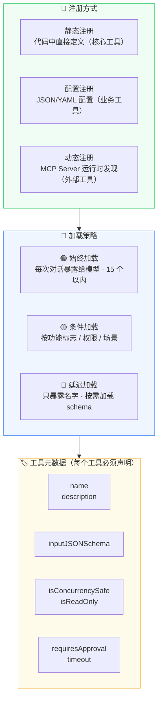

**核心设计决策：工具数量怎么控制？**

| 工具数量 | Schema Token 消耗 | 推荐策略 |
|---------|-------------------|---------|
| < 15 个 | < 10K tokens | 全部加载，不用优化 |
| 15-50 个 | 10-30K tokens | 分组加载，核心 + 按需 |
| 50-200 个 | 30-100K+ tokens | 必须用延迟加载，否则上下文会被撑爆 |

Claude Code 的 ToolSearchTool 方案：工具名列表 ~50 tokens → 模型搜索 → 加载目标工具 schema → 调用。**从 55K tokens 降到 8.7K tokens，节省 85%。**

#### 模块三：权限管道（Permission Pipeline）

从 Claude Code 的 6 层安全 + OpenAI Agents SDK 的审批机制中，提炼出通用模式：

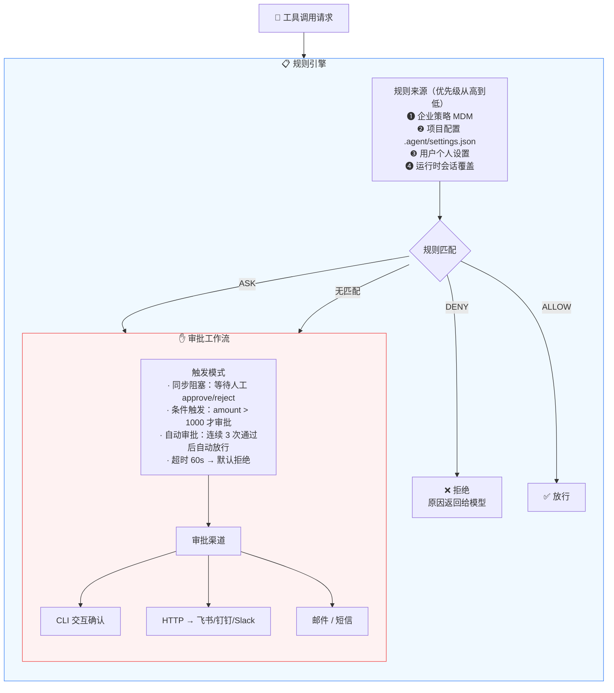

#### 模块四：Hook 系统

Hook 是 Agent 架构中最灵活的扩展点。基于 Claude Code 的实现，提炼出通用 Hook 设计：

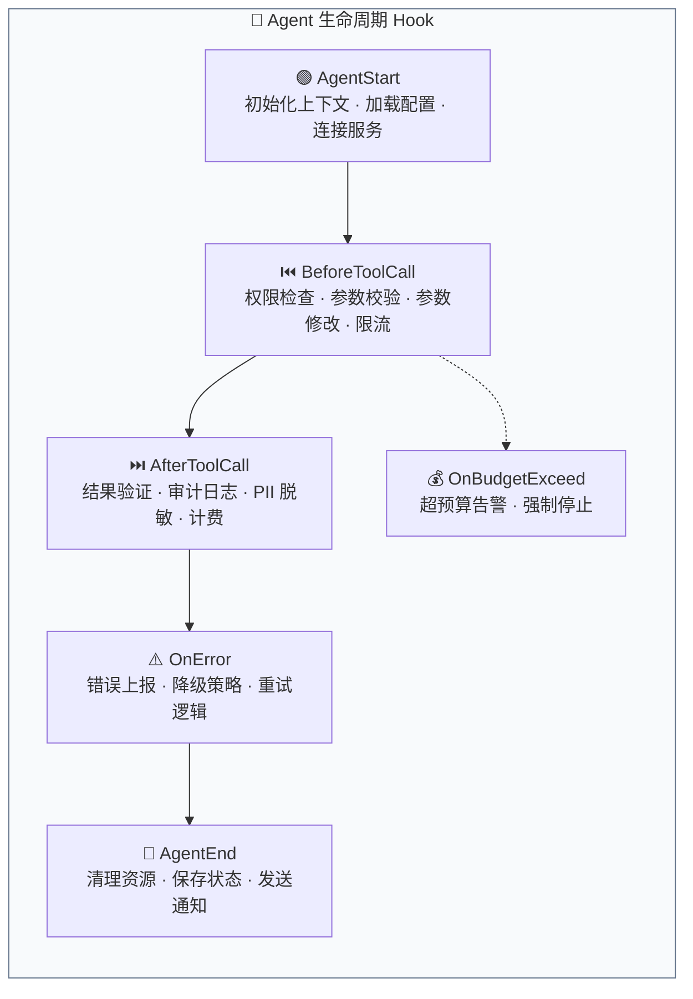

**Hook 执行协议：**

- **输入**：JSON payload（通过 stdin 或 HTTP body）

```json
{
  "event": "BeforeToolCall",
  "session_id": "abc123",
  "tool_name": "deploy",
  "tool_input": { "env": "production", "version": "v2.3.0" },
  "user": "zhangsan",
  "timestamp": "2026-03-30T10:00:00Z"
}
```

- **输出**：`exit code 0` → 允许执行 | `exit code 2` → 阻止执行（stderr 发回模型）| 修改后的 JSON → 替换原始参数

#### 模块五：上下文管理（Context Manager）

Claude Code 的上下文管理是整个架构中最精细的部分——5 层渐进式压缩：

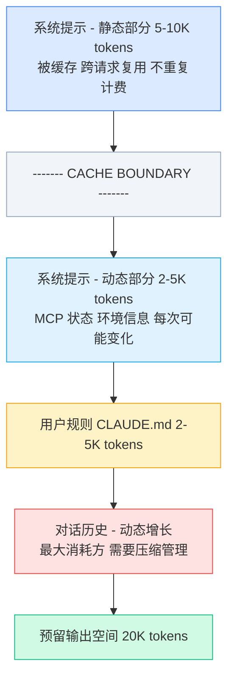

**渐进式压缩策略（按占用率触发）：**

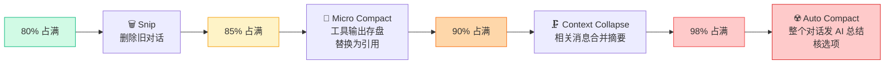

**缓存边界设计**是一个关键成本优化：系统提示分为静态（每次一样）和动态（每次可能不同）两部分，中间用标记隔开。静态部分命中缓存可以省大量 Token 费用——Claude Code 通过这个设计为 Anthropic 节省了数百万美元。

### 4.3 完整的 Agent 调用层参考实现

把以上模块组合起来，以一个"企业内部 Agent 平台"为例：

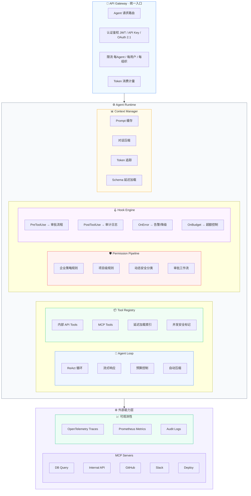

---

## 五、落地建议：你现在该做什么

### 5.1 如果你是 API 提供方

你的接口未来会被 Agent 调用。现在就该做的事：

| 优先级 | 改造项 | 具体做法 |
|--------|--------|---------|
| P0 | 把 API 包装成 MCP Server | 使用 MCP SDK（TypeScript/Python），一个 API 对应一个 Tool |
| P0 | 每个接口声明副作用属性 | `isReadOnly`、`isConcurrencySafe`，Agent 需要这个信息做并行决策 |
| P1 | 接口描述面向 LLM 优化 | description 要写清"做什么、什么时候用、什么时候不用"（和 Skill 的 WHAT/WHEN/NOT 同理）|
| P1 | 错误信息结构化 | Agent 会把错误信息喂回模型，结构化的错误信息比 stack trace 有用得多 |
| P2 | 支持幂等 | Agent 可能会重试，接口必须幂等 |
| P2 | 限流策略适配 | Agent 调用模式不同于人类，可能短时间大量并发 |

### 5.2 如果你是 Agent 平台搭建方

| 优先级 | 搭建项 | 关键设计决策 |
|--------|--------|-------------|
| P0 | Agent Loop | 用最简单的 ReAct 循环，不要过度编排 |
| P0 | Tool Registry | 三层加载策略（始终/条件/延迟），控制 Token 消耗 |
| P0 | Permission Pipeline | 至少实现规则匹配 + 审批工作流，否则 Agent 裸奔 |
| P1 | Hook 系统 | PreToolUse + PostToolUse 两个 Hook 覆盖 80% 场景 |
| P1 | 上下文管理 | 实现至少一级压缩策略，否则长对话会崩 |
| P2 | 多 Agent 编排 | 从子代理 fork 开始，不要上来就搞 Swarm |
| P2 | 可观测性 | OpenTelemetry 追踪每次 LLM 调用和工具调用的 token/延迟/成本 |

### 5.3 如果你是企业安全/合规团队

| 关注点 | 建议 |
|--------|------|
| Agent 能调用什么 | 实现工具级 RBAC，不是 API 级——Agent 可能通过一个 MCP Server 访问多个操作 |
| 调用前审批 | 高危操作（生产部署、数据删除、资金转账）必须有人工审批 Hook |
| 审计追踪 | PostToolUse Hook 全量记录：谁的 Agent、调了什么、传了什么参数、返回了什么 |
| 成本控制 | 设定 Agent 级别的 Token 预算，超额自动停止 |
| 数据泄露 | Agent 的输出可能包含敏感数据，需要输出侧 PII 脱敏 |

---

## 六、结语：从"被调用"到"为 Agent 而设计"

回到开头的问题：**当你的系统接口不再由人触发，而是被 Agent 调用时，你的架构该怎么变？**

Claude Code 的 512K 行源码给出了一个清晰的答案：

1. **Agent 的核心是一个简单循环**——不要过度设计编排层
2. **工具注册需要分层加载**——控制上下文消耗是架构级问题
3. **安全不能靠模型自觉**——需要工程层面的 6 层纵深防御
4. **Hook 是最灵活的扩展点**——权限、审计、审批都通过 Hook 实现
5. **上下文是稀缺资源**——压缩策略和缓存设计决定了长对话的质量和成本

过去十年，我们学会了"为浏览器而设计"——响应式布局、SPA、API 网关。

未来十年，我们要学会"为 Agent 而设计"——工具发现、并发安全声明、结构化错误、审批 Hook、Token 预算。

**API 还是那个 API。但调用方变了，设计哲学就要变。**

---

*本文基于 Claude Code 2026 年 3 月泄露的源码分析，结合 OpenAI Agents SDK、LangGraph、MCP 协议等公开技术文档撰写。*
