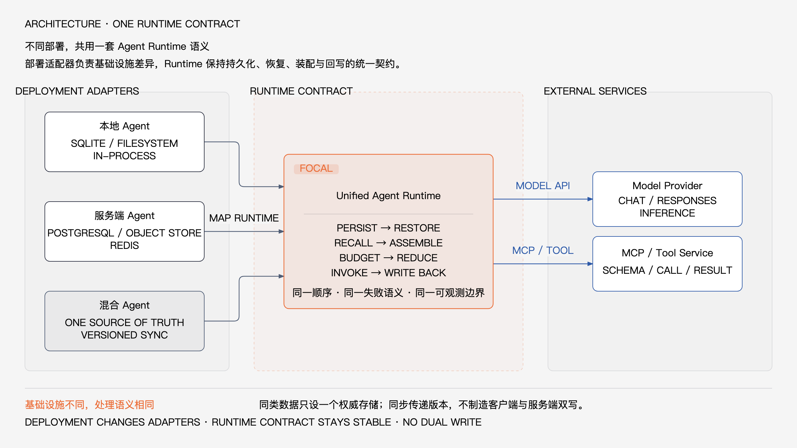
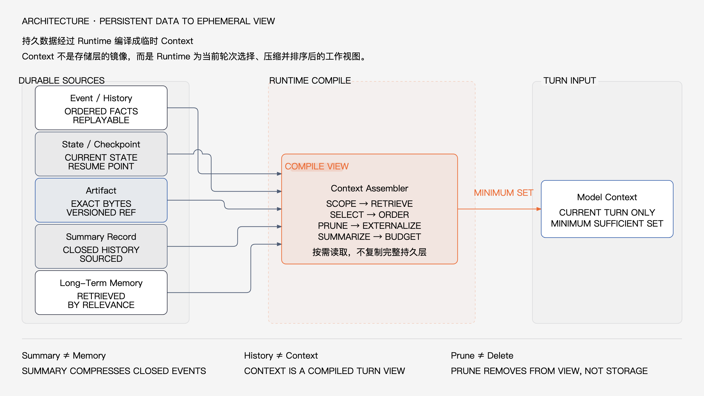
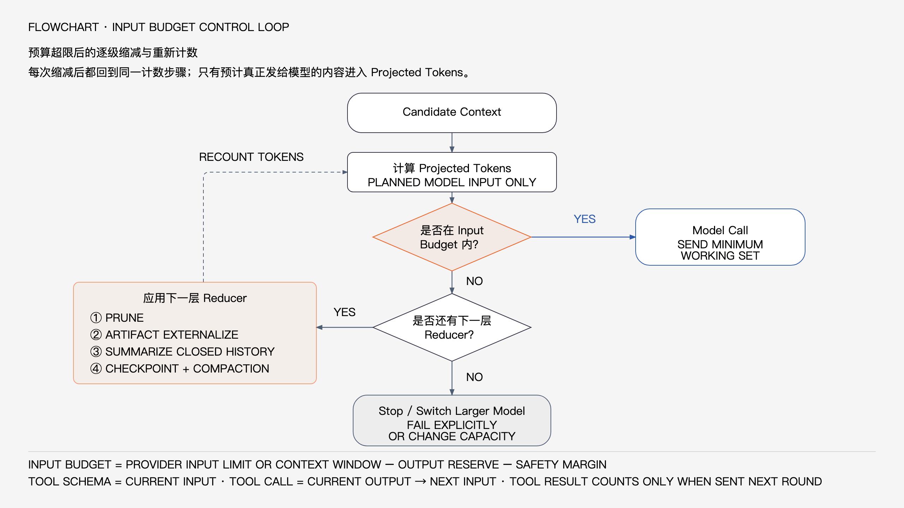

# Agent 上下文与记忆工程：决定 Agent 是否好用的核心系统

开发 Agent 时，模型能力只是体验的一部分。同一个模型，接入不同的上下文与记忆系统，最终可能表现得像两个完全不同的产品。系统能否记住已确认的约束，能否在几十轮工具调用后继续推进，能否在进程重启后恢复，能否避免把错误旧信息塞给模型，往往比单次回答是否精彩更重要。

这些能力来自一套持续运行的 Agent Runtime。无论 Agent 部署在本地、服务端还是两端协同，全文都围绕同一条主链展开：

```text
原始 Event 持久化
→ State 恢复
→ Memory 召回
→ Context 装配
→ 预算判断
→ 裁剪 / Artifact 外部化 / Summary / Compaction
→ 模型与 Tool 调用
→ Event、State、Artifact、Checkpoint 回写
→ Memory Candidate 治理与晋升
```

这条链每一轮都在回答三个问题：读取什么，怎样处理，写回什么。真正困难的不是简单决定“存什么”，而是区分哪些信息必须原样保存、哪些只进入本轮推理、哪些可从活动窗口移出、哪些可有损压缩、哪些值得跨会话保留，以及失败后怎样回到可恢复状态。

本文先解释这条主链为什么决定 Agent 体验，再统一部署边界和数据模型；随后展开一轮请求、活动 Context 控制、Memory 与持久化，最后给出评价指标。

## 1. 上下文工程为什么决定 Agent 是否好用

Agent 的工作不是一次问答，而是一段持续变化的执行过程。用户会补充条件，模型会提出计划，工具会返回结果，运行环境会变化，任务会暂停，服务也可能重启。如果开头给出的 Runtime 主链不能把这些变化组织成稳定、可恢复的工作集，模型再强也会表现出明显的不可靠。

第一类问题是失忆与约束丢失。模型只能处理本轮窗口中的内容；早期信息被挤出窗口或被错误压缩后，Agent 可能忘记用户指定的目录、已经否决的方案、权限边界、验收条件和未完成步骤，甚至重复执行有副作用的操作。硬约束不能只埋在长对话里，必须在 State 和 Context 装配中获得稳定位置。

第二类问题是错误召回。Memory 越多不代表效果越好；过期偏好、其他项目配置、错误主体的数据或被新版本替代的事实一旦进入 Context，模型会把它们当作当前事实继续推理。错误 Memory 往往比缺少 Memory 更危险，因为它以“系统已经知道”的形式持续影响决策。

第三类问题是长任务中断。持续数小时的 Agent 会跨越模型调用、工具调用和进程生命周期。如果执行位置只存在于进程内存，Worker 崩溃、设备休眠或人工暂停都会破坏连续性。恢复必须依赖已持久化 Event、State、Artifact 与 Checkpoint，而不是依赖重新发送整段聊天。

第四类问题是 Token 浪费。把全部 History、全部 Memory 和完整 Tool Result 每轮重复发送，不仅昂贵，还会降低有效信息密度；窗口中无关内容越多，模型越难找到关键约束和当前证据。因此，上下文工程追求的不是“让模型看见最多信息”，而是让模型每轮看见最小但充分的工作集。

一套成熟系统需要在五个目标之间取得平衡：

- **连续性**：跨轮次、跨工具、跨进程继续完成同一个任务；
- **准确性**：保留事实来源、版本和当前有效值，避免无依据改写；
- **相关性**：只召回与当前主体、目标和阶段相关的信息；
- **可恢复性**：从确定的事件位置和执行状态重新开始；
- **成本平衡**：在质量、延迟、Token 与存储成本之间保持可控。

这些目标存在真实冲突：完整 History 有利于审计，却不适合全部进入窗口；激进摘要节省 Token，却可能损失事实、否定关系和未完成事项；广泛召回提升命中机会，却增加错误 Memory 和提示注入风险；频繁 Checkpoint 提高恢复精度，却带来更多写入和协调成本。

上下文工程的价值就在于明确这些取舍，让主链上的每一次选择、压缩、召回和写回都可解释、可追踪、可回退。它不是 Prompt 技巧的延伸，而是一套围绕模型调用建立的数据与运行时系统。

## 2. Agent 在哪里运行：三种部署，一套 Runtime 逻辑

Agent 可以运行在用户设备、云端服务，也可以把执行和数据分布在两端。部署位置会改变权限边界、网络条件、可用性和并发模型，但不应改变开头那条 Runtime 主链的处理语义。



统一 Runtime 在三种部署中都要完成相同职责：

- 接收并持久化原始事件；
- 从事件投影或恢复当前 State；
- 查询与当前请求相关的 Memory；
- 选择 History、Summary 与 Artifact 摘录；
- 计算本次模型调用的输入和输出预算；
- 执行裁剪、外部化、摘要与 Compaction；
- 调用模型和工具；
- 写回结果、状态变化与 Checkpoint；
- 从稳定结果中提取 Memory Candidate。

本地 Agent 的运行边界主要是单设备、单用户或低并发环境。Runtime 靠近用户文件和本地工具，容易获得离线能力与较低的数据移动成本，但必须面对设备休眠、进程退出、磁盘故障和本地权限变化。无论进程是否常驻，事件先落地、状态可恢复、工具副作用可确认这些语义都不能省略。

服务端 Agent 的运行边界主要是多用户、多 Worker、后台执行和跨设备访问。Runtime 需要在并发调度中维持身份隔离、幂等、版本和执行租约；某个 Worker 退出后，另一个 Worker 应能从同一恢复边界继续，而不是依赖前一个进程的内存。服务端改变了协调方式，没有改变数据对象和生命周期顺序。

混合 Agent 将模型调用、工具执行、数据保管或调度分布在两端。例如工具可以在设备上执行，而会话由服务端调度；敏感内容也可以留在设备，只把授权片段交给远端模型。此时 Runtime 还要处理网络断开、传输授权、版本同步和部分可见性，但不能把混合部署理解为“所有数据在客户端和服务端各写一份”。

不论哪种部署，每类数据都应有唯一 Source of Truth。数据可以复制、缓存和建立索引，但必须知道哪一方负责确认当前有效版本，冲突也必须回到该权威来源解决。无版本双写会制造两个互相矛盾的真相。

Context 则是一次模型调用的临时工作集，可以由本地 Runtime 装配、由服务端装配，也可以在混合链路中分阶段装配；它不要求两端各持久化一份。为了审计和复现，系统可以保存 Context Manifest，记录本轮引用了哪些版本的数据，但 Manifest 是装配说明，不是完整 Prompt 的第二份权威副本。

所以，部署设计要回答的是“主链的每一步在哪里执行、跨越什么信任边界、失败后由谁恢复”，而不是重新发明三套上下文逻辑。具体存储技术与数据落点统一放到第 6 章讨论。

## 3. 统一数据模型：不要把 History、Context、Summary 和 Memory 混在一起

上下文系统最常见的设计错误，不是少一个数据库，而是概念边界混乱。一旦把不同生命周期、不同精度和不同用途的数据统称为“上下文”，主链中的裁剪、恢复、召回和写回都会失去依据。



统一数据模型包含六个核心对象。

**Event / History。** Event 是不可变或追加式记录，用户消息、Assistant 输出、Tool Call、Tool Result、错误、审批、取消、重试和状态转换都可以表示为事件。同一 Session 内的 Event 需要稳定顺序、唯一标识、时间、主体和幂等键；History 则是一段有序 Event 的逻辑视图，用于回答“过去真实发生了什么”，并支持审计、重放、State 投影、Summary 生成和故障诊断。

完整保存 History，不代表每轮都把完整 History 发给模型。History 是持久化事实序列，Context 是为本轮挑选的工作集，所以 **History != Context**。

**State。** State 是从 Event 演化得到的结构化投影，通常包括当前目标、阶段、硬约束、已完成事项、下一步、未决问题、Pending Tool、Pending Approval、活跃 Artifact 和最新错误。它回答“现在进行到哪里，接下来允许做什么”。State 更新必须带 Version 或比较条件，关键约束、权限和执行状态应由确定性逻辑维护，不能完全依赖模型概括。

**Artifact。** Artifact 是需要精确保留并按需读取的内容，包括代码文件、长日志、报告、网页快照、图片、表格、生成文档和大型 Tool Result。内容与元数据共同记录 ID、Version、Hash、类型、大小、权限和来源 Event；进入 Context 的通常只是引用、必要元数据和当前相关片段。外部化解决的是“精确内容不能一直占窗口”，不是“内容可以丢弃”。

**Summary。** Summary 是已闭合 History 的可复用有损投影，保留后续仍需要的目标、决定、事实、约束、结果、未完成事项和 Artifact 引用。语义阶段闭合时，Runtime 可以主动生成 Summary；预算压力出现时，也可以为尚未压缩的闭合 History 按需生成。两种触发方式写入同一种 Summary Record，并记录覆盖的 Event 范围、来源 Hash、Version、生成方式和时间。

Summary 可以在后续 Context 中替代其覆盖范围内的大部分逐条 History，但不能替代原始 Event 和精确 Artifact。它服务当前任务或会话的连续性；Memory 服务未来请求和跨会话复用，所以 **Summary != Memory**。Summary 只能作为 Memory Candidate 的来源之一，不能整体自动晋升。

**Memory。** Memory 是经过治理、未来仍有价值的持久知识，例如用户稳定偏好、项目长期约束、已确认环境事实、可复用经验或用户明确要求记住的信息。每条 Memory 都应带身份范围、主题、来源、版本、有效期、敏感级别和状态；Runtime 按身份、Scope、结构化条件和检索相关性选择少量内容，而不是启动时全部注入。

**Context。** Context 是 Runtime 在调用模型前动态装配的临时输入，可能包含 System Prompt、规则、当前用户输入、State、Recent History、Summary、相关 Memory、Tool Schema 和 Artifact 摘录。它在下一轮重新计算，不是长期数据库，也不应被设计成无限增长的 Prompt 字符串。Context Manifest 可以追踪本轮引用了哪些数据版本，但不会取代这些数据的权威记录。

裁剪只让某项内容不进入本轮活动 Context；被裁剪的数据仍可留在权威存储中，并在未来满足条件时重新进入。删除则是数据生命周期操作，需要传播到权威记录及相关派生数据。因此 **裁剪 != 删除**。

History != Context、Summary != Memory、裁剪 != 删除，是后续生命周期、预算和恢复机制的共同边界。Compaction 也不属于上述持久数据类型：它是一项 Runtime 操作，第 5 章会说明它如何通过新的 Context Manifest 重组下一轮活动 Context。

## 4. 一轮请求的完整生命周期

一次可靠的 Agent 请求不是“拼 Prompt，然后调用模型”。

它是一条从原始输入持久化开始，到结果、状态和长期记忆治理结束的事务链。

下面按执行顺序说明每一步读取什么、处理什么、写回什么。

**第一步：原始事件持久化**

读取的是传入的用户消息、上传内容引用、身份信息、Session 标识、客户端幂等键和请求元数据。

Runtime 首先校验主体、权限、消息大小和幂等性，然后为事件分配稳定 ID 与单调 Sequence。

处理重点不是理解语义，而是确保输入已经成为可恢复的事实。

写回 Event Store 的内容包括原始消息、来源、时间、顺序、幂等键和必要的 Artifact 引用。

只有持久化成功后，后续执行才应继续。

这样即使 Worker 随后崩溃，用户刚刚提交的输入仍然存在。

**第二步：State 恢复**

读取的是最新 Checkpoint、当前 State 版本、Checkpoint 之后的增量 Event、Pending Tool、Pending Approval 和活跃 Artifact 元数据。

Runtime 校验 Checkpoint 的 Event Sequence 与 State Version，然后应用后续增量事件，得到当前可执行状态。

如果快照缺失或校验失败，可以从更早 Checkpoint 加增量恢复；最坏情况下才从 Event 起点重放。

写回通常不是新的业务数据，而是恢复标记、Lease 或必要的 State 修复版本。

恢复完成后，Runtime 必须明确当前目标、硬约束、执行位置和未决副作用。

**第三步：Memory 召回**

读取的是当前用户输入、目标、主体身份、Agent 身份、项目或工作区、当前阶段和允许访问的 Memory Scope。

Runtime 先执行身份与权限过滤，再执行结构化查询、关键词或全文检索、可选向量召回和重排。

召回结果还要经过版本、TTL、冲突状态、来源可信度、敏感策略和 Token Budget 检查。

写回的可以是检索追踪、命中分数和使用记录，但不会因为一次命中就改写 Memory 的权威内容。

未通过校验的候选项不进入 Context。

**第四步：Context 候选集装配**

读取的是 System Prompt、当前规则、当前用户输入、恢复后的 State、最近 History、有效 Summary、召回 Memory、可用 Tool Schema 和必要 Artifact 片段。

Runtime 为每个候选项标注来源、优先级、精度要求、可裁剪性、可摘要性、版本和预估 Token。

处理结果是候选 Context，而不是最终发送内容。

此阶段写回的通常是临时装配记录；需要可审计时，可以在最终调用前生成 Context Manifest。

候选项之间还要消除明显冲突，例如 State 已确认新值时，不应继续选择被替代的旧 History 投影。

**第五步：预算判断与逐级缩减**

读取的是候选 Context 的 Token 估算、模型窗口限制、API 输入限制、输出上限、当前输出预留、预计 Tool 增长和安全余量。

Runtime 按“确定性裁剪 → Artifact 外部化 → 选择或按需生成 Summary → Checkpoint + Compaction”的顺序处理。

每执行一级都重新计算预算，不够时才进入下一级。

处理不能破坏当前用户输入、硬约束、Pending Approval、正在执行的 Tool 对和当前步骤所需精确证据。

写回可能包括新的 Artifact、Summary、Checkpoint 和 Context Manifest；单纯裁剪通常不修改权威数据。

第五章会详细说明每种机制的触发、损失、持久化和回退。

**第六步：模型调用**

读取的是经过预算验证的最终 Context 和本次启用的模型参数。

Runtime 根据具体供应商 API 构造请求，并记录输入 Token、请求 ID、模型版本、超时和取消控制。

这里必须准确理解 Tool 相关内容在哪一轮占用窗口。

Tool Schema 是当前模型请求的一部分，属于当前输入预算。

模型生成的 Tool Call 是当前模型输出，因此占用当前输出预算。

进入下一轮模型调用时，先前 Tool Call 会作为历史消息重新进入输入，所以又占用下一轮输入预算。

Tool Result 在工具执行阶段只是 Runtime 数据。

只有当 Runtime 把 Tool Result 发送给下一轮模型时，它才占用该轮 Context；如果结果被外部化，只发送引用和片段，则只计算实际发送部分。

普通模型文本输出同样属于当前输出。

当它在后续轮次作为 History 被再次发送时，才转为后续输入的一部分。

不同模型供应商可能给出一个总窗口，也可能分别限制输入和输出，还可能对 Tool、缓存 Token 或推理 Token采用不同计量方式。

Runtime 必须遵循具体 API 的限制和计费语义，不能把一个统一公式机械套到所有模型上。

模型调用本身不直接修改权威 State。

写回的是原始 Assistant 输出或结构化 Tool Call Event、用量、完成原因、错误和对应 Context Manifest ID。

**第七步：Tool 执行与结果回写**

当模型输出 Tool Call 时，Runtime 读取 Tool 名称、参数、权限策略、当前 State、幂等键和副作用声明。

它先校验 Schema、审批状态和执行权限，再调用工具。

对于有副作用的 Tool，应使用稳定幂等键，并区分“尚未开始”“执行中”“结果未知”“已成功”和“已失败”。

Tool Result 作为 Event 写回，包含 Tool Call ID、状态、摘要元数据、错误和精确结果的位置。

大型结果应立即保存为 Artifact，Event 中只保留引用、Hash、大小和可供下一轮选择的短描述。

如果模型需要继续推理，Runtime 从新 Event 和 State 重新装配下一轮 Context，而不是在旧 Prompt 字符串后无限追加。

**第八步：State、Summary 与 Checkpoint 更新**

读取的是模型输出、Tool Result、当前 State Version、任务规则和本轮确认的事实。

Runtime 用确定性 Reducer 或受约束的结构化提取生成 State Delta，并通过版本检查提交。

语义阶段闭合后，Runtime 可以主动生成 Summary；如果没有主动生成，也可在后续预算压力下按需生成。两者写入同一种 Summary Record，并关联明确的 Event 范围。

达到恢复边界、即将等待审批、即将执行高风险 Tool 或准备 Compaction 时，Runtime 写入 Checkpoint。

Checkpoint 至少指向当前 Event Sequence、State Version、下一执行步骤、未决 Tool、审批状态、Summary 和 Artifact。

写回成功后，Session Head 才移动到新的稳定位置。

**第九步：Memory Candidate 与晋升**

读取的是用户明确表达、稳定 State 变化、已验证 Tool 结果、闭合 Summary 和现有相关 Memory。

Runtime 只提取未来仍可能有价值的候选信息，并判断它属于用户、项目、组织、Agent 还是当前 Session。

候选项随后经过来源校验、去重、冲突识别、版本处理、TTL、敏感信息和用户策略检查。

通过治理的 Candidate 才写入 Memory Store，并更新相应检索投影。

普通消息持久化不等于 Memory 写入。

Summary 生成也不等于 Memory 晋升。

这条生命周期结束后，原始事实、当前执行状态、精确内容、压缩历史和长期知识分别回到自己的数据边界中。

下一轮请求再从这些权威数据重新装配 Context。

整条生命周期有三个不能被异步实现破坏的一致性边界。第一，用户输入必须先成为 Event，模型或 Tool 才能产生后续动作；否则崩溃后可能只留下副作用，却找不到触发它的原始请求。

第二，State Delta、Tool Result 和 Session Head 要通过 Version 与 Event Sequence 关联。它们可以分表或分服务保存，但恢复时必须能判断哪些更新已经提交、哪些仍在处理中、哪些结果对应同一个逻辑操作。

第三，新 Context Manifest 只有在它引用的 State、Summary、Memory 和 Artifact 都可读取时才能生效。先切换 Head、后补齐引用，会让下一轮得到一个结构完整但实际不可恢复的 Context。

实现上可以使用同步事务、Outbox 或幂等消费等不同方式维持这些边界。具体机制取决于部署，但可观察结果必须一致：事件不丢、状态不倒退、副作用不重复、Manifest 不悬空。

这也是主链采用“读取—处理—写回”描述的原因。每一步只有在输入来源和输出归属明确时，才可能独立重试、审计和恢复；把所有中间状态都藏在模型文本中，会让 Runtime 无法判断事实与建议、已执行与待执行。

每轮还应使用 run_id、step_id、event_sequence 和 manifest_id 串联日志与用量。出现错误回答时，工程人员才能还原模型实际看见的内容版本，而不是只查看聊天界面中的最终文本。

追踪记录应保存引用和版本，不必永久复制完整 Context。需要复现时由 Manifest 解析权威数据；如果相关数据受删除或保留策略约束，追踪系统也必须遵守同样的访问与清理边界。

## 5. 活动 Context 如何控制：预算、缩减与回退

活动 Context 的控制目标不是把窗口用满，而是在调用前为当前输入、可能的工具增长、模型输出和误差留出可控空间。



预算必须按一次具体模型调用计算。

可以先定义：

```text
W_model       = 模型可用总窗口（如果供应商提供总窗口约束）
L_input_api   = API 允许的最大输入
R_output      = 本轮模型输出预留
L_output_api  = API 允许的最大输出
T_safety      = Token 估算误差和协议开销的安全余量
```

如果供应商使用总窗口约束，本轮安全输入上限可以写成：

```text
B_input_safe = min(L_input_api, W_model - R_output) - T_safety
```

同时必须满足：

```text
R_output <= L_output_api
```

如果供应商分别限制输入和输出，并且没有共享总窗口，就分别校验输入上限与输出上限，不应虚构一个共享限制。

本轮候选输入由以下部分构成：

```text
T_input =
  T_system_and_rules
+ T_current_user_input
+ T_tool_schema
+ T_state
+ T_recent_history
+ T_summary
+ T_memory
+ T_artifact_excerpt
+ T_protocol_overhead
```

本轮必须满足：

```text
T_input <= B_input_safe
```

预计 Tool 增长用于规划后续调用，而不是把尚未发送的 Tool Result 错算成当前输入。

Runtime 可以估算下一轮：

```text
T_next_input =
  下一轮固定输入
+ 本轮 Tool Call 作为历史输入
+ 计划发送的 Tool Result 或其摘录
+ 继续保留的 State、History、Summary 与 Memory
```

如果预期 Tool Result 很大，应在工具执行前准备外部化策略，并在结果返回后、下一轮模型调用前重新计算。

预算分配时可以把候选内容分为不可移动、受保护和弹性三类。当前用户输入、有效 System Rules、协议必需字段通常不可移动；硬约束、活动 Tool 对、Pending Approval 和当前精确证据属于受保护内容；旧 History、补充 Memory 和次要 Artifact 摘录才是主要弹性空间。

优先级不应只由消息时间决定。较早的安全约束可能比最近的寒暄更重要，低相似度但属于当前项目的有效 Memory 也可能比高相似度的跨项目记录更可靠。Assembler 需要同时考虑来源、Scope、版本、任务阶段和不可逆风险。

Token 估算也必须基于最终序列化请求，而不是仅统计正文字符。角色标记、Tool Schema、函数参数、图片或多模态元数据、供应商协议包装都会产生额外开销；估算器版本应与模型和 API 版本一起记录。

输出预留应来自任务形态，而不是固定常数。只需生成 Tool Call 时可以较小，要求长报告或结构化结果时需要更大；如果 API 对推理 Token 和可见输出有独立语义，Runtime 还要按供应商规则分别预留。

安全余量用于吸收估算误差和不可预测增长，不是可以被普通 History 随意占满的剩余空间。当实际用量持续接近上限时，应校准估算器或调整水位，而不是等供应商返回超限错误后才被动重试。

预算控制应遵循固定决策顺序。

固定顺序让行为可预测，也便于比较每一级造成的信息损失。

**第一层：确定性裁剪**

触发条件是候选 Context 中存在可规则判断的重复、过期、被覆盖、无关或可重新读取内容，或者初次预算已经超限。

典型对象包括重复消息、旧 State 投影、完成后的进度噪声、被新版本替代的值、无需再次展示的成功回执和已经外部化的大正文。

裁剪依赖 Event Type、Version、TTL、Hash、Tool Call ID、Scope、阶段标签和角色配对，不需要模型自由判断。

它的信息损失最低，因为被移出的内容仍在权威存储中，且通常可以确定性地重新定位。

裁剪一般不产生新的持久化数据，只更新本轮选择结果或 Manifest。

失败回退很简单：恢复候选项，调整规则或提高其优先级，再重新装配。

需要特别保护 Tool Call 与 Tool Result 的结构完整性，不能留下模型无法理解的半对消息。

**第二层：Artifact 外部化**

触发条件是某项内容体积大、未来仍需精确读取，但当前推理只需要它的引用、元数据或局部片段。

典型对象是日志、代码、网页正文、数据集、报告、图片说明和大型 Tool Result。

处理时先原子保存原始内容，生成稳定 Artifact ID、Version 与 Hash，再把活动 Context 中的原文替换为引用和必要摘录。

它对精确数据本身没有信息损失，但会降低模型当轮的可见范围。

因此摘录必须覆盖当前问题所需证据，并允许模型或 Runtime 后续按行、页、范围或查询再次读取。

持久化影响是新增 Artifact 内容和元数据，可能还会更新 Event 对该 Artifact 的引用。

如果保存失败，不能只保留一个无效引用。

回退方式是保留原内容、缩小工具结果、延迟下一轮调用，或明确报告资源限制。

**第三层：选择或按需生成 Summary**

Summary 的前提是 History 已经闭合，即该语义阶段的主要决策和结果已经确定，没有悬空 Tool、未决审批或尚未解决的关键冲突。Runtime 可能已经在阶段闭合时主动生成了 Summary；此时预算控制只需选择合适版本，不必再次总结同一范围。

如果闭合 History 尚无可用 Summary，并且逐条保留超过分配预算，Runtime 可以在这一层按需生成。主动生成与按需生成只是触发时机不同，写入的是同一种 Summary Record，都要记录来源 Event 范围、来源 Hash、Version、生成方式和时间。

Summary 应保留目标、硬约束、确认事实、决定及理由、已完成事项、未完成事项、错误和 Artifact 引用。它存在真实信息损失：措辞、细节、置信度、否定关系和少数证据可能在压缩中丢失或失真。因此当前输入、硬约束原文、Pending Approval、活动 Tool 对和当前步骤依赖的精确证据不应只靠 Summary 保存。

这一层的持久化影响是新增或复用 Summary Record，原始 Event 和 Artifact 继续保留。生成失败、校验不通过或来源范围不连续时，Runtime 回退到原始 History 或上一版本 Summary，而不是为了节省 Token 接受一个不可追溯的结果。

**第四层：Checkpoint + Compaction**

Compaction 只在确定性裁剪、Artifact 外部化、选择或按需生成 Summary 后仍然超出安全预算时触发。它不是第二种摘要，也不生成与 Summary 并列的新数据类型；它是一项 Runtime 操作，对下一轮活动 Context 做整体重组。

安全顺序是先提交 Event、State 与 Artifact，再保存 Checkpoint，然后生成新的 Context Manifest，最后原子切换 Session Head。新 Manifest 引用当前 State、已有或刚生成的 Summary、Recent Tail、通过校验的 Memory、必要 Artifact 摘录及规则版本；它描述“下一轮从哪些材料装配”，不把这些材料合并成另一份摘要。

Compaction 的风险来自整体选择与重组：如果 Manifest 遗漏硬约束、未完成事项、活动 Tool 对或关键证据，下一轮仍会失去连续性。Runtime 应校验引用是否存在、版本是否一致、Summary 来源范围是否连续、Recent Tail 是否与 Summary 重叠或断裂，以及预算是否真的回到安全水位。

Compaction 不覆盖或删除原始 Event，也不改写已有 Summary 和 Memory。其持久化结果是 Compaction 前的 Checkpoint 与新的 Context Manifest；大型恢复快照可以作为 Artifact 保存，但仍由 Manifest 引用。

如果生成或校验新 Manifest 失败，Runtime 继续使用旧 Manifest 和旧 Checkpoint，不移动 Session Head。它可以缩小非关键 Memory、调整 Artifact 摘录、补充缺失 Summary 后重试，也可以暂停并请求用户确认，但不能让失败的重组替代当前有效状态。

Compaction 完成后不能仅满足“刚好低于最大窗口”。Runtime 应让新 Manifest 对应的活动 Context 回落到配置的安全水位，为下一轮用户输入、Tool Call、Tool Result 和模型输出留下增长空间；安全水位依据任务类型、工具结果分布和具体模型 API 调整。

新旧 Manifest 的差异应可检查：哪些 History 被 Summary 引用替代、哪些 Artifact 只保留摘录、哪些 Memory 被移出、Recent Tail 从哪个 Event 开始。差异过大或触及受保护内容时，可以要求更严格校验。

只有新 Manifest 通过引用完整性与预算校验，Runtime 才能发起下一轮模型调用。Compaction 的完成条件不是“生成了一段更短文本”，而是“得到一个可装配、可恢复并低于安全水位的活动 Context 计划”。

**每一级处理后都要重算**

缩减不是一次性流水线。

每层完成后，Runtime 都应使用最终序列化格式重新估算 Token，并重新验证输入、输出和工具增长约束。

如果确定性裁剪已经足够，就不应继续摘要。

如果 Artifact 外部化已经回到安全水位，就不应启动 Compaction。

如果模型、工具集合或输出预留发生变化，预算也必须随之重算。

这套顺序把“尽量保真”放在“尽量压缩”之前。

## 6. Memory 与持久化：写入、召回和恢复是三条不同链路

Memory 系统不能只做向量检索。

它首先是一套受治理的长期数据系统，然后才需要检索能力把少量相关信息带回 Context。

**Memory 写入链**

写入从 Candidate 开始，而不是从整段对话或整个 Summary 直接开始。

Candidate 的来源可以是用户明确要求记住的内容、稳定 State 变化、已验证 Tool Result、人工确认结论或闭合 Summary 中的长期事实。

每个 Candidate 都要保留 source_event_id、来源类型和必要的证据引用。

随后确定 Scope：它只属于当前 Session，还是属于用户、项目、工作区、组织或特定 Agent。

Scope 越大，写入门槛应越高，因为错误信息影响的未来请求更多。

写入前需要与现有 Memory 比较。

完全重复的内容可以合并使用记录；新事实与旧事实冲突时，不能无痕覆盖。

系统应创建新 Version，记录 supersedes 或 conflict_with，并明确哪个版本当前有效。

稳定偏好可以长期有效，临时环境信息和短期计划应设置 TTL 或复核时间。

敏感信息需要按策略执行拒绝写入、脱敏、本地加密、限定 Scope 或用户确认。

模型提取可以帮助形成 Candidate，但最终写入必须经过确定性身份、权限、版本和敏感规则。

完成后，权威 Memory 先写入持久化存储，再异步更新全文、BM25 或向量索引。

索引更新失败不应导致权威 Memory 丢失。

Candidate 最好经历 Pending、Accepted、Rejected 或 Needs Confirmation 等状态，而不是由抽取模型直接写成有效 Memory。用户明确要求记住的信息可以获得更高优先级，但仍要执行身份、敏感级别和 Scope 校验。

来源不仅是一个 Event ID，还应能指向支持该结论的原文、Tool 证据或人工确认。对于模型推断而非用户确认的内容，应降低置信度或保留为候选，避免把推测包装成长期事实。

冲突处理要区分“新版本替代旧版本”和“两个来源尚未判定谁正确”。前者可以把旧记录标记为被替代，后者应保持冲突状态并限制自动注入，直到新的证据或用户确认解决分歧。

TTL 到期不一定意味着立即物理删除。系统可以先把记录标记为不可召回，等待复核或保留策略处理；这样既避免继续使用过期事实，也保留必要的审计和版本链。

权威记录提交与索引更新之间应有可重试边界。即使采用异步投影，系统也要能发现索引落后、删除未传播或 Version 不一致，并从权威 Memory 重建，而不是反向以索引内容修复真相。

**Memory 读取链**

读取首先使用 Tenant、User、Agent、Session、Project、Scope 和权限做身份过滤。

任何语义检索都不应跨越这层边界。

第二步使用结构化条件查询 Subject、类型、有效 Version、TTL、状态和时间范围。

结构化条件可以精确定位时，不需要先做向量近邻搜索。

第三步才根据查询形态使用关键词、全文或向量检索扩展候选。

文本检索适合名称、标识符和明确措辞，向量检索适合语义相近但表达不同的内容。

第四步结合相关性、时效性、来源可信度、Scope 距离、冲突状态和当前阶段进行重排。

第五步执行预算与敏感策略检查，只把最少量、可归因的 Memory 注入 Context。

注入内容应包含必要的来源或状态提示，让模型知道它是已确认事实、用户偏好、推测还是待复核信息。

召回结果只是本轮输入选择，不会改变 Memory 的 Source of Truth。

向量库、全文索引和缓存都只是可重建的查询投影。

它们不是权威 Memory。

一次召回可以拆成 Query Planning、Candidate Retrieval、Policy Filter、Rerank 和 Injection 五个阶段。分阶段记录候选数量和淘汰原因，才能判断“没有命中”来自数据不存在、身份过滤、索引延迟、相关性不足还是预算不足。

重排不能只使用向量相似度。有效 Version、来源可信度、Scope 距离、最近确认时间和冲突状态通常比表面语义相似更重要；包含否定约束的 Memory 还需要避免在摘要式注入中丢失“不允许”这一关系。

注入 Context 时应使用稳定、可区分的格式，至少让模型知道内容、适用范围、来源状态和更新时间。模型不需要看见完整治理元数据，但必须能区分用户确认事实、系统观测、经验建议与待复核推断。

命中次数可以帮助优化排序，却不能形成自我强化闭环。某条 Memory 因为过去经常被召回，不代表它仍然正确；更新、冲突、TTL 和用户删除始终优先于历史使用热度。

**持久化与恢复链**

恢复依靠 Event、State、Artifact 和 Checkpoint 的协作，而不是依赖 Memory 猜测任务做到哪里。

Event 提供真实发生的顺序。

State 提供当前结构化执行位置。

Artifact 提供恢复后仍需使用的精确内容。

Checkpoint 把 Event Sequence、State Version、下一步骤、Pending Tool、审批与 Artifact 引用固定在一个一致边界。

恢复时先读取最新有效 Checkpoint，再校验相关 State 和 Artifact，最后重放 Checkpoint 之后的 Event。

对于结果未知的副作用 Tool，不能简单重试。

Runtime 应先依据幂等键查询外部系统或工具执行记录，确定操作是否已经发生。

Memory 可以补充用户偏好和项目知识，但不能替代执行状态与副作用记录。

Checkpoint 的可用性需要在恢复前验证：引用的 State Version 必须存在，Artifact Hash 必须匹配，Pending Tool 状态必须能与 Event 对齐。校验失败时回退到更早 Checkpoint 加增量 Event，而不是带着部分损坏状态继续。

恢复完成后，Runtime 应先生成计划中的下一逻辑动作，再决定是否调用模型或重试 Tool。这样可以阻止“重启即重放最后一次调用”造成的重复副作用，也便于在用户已取消或权限已变化时停止执行。

Summary 和 Memory 能帮助模型理解任务，但都不是恢复游标。恢复位置只由 Event Sequence、State Version 和 Checkpoint 确定，避免有损文本误导执行顺序。

**不同部署下的数据落点**

数据落点可以按四种职责划分：权威结构化记录、大型精确 Artifact、可重建热状态和检索投影。先确定数据职责，再根据部署规模选择实现，能够避免把缓存或索引误当成真相。

本地与服务端使用同一数据模型，但对事务并发、Artifact 访问、临时协调和备份有不同要求。下面的技术组合只是这些机制的常见落点，不改变前述 Runtime 语义。

混合部署为每类数据指定唯一 Source of Truth，再按授权进行复制或缓存。

选择这些技术的依据是机制需要：事务和版本需要数据库，精确大内容需要文件或对象存储，短期协调需要缓存，检索需要可重建索引。

本地使用 SQLite 时，需要关注 WAL、事务边界、Schema Migration、备份和磁盘加密；Filesystem 中的 Artifact 应采用原子写入、Hash 校验和稳定引用，避免数据库已经提交而文件仍不完整。

服务端使用 PostgreSQL 时，需要通过 Tenant 条件、唯一约束、乐观锁和幂等键控制并发；Object Storage 中的 Artifact 应由数据库元数据记录权限、Version、Hash 和保留状态，不能只依赖可猜测路径。

Redis 适合 Session Cache、Lease、限流、流式进度和短期去重键，因为这些数据可以过期或重建。Event、Checkpoint 和有效 Memory 不应只存在 Redis 中，否则驱逐或故障会直接变成不可解释的数据丢失。

混合部署还要为同步记录来源设备、Version 和授权范围。断网期间可以产生本地 Event，但重新连接后必须通过明确协议并入权威顺序；冲突不能由“最后上传者覆盖”这种无语义策略处理。

技术是数据落点，不是上下文工程的主线。

主线始终是数据在写入、活动使用、压缩、召回与恢复之间如何保持正确边界。

## 7. 如何评价上下文与记忆系统

上下文系统不能只用“回答看起来不错”评价，而要覆盖质量、连续性、错误风险、恢复能力与成本。

1. **关键约束保留率**：在长对话、Summary 和 Compaction 后，模型仍正确遵守的硬约束数量，占应保留硬约束总数的比例。测试应覆盖否定约束、目录边界、审批要求、输出格式和已否决方案，而不只检查普通事实。
2. **任务连续成功率**：任务跨越多轮模型调用、多个 Tool、暂停和恢复后，仍能从正确步骤完成的比例。它比单轮正确率更能反映 Agent Runtime 是否可靠。
3. **错误 Memory 召回率**：注入 Context 的 Memory 中，主体错误、Scope 错误、过期、冲突未解决或与当前任务无关的比例。一次错误召回可能污染后续多轮推理，因此该指标需要重点压低。
4. **Summary 事实失真率**：Summary 中与来源 Event 不一致、遗漏关键否定、改变置信度或错误合并主体的事实比例。评测必须能从 Record 追溯到来源范围，并对关键字段做自动或人工核验。
5. **恢复成功率**：在 Worker 崩溃、设备重启、工具超时、审批暂停和 Compaction 失败后，系统从正确位置恢复且不重复有害副作用的比例。进程重新运行并不够，State、Artifact 和外部副作用也要保持一致。
6. **单位任务 Token 成本**：完成一个可验收任务消耗的总输入、输出、工具协议和摘要 Token。它比单轮 Token 更有意义，因为过度压缩可能导致返工，过度召回则会让每轮都变贵。

这些指标应按任务长度、工具类型、模型、部署方式和是否发生恢复分组观察。只看平均值会掩盖长任务和高风险工具中的尾部问题。

评测样本应包含短问答、长规划、工具密集任务、超大 Tool Result、跨会话继续、人工审批和故障注入。只有正常路径的离线问答集，无法验证主链在预算压力与恢复条件下是否可靠。

指标还需要关联 Context Manifest、Summary 来源范围、Memory 命中记录和 Token Usage。这样才能定位一次失败究竟来自模型能力、装配遗漏、错误召回、摘要失真还是恢复位置错误，而不是把所有问题归因于模型。

质量与成本必须联合观察。如果 Token 成本下降但任务重试次数、错误召回率或 Summary 失真率上升，说明缩减策略只是把成本转移到了返工；反之，如果完整 History 带来轻微质量提升却使长任务成本失控，也不代表系统达到了可用平衡。

上线前应建立固定基线，记录同一任务集在不同 Runtime 策略下的约束保留、成功率、错误召回和 Token 成本。策略、模型或 Tool Schema 更新后用同一基线回归，才能区分真实改进与样本波动。

线上监控则关注分布和变化趋势。P95 Context 大小、Compaction 频率、恢复重试次数和过期 Memory 命中，往往比单个平均值更早暴露长任务中的系统性退化。

常见工程错误也可以由这些指标反推。

- 把完整 History 每轮发送，会抬高单位任务 Token 成本并降低相关信息密度。
- 把 Context 当作数据库，会让恢复和数据治理依赖某次 Prompt 快照。
- 把 Summary 当作 Memory，会把一次性进度和摘要失真扩散到未来会话。
- 把裁剪当作删除，会让临时预算决策变成不可逆数据损失。
- 把向量索引当作权威 Memory，会失去版本、权限、来源和冲突治理。
- 让客户端与服务端无条件双写，会制造无法确定的 Source of Truth。
- 在 Compaction 前不保存 Checkpoint，会让压缩失败直接破坏任务连续性。
- 忽略 Tool Schema、Tool Call 与 Tool Result 的轮次归属，会让预算估算在工具密集任务中持续失真。

最终可以用几条工程原则收束整套设计：

1. 每轮请求都沿统一 Runtime 主链处理，任何部署都不能省略持久化与恢复边界。
2. 硬约束、Pending Approval、活动 Tool 对和当前精确证据应获得受保护优先级。
3. 所有选择结果都保留来源、Scope、Version 和可追踪引用，避免无依据改写。
4. 活动输入追求最小充分信息，不以填满模型窗口为目标。
5. 缩减严格遵循裁剪、外部化、Summary、Compaction 的顺序，每一步之后重新计算。
6. Tool Schema、Tool Call、Tool Result 和模型输出按实际所在轮次计入预算。
7. Compaction 前先保存 Checkpoint，新 Manifest 失败时继续使用旧 Manifest。
8. Memory Candidate 经过来源、冲突、TTL 和敏感策略治理后才可晋升。
9. 每类数据只有一个 Source of Truth，缓存与检索索引必须能够重建。
10. 所有策略最终由连续性、准确性、相关性、恢复率和单位任务成本共同评价。

这些原则约束的是 Runtime 的可观察行为，而不是某一种框架或存储产品。只要主链与数据边界稳定，底层基础设施可以随部署规模演进。

模型决定单次推理能力，Agent Runtime 决定这些能力能否在真实任务中持续、正确、经济地发挥。
