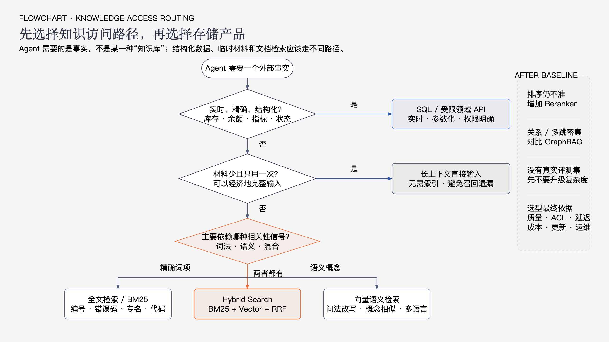
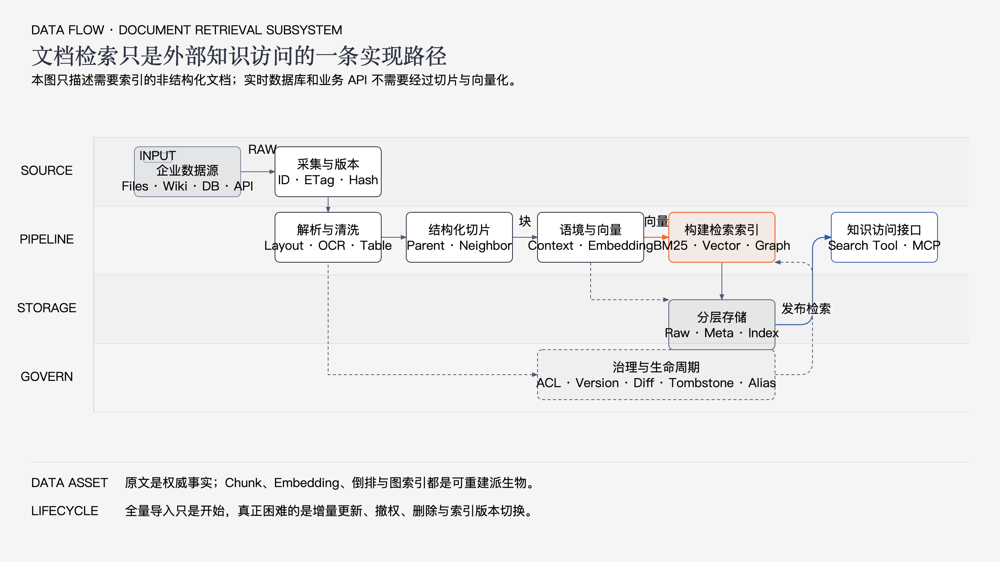
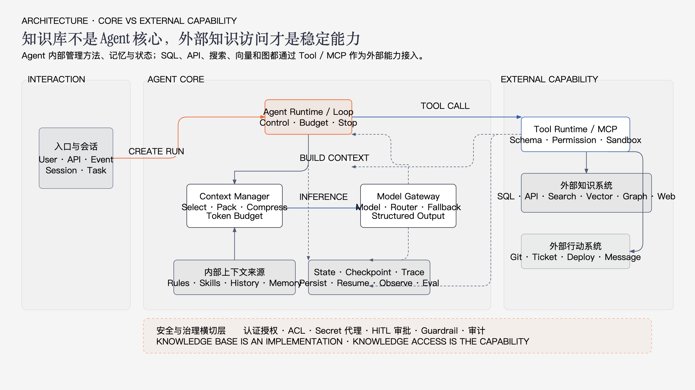
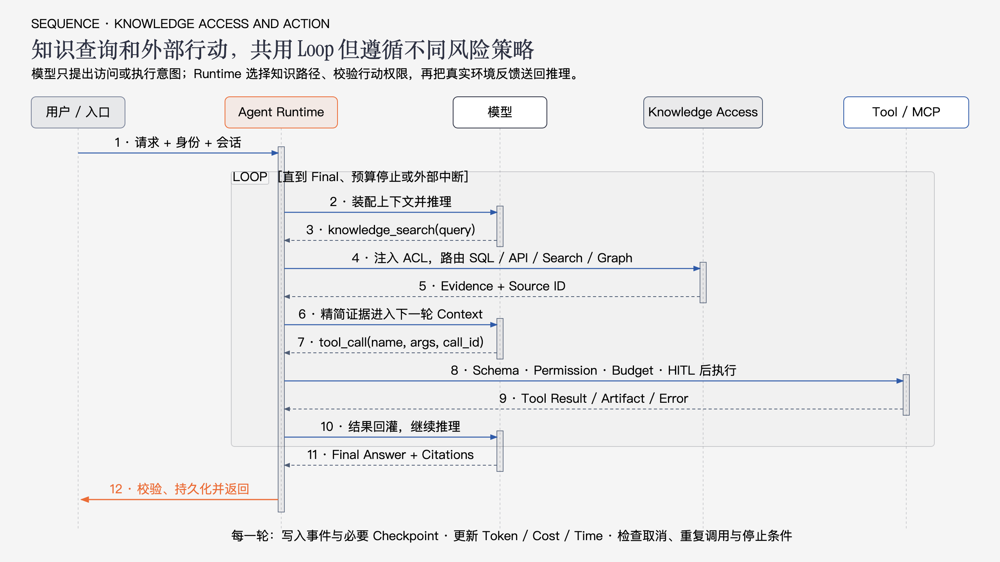

# Agent 外部知识访问体系与总体架构：从传统知识库到多源知识生态

讨论 Agent 时，“知识库”是一个非常容易造成误解的词。

有人用它指企业文档站，有人用它指 RAG 系统，有人用它指向量数据库，还有人把 SQL、搜索引擎、Memory、Skills 都放进知识库。概念不断扩大以后，“知识库”看起来无所不包，却失去了架构上的确定边界。

这也是本文需要解决的核心问题：

> Agent 架构中真正稳定的组件不是传统知识库，而是外部知识访问能力。

传统知识库、全文搜索、向量检索、SQL、业务 API、互联网搜索和 GraphRAG，都是外部知识访问的实现路径。向量数据库则只是其中一种索引基础设施。

本文重新建立一套更稳定的认知：

1. Agent 为什么需要外部知识；
2. 外部知识、知识库、RAG 和向量库分别是什么；
3. Agent 如何在不同知识访问路径之间选择；
4. 文档型知识库作为一种实现，应该如何构建；
5. 外部知识如何经过检索和治理进入模型 Context；
6. Runtime、Context、Skill、Memory、Tool 和 MCP 如何形成完整调用链。

> **资料边界（核验日期：2026-08-27）**
>
> 本文参考 Anthropic、OpenAI、Microsoft、Google、MCP、LangGraph、Elasticsearch、PostgreSQL/pgvector、Pinecone、Qdrant、Weaviate 等官方资料。产品接口会持续变化，文章重点是跨产品长期有效的职责和边界。

---

## 1. 先纠正“知识库”这个概念

### 1.1 “知识库”至少被用于三种不同含义

#### 业务产品

例如企业 Wiki、客服知识中心、产品帮助中心和内部文档站。

这类知识库首先解决的是：

- 内容编辑；
- 分类和发布；
- 权限；
- 版本；
- 人工搜索和阅读。

它不一定具备适合 Agent 的检索接口。

#### 文档检索系统

也就是通常所说的 RAG Knowledge Base：

```text
文档接入
→ 解析与切片
→ 全文或向量索引
→ 查询、过滤和排序
→ 返回证据与引用
```

这是 Agent 外部知识访问的一种常见实现。

#### 泛化的外部知识系统

有些架构把下面所有内容都称为知识库：

```text
文档 + 数据库 + API + 搜索引擎
+ Memory + Graph + Web Search
```

这种叫法适合业务沟通，但不适合技术架构，因为不同能力的更新方式、查询语义、权限和可靠性完全不同。

### 1.2 本文采用四个明确术语

#### Knowledge Source：知识源

保存权威事实的系统：

- 关系数据库；
- 文档和对象存储；
- Wiki 和代码仓库；
- SaaS；
- 搜索引擎；
- 互联网；
- 知识图谱。

#### Knowledge Access Layer：知识访问层

把不同知识源转换成 Agent 可以调用的能力：

```text
knowledge.search
knowledge.fetch
knowledge.query
web.search
database.read
```

它负责路由、权限、查询、过滤、排序和来源封装。

#### Document Retrieval System：文档检索系统

针对非结构化或半结构化文档建设的检索子系统。它通常包含：

- 原文存储；
- Parser；
- Chunk；
- 元数据和 ACL；
- BM25；
- Vector Index；
- Hybrid Search；
- Reranker；
- Citation。

这就是工程实践中经常被称为“知识库”或“RAG 平台”的部分。

#### Vector Store：向量存储或向量索引

保存 Embedding，并支持近似相似度搜索。

它只回答：

> 哪些向量在当前距离函数下与查询向量接近？

它不天然解决原文版本、权限、引用、删除同步和最终上下文质量。

### 1.3 最重要的概念调整

过去常见的架构表达是：

```text
Agent
├── Memory
├── Skills
├── Tools
└── Knowledge Base
```

它会让人误以为每个 Agent 都应该拥有一个单独知识库。

更准确的表达是：

```text
Agent Runtime
├── 内部上下文来源
│   ├── Rules
│   ├── Skills
│   ├── History
│   └── Memory
│
└── 外部能力
    ├── Knowledge Access
    │   ├── SQL / API
    │   ├── Search / RAG
    │   ├── Graph
    │   └── Web
    │
    └── Action Tools
```

知识库不再是 Agent 的必备外设，而是 Knowledge Access 背后的一种实现。

### 1.4 知识库如何演变成今天的知识生态

今天的复杂性不是因为一种知识库产品不断增加功能，而是不同阶段的问题逐渐叠加，最终形成了一个外部知识访问生态。

#### 第一阶段：内容管理型知识库

最早的企业知识库主要面向人：

```text
人工编写内容
→ 分类和标签
→ 审核发布
→ 员工通过目录或关键词阅读
```

典型形态包括：

- Wiki；
- FAQ；
- 帮助中心；
- 文档管理系统；
- 客服知识中心。

这个阶段的核心问题是：

> 如何把组织知识整理、发布和维护出来？

知识由人主动查找，系统不需要把内容压缩后交给模型。

#### 第二阶段：企业搜索

文档数量增加以后，仅靠目录和分类无法找到内容，知识库开始引入：

- 倒排索引；
- 全文检索；
- BM25；
- 分词和同义词；
- 字段权重；
- 权限过滤；
- 高亮和排序。

架构开始变成：

```text
多个内容系统
→ 企业搜索索引
→ 用户输入关键词
→ 返回文档列表
```

核心问题变成：

> 如何从大量内容中找到相关文档？

此时的输出仍然主要面向人，搜索系统只负责返回链接和片段。

#### 第三阶段：向量 RAG

大模型应用出现以后，用户不再满足于文档列表，而是希望直接获得答案。

典型链路变为：

```text
文档
→ Chunk
→ Embedding
→ Vector Store
→ Top-K
→ 放入模型 Context
→ 生成答案
```

向量检索解决了查询与原文措辞不同的问题，RAG 则把外部证据带入模型推理。

这一阶段形成了一个过度简化的认知：

```text
知识库 ≈ 向量数据库 ≈ RAG
```

它适合快速验证文档问答，但很快暴露出边界：

- 编号、错误码和专有词召回不稳定；
- Chunk 可能破坏原文结构；
- 单次 Top-K 无法解决复杂多跳问题；
- 相似内容不一定能够支持答案；
- 文档版本、权限和删除没有天然保障；
- 模型即使获得正确证据，也可能没有正确使用。

#### 第四阶段：受治理的混合检索

为了弥补朴素向量 RAG 的不足，生产系统重新吸收企业搜索和数据治理能力：

```text
BM25
+ Vector Search
+ Metadata Filter
+ ACL
+ RRF
+ Reranker
+ Citation
+ Incremental Update
+ Evaluation
```

这时系统解决的已经不只是召回率，而是：

- 正确用户能否看到正确内容；
- 当前内容是否是有效版本；
- 删除和撤权是否及时生效；
- 回答能否追溯到原文；
- 检索质量是否能够持续评测；
- 多租户之间是否真正隔离。

“知识库”开始从一个索引，扩展为文档数据流水线、检索服务和治理体系。

#### 第五阶段：Agent Knowledge Access 生态

Agent 面临的问题不再全部来自文档：

```text
订单状态       → 业务 API
账户余额       → SQL / API
错误码与代码   → BM25 / Code Search
自然语言文档   → Vector / Hybrid
实体关系       → Graph
最新公开信息   → Web Search
少量临时材料   → 直接 Context
```

如果继续把这些能力全部称为知识库，“知识库”就会变成一个无法进行技术选型的模糊大词。

因此架构开始从：

```text
Agent → Knowledge Base
```

演变为：

```text
Agent Runtime
→ Knowledge Access Layer
→ 根据问题路由到 SQL、API、Search、Vector、Graph 或 Web
→ Context Manager 选择最终证据
```

与此同时，托管 File Search、云知识库、Serverless Vector、Reranker 和 MCP Server 又把其中部分能力产品化，形成了今天的知识生态。

#### 这个演变不是替代，而是叠加

每个阶段仍然有价值：

```text
内容管理
→ 负责知识生产和发布

企业搜索
→ 负责精确词项和大规模搜索

向量检索
→ 提供语义相关性信号

RAG
→ 把外部证据带入生成过程

治理层
→ 提供权限、版本、删除和审计

Knowledge Access
→ 为 Agent 统一组织多种访问路径
```

所以不是传统知识库消失了，也不是向量库失去价值，而是它们从“全部知识能力”回到了生态中的具体位置。

今天所谓知识系统变复杂，本质上是三个问题被同时解决：

1. **如何保存和管理知识；**
2. **如何找到适合当前问题的事实；**
3. **如何把有限且可信的证据交给 Agent。**

理解这段演变以后，后面的技术选型就不应该再问“选择哪一种知识库”，而应该问：

> 当前缺少的是内容管理、检索信号、数据治理、知识路由，还是 Context 交付能力？

---

## 2. Agent 的核心与外部能力

### 2.1 Agent 的稳定核心

一个生产 Agent 的稳定核心包括：

```text
Model
+ Runtime / Loop
+ Context
+ State
```

#### Model

负责理解当前上下文、产生回答或提出下一步调用意图。

#### Runtime / Loop

负责执行模型调用、工具调度、权限、预算、重试、停止、中断和恢复。

#### Context

是某一次模型调用实际可见的信息，包括：

- 系统指令；
- Rules；
- 用户请求；
- 必要历史；
- Skill；
- Memory；
- 外部证据；
- Tool Schema；
- Tool Result。

#### State

是系统持久保存的事实状态，包括：

- 消息和事件；
- 任务状态；
- Checkpoint；
- Tool Call；
- Tool Result；
- Artifact；
- 审批决定。

### 2.2 Agent 的两类外部能力

#### 知识访问

用于观察外部世界：

```text
查询订单状态
读取文档
搜索代码
检索法规
访问互联网
查询实体关系
```

#### 行动工具

用于改变外部世界：

```text
创建工单
发送消息
修改配置
提交代码
执行部署
发起付款
```

知识访问通常是只读的，但不等于没有安全风险。越权检索、敏感数据进入模型和错误引用都可能造成事故。

### 2.3 Tool 和 MCP 才是 Agent 看到的接口

Agent 通常不应该感知：

- 向量数据库品牌；
- Elasticsearch Index 名称；
- 数据库连接字符串；
- 文档切片算法；
- GraphRAG 内部表结构。

它看到的是稳定能力：

```json
{
  "name": "knowledge_search",
  "description": "搜索经过授权的企业文档并返回可引用证据",
  "inputSchema": {
    "type": "object",
    "properties": {
      "query": { "type": "string" },
      "timeRange": { "type": "string" }
    },
    "required": ["query"]
  }
}
```

这个 Tool 可以是本地函数，也可以通过 MCP Server 暴露。

因此：

> MCP 解决“怎样连接和调用知识能力”，Knowledge Access 解决“怎样找到正确事实”，底层存储解决“事实和索引放在哪里”。

---

## 3. 外部知识访问的三层架构

一个完整外部知识系统可以拆成三层。

### 3.1 第一层：Knowledge Sources

知识源是事实产生和存储的位置。

#### 结构化业务系统

例如：

- 订单数据库；
- CRM；
- ERP；
- 账户系统；
- 指标平台；
- 配置中心。

适合通过 SQL 或领域 API 精确查询。

#### 文档系统

例如：

- PDF；
- Office；
- Wiki；
- 设计文档；
- 代码和 README；
- 工单和事故报告。

适合全文、向量或混合检索。

#### 图数据

例如：

- 人员和组织关系；
- 供应链；
- 资产拓扑；
- 调查线索；
- 实体关系网络。

适合图查询或 GraphRAG。

#### 外部动态信息

例如：

- 互联网；
- 新闻；
- 第三方 SaaS；
- 实时市场数据。

适合 Web Search 或外部 API。

### 3.2 第二层：Knowledge Access Layer

知识访问层是最关键的稳定抽象。

它负责：

1. 识别问题应该查询哪个知识源；
2. 根据认证身份生成权限边界；
3. 选择 SQL、API、BM25、Vector 或 Graph；
4. 执行查询改写和分解；
5. 合并、过滤、去重和排序；
6. 返回结构化证据和来源；
7. 记录 Trace、延迟和费用；
8. 控制重试与检索预算。

知识访问层既可以是一个统一 Gateway，也可以由多个领域 Tool 组成。

### 3.3 第三层：Context Delivery

外部系统返回的数据不能直接全部进入模型。

Context Delivery 负责：

- 选择高价值证据；
- 删除重复内容；
- 保留标题、时间和来源；
- 扩展必要父段或相邻段；
- 压缩大型 Tool Result；
- 分配 Token 预算；
- 标记不可信内容；
- 处理证据冲突；
- 生成稳定 Source ID。

因此完整路径是：

```text
Knowledge Source
→ Knowledge Access
→ Evidence
→ Context Manager
→ Model Context
```

### 3.4 三层不能合并理解

例如“当前订单是否已支付”：

```text
Knowledge Source：订单数据库
Knowledge Access：受限订单查询 API
Context Delivery：只返回订单号、支付状态和更新时间
```

“数据库迁移为什么失败”：

```text
Knowledge Source：事故报告、日志、变更记录
Knowledge Access：Hybrid Search + 日志 Tool
Context Delivery：去重、按时间排序、保留引用
```

两者都属于外部知识访问，但只有第二个可能使用传统文档知识库和向量索引。

---

## 4. 外部知识访问路径如何选择



技术选型不应该从“选哪一种知识库产品”开始，而应该从问题和数据的性质开始。

### 4.1 长上下文直接输入

适合：

- 材料数量少；
- 一次性分析；
- 需要整体阅读；
- 文档能经济地放进上下文；
- 没有复杂权限和更新要求。

优势：

- 实现简单；
- 没有索引构建；
- 不会因为 Top-K 召回漏掉文档。

限制：

- 重复输入成本高；
- 占用上下文；
- 规模增长后不可持续；
- 长上下文容量不等于所有位置都能被稳定利用。

这类场景不需要建设知识库。

### 4.2 SQL 或领域 API

适合：

- 实时库存；
- 订单状态；
- 账户余额；
- 时间范围统计；
- 精确过滤和聚合；
- 权威业务状态。

SQL 和 API 的优势是：

- 事实更新后立即可查；
- 数据类型明确；
- 过滤、JOIN 和聚合确定；
- 权限可以由业务后端强制执行。

更推荐向模型提供只读、参数化、有范围限制的领域 Tool，而不是开放任意 SQL。

### 4.3 全文检索和 BM25

适合：

- 错误码；
- 产品编号；
- 人名和专有名词；
- 法条原文；
- 代码符号；
- 日志关键字；
- 精确短语。

它依赖倒排索引：

```text
词项 → 文档或 Chunk 列表
```

优势是精确、成熟、可解释。限制是同义表达、自然语言意图和跨语言语义较弱。

### 4.4 向量检索

适合：

- 查询与文档措辞不同；
- 概念型问题；
- FAQ 和案例匹配；
- 自然语言搜索；
- 多语言语义检索。

它的价值不是存储知识，而是提供一种语义相关性信号。

限制包括：

- 编号和罕见专名可能召回较弱；
- 依赖 Embedding 模型和 Chunk；
- ANN 会用部分 Recall 换取性能；
- 更换 Embedding 模型通常需要重建；
- 相似不等于能够支持答案。

### 4.5 Hybrid Search

真实企业查询经常同时包含精确词和自然语言：

```text
“ERR_CONN_417 为什么只在升级后出现？”
```

其中：

- `ERR_CONN_417` 适合 BM25；
- “为什么只在升级后出现”需要语义和时间上下文。

Hybrid Search 通常并行执行全文和向量检索，再使用 RRF 或其他方法融合。

它是企业文档检索的稳健起点，但不是绝对默认答案。只有实际查询同时需要两类信号时才值得维护两套索引。

### 4.6 Reranker

Reranker 是第二阶段排序：

```text
低成本召回较多候选
→ Reranker 精排
→ 只保留少量高质量证据
```

它适合解决“正确文档已经召回，但排序靠后”。

它不能解决第一阶段完全漏召回的问题。

### 4.7 Graph Retrieval / GraphRAG

适合：

- 实体关系；
- 多跳查询；
- 全局主题；
- 跨大量文档的关系发现；
- 调查、情报和供应链场景。

GraphRAG 通常需要实体抽取、关系抽取、消歧、社区检测、社区摘要和来源映射。

它的索引成本和维护复杂度明显高于普通文档检索。普通 FAQ、制度查询和简单文档问答不应该一开始就使用 GraphRAG。

### 4.8 Web Search 和外部搜索服务

适合：

- 最新公开信息；
- 企业内部没有的数据；
- 需要多来源交叉验证；
- 开放域研究。

Web Search 返回的内容可信度不一致，Context Delivery 必须保留域名、发布时间、抓取时间和引用，并把网页内容视为不可信输入。

### 4.9 Agentic Retrieval

传统检索通常只执行一次：

```text
问题 → 检索 → 生成
```

Agentic Retrieval 允许模型根据证据缺口动态继续：

```text
计划
→ 查询一个或多个知识源
→ 检查证据
→ 发现缺口或冲突
→ 改写、分解或切换知识源
→ 再查询
→ 证据充分后回答
```

Agentic Retrieval 是查询控制模式，不是一种数据库。

它必须有：

- 最大检索轮次；
- 最大查询数；
- Token 和费用预算；
- Deadline；
- 重复查询检测；
- 来源质量控制；
- 明确停止条件。

### 4.10 推荐决策顺序

```text
问题需要实时、精确、结构化事实？
├─ 是 → SQL / 领域 API
└─ 否
   ├─ 全部材料能经济地放进 Context，且只用一次？
   │  └─ 是 → 直接输入
   └─ 否 → 建立检索能力
      ├─ 编号、术语、代码、短语为主 → BM25
      ├─ 自然语言、改写、概念相似为主 → Vector
      ├─ 两类查询同时存在 → Hybrid
      ├─ 已召回但排序不准 → Reranker
      └─ 关系、多跳、全局主题密集 → 评估 GraphRAG
```

---

## 5. 文档型知识库只是其中一种实现

经过前面的概念拆分，现在可以给传统知识库一个准确位置：

> 文档型知识库是面向受治理文档的检索子系统，它是 Knowledge Access 的一种实现，不是 Agent 外部知识的全部。

适合建设文档型知识库的条件：

- 非结构化资料数量较大；
- 同一资料会被反复查询；
- 需要文档级权限；
- 需要版本和删除；
- 需要引用到原文；
- 需要全文或语义检索；
- 数据无法直接通过结构化 API 查询。

不适合把所有内容放入文档型知识库：

- 当前订单、余额和库存；
- 高频实时指标；
- 行为 Rules；
- 任务执行状态；
- 用户长期偏好；
- 确定性计算结果；
- 可以由业务 API 精确回答的数据。

---

## 6. 文档检索子系统如何构建



下面这条流水线只适用于文档型检索系统，不代表所有外部知识都必须经过切片和向量化。

### 6.1 数据源接入

来源可能包括：

- 文件和对象存储；
- Wiki、SharePoint、Google Drive；
- Git、Jira 和工单；
- Slack、邮件和会议记录；
- 业务导出的文档；
- 内部 API。

采集时至少保存：

```text
source_system
source_object_id
source_uri
source_version
content_hash
tenant_id
acl
collected_at
```

首轮通常全量采集，之后通过 CDC、Webhook、事件或轮询同步变更。

### 6.2 原文和版本

原始文件或源记录应该作为不可变快照保存。索引是派生物，不应该成为唯一事实来源。

原文用于：

- Parser 升级后重建；
- Chunk 策略变化后重建；
- Embedding 模型更换后重建；
- 回答引用和审计；
- 合规保留和删除；
- 验证图谱和摘要是否有证据。

### 6.3 解析和规范化

Parser 不应该只输出纯文本，还应保留：

- 标题层级；
- 段落和列表；
- 页码、行号和字符偏移；
- 表格结构；
- 图片与 OCR；
- 代码块和公式；
- 附件和父子关系。

清洗时不要删除错误码、编号、金额、日期和代码符号，因为它们通常是全文检索的重要信号。

### 6.4 去重和版本判定

至少需要：

1. 使用稳定来源 ID 识别同一对象；
2. 使用内容哈希判断是否变化；
3. 使用近重复检测处理复制和模板内容。

文件名不能作为唯一身份。

### 6.5 Chunk

Chunk 的目标是形成可独立检索的证据单元。

常见策略：

- 固定 Token 窗口；
- 按标题和段落切分；
- 表格和代码结构切分；
- 父子 Chunk；
- 邻接扩展；
- Contextual Retrieval。

Chunk 大小没有通用最佳值，必须结合：

- 问题粒度；
- 文档结构；
- Embedding 限制；
- Reranker 限制；
- Context 预算；
- 实际评测。

### 6.6 元数据和 ACL

每个文档或 Chunk 至少保留：

```text
document_id / chunk_id
source_uri / title
section_path / page / offset
source_version / content_hash
parser_version / chunker_version
embedding_model / embedding_version
tenant / users / groups / roles
valid_from / valid_to
```

权限必须在候选召回阶段生效。

错误方式是：

```text
从全库召回
→ Rerank 已读取内容
→ 最后在应用层删除越权结果
```

这样不仅可能泄露信息，还会造成过滤后候选不足。

真实 ACL 必须由认证身份和授权系统生成，不能由模型自由填写。

### 6.7 建立索引

文档检索子系统可能同时使用：

```text
对象存储     → 原始文件和规范化正文
元数据存储   → 身份、版本、ACL、处理状态
倒排索引     → BM25、短语、字段和高亮
向量索引     → Dense / Sparse Vector
图索引       → 可选实体、关系和来源
```

这些存储承担不同职责。

向量索引不应该被当作原文唯一存储。图中由模型抽取的实体和关系也不应该脱离原始证据成为权威事实。

### 6.8 增量更新

完整更新流程是：

```text
发现变化
→ 比较版本和内容哈希
→ 重新解析
→ 对比新旧 Chunk
→ 复用未变化 Chunk
→ 更新变化内容
→ 删除旧 Chunk
→ 发布新索引版本
```

只更新 ACL 时通常不需要重新生成 Embedding，但必须立即更新所有参与权限过滤的索引。

### 6.9 删除和撤权

删除不是只删除一条向量：

```text
源端删除或撤权
→ 写入 Tombstone
→ 禁止旧版本继续召回
→ 删除关联 Chunk
→ 删除倒排和向量记录
→ 更新图关系和摘要
→ 清理缓存
→ 按保留策略删除原文
→ 对账确认不可检索
```

很多检索服务采用最终一致模型。高合规场景需要使用状态过滤或 Tombstone 立即阻断查询。

### 6.10 一次文档检索如何返回证据

```text
认证身份
→ 生成 ACL Filter
→ 查询理解与改写
→ BM25 / Vector / Graph 多路召回
→ 去重与 RRF
→ Rerank
→ 父块或邻接扩展
→ Context Packing
→ Evidence + Source ID
```

每个证据应该能够追溯：

```text
source_id
→ document_id
→ source_uri
→ version
→ page / line / offset
```

模型只生成 Source ID，应用层负责渲染真实链接，避免模型编造 URL。

---

## 7. 不选择“知识库”，而是选择基础设施组合

### 7.1 PostgreSQL + pgvector

适合：

- 已经使用 PostgreSQL；
- 元数据、ACL、业务关系和向量需要共存；
- 需要事务、JOIN 或 RLS；
- 规模和吞吐仍适合关系数据库；
- 希望减少系统数量。

它不是完整知识库。Parser、Chunk、全文检索、Reranker、引用和同步仍需要自行建设或组合。

### 7.2 Elasticsearch / OpenSearch

适合：

- 全文检索是核心；
- 需要分析器、短语、过滤、聚合和高亮；
- 需要同时支持 Vector 和 Hybrid；
- 团队已有搜索工程能力。

需要治理 Shard、Replica、Segment、Mapping、Heap 和数据同步。

### 7.3 专用向量数据库

例如 Pinecone、Qdrant、Weaviate 等。

适合：

- 向量是重要访问路径；
- 向量规模或吞吐较高；
- 需要元数据过滤和多租户；
- 希望使用专门的 ANN 能力。

需要认识到：

- 仍需要权威原文；
- 仍需要版本和删除同步；
- 复杂事务和 JOIN 通常仍在主数据库；
- 精确词项可能仍需要倒排索引；
- 不同产品的一致性和过滤语义并不相同。

向量数据库正在扩展全文、过滤、Rerank 和数据接入能力，说明它们也在向 Retrieval Platform 演进，而不是证明“向量库等于知识库”。

### 7.4 云托管 Retrieval / File Search

例如 OpenAI File Search、Vertex AI RAG Engine、Amazon Bedrock Knowledge Bases、Azure AI Search。

适合：

- 快速上线；
- 团队缺少搜索基础设施能力；
- 接受平台支持格式和配额；
- 希望托管切片、Embedding、索引和引用。

需要评估：

- Chunk 是否可配置；
- ACL 如何实现；
- 删除多久可见；
- 是否能返回稳定引用；
- 是否支持调试召回结果；
- 是否被特定模型和平台绑定。

### 7.5 图数据库和 GraphRAG

图数据库适合已有明确实体和关系 Schema 的业务数据。

GraphRAG 适合从非结构化语料中抽取实体、关系和社区，用于全局主题与多跳分析。

两者不能简单等同。

### 7.6 传统知识库产品

传统或托管知识库产品可以理解为一种组合式交付：

```text
连接器
+ 文档治理
+ 索引
+ 检索
+ 权限
+ 引用
+ 管理界面
```

它的价值是减少建设成本，不是成为 Agent 架构中的唯一知识入口。

Agent 仍然可能同时使用：

- 订单 API；
- 企业搜索；
- 文档知识库；
- Web Search；
- 代码搜索；
- 图查询。

### 7.7 正确的选型指标

不要只比较向量检索 Benchmark。

应该使用真实业务问题评估：

- Recall@K；
- MRR / NDCG；
- 引用是否真正支持结论；
- ACL 是否可能泄露；
- 不可回答问题能否拒答；
- P95 延迟；
- 单次查询费用；
- 更新和删除可见时间；
- 运维和迁移成本。

---

## 8. 完整 Agent 总体架构



### 8.1 入口与会话

入口包括：

- IDE；
- CLI；
- Web；
- IM；
- HTTP API；
- Cron；
- Webhook；
- 消息队列。

它负责认证、租户识别、限流、幂等和传输方式。

会话和任务层管理：

```text
session / thread
task / run
message / event
artifact
checkpoint
```

### 8.2 Agent Runtime / Loop

Runtime 是控制中心：

```text
构造 Context
→ 调用模型
→ 解析回答或 Tool Call
→ 校验并执行
→ 保存结果
→ 检查预算和停止条件
→ 继续或结束
```

模型提出动作，Runtime 才真正执行动作。

### 8.3 Context Manager

Context Manager 为每一次模型调用选择：

- 系统指令；
- Rules；
- 当前请求；
- 必要 History；
- 激活的 Skill；
- Memory；
- 外部证据；
- Tool Schema；
- Tool Result。

它还负责：

- Token 预算；
- 裁剪和摘要；
- Prompt Cache；
- 延迟加载；
- 内容优先级；
- 来源标记。

### 8.4 内部上下文来源

#### Rules

持续或按范围生效的行为约束。

#### Skills

按需加载的专业方法、脚本和参考资料。

#### History

原始交互记录。

#### Memory

跨会话保留的用户偏好、任务结论和长期状态。

这些内容与外部知识访问不同：

```text
Rules / Skills / Memory
→ Agent 内部上下文来源

SQL / API / Search / Graph / Web
→ 外部知识访问
```

### 8.5 Model Gateway

负责：

- 模型供应商适配；
- 模型路由；
- Structured Output；
- 超时和有限重试；
- Fallback；
- Token 与费用统计。

它不应该承担完整 Agent Loop 或业务权限逻辑。

### 8.6 Tool Runtime / MCP Client

负责：

- Tool Registry；
- Schema 发现；
- 参数校验；
- 权限；
- 审批；
- 超时和沙箱；
- 结果清洗；
- MCP Server 连接。

知识访问 Tool 和行动 Tool 都通过这里执行，但风险策略可以不同。

### 8.7 外部知识系统

包括：

- SQL；
- 领域 API；
- 文档检索系统；
- 搜索引擎；
- Vector Store；
- Graph；
- Web Search。

Agent 不应该直接绑定这些实现，而应依赖 Tool 或 Knowledge Access 接口。

### 8.8 外部行动系统

包括：

- 工单；
- 消息；
- Git；
- 云平台；
- 部署；
- 支付；
- 设备。

行动系统通常比只读知识查询需要更严格的授权、审批、幂等和补偿。

### 8.9 State、Checkpoint、Trace 和 Eval

State 和 Checkpoint 保证任务可持续和可恢复。

Trace 记录模型、知识访问、Tool、Guardrail 和 Handoff 的真实调用轨迹。

Eval 判断：

- 答案是否正确；
- 知识源是否选对；
- 证据是否充分；
- Tool 是否调用正确；
- 轨迹是否安全；
- 成本和延迟是否达标。

Trace 回答“发生了什么”，Eval 回答“结果是否足够好”。

### 8.10 安全与 HITL

安全不是一个 Prompt，而是 Runtime 和后端的强制能力：

- 身份认证；
- 资源授权；
- 数据分级；
- Secret 代理；
- Tool Scope；
- 高风险操作审批；
- 输入输出 Guardrail；
- 审计。

HITL 是可持久化的暂停状态：

```text
保存 Checkpoint
→ 标记 awaiting_approval
→ 等待批准、拒绝或补充信息
→ 使用原 Task 恢复
```

---

## 9. 外部知识怎样进入一次 Agent 调用



### 9.1 请求进入 Runtime

入口完成：

1. 认证；
2. Tenant 解析；
3. 限流；
4. 幂等检查；
5. 创建或加载 Session 和 Task。

Runtime 初始化：

- Run ID；
- Trace；
- Token、费用和时间预算；
- 最大轮次；
- Cancellation Token；
- 最近 Checkpoint；
- Tool 和 Skill Catalog。

### 9.2 第一次 Context

Context Manager 装配：

```text
System Prompt
+ Rules
+ 用户请求
+ 必要 History
+ Memory
+ Skill Catalog
+ Tool Schema
```

外部知识不会因为“已经存在于知识库”就自动进入 Context。

只有经过访问、过滤和选择的证据，才会进入某一轮模型调用。

### 9.3 两种知识访问控制方式

#### 应用控制检索

应用在调用模型前固定执行查询：

```text
用户请求
→ 后端检索
→ 证据进入 Context
→ 调用模型
```

适合：

- 查询源固定；
- 权限要求严格；
- 流程需要稳定；
- 不希望模型决定是否检索。

#### 模型控制检索

模型通过 Tool Call 决定：

- 是否查询；
- 查询什么；
- 使用哪个知识 Tool；
- 是否继续查询。

适合复杂研究和开放式任务，但成本和不确定性更高。

### 9.4 模型提出知识查询

例如：

```json
{
  "name": "knowledge_search",
  "arguments": {
    "query": "数据库迁移导致锁表的常见条件",
    "timeRange": "2025-01-01/2026-08-27"
  }
}
```

Runtime 不会直接相信这些参数，而是：

1. 根据认证身份生成 Tenant 和 ACL；
2. 校验 Tool Schema；
3. 检查检索预算；
4. 调用 Knowledge Access；
5. Knowledge Access 选择 SQL、Search、Vector 或 Graph；
6. 返回 Evidence 和 Source ID；
7. 保存完整结果；
8. 将精简证据放入下一轮 Context。

### 9.5 模型提出行动调用

如果模型需要创建工单或执行变更：

1. Runtime 校验参数；
2. 检查权限和风险；
3. 必要时暂停等待审批；
4. 使用幂等键执行；
5. 保存 Tool Result 和 Artifact；
6. 将结果回灌模型。

知识查询和行动调用都可能使用 MCP，但安全语义不同。

### 9.6 Loop 继续

模型根据真实反馈继续：

```text
证据不足 → 改写或切换知识源
证据冲突 → 打开原文或再次验证
需要动作 → 调用行动 Tool
需要批准 → 暂停
任务完成 → 输出 Final
```

每轮 Runtime 都更新：

- 事件；
- Checkpoint；
- Token；
- 费用；
- 时间；
- Tool Call 次数；
- 停止原因。

### 9.7 返回结果

最终回答经过：

- 输出结构校验；
- 引用校验；
- 敏感信息处理；
- 业务完成条件；
- Guardrail。

之后持久化 Message、Artifact、Task 状态和用量，并通过同步响应、SSE、WebSocket 或异步回调返回。

---

## 10. Loop 如何停止、暂停和恢复

### 10.1 正常停止

模型生成 Final 并不自动等于任务成功。

可靠条件是：

```text
模型产生 Final
+ 输出结构合法
+ 引用和业务校验通过
+ 任务完成条件满足
= Runtime 标记 completed
```

### 10.2 预算停止

生产系统需要控制：

- 模型轮次；
- 检索轮次；
- Tool Call 数；
- Token；
- 费用；
- 墙钟时间；
- 重试次数；
- 子 Agent 数量和深度。

预算耗尽不是正常完成。系统应明确返回：

- 停止原因；
- 已完成部分；
- 未完成部分；
- 已产生 Artifact；
- 是否可以恢复。

### 10.3 无进展停止

Runtime 应检测：

- 重复相同查询；
- 相同 Tool 和参数连续失败；
- 证据没有新增；
- 模型在两个方案间循环；
- 幂等动作始终无变化。

这类 Circuit Breaker 往往比固定最大轮次更早发现问题。

### 10.4 可恢复中断

包括：

- 等待用户补充；
- 等待认证；
- 等待审批；
- 用户主动暂停；
- Worker 暂时退出。

需要先保存 Checkpoint，再释放执行资源。

### 10.5 取消

取消通常是终态：

- 停止模型和下游 Tool；
- 取消可以取消的任务；
- 补偿可撤销操作；
- 不持久化半条最终回答；
- 标记 canceled；
- 保留审计和已产生 Artifact。

### 10.6 错误与重试

不同错误必须区别处理：

```text
参数或 Schema 错误
→ 返回模型修正

权限错误
→ 请求授权或终止

429、网络、5xx
→ 有限指数退避

Tool 业务错误
→ 结构化反馈模型

副作用结果未知
→ 先使用幂等键查询状态，不能盲目重试

不可恢复错误
→ 保存诊断并标记 failed
```

---

## 11. 最容易混淆的知识边界

### 11.1 模型参数知识

模型训练形成的通用、相对静态知识。

它不能保证：

- 最新；
- 私有覆盖；
- 准确来源；
- 删除；
- 企业权限。

### 11.2 Context

某一次模型调用实际看到的信息。

它是临时推理视图，不是长期事实存储。

### 11.3 History

原始会话消息和交互事件。

History 很长时也不能全部进入 Context。

### 11.4 Memory

跨会话保存的用户偏好、经验和任务状态。

Memory 不应该成为企业事实的唯一权威来源。

### 11.5 Rules

规定 Agent 必须怎样做：

```text
必须使用参数化 SQL
禁止输出密钥
所有结论必须引用来源
```

Rules 不是事实检索系统。

### 11.6 Skill

描述一类任务应该如何完成：

```text
先查哪些系统
按什么顺序执行
如何验证结果
失败时怎样回滚
```

Skill 可以指导 Agent 使用 Knowledge Access，但不应该复制大量持续变化的事实。

### 11.7 外部知识访问

从权威系统获取当前事实：

```text
SQL
API
Search
Vector
Graph
Web
```

它是稳定能力抽象。

### 11.8 文档知识库

外部知识访问的一种实现，重点解决文档接入、索引、权限、检索和引用。

### 11.9 Tool

Agent 查询或改变外部系统的执行接口。

知识访问 Tool 是只读或低副作用 Tool；行动 Tool 会改变外部状态。

### 11.10 MCP

Tool、Resource 和 Prompt 的互操作协议。

MCP 不负责决定：

- 使用 BM25 还是向量；
- 如何切片；
- 怎样 Rerank；
- Agent Loop 何时停止。

---

## 12. 三条流必须分开理解

### 12.1 控制流

决定下一步执行什么：

```text
Runtime
→ 调模型
→ 查询知识
→ 调行动 Tool
→ 等待审批
→ 继续或停止
```

### 12.2 数据流

数据在哪里产生、转换和存储：

```text
用户消息 → Event Store
原始文件 → Object Store
Chunk → Search Index
Tool Result → State Store
大文件 → Artifact Store
```

### 12.3 上下文流

哪些数据在某一次推理中进入模型：

```text
Knowledge Access 返回 10 MB 数据
→ 过滤和压缩
→ 只有关键 Evidence 进入 Context
```

所以：

> State 是系统拥有的事实，Context 是模型当前可见的投影。

数据已持久化，不代表应该进入模型；数据进入过 Context，也不代表它已经被可靠持久化。

---

## 13. 一个稳定的 Java 知识访问接口

代码不是本文重点，但接口可以帮助理解架构边界。

```java
public interface KnowledgeAccess {

    KnowledgeResult query(
            KnowledgeQuery query,
            AuthContext authContext,
            QueryBudget budget
    );
}

public record KnowledgeQuery(
        String question,
        String preferredSource,
        String timeRange
) {}

public record Evidence(
        String sourceId,
        String sourceType,
        String title,
        String content,
        String sourceUri,
        String version,
        Instant observedAt
) {}

public record KnowledgeResult(
        List<Evidence> evidence,
        String accessPath,
        boolean hasMore
) {}
```

关键点：

1. `AuthContext` 由 Runtime 注入，模型不能伪造权限；
2. `QueryBudget` 限制时间、结果数和费用；
3. `accessPath` 可以是 SQL、BM25、Hybrid、Graph 或 Web；
4. Evidence 必须包含稳定来源；
5. Agent 依赖接口，不依赖具体向量数据库；
6. 完整结果进入状态或 Trace，只有必要证据进入 Context。

---

## 14. 工程师备忘录

### 概念判断

- [ ] 不把向量数据库称为完整知识库；
- [ ] 不把所有外部系统统一建模成文档 RAG；
- [ ] 区分 Knowledge Source、Knowledge Access 和 Context；
- [ ] 区分内部 Memory 与外部权威事实；
- [ ] 区分知识查询 Tool 与行动 Tool；
- [ ] 把传统知识库视为实现方案，而不是 Agent 必选组件。

### 访问路径

- [ ] 实时结构化事实优先 SQL 或领域 API；
- [ ] 少量一次性材料优先直接 Context；
- [ ] 精确词项优先 BM25；
- [ ] 语义改写问题评估向量检索；
- [ ] 混合查询使用 Hybrid；
- [ ] 已召回但排序不准再增加 Reranker；
- [ ] 关系和多跳问题用真实数据评估 GraphRAG；
- [ ] 开放域最新信息使用 Web Search。

### 文档检索系统

- [ ] 保存权威原文；
- [ ] 文档、Chunk 和 Parser 策略有版本；
- [ ] ACL 在召回阶段生效；
- [ ] 全文和向量索引职责明确；
- [ ] 更新时删除旧 Chunk；
- [ ] 删除和撤权有 Tombstone；
- [ ] Evidence 可追溯到页码或位置；
- [ ] 证据不足时允许拒答。

### Agent Runtime

- [ ] 模型只提出调用意图；
- [ ] Runtime 执行权限、预算和风险控制；
- [ ] 每轮记录 Tool Call、Evidence 和停止原因；
- [ ] 外部副作用使用幂等键；
- [ ] HITL 可以持久化和恢复；
- [ ] Context 可以从持久状态重建；
- [ ] Trace 可以转化为 Eval Case。

### 技术选型

- [ ] 先按问题和数据选访问路径；
- [ ] 再按规模、权限和运维选择产品；
- [ ] 使用真实业务查询集；
- [ ] 同时评估质量、ACL、延迟和成本；
- [ ] 不用公开 Benchmark 代替自身评测；
- [ ] 不因概念前沿而跳过简单基线。

---

## 15. 最终结论

Agent 的完整知识体系可以归纳为：

```text
模型参数知识
→ 提供通用常识

Rules
→ 提供行为约束

Skills
→ 提供专业方法

History / Memory
→ 提供交互连续性

Knowledge Access
→ 从外部权威系统取得当前事实

Context Manager
→ 把必要信息组织成当前推理视图

Tool / MCP
→ 提供标准化调用和执行通道

Runtime / Loop
→ 控制调用、反馈、预算、停止和恢复
```

最终需要记住六条：

1. **Agent 架构中的稳定组件是外部知识访问能力，不是传统知识库。**
2. **传统知识库是面向文档的检索实现，不负责覆盖所有外部事实。**
3. **向量库是一种语义索引基础设施，不是知识系统本身。**
4. **SQL、API、BM25、Vector、Graph 和 Web 是并列或组合的访问路径。**
5. **外部知识必须经过权限、筛选、排序和压缩，才能进入 Context。**
6. **模型提出决策，Runtime 负责真正的执行、治理和停止。**

用一句话收束全文：

> 不要问“Agent 应该选择哪一种知识库”，而要问“这个问题需要访问哪个权威知识源，应该通过哪条访问路径取得证据，又应该把哪些证据放进当前上下文”。

这个问题回答清楚以后，向量数据库、传统知识库、RAG、GraphRAG 和长上下文都会回到各自准确的位置。

---

## 参考资料

### Agent、上下文与协议

- [Anthropic：Building Effective Agents](https://www.anthropic.com/engineering/building-effective-agents)
- [Anthropic：Effective Context Engineering for AI Agents](https://www.anthropic.com/engineering/effective-context-engineering-for-ai-agents)
- [Anthropic：Writing Effective Tools for AI Agents](https://www.anthropic.com/engineering/writing-tools-for-agents)
- [OpenAI Agents SDK：Running Agents](https://openai.github.io/openai-agents-python/running_agents/)
- [OpenAI：Function Calling](https://developers.openai.com/api/docs/guides/function-calling)
- [OpenAI Agents SDK：Human in the Loop](https://openai.github.io/openai-agents-python/human_in_the_loop/)
- [OpenAI Agents SDK：Tracing](https://openai.github.io/openai-agents-python/tracing/)
- [MCP 2026-07-28 Specification](https://modelcontextprotocol.io/specification/2026-07-28)
- [LangGraph：Persistence](https://docs.langchain.com/oss/python/langgraph/persistence)
- [LangGraph：Interrupts](https://docs.langchain.com/oss/python/langgraph/interrupts)
- [LangGraph：Fault Tolerance](https://docs.langchain.com/oss/python/langgraph/fault-tolerance)

### 外部知识、检索与存储

- [Lewis 等：Retrieval-Augmented Generation for Knowledge-Intensive NLP Tasks](https://arxiv.org/abs/2005.11401)
- [OpenAI：Retrieval](https://developers.openai.com/api/docs/guides/retrieval)
- [OpenAI：File Search](https://developers.openai.com/api/docs/guides/tools-file-search)
- [Anthropic：Contextual Retrieval](https://www.anthropic.com/engineering/contextual-retrieval)
- [Microsoft：RAG Information Retrieval](https://learn.microsoft.com/en-us/azure/architecture/ai-ml/guide/rag/rag-information-retrieval)
- [Microsoft：Semantic Chunking](https://learn.microsoft.com/en-us/azure/search/search-how-to-semantic-chunking)
- [Microsoft GraphRAG](https://microsoft.github.io/graphrag/)
- [Vertex AI RAG Engine：Data Ingestion](https://cloud.google.com/vertex-ai/generative-ai/docs/rag-engine/use-data-ingestion)
- [Elasticsearch：Reciprocal Rank Fusion](https://www.elastic.co/docs/reference/elasticsearch/rest-apis/reciprocal-rank-fusion)
- [PostgreSQL：Full Text Search](https://www.postgresql.org/docs/current/textsearch-intro.html)
- [pgvector](https://github.com/pgvector/pgvector)
- [Qdrant：Hybrid Queries](https://qdrant.tech/documentation/search/hybrid-queries/)
- [Weaviate：Storage](https://docs.weaviate.io/weaviate/concepts/storage)
- [Pinecone：Database Architecture](https://docs.pinecone.io/guides/get-started/database-architecture)

