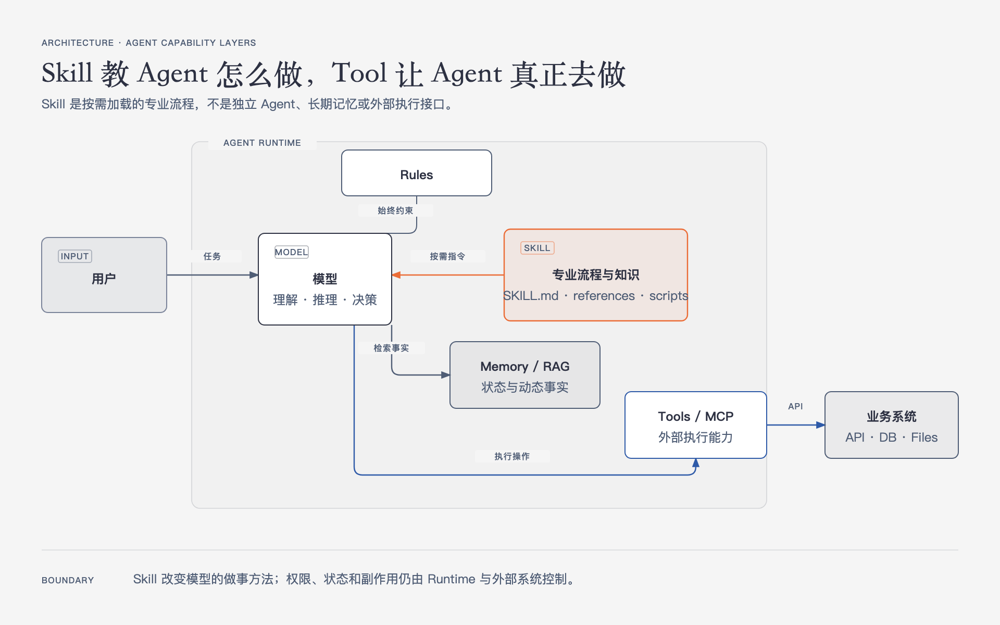
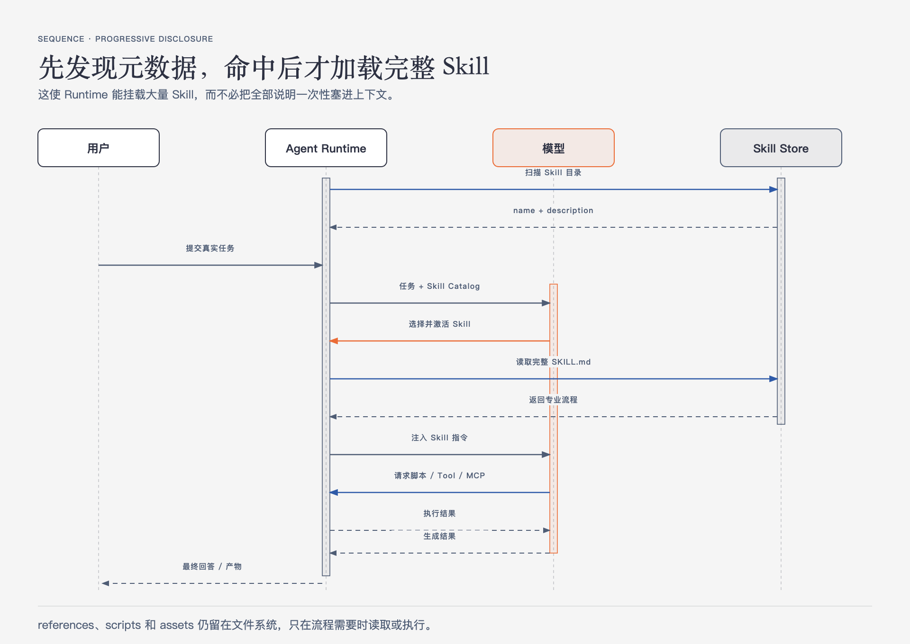
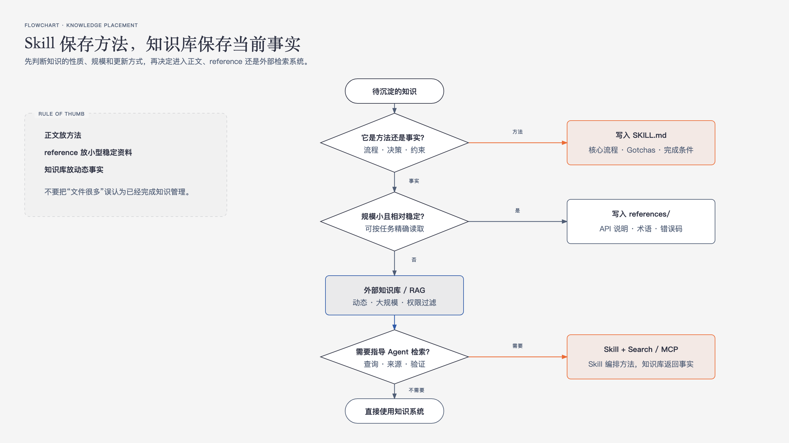
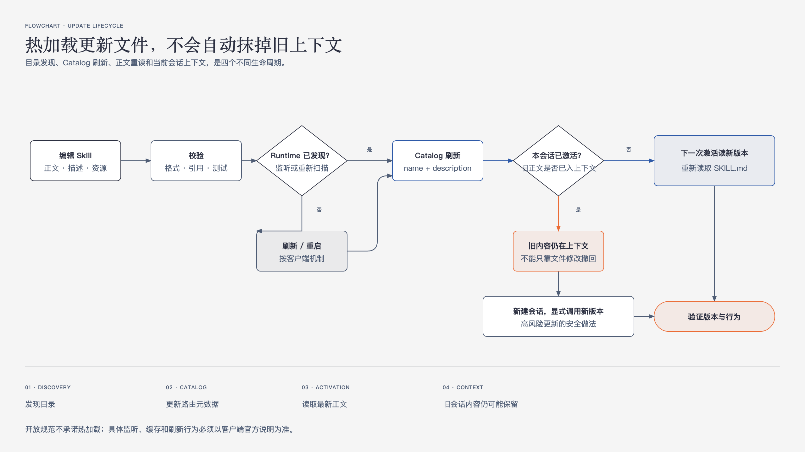

# Agent Skills 核心原理、使用与工程化指南

Agent Skills 正在成为通用 Agent 系统中重要的能力扩展方式。它看起来只是一个带有 `SKILL.md` 的目录，但真正解决的是一个长期存在的问题：

> 如何把团队的专业知识、操作流程、工具用法和工程约束，按需提供给通用 Agent，而不是每次重新写 Prompt，或者为每个场景重新开发 Agent。

本文面向需要设计、使用或治理 Agent Skills 的工程师。重点不是介绍某个产品的几个命令，而是建立一套跨产品、长期有效的认知：

- Skill 在 Agent 系统中处于什么位置；
- Skill 为什么能被发现和命中；
- `SKILL.md`、脚本、参考资料分别承担什么职责；
- 知识库是否适合 Skill 化；
- Skill 怎样更新，所谓“热加载”到底更新了什么；
- 如何把 Skill 当成可测试、可发布、可观测的工程资产。

> **资料边界（核验日期：2026-08-27）**
>
> 本文以 [Agent Skills 开放规范](https://agentskills.io/specification)为主线，并参考 Anthropic、Claude Code、Cursor、OpenAI Codex 和 GitHub Copilot 的官方资料。开放规范定义可移植格式，不规定所有产品的扫描目录、调用语法、权限模型和热加载行为。文中会明确区分“标准字段”“产品扩展”和“工程建议”。

---

## 1. Skill 是什么

Agent Skill 是一个可以被 Agent 发现并按需加载的目录包。它至少包含一个 `SKILL.md`，也可以附带脚本、参考资料、模板和其他资源。

```text
skill-name/
├── SKILL.md
├── scripts/
├── references/
└── assets/
```

更准确地说，Skill 是四种东西的组合：

1. **触发元数据**：告诉 Agent 这个 Skill 是什么、什么时候可能有用；
2. **操作说明**：告诉 Agent 完成某类任务时应该遵循什么流程；
3. **专业资料**：提供模型本身不知道的项目知识、接口约束和边界条件；
4. **确定性工具**：通过脚本完成不适合依赖模型临场生成的工作。

Anthropic 将 Skill 类比为给新员工准备的 onboarding guide：通用 Agent 已经有基础能力，Skill 负责补充组织特有的工作方式和专业知识。

### 1.1 Skill 不是什么

#### Skill 不是普通 Prompt 模板

Prompt 通常针对一次请求；Skill 是可发现、可复用、可版本化的任务能力包。它还能携带脚本和参考文件，并利用渐进式披露减少上下文开销。

#### Skill 不是 Tool 或 MCP Server

Skill 本身不会建立网络连接，也不会天然获得数据库权限。

- Skill 告诉 Agent **如何做**；
- Tool/MCP 告诉 Agent **可以调用什么外部能力**；
- Agent Runtime 负责真正加载 Skill、选择 Tool 并执行循环。

Skill 可以指导 Agent 调用 MCP Tool，但不能代替 MCP Server。

#### Skill 不是独立 Agent

Skill 没有自己的长期运行循环、模型实例和状态机。它是被 Agent Runtime 加载的一组指令和资源。某些产品可以让 Skill 在子 Agent 中执行，但这是宿主产品的扩展，不改变 Skill 的本质。

#### Skill 不是长期记忆

Skill 适合沉淀稳定方法和必要知识，不适合记录不断变化的用户状态、会话事实和业务数据。长期记忆、数据库和检索系统有不同的生命周期与一致性要求。

---

## 2. Skill 在 Agent 系统中的定位



一个完整 Agent 系统通常包含以下部分：

```text
用户
  ↓
Agent Runtime
  ├─ 模型：理解、推理和决策
  ├─ Rules：始终生效的基础约束
  ├─ Skills：按需加载的专业流程
  ├─ Memory / RAG：动态状态与可检索知识
  ├─ Tools / MCP：执行外部操作
  └─ Loop：规划、调用、观察、继续或结束
```

### 2.1 Skill 属于行为与知识层

Skill 的直接产物是“进入模型上下文的指令与资源”。它改变的是 Agent 处理任务的方法：

- 应该先读哪些文件；
- 应该按什么顺序操作；
- 哪些工具是默认选择；
- 哪些边界条件最容易出错；
- 输出应该满足什么格式；
- 完成后应该怎样验证。

Skill 不直接拥有执行权。是否允许读取文件、运行脚本、访问网络或调用 MCP，仍由 Runtime 的 Tool 与权限系统决定。

### 2.2 Skill、Rules、Memory、RAG、MCP 的区别

| 机制 | 主要作用 | 加载时机 | 适合内容 |
| --- | --- | --- | --- |
| Rules | 全局或路径级约束 | 始终或按文件范围加载 | 编码规范、禁止事项、固定约定 |
| Skill | 可复用专业流程 | 任务相关时按需加载 | 工作流、领域方法、工具使用指南 |
| Memory | 保存跨轮次状态 | 按会话或用户读取 | 偏好、历史状态、长期上下文 |
| RAG/搜索 | 从大规模语料检索事实 | 查询时动态检索 | 文档库、实时知识、海量内容 |
| Tool/MCP | 执行外部操作 | 模型或流程决定调用时 | API、数据库、文件、业务动作 |

判断原则：

- 每次会话都必须遵守的内容，放 Rules；
- 某类任务才需要的方法，放 Skill；
- 规模大、变化快、需要权限过滤的事实，放知识库；
- 需要真实读写外部系统的能力，做成 Tool 或 MCP；
- Skill 可以把这些机制组合成一条可靠工作流。

---

## 3. Skill 的标准结构

### 3.1 最小目录

按照 Agent Skills 规范，最小 Skill 只有一个文件：

```text
database-migration/
└── SKILL.md
```

完整工程通常是：

```text
database-migration/
├── SKILL.md
├── scripts/
│   ├── validate-plan.py
│   └── check-schema.py
├── references/
│   ├── migration-policy.md
│   └── rollback-patterns.md
├── assets/
│   └── migration-plan-template.md
└── evals/
    └── evals.json
```

规范定义 `scripts/`、`references/` 和 `assets/` 为推荐约定；`evals/` 是常见工程扩展，不属于必需结构。

### 3.2 `SKILL.md` 由两部分组成

```markdown
---
name: database-migration
description: >
  Generates and validates database migration plans. Use when creating,
  reviewing, or rolling back schema and data migrations.
compatibility: Requires Python 3.11+ and access to the project repository
metadata:
  owner: platform-team
  version: "1.3.0"
---

# Database Migration

## Workflow

1. Read the current schema.
2. Create a migration plan using `assets/migration-plan-template.md`.
3. Run `python3 scripts/validate-plan.py <plan>`.
4. Do not execute destructive SQL without explicit user approval.
```

第一部分是 YAML frontmatter，第二部分是 Markdown 指令正文。

### 3.3 标准 frontmatter 字段

| 字段 | 是否必需 | 作用 |
| --- | --- | --- |
| `name` | 是 | Skill 的稳定标识，必须与父目录名一致 |
| `description` | 是 | 描述做什么、什么时候使用，是发现和命中的核心信号 |
| `license` | 否 | License 名称或 Skill 内 License 文件 |
| `compatibility` | 否 | 产品、系统包、网络和运行环境要求 |
| `metadata` | 否 | 自定义字符串键值，例如 owner、version |
| `allowed-tools` | 否 | 预授权工具列表，仍是实验字段，产品支持不一致 |

`name` 必须满足：

- 1～64 个字符；
- 仅使用小写字母、数字和连字符；
- 不能以连字符开头或结尾；
- 不能包含连续连字符；
- 必须与 Skill 目录名一致。

`description` 最长 1024 个字符，必须同时回答：

1. 这个 Skill 能做什么；
2. 什么用户意图或任务场景应该使用它。

### 3.4 标准字段和产品扩展不要混写

Claude Code 等产品扩展了 frontmatter，例如：

```yaml
disable-model-invocation: true
user-invocable: false
context: fork
model: inherit
```

这些字段可能非常有用，但不是开放规范的一部分。需要跨客户端共享 Skill 时：

- 核心流程只依赖标准字段；
- 产品扩展写入 `compatibility` 或维护产品专用版本；
- 不要假设另一个 Agent 会理解或执行扩展字段；
- `allowed-tools` 本身也是实验字段，权限仍以宿主 Runtime 为准。

### 3.5 渐进式披露

Skill 可扩展的关键不是目录，而是 progressive disclosure：

```text
第一级：name + description
  所有可用 Skill 的轻量目录

第二级：完整 SKILL.md
  Skill 被激活时才加载

第三级：references / scripts / assets
  执行过程中按需读取或运行
```

规范建议：

- `SKILL.md` 保持在 500 行、5000 tokens 以内；
- 详细资料拆到独立文件；
- 引用路径从 Skill 根目录计算；
- 引用关系尽量只深入一层；
- 明确写出何时需要读取哪个参考文件。

差的写法：

```markdown
更多内容见 references/。
```

好的写法：

```markdown
当下游 API 返回非 2xx 时，读取 `references/api-errors.md`，
根据错误码选择重试、降级或终止。
```

---

## 4. Skill 如何生成

### 4.1 不要从“让模型写一个最佳实践 Skill”开始

Agent Skills 官方最佳实践明确指出：只让模型依赖通用训练知识生成 Skill，往往会得到“正确处理异常”“遵循安全最佳实践”之类没有工程价值的空话。

高价值 Skill 的来源应该是真实专业经验：

- 一次成功完成的复杂任务；
- 团队 Runbook 和故障复盘；
- API Schema、内部规范和配置；
- 反复出现的 Code Review 意见；
- 历史修复提交和线上事故；
- 工程师纠正 Agent 的关键反馈。

Skill 生成的本质不是“生成 Markdown”，而是**提取可复用的决策和步骤**。

### 4.2 推荐生成流程

#### 第一步：确认能力缺口

先让没有 Skill 的 Agent 完成真实任务，记录：

- 哪一步做错了；
- 缺少什么项目知识；
- 是否选错了工具；
- 是否遗漏关键验证；
- 是否在同一个地方反复试错。

如果 Agent 在没有 Skill 时已经稳定完成任务，就不一定需要创建 Skill。

#### 第二步：定义边界

一个 Skill 应覆盖一个内聚工作单元。例如：

- “生成并验证数据库迁移计划”是一个 Skill；
- “数据库迁移 + 数据库运维 + SQL 教程 + 容量规划”范围过大。

可以像设计函数一样检查：

- 输入是什么；
- 输出是什么；
- 依赖什么工具；
- 什么情况不应该使用；
- 成功标准是什么。

#### 第三步：先写命中描述

```yaml
name: database-migration
description: >
  Generates, reviews, and validates database migration and rollback plans.
  Use when a task changes database schema or data, adds migration files,
  reviews migration safety, or prepares rollback procedures.
```

不要只写：

```yaml
description: Helps with databases.
```

#### 第四步：只写最小有效流程

正文优先包含：

- 必须执行的步骤；
- 默认工具和命令；
- 非显而易见的 Gotchas；
- 输入输出模板；
- 完成条件；
- 失败后的处理方式。

不要解释模型本来就知道的基础概念。

#### 第五步：把确定性逻辑做成脚本

适合放进脚本的内容：

- Schema 和配置校验；
- 格式转换；
- 重复的数据处理；
- 固定算法；
- 机械化检查；
- 每次都被 Agent 临时重写的辅助逻辑。

脚本应该：

- 非交互式运行；
- 支持 `--help`；
- 对错误给出下一步建议；
- 结构化数据写 stdout，诊断写 stderr；
- 使用明确退出码；
- 尽量幂等；
- 破坏性操作支持 `--dry-run`；
- 固定依赖版本。

#### 第六步：从真实失败中迭代

执行 Skill 后，重点看完整轨迹，而不只是最终答案：

- 是否正确命中；
- 是否加载了无关参考文件；
- 是否绕过规定流程；
- 是否重复发明已有脚本；
- 是否在某一步反复试错；
- 是否产生过多 tokens 和命令。

每次需要人工纠正的非显然问题，都可能成为 `Gotchas` 或新的评测用例。

---

## 5. Skill 如何使用

### 5.1 安装位置由客户端决定

开放规范定义 Skill 包的格式，不统一规定所有客户端必须扫描哪些目录。

常见路径如下：

| 客户端 | 项目级 | 用户级 |
| --- | --- | --- |
| 通用约定 | `.agents/skills/<name>/` | `~/.agents/skills/<name>/` |
| Cursor | `.cursor/skills/<name>/` | `~/.cursor/skills/<name>/` |
| Claude Code | `.claude/skills/<name>/` | `~/.claude/skills/<name>/` |
| OpenAI Codex | `.agents/skills/`、`.codex/skills/` | `~/.agents/skills/`、`~/.codex/skills/` |
| GitHub Copilot | `.github/skills/`、`.claude/skills/`、`.agents/skills/` | `~/.copilot/skills/`、`~/.agents/skills/` |

工程上优先使用项目级 Skill：

- 和代码一起版本管理；
- 团队成员得到相同流程；
- Cloud Agent 克隆仓库后也能访问；
- 变更可以经过普通 Code Review。

用户级 Skill 适合个人通用工作流，例如写作、提交信息或个人调试习惯。

### 5.2 自动调用

自动调用的一般过程：

1. Runtime 扫描 Skill 目录；
2. 解析每个 `SKILL.md` 的 `name` 和 `description`；
3. 把轻量 Skill Catalog 提供给模型；
4. 用户提出任务；
5. 模型判断某个 Skill 是否相关；
6. Runtime 或模型读取完整 `SKILL.md`；
7. Agent 按说明加载资源、调用工具并完成任务。

### 5.3 显式调用

多数客户端提供显式调用方式，例如：

```text
/database-migration
$database-migration
明确告诉 Agent：使用 database-migration Skill
```

具体语法由产品决定。显式调用适合：

- 开发和调试 Skill；
- 高价值、低频工作流；
- 自动命中不稳定的场景；
- 用户必须明确选择的危险操作；
- 需要传递参数的命令式流程。

自动命中适合：

- 用户通常不知道 Skill 名称；
- Skill 对多种自然语言表达都应该生效；
- 任务边界清晰、误触发风险低。

### 5.4 Skill 被激活后发生什么



Skill 激活不等于把整个目录一次性塞入 Prompt。

规范推荐：

```text
Catalog 中只有 name + description
  ↓
命中后加载 SKILL.md
  ↓
Skill 指令要求时才读取 reference
  ↓
需要确定性处理时运行 script
  ↓
脚本输出和 Tool 结果进入上下文
```

不同 Runtime 可以通过文件读取，也可以通过专用 `activate_skill` Tool 返回 Skill 正文。具体实现不同，但渐进式披露原则相同。

---

## 6. Skill 是如何被命中的

### 6.1 `description` 是主要路由信号

Agent Skills 规范要求 Runtime 在启动或发现阶段读取所有 Skill 的 `name` 和 `description`。这两个字段构成模型看到的 Skill Catalog。

当用户请求到来时，模型根据：

- 当前用户意图；
- 对话上下文；
- Skill 名称；
- Skill description；
- Runtime 提供的激活规则；
- 当前是否已有更直接的工具；

判断是否需要加载 Skill。

因此，Skill 命中通常不是传统的关键词 `if/else`，也不是由目录名机械决定，而是一次模型路由决策。

### 6.2 命中具有非确定性

同一个请求多次运行，可能出现不同结果：

- 某次自动命中；
- 某次认为基础工具已足够而没有命中；
- 多个相近 Skill 之间选择不同；
- Skill description 过宽导致误触发。

这意味着“我手动试了一次成功”不能证明 Skill 命中可靠。

### 6.3 好 description 的写法

跨客户端最稳妥的结构是：

```text
做什么 + 处理哪些对象 + 何时使用 + 关键边界
```

例如：

```yaml
description: >
  Reviews Java database migrations for locking, backward compatibility,
  rollback safety, and data-loss risks. Use when creating or reviewing
  Flyway/Liquibase migrations or when a change modifies database schema.
  Do not use for ordinary SQL query optimization.
```

注意：

- 以用户意图描述触发场景，不要只描述内部实现；
- 包含常见同义表达和对象类型；
- 对相邻能力写清不适用边界；
- 不要堆砌所有可能关键词；
- 不要为了提高召回率把 description 写成“任何开发任务都使用”。

### 6.4 用正负样本测试命中

为每个 Skill 准备命中评测：

```json
[
  {
    "query": "帮我检查这次 Flyway 迁移有没有锁表和回滚风险",
    "should_trigger": true
  },
  {
    "query": "帮我优化这个查询的执行计划",
    "should_trigger": false
  }
]
```

推荐包含：

- 8～10 个 should-trigger 请求；
- 8～10 个 should-not-trigger 请求；
- 明确提到领域的请求；
- 没有说出 Skill 名但表达了相同意图的请求；
- 与 Skill 共享关键词、实际需求不同的 near-miss；
- 口语、缩写、错别字和带噪声上下文。

由于模型行为非确定，官方优化指南建议每个请求运行多次。可以记录：

```text
trigger_rate = 命中次数 / 总运行次数
```

优化时同时关注：

- **漏召回**：应该命中但没有命中；
- **误召回**：不应该命中却加载了 Skill；
- **选择冲突**：多个 Skill description 高度重叠；
- **命中后无收益**：Skill 被加载，但结果不比基线更好。

### 6.5 显式调用是确定性入口

自动命中始终是模型决策。需要确定性时：

- 使用产品提供的 `/skill`、`$skill` 或 Skill Tool；
- 在任务中明确要求使用指定 Skill；
- 对高风险操作关闭自动调用；
- 在 Agent SDK 中只暴露允许使用的 Skill 列表。

---

## 7. 知识库能否 Skill 化

答案是：**一部分可以，但不能把 Skill 当成通用知识库替代品。**



### 7.1 适合 Skill 化的知识

适合放入 `SKILL.md`：

- 稳定的操作流程；
- 决策顺序；
- 工具选择规则；
- 团队独有的 Gotchas；
- 必须始终执行的验证步骤；
- 某类任务的输入输出模板。

适合放入 `references/`：

- 相对稳定的小型 API 说明；
- 数据字段含义；
- 错误码映射；
- 术语表；
- 团队设计模式；
- 某个流程按场景拆分的详细资料。

### 7.2 不适合直接 Skill 化的知识

下面内容更适合外部知识库、搜索或 RAG：

- 数量巨大，无法按任务精确选择；
- 高频变化，需要分钟级或小时级更新；
- 需要按用户进行文档级权限过滤；
- 必须返回最新事实；
- 需要全文检索、向量检索或复杂排序；
- 内容来自数据库、工单、监控或实时业务系统。

把几万篇文档复制进 Skill 会产生三个问题：

1. Agent 不知道应该读哪一篇；
2. 版本和权限难以管理；
3. 文件存在不代表内容会自动进入模型上下文。

### 7.3 最合理的是混合架构

```text
Skill
  ├─ 定义什么时候检索
  ├─ 定义查询构造方法
  ├─ 定义来源优先级
  ├─ 定义结果校验方式
  └─ 指导调用搜索 Tool / MCP
             ↓
       外部知识库 / RAG
             ↓
       当前、授权后的事实
```

Skill 保存“怎样使用知识”，知识库保存“当前有哪些事实”。

例如研发知识 Skill 可以包含：

- 先搜索正式 ADR，再搜索 Wiki，最后搜索聊天记录；
- 生产故障问题必须限制时间范围；
- 引用结论时必须返回原始文档链接；
- 通过 `knowledge/search` MCP Tool 执行检索；
- 找不到一手证据时明确说明不确定。

而真正的 ADR、Wiki 和聊天记录仍留在有版本、权限和搜索能力的系统中。

### 7.4 判断公式

可以用四个问题快速判断：

```text
这是“方法”还是“事实”？
  方法优先 Skill，事实继续判断

内容是否规模小且稳定？
  是：可放 reference
  否：放外部知识库

是否需要实时更新或权限过滤？
  是：放外部系统

是否需要指导 Agent 如何检索和使用？
  是：额外创建 Skill 作为检索工作流
```

---

## 8. 更新与热加载

“修改文件后是否立即生效”不是一个单一问题。需要拆成四层：

1. **目录发现**：Runtime 是否发现新增或删除的 Skill；
2. **Catalog 刷新**：`name`、`description` 是否更新到模型可见目录；
3. **正文读取**：下一次激活是否读取最新 `SKILL.md`；
4. **上下文存量**：本会话已经加载的旧指令是否仍保留。

开放规范只定义 Skill 格式和渐进式披露，不要求客户端必须文件监听或热重载。

### 8.1 “文件更新”不等于“旧上下文被替换”

即使 Runtime 已发现新版本，本会话之前加载的 Skill 内容通常已经成为对话上下文的一部分。客户端可以让下一次激活读取新文件，但无法自动从模型上下文中擦除旧文本。

因此：

- 修改 description 需要 Catalog 刷新；
- 修改正文需要下一次激活重新读取；
- 已经激活过旧版的长会话，最好新建会话验证；
- 高风险变更不要依赖“看起来已经热加载”。

### 8.2 Claude Code 的实时变更检测

Claude Code 官方文档明确说明：

- 监听 `~/.claude/skills/`、项目 `.claude/skills/` 和 `--add-dir` 中已有的 Skill 目录；
- 在当前会话内发现 `SKILL.md` 的新增、修改和删除，不要求重启；
- 如果会话启动时顶层 Skills 目录还不存在，创建后需要重启 Claude Code 才能开始监听；
-实时检测只覆盖 `SKILL.md` 文本；
- Plugin 中 hooks、MCP、agents、output styles 等资源需要 `/reload-plugins`；
- 已经调用过的 Skill 内容仍会留在当前上下文，直到会话结束。

### 8.3 Cursor 和其他客户端

不同产品的扫描周期、缓存和会话更新策略可能不同。如果官方资料没有明确承诺热加载，工程上不要推断：

- 文件保存成功不代表 Catalog 已刷新；
- Catalog 已刷新不代表当前会话删除了旧内容；
- IDE 显示 Skill 不代表 Cloud Agent 使用了同一目录；
- 本地用户级 Skill 不一定会上传到远程沙箱。

可移植的安全流程是：

```text
编辑 Skill
  → 运行格式与链接校验
  → 查看客户端是否已重新发现
  → 新会话显式调用
  → 验证读取的是新版本
  → 再测试自动命中
```



### 8.4 为 Skill 增加可验证版本

开放规范没有独立顶层 `version` 字段，可以放在 `metadata`：

```yaml
metadata:
  owner: platform-team
  version: "1.4.0"
  updated: "2026-08-27"
```

建议：

- Skill 目录由 Git 管理；
- 发布版本使用 tag 或插件/包版本；
- 正文中避免散落易过期的日期和版本；
- 与外部 API 绑定时写清兼容范围；
- 重大流程变化使用新会话和回归评测；
- 远程平台使用平台提供的版本化 Skill API 或发布机制。

---

## 9. 使用与维护避坑

### 9.1 Skill 范围过大

症状：

- description 几乎匹配所有任务；
- 正文包含大量互不相关流程；
- 激活后模型难以找到当前需要的步骤。

处理：

- 以一个内聚工作单元拆分；
- 共享材料提取为 reference；
- 避免把“公司所有研发规范”做成一个 Skill。

### 9.2 把普通常识重复写进 Skill

Skill 中的每个 token 都会与对话、代码和其他 Skill 竞争注意力。只保留模型缺少的内容：

- 项目特定事实；
- 非显然限制；
- 固定流程；
- 工具和环境约束；
- 真实失败经验。

### 9.3 description 只写功能，不写触发场景

```yaml
# 差
description: Generates reports.

# 好
description: >
  Generates weekly engineering health reports from incident and delivery data.
  Use when the user requests weekly engineering metrics, incident trends,
  delivery summaries, or the standard leadership report.
```

### 9.4 参考文件拆得太深

不要形成：

```text
SKILL.md → index.md → platform.md → api.md → error.md
```

模型可能停止追踪，或者加载大量无关内容。让 `SKILL.md` 直接指向任务需要的文件。

### 9.5 脚本用途不明确

必须说明脚本是：

- 直接执行；
- 作为参考阅读；
- 还是执行后读取输出。

否则 Agent 可能把脚本全文读进上下文，而不是运行它；也可能执行本来只用于示例的危险脚本。

### 9.6 脚本依赖不固定

避免运行时使用未经固定的 `latest`。明确：

- 运行时版本；
- 依赖版本；
- 网络要求；
- 操作系统限制；
- 输入输出格式；
- 权限需求。

### 9.7 授权边界写在 description 里

Skill 指令不是安全边界。即使正文写着“只能读取”，仍必须由：

- Tool allowlist；
- 沙箱；
- 文件权限；
- 网络策略；
- MCP Server 授权；
- 人工确认；

执行真正限制。

### 9.8 安装不可信 Skill

Skill 可以指导 Agent 运行脚本、读取文件和访问网络。安装第三方 Skill 前至少检查：

- `SKILL.md` 是否要求读取敏感目录；
- scripts 是否上传数据；
- 是否动态下载和执行代码；
- 依赖是否固定；
- 是否申请过宽 Tool 权限；
- assets 是否包含二进制或隐藏内容；
- License 和维护来源是否可信。

### 9.9 只测试输出，不看执行轨迹

最终答案正确，过程仍可能存在：

- 没有命中 Skill；
- 意外用了其他 Skill；
- 跳过了权限确认；
- 重复运行破坏性命令；
- 读取了不必要的敏感文件；
- 消耗远高于基线。

评测必须同时覆盖命中、过程、产物和成本。

---

## 10. Skill 工程化实践

### 10.1 把 Skill 当成代码资产

推荐仓库结构：

```text
.agents/skills/
└── database-migration/
    ├── SKILL.md
    ├── scripts/
    ├── references/
    ├── assets/
    └── evals/
```

配套要求：

- 有明确 owner；
- 经过 Pull Request；
- 有变更记录；
- 有最小兼容说明；
- 有命中与输出评测；
- scripts 有普通单元测试；
- 高风险 Skill 有人工审批点。

### 10.2 CI 校验

最小 CI 应检查：

```text
目录名与 name 一致
YAML 可以解析
必需字段存在
description 长度合法
引用文件都存在
SKILL.md 不超过团队预算
脚本通过静态检查和测试
不存在密钥和绝对个人路径
```

Agent Skills 官方提供 `skills-ref`：

```bash
skills-ref validate ./database-migration
```

它负责规范结构验证；团队仍需补充引用、脚本、安全和评测检查。

### 10.3 建立两类评测

#### 命中评测

回答“是否在正确任务上加载”：

- should-trigger；
- should-not-trigger；
- near-miss；
- 多次运行后的 trigger rate；
- 同类 Skill 冲突。

#### 效果评测

回答“加载以后是否真的更好”：

- 与无 Skill 基线比较；
- 结果是否满足断言；
- 是否执行必需步骤；
- 是否调用正确工具；
- 是否产生预期文件；
- tokens、耗时和工具调用次数是否可接受。

官方评测指南建议每个测试用例分别运行 with-skill 和 without-skill，并记录结果、时间和 tokens。一个 Skill 如果只增加上下文和耗时，却没有提高成功率，就不值得保留。

### 10.4 可观测性

Runtime 或平台最好记录：

- 候选 Skill 列表；
- 最终激活的 Skill；
- Skill 版本和路径；
- 自动调用还是显式调用；
- 加载的参考文件；
- 执行的脚本；
- Tool 与 MCP 调用；
- tokens 和耗时；
- 用户取消和错误。

不要记录 Skill 读取到的密钥、完整业务数据或敏感文档正文。

### 10.5 发布策略

根据使用范围选择：

- 项目 Skill：随仓库发布；
- 个人 Skill：用户目录管理；
- 跨团队 Skill：独立仓库、插件或内部市场；
- 云端 Agent：使用平台的上传、版本和权限机制；
- 多客户端 Skill：以开放规范字段为核心，扩展字段分层维护。

避免把团队 Skill 通过聊天或压缩包随意传播。缺少来源、版本和审计会迅速形成配置漂移。

### 10.6 维护闭环

```text
真实任务失败
  → 判断是命中问题还是执行问题
  → 更新 description / instructions / script
  → 运行规范校验
  → 运行命中评测
  → 运行效果评测
  → 发布新版本
  → 观察线上轨迹
```

不要在每次失败后机械追加一条强制规则。规则越多不一定越可靠；有时应该删掉冲突说明、提供明确默认值，或者把易错逻辑移入脚本。

---

## 11. 工程师速查

### 应该创建 Skill 的信号

- Agent 在同类任务中反复犯相同错误；
- 每次都需要重新解释团队流程；
- 存在稳定、可复用的多步操作；
- 有项目专属 Gotchas；
- 需要固定输出模板和验证动作；
- Agent 每次都临时编写同一种辅助脚本。

### 不应该创建 Skill 的信号

- 模型不加 Skill 已经稳定完成；
- 内容只是通用常识；
- 内容巨大且高频变化；
- 核心需求是实时检索；
- 核心需求是外部系统执行能力；
- 无法定义什么叫成功。

### 发布前检查

- [ ] `name` 合法并与目录一致；
- [ ] `description` 同时描述 WHAT 和 WHEN；
- [ ] 有正负命中样本；
- [ ] 正文只保留必要指令；
- [ ] 参考文件按需加载；
- [ ] 脚本非交互、幂等且有清晰错误；
- [ ] 没有密钥、个人绝对路径和过期版本；
- [ ] 权限由 Runtime 和 Tool 系统强制；
- [ ] 与无 Skill 基线比较过；
- [ ] owner、版本和回滚方式明确。

---

## 12. 总结

Agent Skill 的价值，不是把更多文字塞给模型，而是把组织的专业能力整理成**可发现、可按需加载、可执行、可验证、可维护**的工程单元。

理解 Skill 时，需要始终抓住四个核心：

1. **Skill 是按需加载的行为与专业知识包，不是独立 Agent，也不是 Tool。**
2. **Skill 依靠 `name` 和 `description` 被发现，命中是模型路由决策，需要正负样本评测。**
3. **稳定方法适合 Skill，动态大规模事实适合知识库；最佳实践通常是 Skill 指导 Agent 使用检索和 MCP。**
4. **热加载是客户端能力，不是开放规范保证；目录发现、Catalog 刷新、正文重读和旧上下文必须分开理解。**

成熟的 Skill 不应该依赖“模型应该能理解”。它应该像成熟代码一样，有清晰边界、稳定接口、最小权限、自动校验、回归评测、版本治理和真实运行数据。

---

## 参考资料

- [Agent Skills Overview](https://agentskills.io/home)
- [Agent Skills Specification](https://agentskills.io/specification)
- [Agent Skills：Adding Skills Support](https://agentskills.io/client-implementation/adding-skills-support)
- [Agent Skills：Best Practices](https://agentskills.io/skill-creation/best-practices)
- [Agent Skills：Optimizing Descriptions](https://agentskills.io/skill-creation/optimizing-descriptions)
- [Agent Skills：Evaluating Skills](https://agentskills.io/skill-creation/evaluating-skills)
- [Agent Skills：Using Scripts](https://agentskills.io/skill-creation/using-scripts)
- [Anthropic：Equipping Agents for the Real World with Agent Skills](https://www.anthropic.com/engineering/equipping-agents-for-the-real-world-with-agent-skills)
- [Claude Code：Skills](https://docs.anthropic.com/en/docs/claude-code/skills)
- [OpenAI：Testing Agent Skills Systematically with Evals](https://developers.openai.com/blog/eval-skills)
- [OpenAI Codex：Build Skills](https://developers.openai.com/codex/skills)
- [GitHub Copilot：About Agent Skills](https://docs.github.com/en/copilot/concepts/agents/about-agent-skills)
