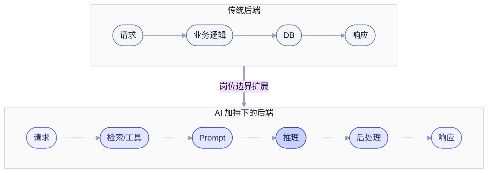
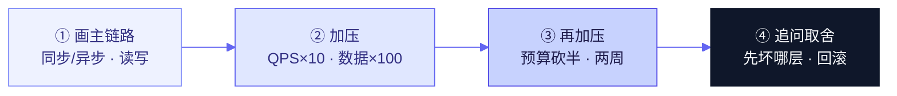
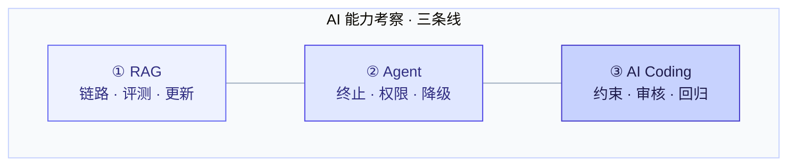
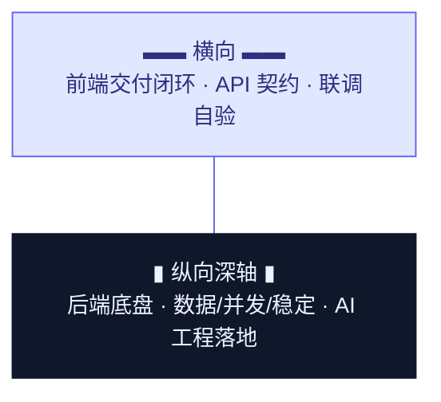
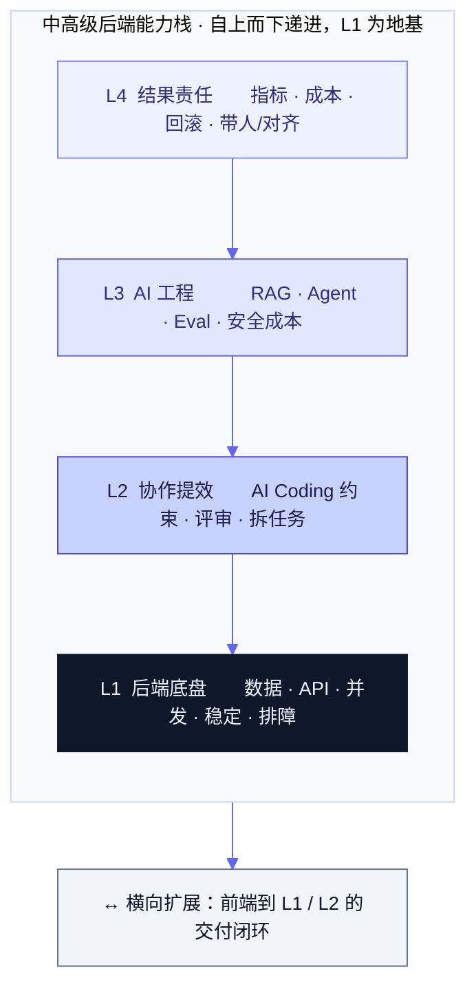
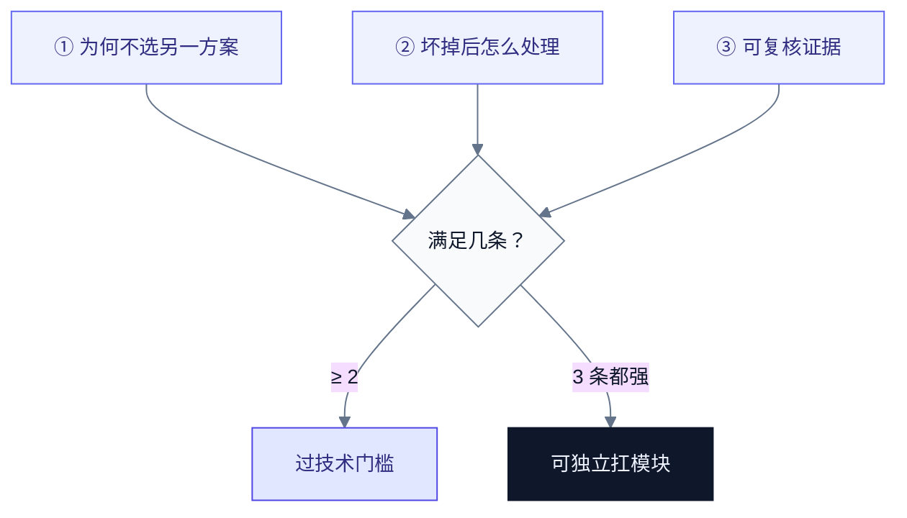
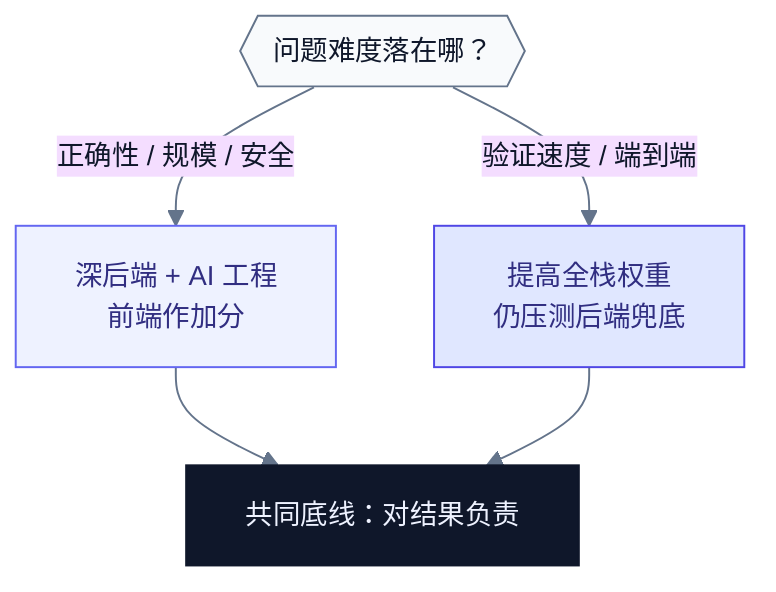
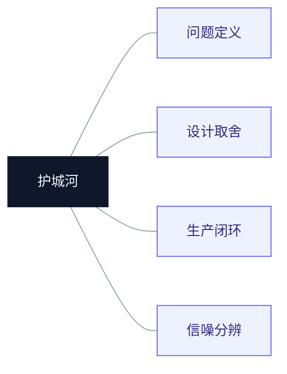
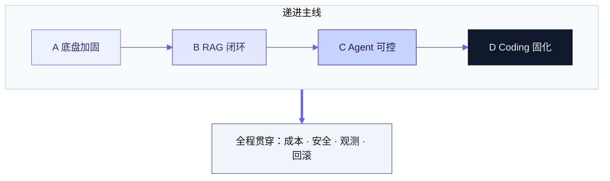

# AI 时代，我作为后端面试官到底在看什么

> 本文面向求职者与同行面试官。视角是**中高级后端招聘**：能独立扛模块，并能把 AI 工程能力落到业务里。  
> 不是题库，不是面经合集。核心只有一件事——**面试内容怎么变，我们到底在筛什么人。**

---

## 写在前面：先给结论

过去两年，候选人简历上多了两样东西：一堆 AI 名词，以及一句「熟练使用 Cursor / Claude Code」。

作为后端面试官，我的标准并没有变成「谁 prompt 写得花」。真正变贵的，是这些能力：

1. **把不确定的模型输出，做成可上线的系统**  
2. **在约束下做取舍，而不是堆组件**  
3. **审核 AI 产物的判断力**——流畅不等于正确  
4. **对模块结果负责**：稳定、成本、评测、回滚，而不是只负责「代码写完」

一句话：

> **代码正在贬值，工程闭环与技术判断正在升值。**  
> 八股没有死，死的是「只会背、不会用」；全栈不是目标，死的是「边界外就推锅」。

下面按这条主线展开：行业变了什么 → 面试怎么变 → 能力模型与达标线 → 后端/全栈抉择 → 竞争力 → 学习路径 → 收束。

```mermaid
%%{init: {'theme':'base','themeVariables':{'fontFamily':'ui-sans-serif,system-ui,sans-serif','fontSize':'14px','primaryTextColor':'#0f172a','lineColor':'#64748b','clusterBkg':'#f8fafc','clusterBorder':'#cbd5e1'}}}%%
flowchart LR
    A["① 行业"] --> B["② 面试"]
    B --> C["③ 能力模型"]
    C --> D["④ 岗位抉择"]
    D --> E["⑤ 竞争力"]
    E --> F["⑥ 学习路径"]
    F --> G["⑦ 收束"]

    style A fill:#eef2ff,stroke:#6366f1,color:#312e81
    style B fill:#eef2ff,stroke:#6366f1,color:#312e81
    style C fill:#eef2ff,stroke:#6366f1,color:#312e81
    style D fill:#eef2ff,stroke:#6366f1,color:#312e81
    style E fill:#eef2ff,stroke:#6366f1,color:#312e81
    style F fill:#eef2ff,stroke:#6366f1,color:#312e81
    style G fill:#0f172a,stroke:#0f172a,color:#f8fafc
```

---

## 一、背景：AI 如何改写后端岗位

### 1.1 岗位语义正在偏移

以前很多后端岗的隐含定义是：

> 吃透语言与中间件，把业务规则落成稳定接口。

现在同一张 JD 里，「加分项」越来越常出现：熟悉 LLM 应用、了解 RAG/Agent、有 Prompt / Eval 经验。这不是 HR 蹭热度，而是岗位边界在扩：

| 维度 | 传统后端 | AI 加持下的后端（中高级） |
|------|----------|---------------------------|
| 主链路 | 请求 → 业务逻辑 → DB → 响应 | 请求 → 检索/工具 → Prompt → 推理 → 后处理 → 响应 |
| 关键依赖 | MySQL / Redis / MQ / RPC | 上述全部 + 模型服务 + 向量检索 + 工具权限 |
| 质量定义 | 正确、稳定、性能 | 正确、稳定、性能 + **可信、可评测、可控成本** |
| 个人效率工具 | IDE、搜索、脚手架 | Coding Agent、规范约束、评审工作流 |

后端没有消失，它在变成 **「模型与业务之间的粘合层」**：算法可以采购，模型可以切换，但把能力接进权限、审计、限流、降级、账单和业务指标，仍然高度依赖工程。

### 1.2 Coding Agent 改的是「写」，不是「负责」

AI 编码把语法、样板、局部实现的成本打下来了。它没有自动解决：

- 需求是不是真问题  
- 数据模型三个月后会不会变成债  
- 幂等、一致性、安全边界谁来守  
- 线上坏了先保什么、后修什么  
- 模型胡说时系统如何降级，而不是把幻觉当真相返回

所以面试里，我会区分两类候选人：

- **把 AI 当打印机**：更快产出看起来能跑的代码  
- **把 AI 当初级同事**：会派活、会约束、会验收、会为结果背锅  

中高级要的是第二种。

### 1.3 变与不变

| 不变（底盘） | 变（新战场） |
|--------------|--------------|
| 数据建模、API 契约、并发与一致性 | RAG/Agent 链路设计与评测 |
| 故障排查、可观测、容量与成本意识 | Token/延迟/供应商切换与降级 |
| 安全与权限本能 | Prompt 注入、工具越权、数据出域 |
| 在约束下做架构取舍 | 用 AI 提效，同时控制复杂度膨胀 |

**如果你只有新战场没有底盘，面试里一追问生产细节就会空。**  
**如果你只有底盘拒绝新战场，简历在 2026 年会越来越难进二面。**

---

## 二、面试内容的结构性转变

这一章是全文最硬的部分。同行如果要对齐口径，建议直接对照「旧问法 / 新问法 / 我在听什么」。

### 2.1 基础：从背诵八股，到可迁移的工程理解

八股没有被取消，被取消的是「孤立知识点考试」。

| 旧问法 | 新问法 | 我在听什么 |
|--------|--------|------------|
| TCP 三次握手是什么 | SYN 丢了会发生什么？TIME_WAIT 过多怎么处理？ | 你是否理解协议设计背后的故障态 |
| Redis 有哪些数据结构 | 为什么这里用 Redis 而不是本地缓存/DB？热 Key 怎么治？ | 选型理由与边界 |
| 事务隔离级别背一遍 | 你们业务能接受脏读吗？用了什么隔离，出过什么事故？ | 有没有线上判断，而不只是教材复述 |

**中高级通过线**：能把基础映射到「场景 → 机制 → 故障 → 对策」。  

**过度要求**：要求背诵冷门源码细节，却从不问他有没有用过、出过什么事。

### 2.2 设计：从堆组件清单，到约束下的取舍

系统设计题的升级，不在于组件名是否时髦，而在于候选人是否能在加压条件下改方案。

典型追问链：

1. 先画主链路（同步/异步、写路径/读路径）  
2. 加压：QPS ×10、数据 ×100、跨地域、要强一致  
3. 再加压：预算砍半、团队只有 3 人、必须两周上线  
4. 问：哪一层会先坏？你保可用性还是一致性？回滚怎么做？

| 旧表现（常见淘汰信号） | 新表现（加分） |
|------------------------|----------------|
| 上来就 Redis + MQ + 微服务 | 先澄清 QPS、一致性、延迟、成本 |
| 方案只有一条「正确路径」 | 给出 2–3 个方案与取舍条件 |
| 只谈怎么做 | 同时谈怎么观测、怎么降级、怎么证明有效 |

**中高级通过线**：结构化表达（澄清 → 高层 → 深入 → 权衡），被加条件后能改方案而不是死扛。  
**过度要求**：要求现场给出可直接上生产的完整细设，却不给业务约束。

### 2.3 AI 能力：从「调过 API」，到链路工程与生产闭环

这是 2025–2026 后端面试增量最大的一块。我会拆成三条线考察，而不是问「你用过哪个框架」。

#### （1）RAG：检索增强是不是工程，而不是 Demo

常追问：

- 文档怎么切？固定长度还是语义切？overlap 怎么定？  
- 纯向量不够时，为什么上混合检索 + Rerank？  
- 幻觉怎么约束？有没有引用溯源？  
- 效果怎么评？Recall@K、人工抽检、业务指标有没有闭环？  
- 知识库更新如何不停服？

**听什么**：关键决策点，而不是「我用了 Milvus」。

#### （2）Agent：能不能把工具调用做成可控系统

常追问：

- Agent Loop 怎么停？最大步数、早停、死循环怎么防？  
- 工具权限怎么分级？失败重试会不会造成资金/数据侧效应？  
- 多 Agent 什么时候值得上，什么时候是过度设计？  
- Trace / 评测 / Human-in-the-loop 有没有？

**听什么**：把非确定性关进笼子的能力。

#### （3）AI Coding：会不会用，会不会审

常追问：

- 你怎么给 Agent 约束上下文（规范、目录、禁止事项）？  
- AI 生成代码你最常抓住哪类错误？  
- 复杂改动你是否拆任务、是否要求测试与回归证据？

**听什么**：人机协作工作流，而不是「我生成得很快」。

| 必须能讲清 | 加分 | 过度要求（对多数业务后端） |
|------------|------|------------------------------|
| 一条完整 RAG 或工具调用链路 + 至少一个生产问题 | Eval、成本治理、模型路由、安全护栏 | 训练大模型、自研推理引擎、发论文级算法 |

### 2.4 前端能力：从「后端不管 UI」，到「能闭环交付」

AI 降低了跨栈门槛，团队越来越讨厌「接口抛完就等前端」的纯后端。但这不等于人人都要成为资深前端。

我考察前端扩展时，看的是**交付闭环水位**，不是 CSS 美学竞赛：

| 水位 | 含义 | 面试怎么验证 |
|------|------|--------------|
| L0 不及格 | 完全不懂页面如何消费接口，联调全靠别人 | 讲不清前后端契约与错误态 |
| L1 及格（中高级后端常见要求） | 能读懂/小改页面与状态流；能用 AI 补齐简单前端并自己验收 | 给一个小需求：接口 + 简单交互，看他如何拆与验 |
| L2 加分 | 能独立交付中等复杂度前端，理解性能与体验边界 | 有端到端模块案例 |
| L3 过度（对后端岗） | 要求精通复杂前端工程化/视觉体系 | 那是前端专家岗的事 |

**立场**：后端岗要的是 T 型——**后端做深轴，前端到「能交付、能验收」**；不是把深度稀释成「什么都会一点」。

### 2.5 一张总表：面试现场的重心迁移

| 考察块 | 过去权重（粗） | 现在权重（粗） | 关键变化 |
|--------|----------------|----------------|----------|
| 八股背诵 | 高 | 中（改考法） | 从记忆 → 场景迁移 |
| 算法题 | 视公司 | 视公司 | 仍作筛选，但不再是中高级区分度唯一来源 |
| 系统设计 | 高 | 更高 | 加压取舍 + 故障与成本 |
| 项目深挖 | 高 | 最高 | 追问判断链与证据 |
| AI 工程 | 低/无 | 高（增量） | Demo 不够，要闭环 |
| 前端广度 | 低 | 中 | 闭环交付，不是转岗 |
| AI Coding 协作 | 无 | 中高 | 审核力 > 生成速度 |

---

## 三、能力模型：我们到底要什么样的中高级后端

把上面的转变收成一张可对照模型。中高级候选人，我期望四层同时成立：

### 3.1 L1 后端底盘（没有它，上面都是空中楼阁）

- 数据模型与 API 契约能讲清演进代价  
- 并发、幂等、一致性不是口号，能落到案例  
- 会排障：日志、指标、链路，能缩小范围  
- 知道性能与成本的基本账

### 3.2 L2 AI Coding 协作

- 能把任务拆成 Agent 可执行单元  
- 会写约束（规范、边界、禁止事项）  
- 会验收：测试、静态检查、人工审关键路径  
- 知道何时不该让 AI 直接改生产关键模块

### 3.3 L3 AI 工程落地

- 理解非确定性输出对系统的冲击  
- 能设计检索/工具/降级/审计中至少一条完整链路  
- 有评测或坏案例闭环意识  
- 能讨论延迟、成本、供应商绑定

### 3.4 L4 结果责任（中高级分水岭）

- 能定义「做成什么样算好」  
- 能在业务、风险、工期之间做决策并解释  
- 出问题能主导止血与复盘  
- 能把个人效率变成模块效率（规范、模板、评审）

---

## 四、这些要求合理吗：必须 / 加分 / 过度

理性拆解的意义，是防止招聘「既要又要」把人吓跑，也防止标准低到谁都行。

### 4.1 必须（中高级后端，过线门槛）

| 能力 | 达标证据（面试可验证） |
|------|------------------------|
| 后端底盘 | 至少 1 个复杂模块：有设计取舍、有故障/优化故事、有量化结果 |
| 系统设计 | 能在约束下改方案，能说清 trade-off |
| 工程闭环 | 谈到测试/观测/回滚中至少两项有真实经验 |
| AI 认知 | 能诚实区分「用过工具」与「做过链路」；对 AI 产物有审核意识 |
| 前端闭环 | 至少 L1：能协同/小改/自验，不把联调当黑盒 |

### 4.2 加分（显著拉开档位）

| 能力 | 达标证据 |
|------|----------|
| RAG/Agent 生产经验 | 讲得出优化前后对比、坏案例、评测方法 |
| 成本与评测治理 | Token、缓存、模型路由、LLM-as-Judge/人工抽检 |
| 安全意识 | 注入、工具权限、敏感数据出域有方案 |
| 端到端交付 | 独立扛过含前端的中等模块 |
| 组织贡献 | 规范、脚手架、评审机制、带人提效 |

### 4.3 过度要求（我会主动降噪）

| 过度项 | 为什么过度 |
|--------|------------|
| 必须精通训练/推理内核 | 那是算法/Infra 专家方向，不是多数业务后端 |
| 必须刷完所有 Agent 框架 | 框架会变，链路与治理能力更重要 |
| 必须达到资深前端视觉/工程深度 | 稀释后端深度，岗位定义会糊 |
| 必须「纯手写不靠 AI」才算能力强 | 时代工具变了，考的是判断与负责，不是苦劳 |
| 简历名词越多越好 | 名词密度通常与理解深度成反比 |

### 4.4 「程度」怎么卡：我用的三条验收

对中高级，我几乎总用这三条判断「是不是真的会」：

1. **能否讲清为什么不选另一种方案**  
2. **能否讲出一个线上/准线上坏掉后你怎么处理**  
3. **能否给出可复核的证据**（指标、评测、账单、事故复盘）

满足两条，通常可过技术门槛；三条都强，往往是可独立扛模块的人。

---

## 五、全栈还是后端：我的抉择逻辑

我自己是后端，招聘默认也以后端深度为主轴。但这不妨碍我要求前端扩展。关键是把「岗位策略」说清楚。

### 5.1 什么时候更应该要深后端

- 系统有真实一致性、安全、规模、数据复杂度  
- AI 能力要进核心业务链路（权限、资金、审计、主数据）  
- 团队已有前端，缺的是把模型与数据做稳的人  

这时「会一点前端」是加分，**「前端很炫但后端发虚」是风险**。

### 5.2 什么时候全栈广度更值钱

- 小团队、要端到端速度  
- 工具型/内部产品，交互不极端复杂  
- 需要快速验证 AI 功能的产品形态  

这时我会提高闭环权重，但仍会压测：AI 输出错误时后端有没有兜底。

### 5.3 我建议求职者如何自我定位

| 定位 | 适合谁 | 面试表达 |
|------|--------|----------|
| **深后端 + AI 工程**（我更常招） | 有分布式/数据/稳定经验，想切 AI 落地 | 「我能把非确定性能力接进生产系统」 |
| **交付型全栈 + AI** | 端到端产品经验强 | 「我能从体验到接口到模型调用闭环」 |
| **纯全栈名词堆砌** | — | 容易两边都不深，风险最大 |

> **抉择逻辑不是站队，而是匹配问题难度。**  
> 问题在系统正确性与规模 → 后端深轴优先；  
> 问题在验证速度与闭环 → 提高全栈权重；  
> 无论哪种，AI 时代都要求你能对结果负责。

---

## 六、变革路上，竞争力到底是什么

这一章回答「我们在关注什么」。把市场上流行的口号收成可面试、可培养的四块护城河。

### 6.1 问题定义能力

AI 很擅长「给定目标后的局部实现」，不擅长「判断该不该做、做到哪」。

竞争力体现为：

- 能把模糊需求拆成可验证目标  
- 能识别假需求与过度设计  
- 能定义成功指标（业务指标优先于技术炫技）

### 6.2 系统设计与取舍

竞争力体现为：

- 多方案比较，而不是唯一真理  
- 清楚边界：强一致/最终一致、同步/异步、集中/分布式  
- 敢于做减法：知道什么时候不上多 Agent、不上微服务

### 6.3 生产闭环能力

把系统从「能跑」推进到「能运营」：

- 可观测：出问题找得到  
- 可回滚：改错了撤得回  
- 可评测：AI 功能不是凭感觉说变好了  
- 可控成本：延迟、Token、机器、人效都在账上

### 6.4 信噪分辨力（审核 AI 的能力）

这是 AI 时代新增的硬竞争力：

- 能发现「看起来对」的代码里的权限洞、边界洞、一致性洞  
- 能约束 Agent，避免复杂度被无成本地堆高  
- 知道自己知识边界在哪——知识面决定 AI 是放大器还是归零器

**汇总成面试官一句话：**

> 我关注的不是你是不是比 AI 敲得快，  
> 而是你离开 AI 是否仍具备判断；有了 AI，是否能交付更稳、更便宜、更可证伪的结果。

---

## 七、学习路径：Agent / RAG / Coding，怎么走才像中高级

原则：**按产出物学习，不按课程名收藏。** 每一阶段都要能在面试里讲成故事。

### 阶段 A：加固底盘（2–4 周，可与工作并行）

**产出物**

- 整理 1–2 个本人真实项目的「设计决策文档」：备选方案、取舍、事故/优化  
- 补齐排障工具箱：日志、指标、画像/链路，至少能讲一次完整排障

**面试可讲**：「我不是背过隔离级别，而是在某某一致性问题里这样选。」

### 阶段 B：RAG 工程化（3–6 周）

**产出物**

- 一个完整 RAG：解析 → 切分 → 检索 →（可选 Rerank）→ 生成 → 引用  
- 至少做一轮评测：坏案例集 + 一次检索/切分优化对比

**面试可讲**：为什么切分策略变了，指标怎么变，而不是「我接了向量库」。

### 阶段 C：Agent 与工具调用（3–6 周）

**产出物**

- 一个带工具权限与终止条件的 Agent（业务 Agent 或 Coding Agent 其一）  
- 明确：状态、工具注册、失败重试、最大步数、审计日志  
- 最好有 Trace 或简单评测

**面试可讲**：死循环怎么防、工具失败怎么降级、什么时候不该上多 Agent。

### 阶段 D：AI Coding 工作流（持续）

**产出物**

- 个人/团队的约束文件与评审清单  
- 一次「AI 辅助完成 + 人工守住质量」的模块交付复盘  
- 前端 L1：用 AI 完成一个小闭环页面并能自测

**面试可讲**：你如何派活、如何验收、如何防止技术债被加速制造。

### 阶段路径图

**刻意不做的弯路**

- 只追框架版本，不建评测  
- 只做聊天机器人 Demo，不上权限与审计  
- 同时学训练、推理优化、全部前端工程化——中高级业务后端ROI通常很差

---

## 八、总结与展望

### 8.1 给求职者

1. **用证据替换名词**：每个 AI 关键词背后，准备「决策 / 故障 / 指标」三件套。  
2. **把前端当闭环能力，不当身份焦虑**：先到 L1，再谈要不要更深。  
3. **把 AI Coding 写成工作方式**：约束、拆分、评审、回归，而不是「我用过某某工具」。

### 8.2 给同行面试官

1. **改问法，而不是只改 JD 关键词**：场景、取舍、坏案例、证据。  
2. **写清必须/加分/过度**：减少「既要研究员又要苦力全栈」的幻觉招聘。  
3. **允许候选人用 AI，但看他怎么用**：派活质量、审核质量、对结果的责任声明。

### 8.3 展望

未来两三年，后端岗位名可能会继续漂向「AI 应用 / Agent 工程 / 智能化业务研发」，但底层稀缺不会漂丢：

- 谁能在不确定中定义正确问题  
- 谁能在约束下做可持续的设计  
- 谁能把模型能力关进可运营的系统  

**面试官真正要找的，不是更会说话的 prompt 用户，而是对模块结果负责的工程师。**

---

## 附录：一场中高级后端技术面的参考结构（60–90 分钟）

| 时段 | 内容 | 目的 |
|------|------|------|
| 10 min | 项目深挖开场 | 找真实判断链 |
| 15–20 min | 系统设计（可含 AI 场景） | 取舍与加压应变 |
| 15–20 min | AI 链路（RAG 或 Agent 二选一深挖） | 区分 Demo 与工程 |
| 10 min | 基础场景题（网络/DB/缓存择一） | 底盘是否扎实 |
| 5–10 min | AI Coding 工作方式 + 前端闭环水位 | 协作与交付 |
| 5 min | 反问 | 看问题质量与岗位匹配 |

> 结构可按公司文化裁剪，但建议保持：**项目判断 > 设计取舍 > AI 工程深度 > 工具熟悉度**。

---

**修订说明**：本文为面试官视角的选人框架文，强调转变机制与达标证据，不提供标准答案题海。若你的团队业务偏平台/偏算法，请上调 Infra 或训练相关权重，并同步改写「过度要求」边界。
