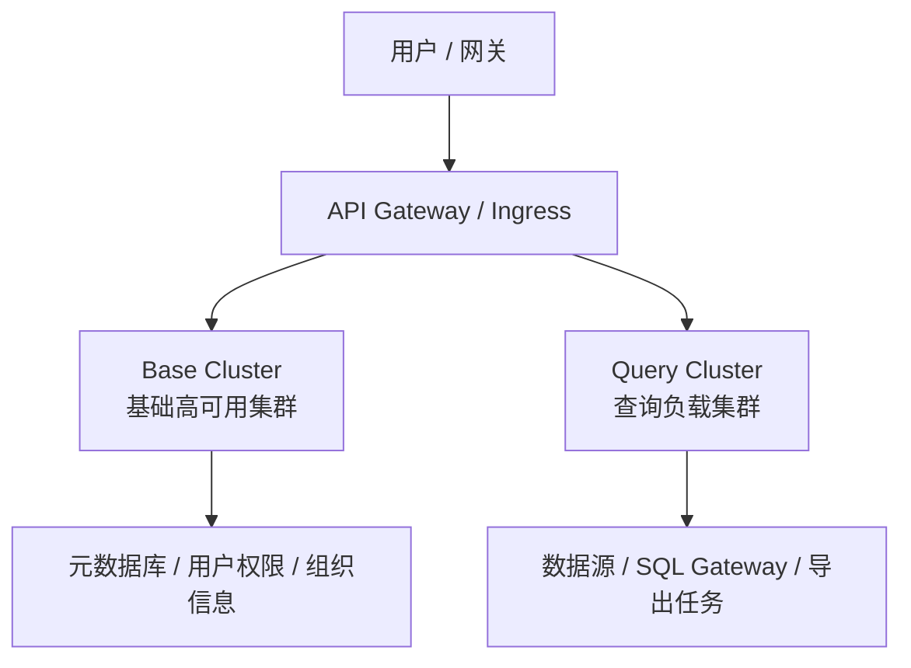

# 从一次结果集密集型查询 OOM 看 Java 服务的稳定性架构治理

> 本文回答一个典型的工程问题：**当一个高并发、结果集密集型 Java 数据查询服务在大结果集场景下出现堆内存 OOM 时，如何从现象定位到根因，并进一步沉淀出可持续的稳定性架构？**
>
> 这不是一次单点 Bug 修复复盘，而是一次关于「大对象、同步请求、APM 观测、JVM 堆、查询入口隔离」的系统性治理总结。

---

## 一、问题背景

在高并发、结果集密集型数据查询类系统中，在线查询接口往往承担着非常复杂的运行时压力。这类系统常见于报表分析、实时数据检索、多维查询、在线导出和数据服务平台等场景：

- SQL 或查询条件由用户配置、页面组件或上游系统动态生成，执行成本不可完全预估；
- 查询结果可能从几百行突然放大到几十万、几百万行；
- 多个页面组件、定时任务、导出任务可能同时触发查询；
- 服务端需要在 JVM 堆内承载结果集、序列化缓冲区、HTTP 响应对象和观测组件产生的临时对象。

一次生产环境 OOM 暴露出一个容易被忽略的问题：**真正压垮 JVM 的不一定是数据库查询本身，而可能是查询结果进入 JVM 后，被日志、APM 或响应序列化二次放大。**

本次事故发生在一个 Java 数据查询服务中，JVM 堆配置约 10GB。故障发生时，在线查询接口正在处理大结果集，堆转储显示多个 Tomcat 工作线程持有 GB 级对象，最终在 JSON 序列化缓冲区扩容时触发 `java.lang.OutOfMemoryError`。

---

## 二、执行摘要

本次问题的直接触发点是：

> APM Agent 在业务方法退出阶段，为打印方法调用日志，对完整查询结果对象执行 JSON 序列化。查询结果已经是一个超大 DataFrame，序列化过程又在堆上创建了巨大的字符数组，最终在 `SerializeWriter.expandCapacity` 阶段耗尽堆内存。

但如果只把问题归因于 APM，是不完整的。

更本质的问题有三层：

| 层次 | 问题 | 影响 |
|------|------|------|
| 结果集层 | 在线查询接口允许返回过大的结果集 | JVM 堆内首先形成 GB 级业务对象 |
| 观测层 | APM 对大对象做完整 JSON 序列化 | 在业务对象之外再次制造巨大临时对象 |
| 架构层 | 在线查询、定时任务、下载任务共享同一 JVM | 单类高波动负载可能拖垮整个服务 |

因此，治理策略也必须分层：

1. **短期止血**：限制或关闭 APM 对大对象的返回值序列化。
2. **中期治理**：为在线查询建立服务端返回行数硬上限和完整日志。
3. **长期架构**：将高波动查询负载与基础高可用能力拆分到不同运行时集群。

---

## 三、故障现象

生产环境表现为：

- JVM 进程发生 `java.lang.OutOfMemoryError: Java heap space`；
- 在线查询接口响应异常，部分请求失败；
- GC 压力明显升高，堆在短时间内被大对象顶满；
- 故障线程集中在 Web 容器工作线程，而不是异步下载线程或定时任务线程；
- 堆内存在超大查询结果对象，以及由 JSON 序列化产生的巨大字符数组。

从用户视角看，问题可能表现为：

- 数据页面加载失败；
- 在线分析接口超时或 500；
- 服务节点重启；
- 基础能力也被拖慢，例如登录、组织信息、权限接口响应变差。

这类问题的危险之处在于：它通常不是持续内存泄漏，而是**瞬时内存洪峰**。查询结束后，堆可能又能回落，因此如果只看长期堆趋势，很容易误判。

---

## 四、定位方法：从堆转储到线程栈交叉验证

面对 JVM OOM，单看日志通常不够。比较可靠的方法是把三类证据串起来：

1. 堆转储：确认谁持有最多内存。
2. 线程栈：确认这些对象正在被哪个调用链使用。
3. 业务上下文：确认对象来自哪个接口、哪个查询场景、哪个数据源。

### 4.1 堆转储分析

使用 Eclipse MAT 打开 `.hprof` 后，首先查看 Dominator Tree。关键发现是：

- 两个 Web 工作线程分别保留约 2GB 级别的堆内存；
- 线程下方存在 JSON 序列化缓冲区对象；
- 缓冲区内部是超大的 `char[]`；
- 同一线程还持有完整查询结果对象，结构类似 `List<List<Object>>`；
- 查询结果外层列表达到百万行级别。

这说明内存不是均匀分散在整个系统中，而是高度集中在少数在线查询线程上。

### 4.2 线程栈分析

线程栈显示，OOM 发生在 JSON 序列化扩容阶段：

```text
java.lang.OutOfMemoryError
  -> SerializeWriter.expandCapacity
  -> SerializeWriter.writeString
  -> JSON.toJSONString
  -> APM Monitor finally log
  -> 查询结果统计方法
  -> 在线查询执行方法
  -> Web Controller execute
```

这个栈非常关键。它说明：

- OOM 的直接位置不是 JDBC 读取结果，也不是 HTTP 响应输出；
- 触发点是 APM 在方法退出时打印日志；
- 此时业务查询结果已经完整装入内存；
- APM 又对完整结果进行 JSON 序列化，导致内存被放大。

### 4.3 排除其他路径

排查过程中，还需要排除几个常见误区：

| 候选原因 | 排除依据 |
|----------|----------|
| 异步下载导致 OOM | 故障线程是 Web 容器工作线程，不是下载线程 |
| 定时任务导致 OOM | 栈中锚点是在线查询接口，不是任务调度入口 |
| 单纯 HTTP 响应过大 | OOM 栈停在 APM 日志序列化阶段，响应序列化尚未成为第一现场 |
| 典型内存泄漏 | 大对象与查询线程生命周期绑定，查询结束后理论上可回收 |

结论是：**这是一次由大结果集触发、由 APM 全量序列化放大的瞬时堆内存事故。**

---

## 五、根因模型

这类问题可以抽象为一个三段式模型。


### 5.1 第一层：结果集过大

结果集密集型查询系统天然允许用户查询宽表、明细数据和多维分析结果。一旦服务端缺少硬性限制，请求可能返回远超预期的数据量。

典型风险包括：

- `pageSize` 上限形同虚设；
- 前端有限制，但后端未强制校验；
- SQL Gateway 或数据源适配层绕过分页；
- 本地聚合逻辑先全量拉取，再在 JVM 内聚合；
- 汇总统计路径额外执行查询，导致结果集或中间对象翻倍。

如果外层 `rows` 列表达到数百万行，即使每行只有少量字段，也足以在 JVM 堆上形成 GB 级对象。

### 5.2 第二层：序列化放大

大结果集本身已经危险，但更危险的是二次放大。

常见放大点包括：

- APM 打印方法入参和返回值；
- 业务日志打印完整对象；
- HTTP JSON 响应序列化；
- 缓存层将完整结果写入 Redis 或本地缓存；
- 异常日志把上下文对象完整展开。

JSON 序列化通常会构造中间字符缓冲区。对于超大对象来说，这相当于在原始业务对象之外，再申请一份甚至多份大内存。

所以本次事故中，堆上同时存在：

- 查询结果对象；
- JSON 序列化缓冲区；
- Web 请求上下文；
- APM 方法监控上下文；
- 并发线程上的另一份类似对象。

这些对象叠加后，10GB 堆仍然可能被快速耗尽。

### 5.3 第三层：运行时故障域过大

如果在线查询、定时任务、导出、登录、权限、基础元数据接口都部署在同一个 JVM 中，那么一个大查询峰值就可能影响所有能力。

从架构角度看，这不是简单的“内存给少了”，而是故障域边界不清晰：

- 查询接口允许慢，也允许占用较多资源；
- 基础接口要求稳定、低延迟、高可用；
- 两者共享同一进程、同一堆、同一线程池或同一生命周期时，稳定性目标天然冲突。

---

## 六、短期止血：先切断序列化放大链路

短期目标不是立即重构系统，而是先避免进程再次因为同类请求 OOM。

### 6.1 限制 APM 大对象序列化

对于 APM 和日志系统，应建立明确规则：

- 禁止对大结果集对象打印完整 JSON；
- 禁止在方法 finally 中默认展开返回值；
- 对集合、数组、字符串、二进制对象设置最大序列化长度；
- 对查询结果类、DataFrame 类、ResultSet 包装类加入黑名单；
- 日志只保留摘要信息，例如行数、列数、耗时、数据源、视图 ID、SQL hash。

推荐日志从“打印对象”改为“打印摘要”：

```text
query finished: viewId=xxx, rows=10000, columns=18, costMs=32500, source=starrocks, sqlHash=abc123
```

而不是：

```text
query result: {"columns":[...],"rows":[... millions of rows ...]}
```

### 6.2 必要时临时移除高风险 Agent

如果 APM 平台无法快速支持返回值黑名单或大对象裁剪，可以在预发环境验证移除 Agent 后的行为，再决定是否在生产临时下线该 Agent。

这个动作的取舍是：

| 方案 | 优点 | 风险 |
|------|------|------|
| 保留 Agent，关闭大对象序列化 | 保留链路监控能力，改动较小 | 依赖 APM 配置能力，可能漏配 |
| 临时移除 Agent | 彻底切断本次直接触发点 | 损失部分方法级监控和链路诊断能力 |

无论选择哪种方案，都只能算止血。因为只要服务端仍允许超大结果集进入堆，后续仍可能在 HTTP 响应、缓存或业务逻辑中再次触发 OOM。

---

## 七、中期治理：限制在线查询返回体积

结果集密集型查询系统可以支持慢查询，但不应该让单次在线请求无限制地返回明细数据。

需要建立一个明确原则：

> 在线查询用于交互式分析，必须有服务端硬上限；超大明细数据应进入异步导出或离线任务链路。

### 7.1 服务端 pageSize 硬顶

只依赖前端限制是不够的。后端必须有统一配置，例如：

```yaml
query:
  execute:
    max-page-size: 10000
    rows-warn-threshold: 50000
```

服务端收到请求后，应执行以下逻辑：

1. 校验 `pageSize` 是否为空、为负数或异常大；
2. 将 `pageSize` 限制在 `max-page-size` 内；
3. 对超过上限的请求选择拒绝或截断；
4. 记录 requested、effective、maxLimit；
5. 返回结果后记录实际 rows。

超限策略有两种：

| 策略 | 适用场景 | 特点 |
|------|----------|------|
| 直接拒绝 | API 契约明确、调用方可改造 | 语义清晰，不产生误解 |
| 静默截断并告警 | 兼容历史数据页面、短期不希望破坏用户体验 | 需要在响应或日志中明确标识截断 |

更推荐长期采用“明确拒绝或显式提示截断”，避免用户误以为拿到了完整数据。

### 7.2 JDBC 读取行数与分页保持一致

仅在服务入口限制 `pageSize` 还不够。还要确保数据源适配层不会绕过分页。

需要重点排查：

- SQL 渲染后是否真的带上 `LIMIT`；
- SQL Gateway 路径是否使用了分页参数；
- `ResultSet` 解析是否仍按无限行读取；
- 本地聚合是否先全量拉取数据；
- 汇总统计是否额外执行无分页查询。

一个常见隐患是：入口处 `pageSize=10000`，但底层 `ResultSet` 解析仍然使用无限读取，最终返回 rows 远大于入口限制。这种情况必须通过日志和单测验证。

### 7.3 每次查询记录 limit 与实际 rows

为了后续可观测，建议每次在线查询至少记录：

| 字段 | 说明 |
|------|------|
| scene | execute、cacheDelete、preview、shareExecute 等场景 |
| viewId / resourceId | 查询对象标识 |
| requestedPageSize | 客户端请求行数 |
| effectivePageSize | 服务端生效行数 |
| maxLimit | 当前配置上限 |
| rows | 实际返回行数 |
| costMs | 查询总耗时 |
| summaryEnabled | 是否包含汇总路径 |
| sourceType | 数据源类型 |

当 `rows` 超过阈值时，输出 warn 日志或指标事件。这样下一次排查时，不需要再从堆转储反推是否被超大 limit 打穿。

---

## 八、长期架构：按运行时资源特征拆分故障域

本次事故还暴露出一个更大的架构问题：所有能力共享同一个 JVM。

对于高并发、结果集密集型查询系统，比较合理的拆分方式不是简单按 Controller 或业务模块拆，而是按运行时资源特征拆。

### 8.1 双集群模型

建议将服务拆分为两个运行时集群：



### 8.2 Base Cluster

Base Cluster 承载低波动、高可用的基础能力：

- 登录、鉴权、Token；
- 用户、组织、角色、权限；
- 系统配置和基础元信息；
- 健康检查；
- 必要的基础管理接口。

它的目标是高可用和低延迟。即使查询集群发生 OOM、重启或扩缩容，基础能力也不应该被拖垮。

建议 SLO：

- 可用性：99.99%；
- P99 延迟：面向基础接口控制在较低范围；
- 禁止承接大查询和导出执行。

### 8.3 Query Cluster

Query Cluster 承载高内存、高波动、允许慢的查询负载：

- 在线数据页面查询；
- 数据分析 execute；
- 分享页查询；
- 定时任务触发的查询；
- 异步导出任务；
- SQL 执行和结果集处理。

它的目标不是永远低延迟，而是可控承压：

- 可以配置更大堆；
- 可以独立扩容；
- 可以针对慢查询、行数、数据源做专门监控；
- 即使节点重启，也不影响基础登录和权限接口。

### 8.4 网关显式分流

双集群架构能否生效，关键在网关路由。

必须显式配置：

| 路由类型 | 目标集群 |
|----------|----------|
| 登录、用户、组织、权限、系统信息 | Base Cluster |
| 查询、页面执行、分享执行、下载导出 | Query Cluster |

同时应避免 Base Cluster 同步阻塞依赖 Query Cluster。如果确实需要跨集群调用，也应设置超时、降级和隔离策略。

---

## 九、为什么“加内存”不是根治方案

遇到 OOM 后，第一反应往往是把 JVM 堆从 10GB 调到 12GB 或 16GB。这可以降低短期故障概率，但不能解决根因。

原因很简单：

1. 如果单次查询可以返回数百万行，结果集会随数据增长继续膨胀；
2. 如果 APM 或日志继续全量序列化，大对象仍会被二次放大；
3. 如果多个查询并发执行，内存峰值近似叠加；
4. 如果基础接口和查询接口仍在同一 JVM，故障域仍然没有隔离。

加内存只能增加缓冲区，不能改变系统的风险模型。

正确顺序应该是：

1. 限制大对象被无意义序列化；
2. 限制单次在线查询返回规模；
3. 将高波动负载与基础能力隔离；
4. 再根据压测结果调整 JVM 和容器资源。

---

## 十、落地路线

建议分三阶段推进。

### 阶段一：止血

目标：不再因为 APM 全量序列化大结果集导致 OOM。

动作：

- 为 APM 配置返回值黑名单；
- 对大集合、大字符串、大对象设置序列化上限；
- 如平台暂不支持，预发验证临时移除高风险 Agent；
- 观察 Full GC、OOM、Web 工作线程堆占用和查询接口错误率。

验收标准：

- 相同大查询场景下，不再出现 JSON 序列化缓冲区 GB 级膨胀；
- OOM 栈中不再出现 APM 对完整结果集的 `toJSONString`。

### 阶段二：服务端限流

目标：在线查询结果体积可控。

动作：

- 增加 `max-page-size` 配置；
- 统一入口处 pageSize 校验；
- 明确超限策略；
- 确保 JDBC、SQL Gateway、本地聚合路径都遵守分页；
- 每次查询记录 requested、effective、rows、costMs。

验收标准：

- 单次在线查询 rows 不超过服务端配置上限；
- 如果底层路径绕过分页，日志能直接暴露；
- 大明细数据被引导到异步导出链路。

### 阶段三：运行时隔离

目标：查询峰值不再影响基础服务可用性。

动作：

- 同一代码基线支持不同运行角色；
- 部署 Base Cluster 与 Query Cluster；
- 网关按路径分流；
- Query Cluster 独立扩缩容和 JVM 参数；
- Base Cluster 建立高可用 SLO 和白名单监控。

验收标准：

- 查询集群重启或 OOM 不影响登录、权限、基础信息接口；
- Base Cluster 连续满足高可用目标；
- Query Cluster 的慢查询、结果行数、堆使用可观测。

---

## 十一、工程经验总结

### 11.1 OOM 定位要看“谁在放大对象”

大结果集进入堆只是第一步。真正触发 OOM 的可能是：

- APM；
- 日志；
- JSON 响应；
- 缓存；
- 本地聚合；
- 异常处理。

因此，排查 OOM 不能只问“谁查了很多数据”，还要问“谁把这些数据又复制、展开、序列化了一遍”。

### 11.2 在线查询必须有服务端硬约束

前端限制、产品约定、默认 pageSize 都不是安全边界。真正的安全边界只能在服务端。

尤其是结果集密集型查询系统，必须明确区分：

- 在线交互查询：小结果、快响应、可分页；
- 异步导出：大结果、可排队、可重试、可限流；
- 离线任务：长耗时、强隔离、可观测。

不能让一个在线 HTTP 请求承载无限明细数据。

### 11.3 APM 观测不能破坏被观测系统

APM 的职责是观测系统，而不是改变系统的资源模型。

对高风险对象，APM 应遵循：

- 只记录摘要，不记录全文；
- 只记录耗时、异常、对象规模，不展开对象内容；
- 对返回值序列化设置硬限制；
- 对大对象类建立黑名单；
- 对 finally 中的监控逻辑保持极低内存开销。

### 11.4 架构稳定性要按资源特征拆分

很多系统最初按功能模块组织部署，但稳定性问题往往来自资源特征差异。

对于这类系统，基础接口和查询接口的资源模型完全不同：

| 能力 | 资源特征 | 稳定性目标 |
|------|----------|------------|
| 登录、权限、组织、配置 | 低内存、低延迟、可预测 | 高可用 |
| 查询、导出、定时任务 | 高内存、慢 SQL、强波动 | 可控承压 |

把它们放在同一个 JVM 中，本质上是让低波动能力承担高波动能力的风险。

---

## 十二、结语

本次 OOM 的直接原因是 APM 对超大查询结果做完整 JSON 序列化，但它揭示的问题远不止一个 Agent 配置。

它提醒我们：

- 大结果集进入 JVM 后，任何一次序列化都可能成为堆内存放大器；
- 在线查询接口必须有后端强约束，不能把无限数据交给 HTTP 请求承载；
- APM、日志、缓存等横切能力必须对大对象保持克制；
- 结果集密集型查询服务的稳定性治理，最终要走向运行时故障域隔离。

一个成熟的解决方案不应该停留在“这次 OOM 修好了”，而应沉淀为一套稳定性边界：

> 查询可以慢，但不能无限放大；观测可以细，但不能复制世界；系统可以承载重负载，但重负载不能拖垮基础能力。
