# 每个软件都需要一个 CLI + Skill：未来软件架构的终局猜想

> 各大厂都在做自己的 CLI——Claude Code、Gemini CLI、OpenCode、Codex CLI——而且全是 `npm install -g` 一键安装。装完之后加载 Skill，就能用自然语言操控一切。这让我想到一个问题：**未来是不是所有软件都需要一个自己的 CLI？Skill 是不是会变成软件能力的最小交付单元？**
>
> 但接踵而来的问题是：**Skill 一多就成千上万，CLI 怎么精准调用？开发一个 CLI 难不难？怎么用这套逻辑把自己的软件重做一遍？**
>
> 这篇文章沿着五条思考路径展开，试图回答这些问题。

---

## 一、命题：每个软件都需要一个 CLI Agent

### 1.1 正在发生的事实

2025-2026 年，一场静默的"CLI 复兴运动"正在发生。但这一次的 CLI 不再是 `man page` + `--help` 那个时代的产物——它们本质上是 **Agent**：

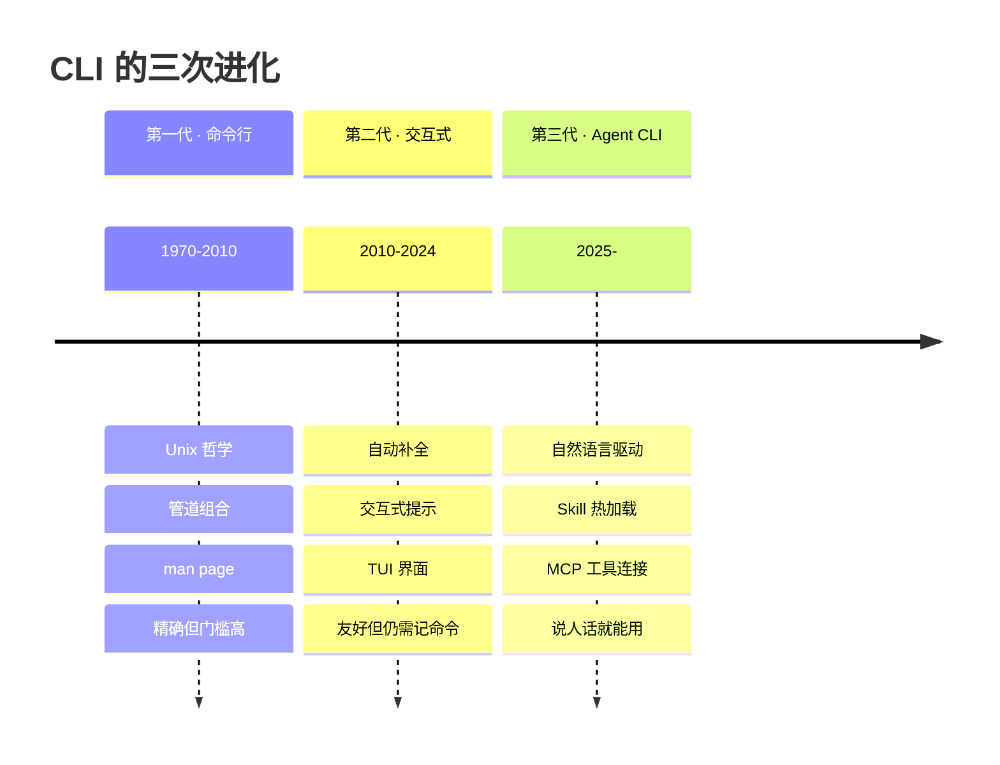
```mermaid
timeline
    title CLI 的三次进化
    section 第一代 · 命令行
        1970-2010 : Unix 哲学
                  : 管道组合
                  : man page
                  : 精确但门槛高
    section 第二代 · 交互式
        2010-2024 : 自动补全
                  : 交互式提示
                  : TUI 界面
                  : 友好但仍需记命令
    section 第三代 · Agent CLI
        2025-     : 自然语言驱动
                  : Skill 热加载
                  : MCP 工具连接
                  : 说人话就能用
```

看看这些产品在做什么：

| 产品 | 本质 | 安装方式 | Skill 机制 |
|------|------|---------|-----------|
| Claude Code | 编码 Agent CLI | `npm i -g @anthropic-ai/claude-code` | CLAUDE.md + Agent Skills |
| Gemini CLI | 编码 Agent CLI | `npm i -g @anthropic-ai/gemini-cli` | GEMINI.md + 插件 |
| Codex CLI | 编码 Agent CLI | `npm i -g @openai/codex` | 指令文件 + Function Calling |
| OpenCode | 开源编码 Agent | `go install` | 配置文件 + MCP |
| Warp | 智能终端 | 独立安装 | AI 命令解释 + Workflow |
| OpenClaw | 全能 Agent CLI | `npm i -g openclaw` | ClawHub Skill 市场 |

**模式高度一致：CLI 壳 + LLM 大脑 + Skill 能力包 + MCP 工具连接。**

### 1.2 为什么是 CLI 而不是 GUI

这不是技术审美问题，而是 **Agent 的天然形态就是文本流**：

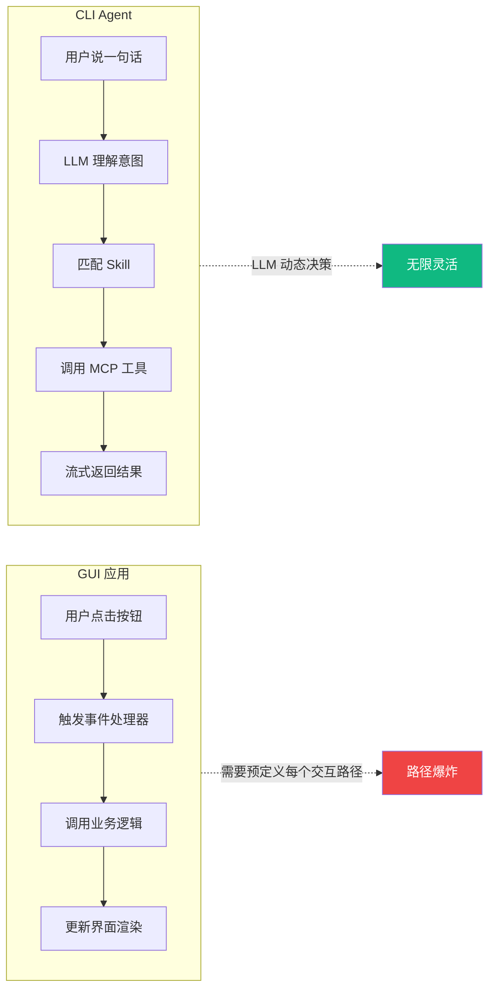
```mermaid
flowchart LR
    subgraph GUI["GUI 应用"]
        direction TB
        G1["用户点击按钮"] --> G2["触发事件处理器"]
        G2 --> G3["调用业务逻辑"]
        G3 --> G4["更新界面渲染"]
    end

    subgraph CLI_AGENT["CLI Agent"]
        direction TB
        C1["用户说一句话"] --> C2["LLM 理解意图"]
        C2 --> C3["匹配 Skill"]
        C3 --> C4["调用 MCP 工具"]
        C4 --> C5["流式返回结果"]
    end

    GUI -. "需要预定义每个交互路径" .-> LIMIT["路径爆炸"]
    CLI_AGENT -. "LLM 动态决策" .-> FLEX["无限灵活"]

    style LIMIT fill:#ef4444,color:#fff
    style FLEX fill:#10b981,color:#fff
```

三个核心原因：

1. **LLM 输入输出都是文本**——CLI 是零阻抗的连接方式，GUI 反而是额外的翻译层
2. **Agent 的行为不可预测**——GUI 需要预定义所有交互路径，但 Agent 的决策链路是动态的
3. **组合能力**——CLI 天然支持管道、脚本、自动化编排，GUI 做不到

> 这不意味着不需要 GUI。而是说 **CLI 是 Agent 的"原生接口"，GUI 是 Agent 的"展示层"**。先有 CLI，再套 GUI——就像 Git CLI 先于 GitHub Desktop。

### 1.3 一个推论：每个 SaaS 都会有自己的 Agent CLI

如果我们接受"CLI 是 Agent 天然形态"这个前提，逻辑链条就很清晰了：

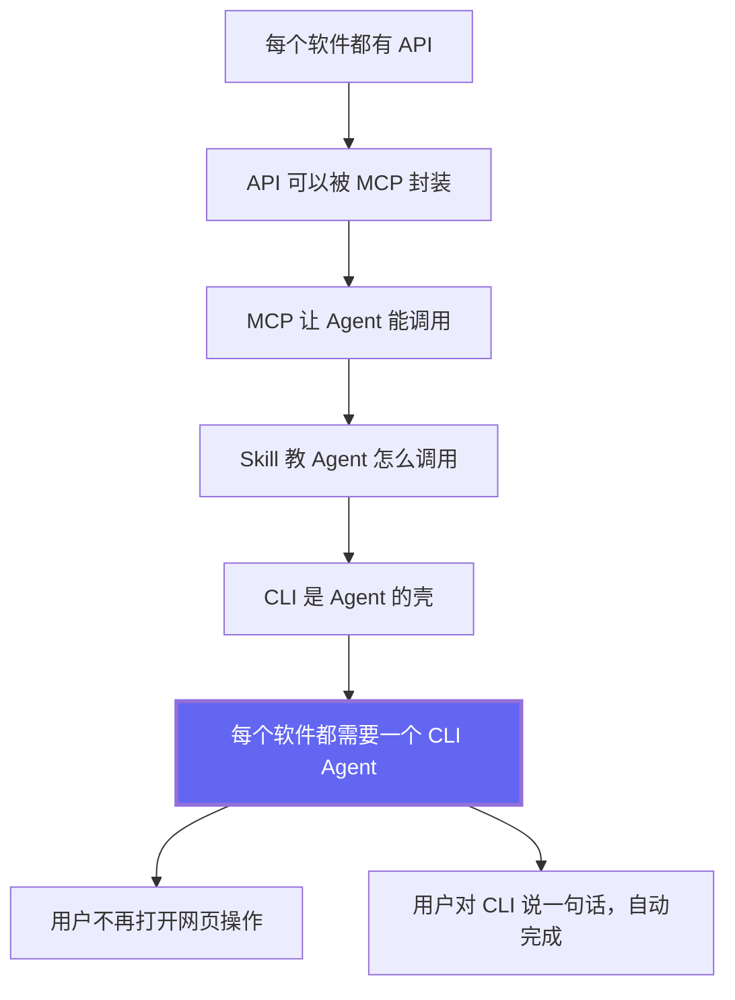
```mermaid
flowchart TD
    A["每个软件都有 API"] --> B["API 可以被 MCP 封装"]
    B --> C["MCP 让 Agent 能调用"]
    C --> D["Skill 教 Agent 怎么调用"]
    D --> E["CLI 是 Agent 的壳"]
    E --> F["每个软件都需要一个 CLI Agent"]

    F --> G["用户不再打开网页操作"]
    F --> H["用户对 CLI 说一句话，自动完成"]

    style F fill:#6366f1,color:#fff,stroke-width:3px
```

想象一下：

```bash
# 不再打开 Jira 网页，手动创建 Issue
$ jira-cli "把这个 bug 分给张三，P1 优先级，关联到 sprint 7"

# 不再打开 Figma，手动调布局
$ figma-cli "把首页 banner 改成渐变背景，文字居中"

# 不再打开财务系统，手动报销
$ finance-cli "报销上周北京出差的高铁票和酒店，一共 2380 元"
```

**这不是未来，这是正在发生的事。** Vercel 已经有 `vercel` CLI，Stripe 有 `stripe` CLI，AWS 有 `aws` CLI。只是它们还没有装上 Agent 大脑——但这只是时间问题。

---

## 二、Skill 的一键生成：从"专家手写"到"对话生成"

### 2.1 当前 Skill 的创建方式

今天创建一个 Skill，你需要：

1. 理解业务流程
2. 手写 SKILL.md
3. 编写辅助脚本
4. 测试调试
5. 发布到 Skill 市场

这其实跟"写代码"差不多——只是语言从 Python/TypeScript 变成了 Markdown + 自然语言。

但问题来了：**如果 Skill 的本质是"教 AI 怎么做事"，那 AI 自己能不能生成 Skill？**

### 2.2 Skill 应该可以一键生成

答案是肯定的。来看一个具体场景：

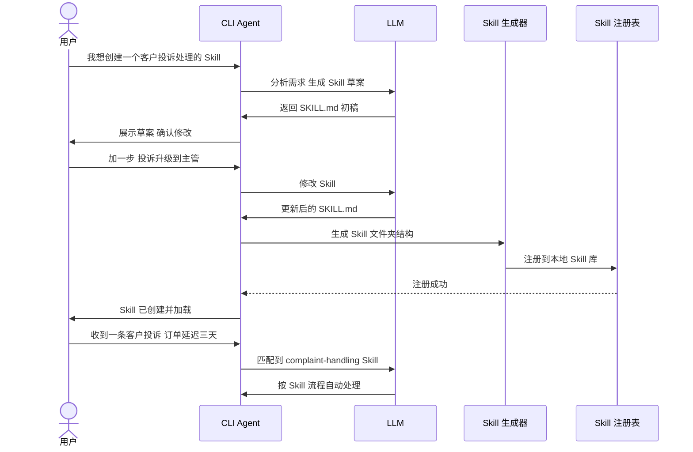
```mermaid
sequenceDiagram
    actor User as 用户
    participant CLI as CLI Agent
    participant LLM as LLM
    participant SkillGen as Skill 生成器
    participant Registry as Skill 注册表

    User->>CLI: 我想创建一个客户投诉处理的 Skill
    CLI->>LLM: 分析需求 生成 Skill 草案
    LLM->>CLI: 返回 SKILL.md 初稿
    CLI->>User: 展示草案 确认修改
    User->>CLI: 加一步 投诉升级到主管
    CLI->>LLM: 修改 Skill
    LLM->>CLI: 更新后的 SKILL.md
    CLI->>SkillGen: 生成 Skill 文件夹结构
    SkillGen->>Registry: 注册到本地 Skill 库
    Registry-->>CLI: 注册成功
    CLI->>User: Skill 已创建并加载
    User->>CLI: 收到一条客户投诉 订单延迟三天
    CLI->>LLM: 匹配到 complaint-handling Skill
    LLM->>CLI: 按 Skill 流程自动处理
```

**关键洞察**：Skill 生成本身就是一个 Skill。我们可以有一个 "meta-skill"——一个专门用来生成其他 Skill 的 Skill。

### 2.3 Skill 的生成管线

一个实用的 Skill 自动生成管线长这样：

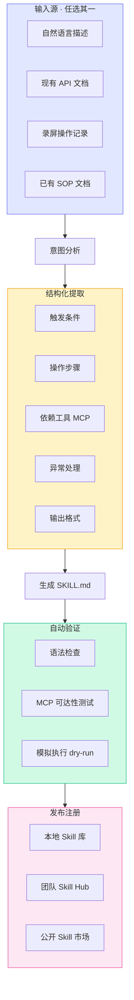
```mermaid
flowchart TD
    subgraph INPUT_BOX["输入源 · 任选其一"]
        I1["自然语言描述"]
        I2["现有 API 文档"]
        I3["录屏操作记录"]
        I4["已有 SOP 文档"]
    end

    INPUT_BOX --> ANALYZE["意图分析"]
    ANALYZE --> EXTRACT_BOX

    subgraph EXTRACT_BOX["结构化提取"]
        E1["触发条件"]
        E2["操作步骤"]
        E3["依赖工具 MCP"]
        E4["异常处理"]
        E5["输出格式"]
    end

    EXTRACT_BOX --> GENERATE["生成 SKILL.md"]
    GENERATE --> VALIDATE_BOX

    subgraph VALIDATE_BOX["自动验证"]
        V1["语法检查"]
        V2["MCP 可达性测试"]
        V3["模拟执行 dry-run"]
    end

    VALIDATE_BOX --> PUBLISH_BOX

    subgraph PUBLISH_BOX["发布注册"]
        P1["本地 Skill 库"]
        P2["团队 Skill Hub"]
        P3["公开 Skill 市场"]
    end

    style INPUT_BOX fill:#e0e7ff,stroke:#6366f1
    style EXTRACT_BOX fill:#fef3c7,stroke:#f59e0b
    style VALIDATE_BOX fill:#d1fae5,stroke:#10b981
    style PUBLISH_BOX fill:#fce7f3,stroke:#ec4899
```

### 2.4 表单 Skill 的例子

你提到的"创建某个表单的 Skill"，来看具体实现：

```bash
$ my-app-cli "生成一个客户登记表单的 Skill"
```

AI 自动生成：

```markdown
---
name: customer-registration-form
description: >
  创建和管理客户登记信息。当用户要求"登记客户""添加新客户"
  "录入客户信息"时激活。
triggers:
  - 登记客户
  - 添加客户
  - 新客户录入
---

## 必填字段

| 字段 | 类型 | 校验规则 |
|------|------|---------|
| 姓名 | string | 非空，2-50字符 |
| 手机号 | string | 11位手机号格式 |
| 公司名称 | string | 非空 |
| 来源渠道 | enum | [线上推广/转介绍/自然流量/BD拓展] |

## 操作流程

1. 收集用户提供的客户信息
2. 校验字段完整性和格式
3. 若信息不完整，逐个询问缺失字段
4. 调用 CRM 接口创建客户 → [MCP: crm-server]
5. 返回创建结果（客户ID + 摘要）

## 对话示例

用户："帮我登记个客户，张三，电话 13800138000，XX科技公司，BD介绍来的"
→ 提取：姓名=张三，手机=13800138000，公司=XX科技，来源=BD拓展
→ 调用 CRM API 创建
→ 返回："已创建客户 张三（ID: C-20260415），来源：BD拓展"
```

从此你只需说一句话就能创建一条客户记录。**表单不再是一个页面，而是一段对话。**

---

## 三、Skill 精准调用的秘诀：当 Skill 成千上万时

### 3.1 问题的本质

这是整篇文章最核心的技术问题。当一个 CLI Agent 加载了上千个 Skill，用户说"帮我请个假"——Agent 怎么知道该调用 `leave-application` 而不是 `time-off-query` 或 `attendance-report`？

这本质上是一个 **信息检索 + 语义匹配 + 上下文决策** 的复合问题。

### 3.2 三层漏斗架构

精准调用的秘诀在于**不要让模型一次看到所有 Skill**，而是用**三层漏斗**逐步缩小范围：

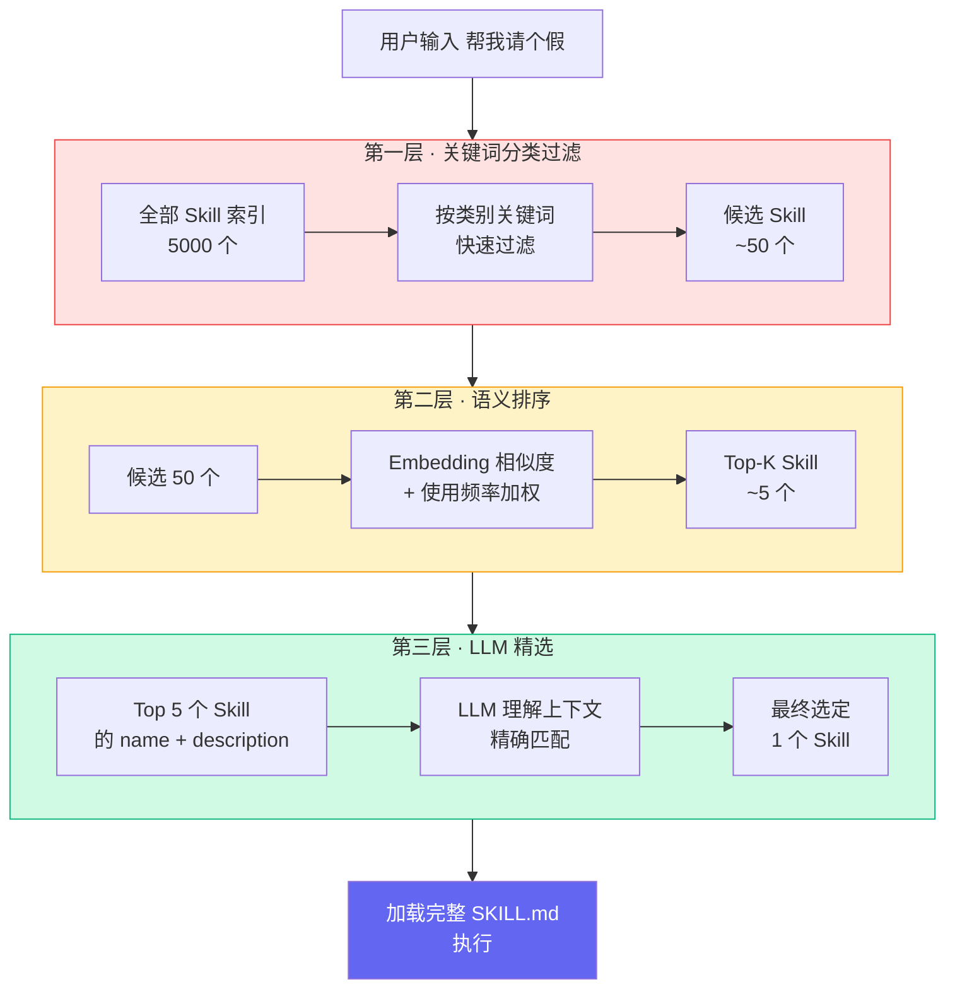
```mermaid
flowchart TD
    USER["用户输入 帮我请个假"] --> L1

    subgraph L1["第一层 · 关键词分类过滤"]
        direction LR
        L1A["全部 Skill 索引<br/>5000 个"] --> L1B["按类别关键词<br/>快速过滤"]
        L1B --> L1C["候选 Skill<br/>~50 个"]
    end

    L1 --> L2

    subgraph L2["第二层 · 语义排序"]
        direction LR
        L2A["候选 50 个"] --> L2B["Embedding 相似度<br/>+ 使用频率加权"]
        L2B --> L2C["Top-K Skill<br/>~5 个"]
    end

    L2 --> L3

    subgraph L3["第三层 · LLM 精选"]
        direction LR
        L3A["Top 5 个 Skill<br/>的 name + description"] --> L3B["LLM 理解上下文<br/>精确匹配"]
        L3B --> L3C["最终选定<br/>1 个 Skill"]
    end

    L3 --> LOAD["加载完整 SKILL.md<br/>执行"]

    style L1 fill:#fee2e2,stroke:#ef4444
    style L2 fill:#fef3c7,stroke:#f59e0b
    style L3 fill:#d1fae5,stroke:#10b981
    style LOAD fill:#6366f1,color:#fff
```

每一层的设计意图：

| 层级 | 方法 | 输入规模 | 输出规模 | 延迟 | 作用 |
|------|------|---------|---------|------|------|
| L1: 过滤 | 关键词 + 分类标签 + 倒排索引 | 5000 | ~50 | <5ms | 排除明显不相关的 |
| L2: 排序 | Embedding 余弦相似度 + 频率 | ~50 | ~5 | <20ms | 语义级粗排 |
| L3: 精选 | LLM 读 description 决策 | ~5 | 1 | ~200ms | 上下文级精排 |

**总延迟 < 250ms，比你打开一个网页还快。**

### 3.3 Skill 的元数据设计：精准调用的基础

精准调用的前提是 **Skill 有足够好的元数据**。一个高质量的 Skill 索引条目应该包含：

```
┌──────────────────────────┐
│      SkillMetadata       │
├──────────────────────────┤
│ + name: string           │
│ + description: string    │
│ + triggers: string[]     │
│ + categories: string[]   │
│ + keywords: string[]     │
│ + embedding: float[]     │
│ + usageCount: int        │
│ + successRate: float     │
│ + requiredMCPs: string[] │
│ + conflictsWith: string[]│
│ + lastUsed: datetime     │
└──────────┬───────────────┘
           │ 被索引
           ▼
┌──────────────────────────────────────┐
│            SkillIndex                │
├──────────────────────────────────────┤
│ + skills: Map<string, SkillMetadata> │
│ + keywordIndex: InvertedIndex        │
│ + embeddingIndex: VectorIndex        │
│ + categoryTree: CategoryTree         │
├──────────────────────────────────────┤
│ + add(skill)                         │
│ + search(query): SkillMetadata[]     │
│ + rank(candidates, ctx): Metadata[]  │
└──────────┬───────────────────────────┘
           │ 被路由器使用
           ▼
┌──────────────────────────────────────┐
│            SkillRouter               │
├──────────────────────────────────────┤
│ + index: SkillIndex                  │
│ + llm: LLM                          │
├──────────────────────────────────────┤
│ + resolve(input, ctx): Skill         │
│ - filterByKeyword(input): Metadata[] │
│ - rankBySemantic(cands): Metadata[]  │
│ - selectByLLM(topK, ctx): Metadata   │
└──────────────────────────────────────┘
```

### 3.4 六个精准调用的工程技巧

**技巧一：Trigger 短语比 Description 更重要**

```yaml
# ❌ 只有 description
description: "处理员工请假申请流程"

# ✅ 加上 trigger 短语
description: "处理员工请假申请流程"
triggers:
  - "请假"
  - "休假"
  - "请个假"
  - "想休息几天"
  - "年假"
  - "病假"
  - "事假"
```

Trigger 是用户最可能说出的那些话。它不需要完美——只需要覆盖高频表达。

**技巧二：层级分类 + 命名空间**

```
skills/
├── hr/                    # 人力资源类
│   ├── leave-apply        # 请假
│   ├── leave-query        # 查假
│   └── attendance-report  # 考勤
├── finance/               # 财务类
│   ├── expense-submit     # 报销
│   └── budget-query       # 预算
├── crm/                   # 客户管理类
│   ├── customer-create    # 创建客户
│   └── order-track        # 订单追踪
└── devops/                # 运维类
    ├── deploy-prod        # 生产部署
    └── rollback           # 回滚
```

分类让第一层过滤效率大幅提升——如果上下文已经在"HR"话题里，直接把其他类别的 Skill 全部跳过。

**技巧三：上下文感知——记住用户在"聊什么"**

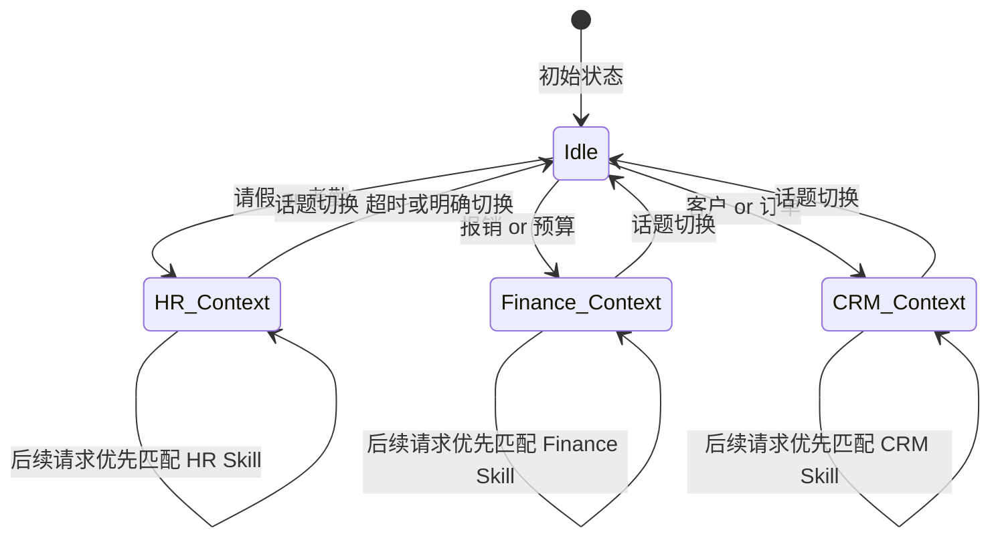
```mermaid
stateDiagram-v2
    [*] --> Idle: 初始状态

    Idle --> HR_Context: 请假 or 考勤
    Idle --> Finance_Context: 报销 or 预算
    Idle --> CRM_Context: 客户 or 订单

    HR_Context --> HR_Context: 后续请求优先匹配 HR Skill
    Finance_Context --> Finance_Context: 后续请求优先匹配 Finance Skill
    CRM_Context --> CRM_Context: 后续请求优先匹配 CRM Skill

    HR_Context --> Idle: 话题切换 超时或明确切换
    Finance_Context --> Idle: 话题切换
    CRM_Context --> Idle: 话题切换
```

当用户刚说了"帮我请个假"，紧接着又说"顺便帮我看看剩几天"——第二句不包含任何明确关键词，但上下文暗示了它是"查询剩余年假"，而不是"查看剩余预算"。

**技巧四：使用频率加权——越常用的排越前**

```
score = semantic_similarity * 0.6 + usage_frequency * 0.2 + recency * 0.1 + success_rate * 0.1
```

一个每天被调用 50 次的 Skill 和一个半年没人用的 Skill，在语义相似度接近时，前者应该优先。

**技巧五：冲突检测——避免歧义**

当多个 Skill 得分非常接近时（差距 < 阈值），**不要猜，要问**：

```
用户：帮我看一下张三的情况

CLI：我找到了两个可能匹配的操作：
  1. 📋 查看员工档案（HR 系统）
  2. 🤝 查看客户详情（CRM 系统）
请问你指的是哪一个？
```

**技巧六：学习与反馈——越用越准**

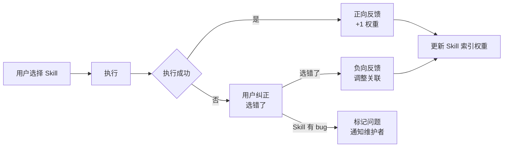
```mermaid
flowchart LR
    A["用户选择 Skill"] --> B["执行"]
    B --> C{"执行成功"}
    C -- "是" --> D["正向反馈<br/>+1 权重"]
    C -- "否" --> E["用户纠正<br/>选错了"]
    E -- "选错了" --> F["负向反馈<br/>调整关联"]
    E -- "Skill 有 bug" --> G["标记问题<br/>通知维护者"]
    D & F --> H["更新 Skill 索引权重"]
```

### 3.5 类比：Skill 调度就是"大脑的注意力机制"

如果把 CLI Agent 想象成一个大脑：

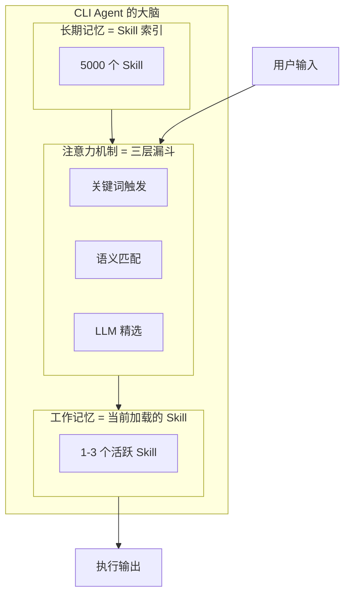
```mermaid
flowchart TD
    subgraph BRAIN["CLI Agent 的大脑"]
        direction TB
        
        subgraph LONG["长期记忆 = Skill 索引"]
            S1["5000 个 Skill"]
        end

        subgraph ATTENTION["注意力机制 = 三层漏斗"]
            A1["关键词触发"]
            A2["语义匹配"]
            A3["LLM 精选"]
        end

        subgraph WORKING["工作记忆 = 当前加载的 Skill"]
            W1["1-3 个活跃 Skill"]
        end

        LONG --> ATTENTION
        ATTENTION --> WORKING
    end

    INPUT["用户输入"] --> ATTENTION
    WORKING --> OUTPUT["执行输出"]
```

人脑也不会同时想着自己会的所有事情——你说"做饭"，大脑不会同时激活"开车""写代码""游泳"的记忆。它会先按类别过滤，再按语境匹配，最后精确激活。

**Skill 精准调用的本质，就是为 CLI Agent 实现一套人工的"注意力机制"。**

---

## 四、CLI Agent 的开发：难度、架构与设计

### 4.1 开发难度：没你想象的那么大

先说结论：**一个基础的 CLI Agent，一个全栈工程师一周可以做出来。** 但要做到生产级，需要 2-4 周。

难度分级：

```
                        CLI Agent 开发难度 vs 价值矩阵

    业务价值高 ▲
              │  ┌─────────────────────┬──────────────────────┐
              │  │    优先实现          │     重点投入          │
              │  │                     │                      │
              │  │  • Skill 加载机制    │  • Skill 精准路由     │
              │  │  • MCP 工具连接      │  • Skill 自动生成     │
              │  │                     │  • 权限与安全         │
              │  ├─────────────────────┼──────────────────────┤
              │  │    按需开发          │     谨慎评估          │
              │  │                     │                      │
              │  │  • 基础对话循环      │  • 多 Agent 编排      │
              │  │  • 流式输出          │  • 离线能力           │
              │  │  • GUI 壳            │                      │
              │  └─────────────────────┴──────────────────────┘
    业务价值低 └───────────────────────────────────────────────▶
              开发难度低                              开发难度高
```

### 4.2 核心架构设计

一个生产级 CLI Agent 的架构分 5 层：

```
┌──────────────────────────────────────────────────────────────┐
│                   Layer 1 · CLI 输入层                         │
│           终端交互  /  流式 I/O  /  管道  /  REPL              │
├──────────────────────────────────────────────────────────────┤
│                   Layer 2 · Agent 循环核心                     │
│       消息收发 → LLM 调用 → 工具执行 → 结果反馈 → 循环         │
├──────────────┬──────────────────┬────────────────────────────┤
│  Layer 3a    │   Layer 3b       │   Layer 3c                 │
│  Skill 路由器 │   Skill 加载器    │   Skill 注册表              │
│  三层漏斗匹配 │   渐进式披露      │   索引 + 元数据             │
├──────────┬───┴──────┬───────────┴───┬────────────────────────┤
│ Layer 4  │          │               │                        │
│ MCP      │ MCP      │  内置工具      │  Function Calling      │
│ Server A │ Server B │  (文件/HTTP)   │  (原子调用)             │
├──────────┴──────────┴───────────────┴────────────────────────┤
│                   Layer 5 · 基础设施                           │
│       认证鉴权   ·   日志审计   ·   配置管理   ·   插件系统     │
└──────────────────────────────────────────────────────────────┘
```

### 4.3 从零开始的技术选型

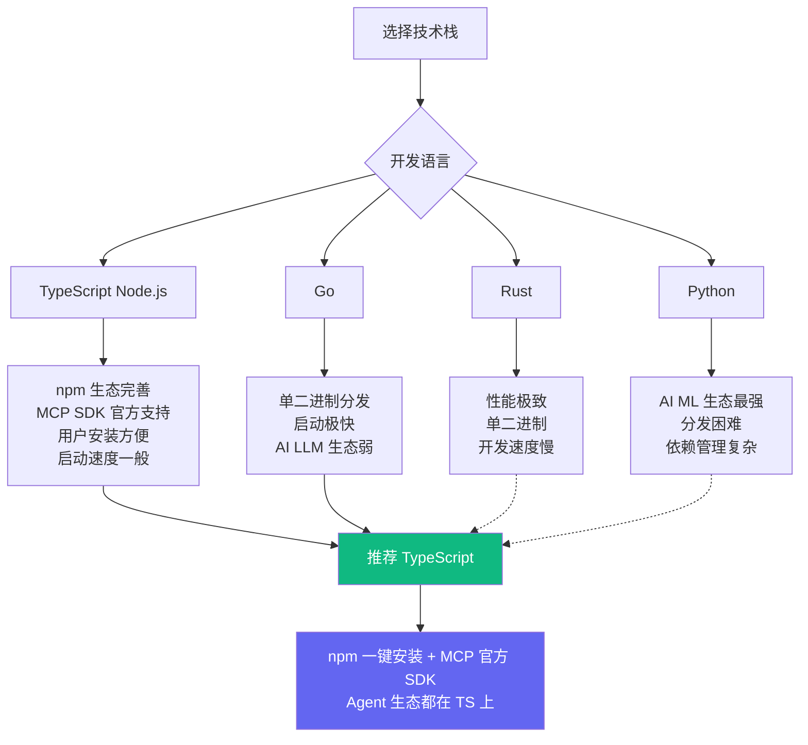
```mermaid
flowchart TD
    START["选择技术栈"] --> LANG{"开发语言"}

    LANG --> TS["TypeScript Node.js"]
    LANG --> GO["Go"]
    LANG --> RUST["Rust"]
    LANG --> PYTHON["Python"]

    TS --> TS_PRO["npm 生态完善<br/>MCP SDK 官方支持<br/>用户安装方便<br/>启动速度一般"]
    GO --> GO_PRO["单二进制分发<br/>启动极快<br/>AI LLM 生态弱"]
    RUST --> RUST_PRO["性能极致<br/>单二进制<br/>开发速度慢"]
    PYTHON --> PY_PRO["AI ML 生态最强<br/>分发困难<br/>依赖管理复杂"]

    TS_PRO --> REC["推荐 TypeScript"]
    GO_PRO --> REC
    RUST_PRO -.-> REC
    PY_PRO -.-> REC

    REC --> WHY["npm 一键安装 + MCP 官方 SDK<br/>Agent 生态都在 TS 上"]

    style REC fill:#10b981,color:#fff
    style WHY fill:#6366f1,color:#fff
```

### 4.4 核心模块实现

**模块一：Agent Loop（核心循环）**

这是整个 CLI 的心脏。Claude Code 的 512K 泄露源码告诉我们，生产级 Agent Loop 其实惊人的简单：

```typescript
async function agentLoop(userMessage: string, context: ConversationContext) {
  context.addMessage({ role: "user", content: userMessage });

  while (true) {
    // 1. 组装消息 + 系统提示 + 已加载的 Skill
    const messages = context.buildMessages();
    const tools = skillRouter.getActiveTools(context);

    // 2. 调用 LLM
    const response = await llm.chat({ messages, tools, stream: true });

    // 3. 处理响应
    for await (const chunk of response) {
      if (chunk.type === "text") {
        process.stdout.write(chunk.text);
      }
      if (chunk.type === "tool_call") {
        const result = await toolExecutor.execute(chunk.toolCall);
        context.addToolResult(chunk.toolCall.id, result);
      }
    }

    // 4. 判断是否继续循环
    if (!response.hasToolCalls) break;
    if (context.budgetExceeded()) break;
  }
}
```

**模块二：Skill Router（路由器）**

```typescript
class SkillRouter {
  private index: SkillIndex;
  private llm: LLMClient;

  async resolve(input: string, context: ConversationContext): Promise<Skill> {
    // L1: 关键词 + 分类过滤
    const candidates = this.index.filterByKeywordsAndCategory(
      input,
      context.currentCategory
    );

    // L2: 语义排序
    const topK = await this.index.rankBySemantic(input, candidates, 5);

    // L3: LLM 精选（仅当候选 > 1 时）
    if (topK.length === 1) return topK[0];

    const selected = await this.llm.selectSkill(input, topK, context);
    return selected;
  }
}
```

**模块三：Skill Loader（渐进式加载器）**

```typescript
class SkillLoader {
  // 三层渐进加载
  async loadForDiscovery(skillId: string): Promise<SkillSummary> {
    // ~100 tokens: name + description + triggers
    return this.registry.getSummary(skillId);
  }

  async loadForActivation(skillId: string): Promise<SkillFull> {
    // <5000 tokens: 完整 SKILL.md 内容
    return this.registry.getFullContent(skillId);
  }

  async loadForExecution(skillId: string): Promise<SkillRuntime> {
    // 加载关联脚本和工具定义
    return this.registry.getRuntime(skillId);
  }
}
```

### 4.5 开发路线图


```mermaid
flowchart LR
    subgraph W1["Week 1 · 最小可用"]
        direction TB
        W1A["Agent Loop 核心循环"]
        W1B["基础 Skill 加载"]
        W1C["1-2 个内置工具"]
        W1D["终端 IO + 流式输出"]
    end

    subgraph W2["Week 2 · 能力扩展"]
        direction TB
        W2A["MCP 客户端"]
        W2B["Skill 路由器"]
        W2C["配置系统"]
        W2D["错误处理与重试"]
    end

    subgraph W3["Week 3 · 生产加固"]
        direction TB
        W3A["权限控制"]
        W3B["日志审计"]
        W3C["Skill 自动生成"]
        W3D["使用反馈系统"]
    end

    subgraph W4["Week 4 · 生态建设"]
        direction TB
        W4A["Skill 市场 Hub"]
        W4B["插件机制"]
        W4C["npm 发布"]
        W4D["文档 + 示例"]
    end

    W1 --> W2 --> W3 --> W4
```

### 4.6 一个极简 CLI Agent 的目录结构

```
my-agent-cli/
├── package.json
├── tsconfig.json
├── src/
│   ├── index.ts                 # CLI 入口
│   ├── agent/
│   │   ├── loop.ts              # Agent 核心循环
│   │   ├── context.ts           # 对话上下文管理
│   │   └── budget.ts            # 预算/限流控制
│   ├── skill/
│   │   ├── router.ts            # Skill 三层路由
│   │   ├── loader.ts            # 渐进式加载器
│   │   ├── registry.ts          # Skill 注册表
│   │   ├── generator.ts         # Skill 自动生成
│   │   └── index.ts             # Skill 索引与检索
│   ├── tool/
│   │   ├── executor.ts          # 工具执行引擎
│   │   ├── mcp-client.ts        # MCP 协议客户端
│   │   └── builtin/             # 内置工具
│   │       ├── file.ts
│   │       ├── http.ts
│   │       └── shell.ts
│   ├── llm/
│   │   ├── client.ts            # LLM API 封装
│   │   ├── stream.ts            # 流式处理
│   │   └── providers/           # 多模型支持
│   │       ├── openai.ts
│   │       ├── anthropic.ts
│   │       └── ollama.ts
│   └── config/
│       ├── settings.ts          # 配置加载
│       └── auth.ts              # 认证管理
├── skills/                      # 内置 Skill
│   ├── help/
│   │   └── SKILL.md
│   └── skill-generator/
│       └── SKILL.md
└── README.md
```

---

## 五、用 CLI + Skill 重做你的软件

### 5.1 心智模型转换

传统软件和 CLI + Skill 软件的根本区别不在于技术实现，而在于**交互范式的转换**：

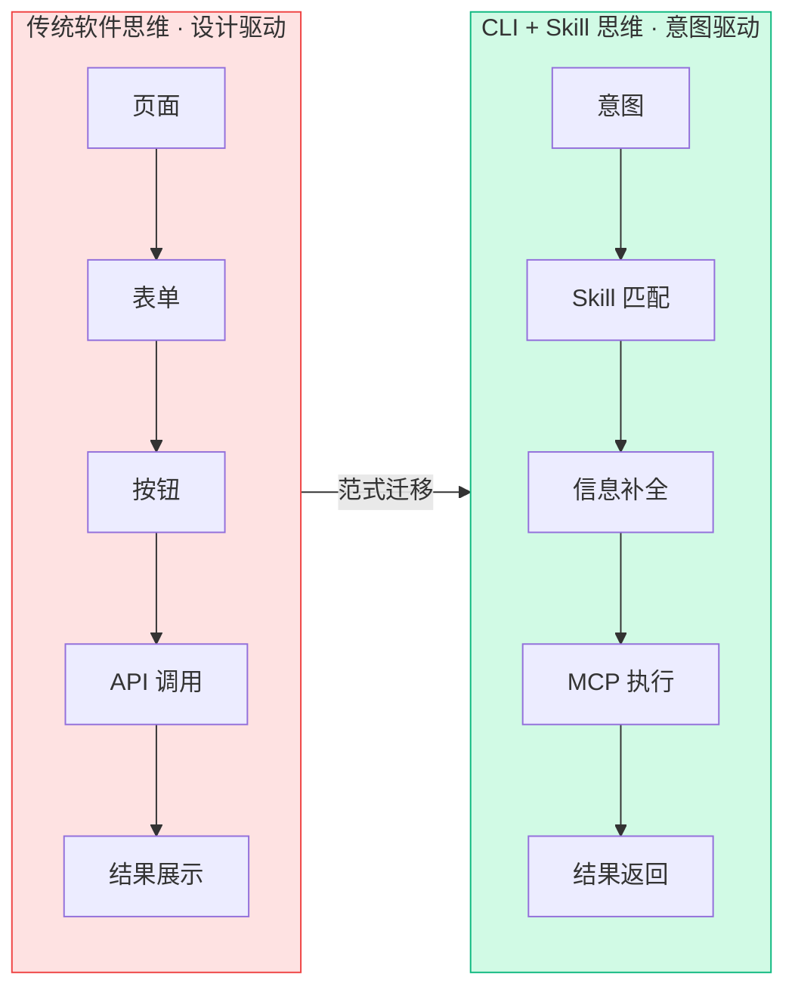
```mermaid
flowchart LR
    subgraph OLD["传统软件思维 · 设计驱动"]
        direction TB
        O1["页面"] --> O2["表单"]
        O2 --> O3["按钮"]
        O3 --> O4["API 调用"]
        O4 --> O5["结果展示"]
    end

    subgraph NEW["CLI + Skill 思维 · 意图驱动"]
        direction TB
        N1["意图"] --> N2["Skill 匹配"]
        N2 --> N3["信息补全"]
        N3 --> N4["MCP 执行"]
        N4 --> N5["结果返回"]
    end

    OLD -- "范式迁移" --> NEW

    style OLD fill:#fee2e2,stroke:#ef4444
    style NEW fill:#d1fae5,stroke:#10b981
```

### 5.2 重做的六步法

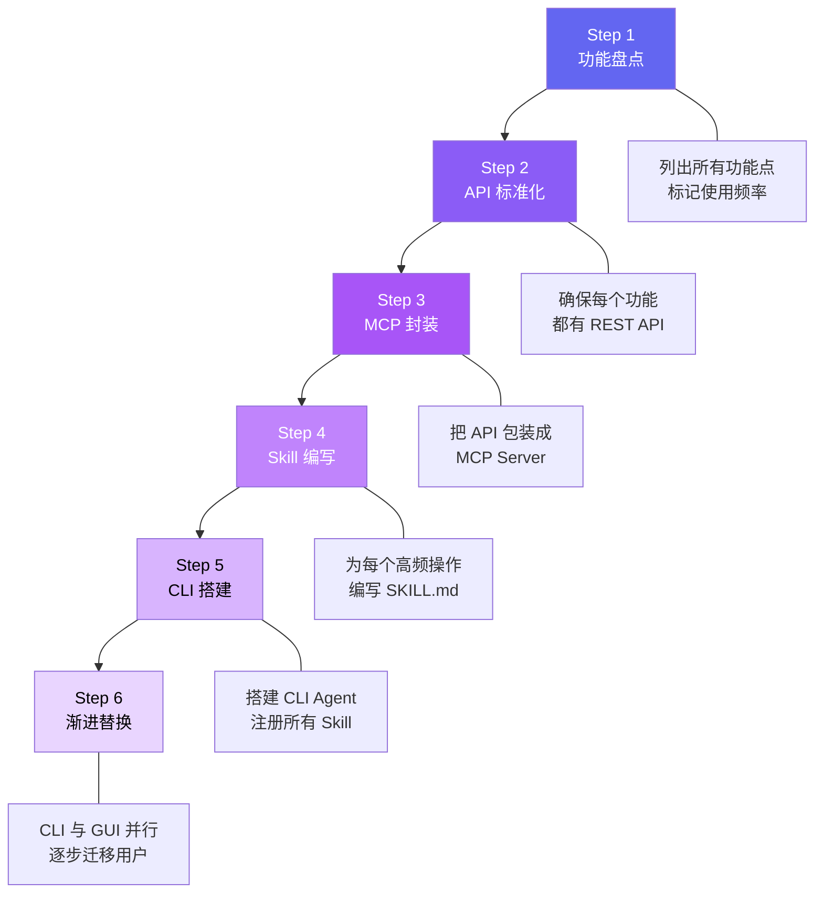
```mermaid
flowchart TD
    S1["Step 1<br/>功能盘点"] --> S2["Step 2<br/>API 标准化"]
    S2 --> S3["Step 3<br/>MCP 封装"]
    S3 --> S4["Step 4<br/>Skill 编写"]
    S4 --> S5["Step 5<br/>CLI 搭建"]
    S5 --> S6["Step 6<br/>渐进替换"]

    S1 --- D1["列出所有功能点<br/>标记使用频率"]
    S2 --- D2["确保每个功能<br/>都有 REST API"]
    S3 --- D3["把 API 包装成<br/>MCP Server"]
    S4 --- D4["为每个高频操作<br/>编写 SKILL.md"]
    S5 --- D5["搭建 CLI Agent<br/>注册所有 Skill"]
    S6 --- D6["CLI 与 GUI 并行<br/>逐步迁移用户"]

    style S1 fill:#6366f1,color:#fff
    style S2 fill:#8b5cf6,color:#fff
    style S3 fill:#a855f7,color:#fff
    style S4 fill:#c084fc,color:#fff
    style S5 fill:#d8b4fe,color:#000
    style S6 fill:#e9d5ff,color:#000
```

### 5.3 以一个 CRM 系统为例：完整重做过程

假设你有一个中型 CRM 系统，包含：客户管理、商机跟进、合同管理、报表分析。

**Step 1：功能盘点**

| 功能模块 | 高频操作 | 当前入口 | Skill 化优先级 |
|---------|---------|---------|--------------|
| 客户管理 | 创建客户 | 填 10 个字段的表单 | P0 |
| 客户管理 | 查询客户 | 搜索框 + 筛选器 | P0 |
| 商机跟进 | 更新商机阶段 | 拖拽看板 | P1 |
| 商机跟进 | 添加跟进记录 | 弹窗表单 | P0 |
| 合同管理 | 创建合同 | 复杂多步表单 | P1 |
| 报表分析 | 查看销售漏斗 | 图表页面 | P2 |

**Step 2-3：API + MCP 封装**

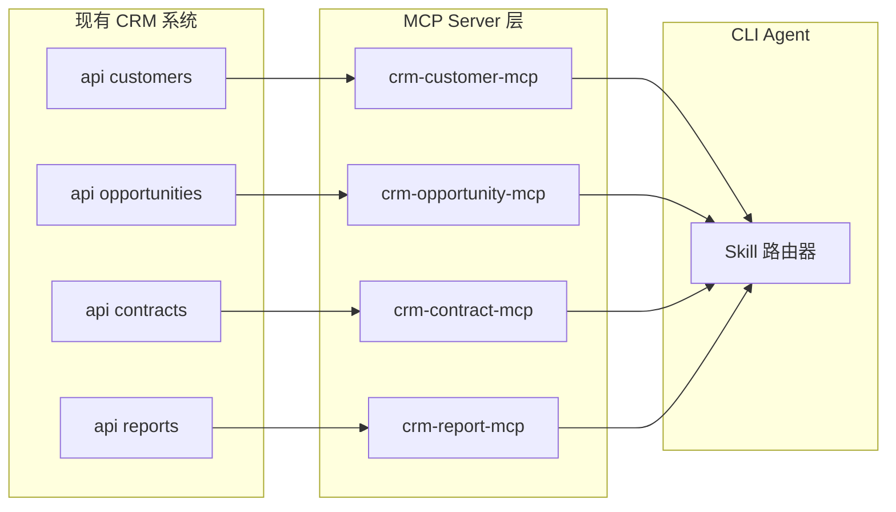
```mermaid
flowchart LR
    subgraph CRM["现有 CRM 系统"]
        API1["api customers"]
        API2["api opportunities"]
        API3["api contracts"]
        API4["api reports"]
    end

    subgraph MCP_LAYER["MCP Server 层"]
        M1["crm-customer-mcp"]
        M2["crm-opportunity-mcp"]
        M3["crm-contract-mcp"]
        M4["crm-report-mcp"]
    end

    API1 --> M1
    API2 --> M2
    API3 --> M3
    API4 --> M4

    subgraph AGENT["CLI Agent"]
        SK["Skill 路由器"]
    end

    M1 & M2 & M3 & M4 --> SK
```

**Step 4：Skill 编写（以"添加跟进记录"为例）**

```markdown
---
name: add-follow-up
description: 为商机添加跟进记录。当用户提到"跟进""回访""联系客户"时激活。
triggers: [跟进, 回访, 联系客户, 拜访记录, 沟通记录]
requiredMCPs: [crm-opportunity-mcp]
---

## 流程

1. 确认客户/商机（从上下文推断或询问）
2. 收集跟进内容（方式、结果、下一步）
3. 调用 MCP 创建跟进记录
4. 返回确认 + 该商机当前状态摘要

## 必要信息

| 字段 | 必填 | 默认值 |
|------|------|-------|
| 商机名称/客户 | 是 | 从上下文推断 |
| 跟进方式 | 否 | "电话" |
| 跟进内容 | 是 | - |
| 下一步计划 | 否 | - |

## 对话示例

用户："今天跟张三聊了下，他对方案很感兴趣，下周安排上门演示"
→ 提取：客户=张三，方式=电话，内容=对方案感兴趣，下一步=下周上门演示
→ 创建跟进记录，返回确认
```

**Step 5-6：效果对比**

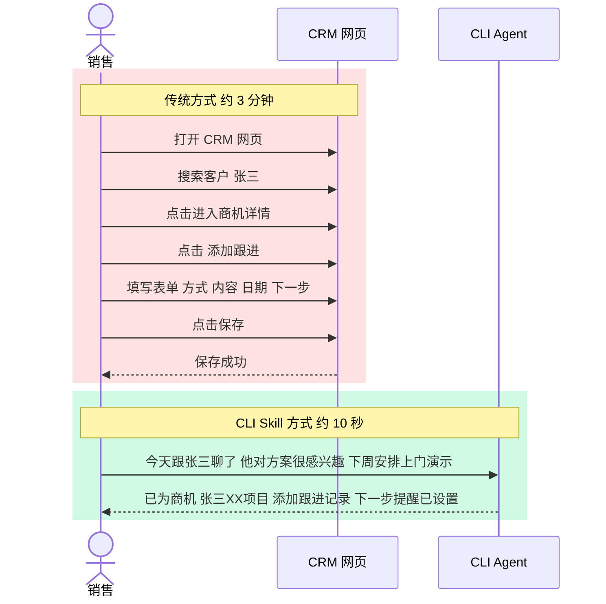
```mermaid
sequenceDiagram
    actor User as 销售
    participant GUI as CRM 网页
    participant Agent as CLI Agent

    rect rgb(254, 226, 226)
        Note over User,GUI: 传统方式 约 3 分钟
        User->>GUI: 打开 CRM 网页
        User->>GUI: 搜索客户 张三
        User->>GUI: 点击进入商机详情
        User->>GUI: 点击 添加跟进
        User->>GUI: 填写表单 方式 内容 日期 下一步
        User->>GUI: 点击保存
        GUI-->>User: 保存成功
    end

    rect rgb(209, 250, 229)
        Note over User,Agent: CLI Skill 方式 约 10 秒
        User->>Agent: 今天跟张三聊了 他对方案很感兴趣 下周安排上门演示
        Agent-->>User: 已为商机 张三XX项目 添加跟进记录 下一步提醒已设置
    end
```

### 5.4 并行世界：CLI 不是替代 GUI，而是共存

一个常见误解是"做了 CLI 就不要 GUI 了"。不是这样的——**CLI 和 GUI 应该共享同一层 API/MCP，各自服务不同场景**：

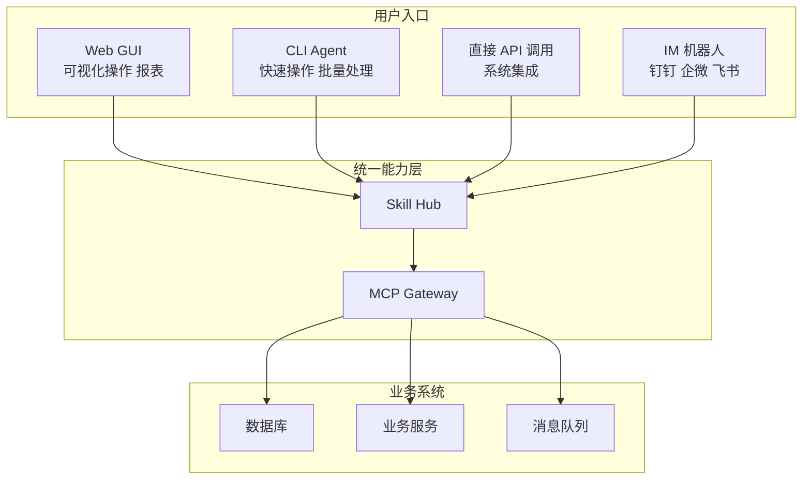
```mermaid
flowchart TD
    subgraph USERS["用户入口"]
        WEB["Web GUI<br/>可视化操作 报表"]
        CLI["CLI Agent<br/>快速操作 批量处理"]
        API_DIRECT["直接 API 调用<br/>系统集成"]
        CHATBOT["IM 机器人<br/>钉钉 企微 飞书"]
    end

    subgraph MIDDLE["统一能力层"]
        SKILL_HUB["Skill Hub"]
        MCP_HUB["MCP Gateway"]
    end

    subgraph BACKEND["业务系统"]
        DB["数据库"]
        SERVICE["业务服务"]
        QUEUE["消息队列"]
    end

    WEB & CLI & API_DIRECT & CHATBOT --> SKILL_HUB
    SKILL_HUB --> MCP_HUB
    MCP_HUB --> DB & SERVICE & QUEUE
```

**Skill 和 MCP 是能力层，CLI/GUI/IM Bot 是交付渠道。** 一次编写 Skill，多渠道复用。

---

## 六、终局猜想：软件架构的范式迁移

### 6.1 从"页面驱动"到"意图驱动"

我们正在经历软件交互范式的第三次大迁移：

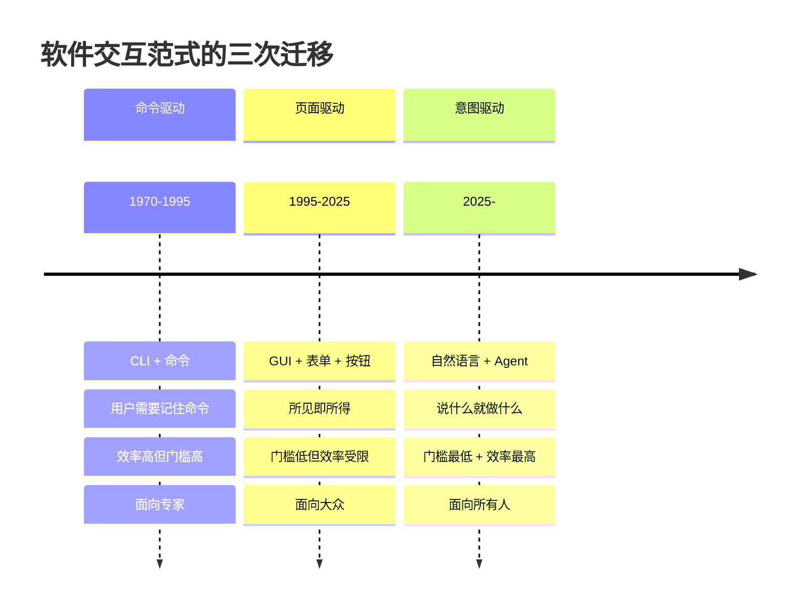
```mermaid
timeline
    title 软件交互范式的三次迁移
    section 命令驱动
        1970-1995 : CLI + 命令
                  : 用户需要记住命令
                  : 效率高但门槛高
                  : 面向专家
    section 页面驱动
        1995-2025 : GUI + 表单 + 按钮
                  : 所见即所得
                  : 门槛低但效率受限
                  : 面向大众
    section 意图驱动
        2025-     : 自然语言 + Agent
                  : 说什么就做什么
                  : 门槛最低 + 效率最高
                  : 面向所有人
```

### 6.2 未来软件的标准架构

如果这个趋势成立，未来每个软件的架构会趋同于以下模式：

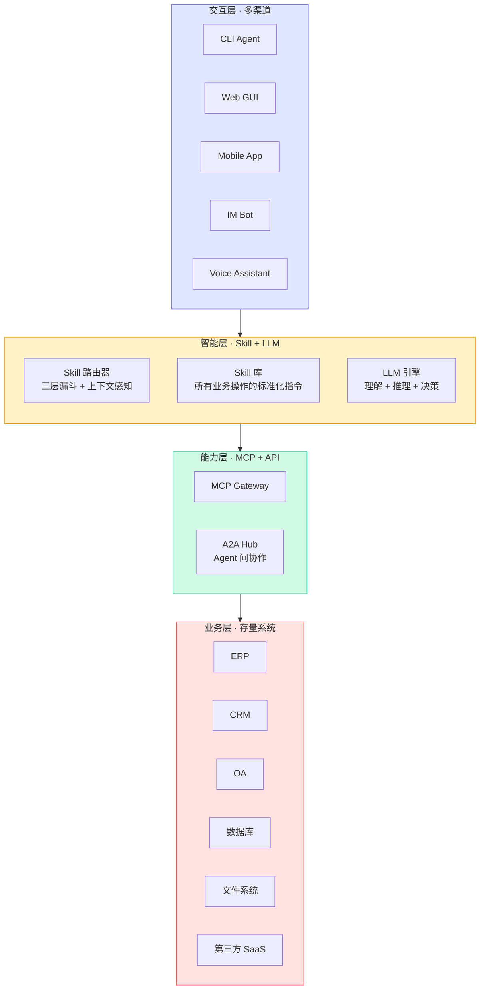
```mermaid
flowchart TD
    subgraph INTERFACE["交互层 · 多渠道"]
        direction LR
        I1["CLI Agent"]
        I2["Web GUI"]
        I3["Mobile App"]
        I4["IM Bot"]
        I5["Voice Assistant"]
    end

    subgraph INTELLIGENCE["智能层 · Skill + LLM"]
        direction TB
        ROUTER["Skill 路由器<br/>三层漏斗 + 上下文感知"]
        SKILLS["Skill 库<br/>所有业务操作的标准化指令"]
        LLM_ENGINE["LLM 引擎<br/>理解 + 推理 + 决策"]
    end

    subgraph CAPABILITY["能力层 · MCP + API"]
        direction LR
        MCP_GW["MCP Gateway"]
        A2A_HUB["A2A Hub<br/>Agent 间协作"]
    end

    subgraph BUSINESS["业务层 · 存量系统"]
        direction LR
        B1["ERP"]
        B2["CRM"]
        B3["OA"]
        B4["数据库"]
        B5["文件系统"]
        B6["第三方 SaaS"]
    end

    INTERFACE --> INTELLIGENCE
    INTELLIGENCE --> CAPABILITY
    CAPABILITY --> BUSINESS

    style INTERFACE fill:#e0e7ff,stroke:#6366f1
    style INTELLIGENCE fill:#fef3c7,stroke:#f59e0b
    style CAPABILITY fill:#d1fae5,stroke:#10b981
    style BUSINESS fill:#fee2e2,stroke:#ef4444
```

### 6.3 五条思考路径的终极答案

回到开头的五个问题：

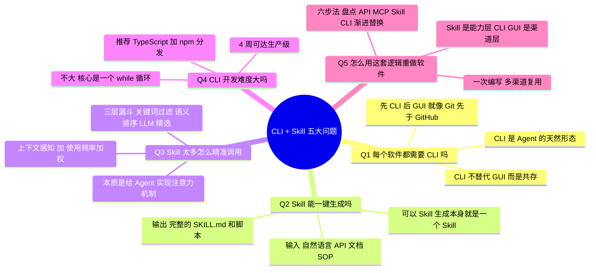
```mermaid
mindmap
    root((CLI + Skill 五大问题))
        Q1 每个软件都需要 CLI 吗
            CLI 是 Agent 的天然形态
            CLI 不替代 GUI 而是共存
            先 CLI 后 GUI 就像 Git 先于 GitHub
        Q2 Skill 能一键生成吗
            可以 Skill 生成本身就是一个 Skill
            输入 自然语言 API 文档 SOP
            输出 完整的 SKILL.md 和脚本
        Q3 Skill 太多怎么精准调用
            三层漏斗 关键词过滤 语义排序 LLM 精选
            上下文感知 加 使用频率加权
            本质是给 Agent 实现注意力机制
        Q4 CLI 开发难度大吗
            不大 核心是一个 while 循环
            推荐 TypeScript 加 npm 分发
            4 周可达生产级
        Q5 怎么用这套逻辑重做软件
            六步法 盘点 API MCP Skill CLI 渐进替换
            Skill 是能力层 CLI GUI 是渠道层
            一次编写 多渠道复用
```

### 6.4 这不是预测，这是正在发生的事

2026 年 Q2 的此刻：

- Anthropic 的 Agent Skills 已被 27+ 工具采纳
- MCP 协议月下载量 9700 万+
- OpenClaw 的 ClawHub 已有 5700+ Skill
- Vercel、Stripe、Cloudflare 都在给自己的 CLI 加 Agent 能力
- 企业内部的 MCP Server 建设正在加速

**不是"要不要做"的问题，而是"什么时候开始做"的问题。**

---

## 七、给不同角色的行动建议

### 7.1 如果你是开发者

| 行动 | 时间 | 产出 |
|------|------|------|
| 学习 SKILL.md 规范 | 2 小时 | 能手写 Skill |
| 用现有 CLI（Claude Code / Codex）体会 Skill 机制 | 1 天 | 理解 Agent 如何使用 Skill |
| 为自己的项目写 3 个 Skill | 1 天 | 实际感受效率提升 |
| 搭建一个最小 CLI Agent Demo | 1 周 | 掌握核心架构 |

### 7.2 如果你是技术负责人

| 行动 | 优先级 | 产出 |
|------|--------|------|
| 盘点现有系统 API 资产 | P0 | API 可 MCP 化清单 |
| 试点 1 个业务流程的 Skill 化 | P0 | 效果验证数据 |
| 评估 CLI Agent 方案（自建 vs 集成） | P1 | 技术选型报告 |
| 建立内部 Skill 编写规范 | P1 | 团队统一标准 |
| 规划 MCP Server 建设路线 | P2 | 中长期路线图 |

### 7.3 如果你是产品经理

**重新思考"功能"的定义。** 过去你设计的是"页面 + 表单 + 按钮"；未来你设计的是"意图 + Skill + 对话流"。

```
过去：用户故事 → 原型图 → UI 设计 → 前端开发 → 联调 → 上线
未来：用户意图 → SKILL.md → MCP 对接 → 测试 → 上线
```

**Skill 就是新时代的 PRD。**

---

## 八、结语：软件的终极形态是对话

回到最初的思考——

各大厂的 CLI Agent 不是技术团队的玩具，它们指向一个清晰的未来：**软件不再是你"打开然后操作"的东西，而是你"说一句话然后它自己完成"的东西。**

实现这个未来需要三样东西：

- **CLI**（Agent 的壳）—— 接收意图，返回结果
- **Skill**（Agent 的脑）—— 知道怎么做，什么时候做
- **MCP**（Agent 的手）—— 连接系统，执行操作

Skill 精准调用的秘诀不是什么高深算法，而是一个朴素的工程实践：**三层漏斗 + 好的元数据 + 上下文感知 + 用户反馈。** 本质上就是给 Agent 装一套"注意力机制"。

CLI 的开发难度也没有想象中那么大——核心是一个 while 循环，生态已经足够成熟，TypeScript + npm 两周可以交付一个可用版本。

真正难的不是技术，而是思维的转换：**从"设计页面"到"设计意图"，从"做表单"到"写 Skill"，从"用户操作系统"到"用户跟系统对话"。**

这场范式迁移才刚刚开始。现在入场，还来得及。

---

*本文系技术探索性文章，欢迎探讨交流。*

*最后更新：2026 年 4 月*
