# Hermes Agent 内核原理与 Agent 平台开发方向

> 本文基于 Hermes Agent 官方架构、Agent Loop、Gateway、Prompt、上下文压缩、工具、MCP、会话、ACP、Cron、Memory、Skills 和安全文档，并结合 MCP、ACP、A2A、LangGraph、OpenAI Agents SDK、Anthropic Agent 架构资料进行交叉分析。  
> 研究时间：2026-08-24。Hermes 更新速度很快，本文讲稳定的架构思想；具体文件名、行数和配置项应以当前版本为准。  
> 官方入口：[Hermes Agent 架构](https://hermes-agent.nousresearch.com/docs/zh-Hans/developer-guide/architecture) · [GitHub 仓库](https://github.com/NousResearch/hermes-agent)

---

## 0. 先给结论：Hermes 到底是什么

Hermes 不是「一个模型」，也不只是「一个聊天机器人」。

更准确的定义是：

> **Hermes 是一个以 AIAgent 循环为内核、以 Gateway 为多端入口、以 Tool/MCP 为执行能力、以 Session/Memory/Skill 为状态系统、以 ACP/API/Cron 为外部运行协议的单租户 Agent Runtime。**

它的核心价值不在某条 Prompt，而在于把一个模型变成可长期运行的系统：

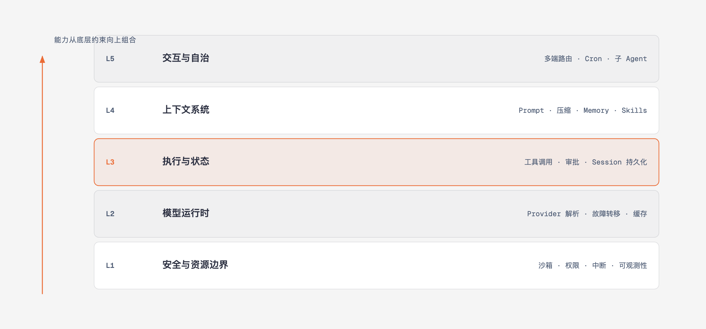

Hermes 确实代表了当前主流 Agent 的很多开发方向：

1. **一个平台无关的 Agent Loop，多个入口复用**
2. **模型只负责决策，运行时负责执行与状态**
3. **工具协议标准化：Function Calling + MCP**
4. **宿主协议标准化：ACP / JSON-RPC / HTTP API**
5. **上下文工程替代单纯 Prompt 工程**
6. **短期上下文、长期记忆、历史检索、程序性技能分层**
7. **Human-in-the-loop、审批、可中断、可恢复**
8. **子 Agent 隔离上下文，并行处理**
9. **轨迹、成本、评估和自我改进进入运行时**

但需要纠正一个容易过度乐观的判断：

> **Hermes 的架构思想具有代表性，不等于 Hermes 当前的全部代码组织方式都是行业最佳实践。**

Hermes 的核心编排曾高度集中在 `run_agent.py` 和 `gateway/run.py`。这有利于快速迭代和阅读完整控制流，但会形成 God Object、状态耦合和测试边界过大的问题。当前项目一直在持续拆分模块。因此，学习 Hermes 时应该重点学习它的**运行时分层、协议边界和状态模型**，而不是照抄某个超大文件。

---


## 1. 总体架构：一个内核，多个入口

官方架构的关键不是目录，而是所有入口最终都收敛到同一个 `AIAgent`：

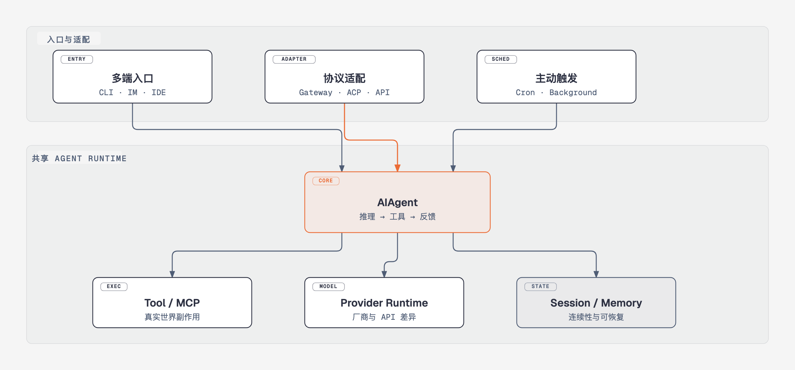

这就是 Hermes 最重要的设计：

- **入口层只处理平台差异**
- **AIAgent 只处理 Agent 语义**
- **工具层处理真实世界副作用**
- **存储层处理连续性**
- **Provider 层屏蔽模型厂商差异**

官方将其称为「平台无关的核心」：[架构概览](https://hermes-agent.nousresearch.com/docs/zh-Hans/developer-guide/architecture)。

---


## 2. 多端总线原理：它不是 Kafka，而是“适配器 + 路由器 + 会话协调器”


### 2.1 什么叫“多端总线”

Hermes 的多端总线主要由 `GatewayRunner` 承担。

它不是传统意义上的 Kafka/RabbitMQ 消息总线，没有中心 Topic、Offset、Consumer Group 这些语义。它更像：

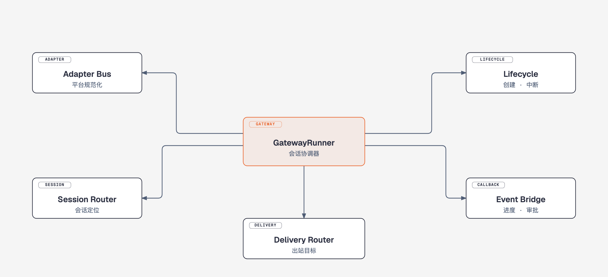

也就是把 20 多种不同平台的输入统一成一种内部事件，再将 Agent 输出重新翻译回平台消息。

### 2.2 入站规范化

每个平台适配器负责把原始事件转成统一的 `MessageEvent`：

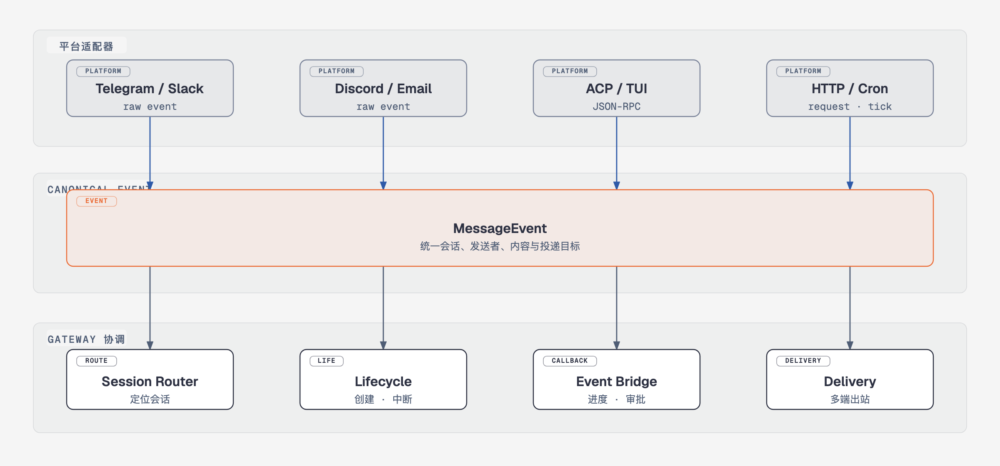

适配器只需要实现统一接口：

- `connect()` / `disconnect()`：生命周期
- `on_message()`：原始事件转内部消息
- `send_message()`：内部输出转平台发送

这与 Web 框架里的 Controller Adapter、数据库里的 Driver、LSP 的 Editor Adapter 是同一种设计。

### 2.3 会话键就是路由主键

Gateway 将消息映射成稳定的会话键：

```
agent:main:{platform}:{chat_type}:{chat_id}
```

例如：

```
agent:main:telegram:private:123456789
```

线程型平台还会把 thread/topic 信息编码进去。

这个 key 的作用是：

1. 找到历史会话
2. 判断该会话是否已有 Agent 在运行
3. 绑定中断、审批和排队消息
4. 将响应投递回原聊天

需要强调：

> **Session Key 是路由句柄，不是权限边界。**

授权必须由平台 allowlist、DM 配对或操作系统权限单独完成。Hermes 的安全策略也明确说明，知道 session ID 不应等于获得会话权限。[Gateway 内部机制](https://hermes-agent.nousresearch.com/docs/zh-Hans/developer-guide/gateway-internals) · [安全策略](https://raw.githubusercontent.com/NousResearch/hermes-agent/main/SECURITY.md)

### 2.4 两级消息守卫

同一个会话里的 Agent 正在执行时，新消息不能直接再启动第二个 Agent，否则两个循环会同时写同一段历史。

Hermes 使用两级守卫：

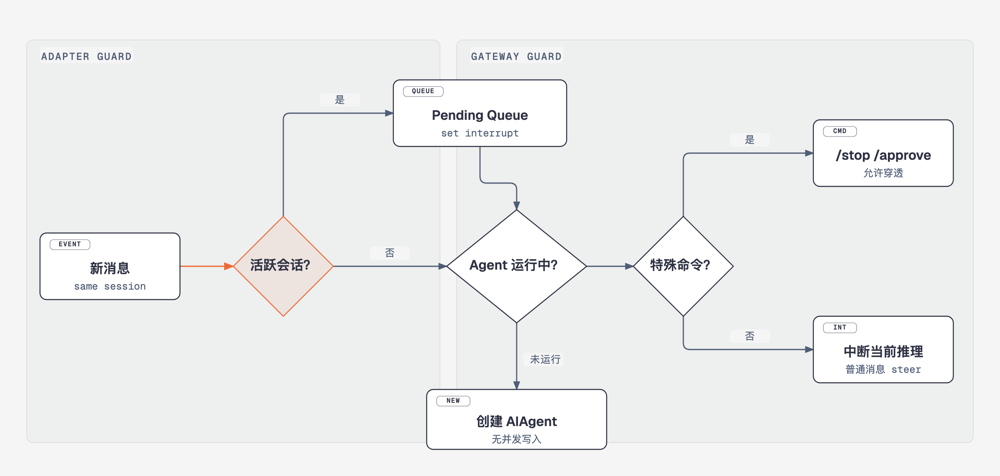

为什么要两级？

- 第一层尽早防止竞态
- 第二层处理命令语义
- `/approve` 必须能在 Agent 等待审批时穿透
- 普通新消息则体现“用户随时可以 steer/interrupt”

这也是现代交互式 Agent 的重要能力：**不是请求发出后只能等，而是可以中断和转向。**

### 2.5 出站投递总线

Agent 输出不一定只回原聊天，还可能来自：

- 当前会话直接回复
- Cron 定时任务
- 后台 Agent 完成通知
- `send_message` 跨平台发送
- 指定 channel/thread 投递

所以 Gateway 还有独立的 Delivery 层：

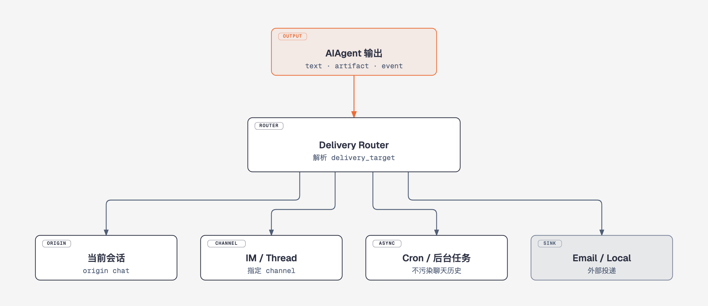

Cron 的输出不镜像进目标聊天的 Agent 历史，避免破坏 `User → Assistant` 消息交替。这是一个很细但很正确的状态设计。

### 2.6 另一条总线：AIAgent 回调事件总线

除了“聊天消息总线”，Hermes 还有一条“执行事件总线”。

`AIAgent` 暴露回调：

- tool start / progress / complete
- thinking start / stop
- reasoning delta
- stream token delta
- clarify request
- approval request
- agent step complete
- status changed

不同宿主消费同一批事件：

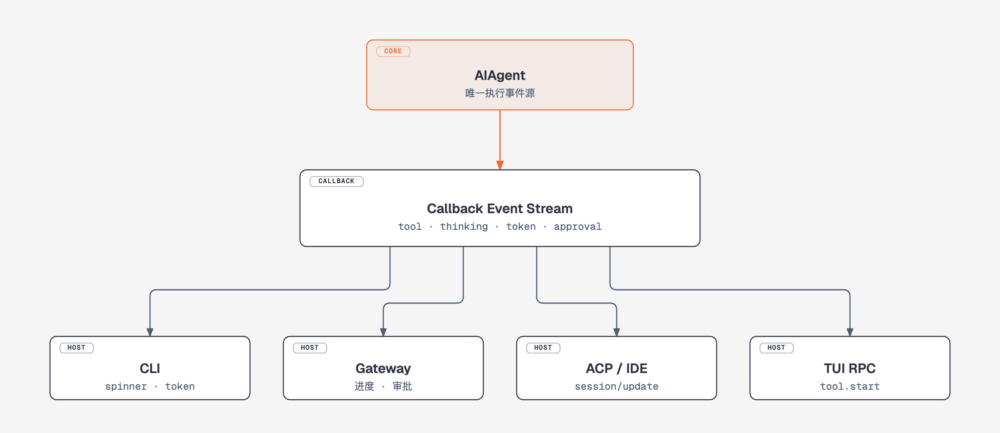

这才是 Hermes 真正的“多端复用”关键：**不仅复用最终答案，也复用执行过程的事件语义。**

---


## 3. AIAgent 的分发原理：模型做决策，运行时做状态机


### 3.1 最小 Agent Loop

Hermes 的核心循环本质上并不神秘：

```python
messages.append(user_message)

while turns < max_turns:
    context = assemble_prompt(messages, memory, skills, tools)
    response = call_model(context)

    if response.tool_calls:
        results = execute_tools(response.tool_calls)
        messages.append(response)
        messages.extend(results)
        continue

    persist(messages)
    return response.text
```

真正复杂的是这个循环周围的工程能力：

- Provider 选择和鉴权
- 三种 API 消息格式转换
- Prompt 缓存
- 工具并发与审批
- 中断
- 错误重试和模型回退
- 上下文压缩
- 会话持久化
- 记忆刷写
- 子 Agent 预算
- 多端进度事件

官方完整生命周期见 [Agent Loop 内部机制](https://hermes-agent.nousresearch.com/docs/zh-Hans/developer-guide/agent-loop)。

### 3.2 单轮分发链

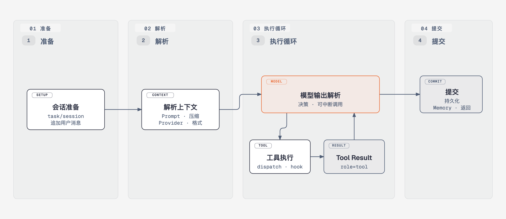

### 3.3 内部统一消息格式

Hermes 内部尽量统一成 OpenAI 风格：

```json
{"role": "system", "content": "..."}
{"role": "user", "content": "..."}
{"role": "assistant", "content": "...", "tool_calls": []}
{"role": "tool", "tool_call_id": "...", "content": "..."}
```

然后在边缘适配为：

- `chat_completions`
- `codex_responses`
- `anthropic_messages`

这是一种经典的 **Canonical Model（规范内部模型）**：

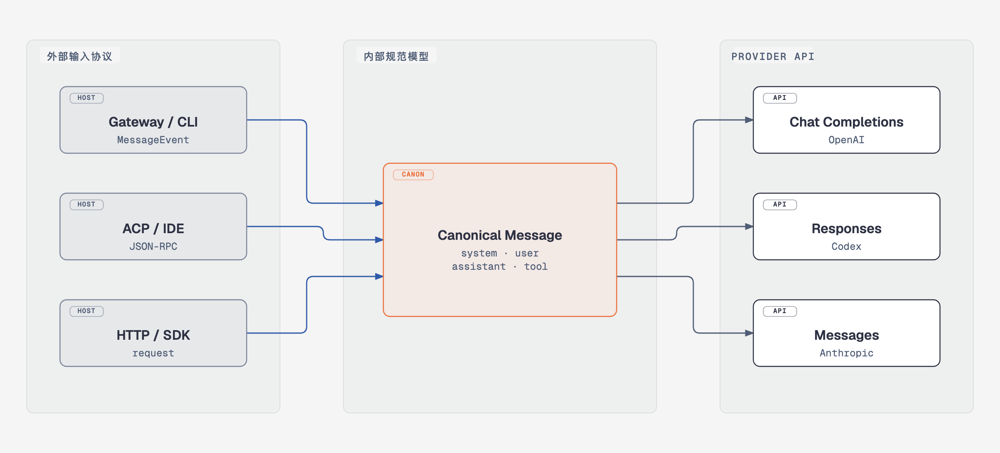

好处是 Agent Loop 不需要知道每家 API 的全部细节。

### 3.4 Provider 分发不是简单 base_url 切换

Provider Runtime 解析：

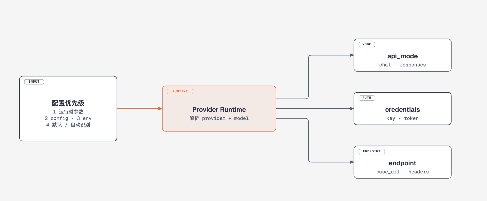

优先级：

1. 显式运行时参数
2. `config.yaml`
3. 环境变量
4. Provider 默认值 / 自动识别

它还必须解决：

- 原生 Anthropic 凭据刷新
- OpenAI Responses 与 Chat Completions 差异
- 自定义 OpenAI-Compatible Endpoint
- API Key 不应误发给其他域名
- 主模型和辅助模型采用不同路由
- 429/5xx/鉴权失败后的 fallback provider

因此 Provider 层本质上是一个 **模型驱动适配器 + 凭据作用域系统 + 故障转移器**。[Provider 运行时解析](https://hermes-agent.nousresearch.com/docs/zh-Hans/developer-guide/provider-runtime)

### 3.5 工具调用的分发

模型输出：

```json
{
  "name": "read_file",
  "arguments": {"path": "/project/app.py"}
}
```

运行时执行：

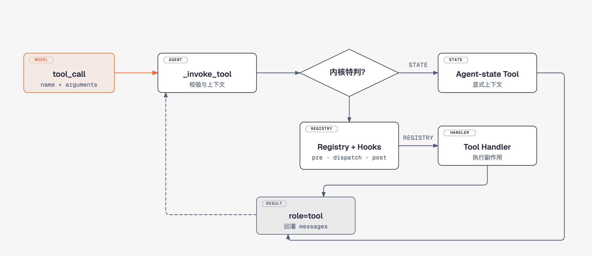

这里的关键是：

> **模型从不直接执行代码。模型只产生“调用意图”；运行时决定是否允许、如何执行、结果如何回灌。**


### 3.6 并发原理

当一轮有多个工具调用：

- 单个调用：主线程执行
- 多个独立调用：线程池并发
- 交互式工具（clarify/approval）：强制串行
- 工具结果即使并发完成，也按模型原始调用顺序写回

“按原顺序写回”很重要，因为 LLM 的下一轮推理依赖稳定的工具调用—结果配对。

### 3.7 可中断 API 调用

模型 HTTP 请求在后台线程执行，主线程同时监听：

- 返回事件
- 用户中断事件
- 超时

中断后：

- 丢弃未完成响应
- 不把半条 assistant 消息写入历史
- 允许新输入接管

这是比普通 Chat API 更接近操作系统进程控制的设计。

### 3.8 预算和停止条件

Agent 不能无限循环。Hermes 用 Iteration Budget 限制工具轮次，达到上限后停止并总结已完成内容。

子 Agent 有独立预算，因此总调用量可能大于父 Agent 上限。

生产系统还应同时限制：

- 最大模型调用数
- 最大 Token
- 最大费用
- 最大工具副作用次数
- 最大墙钟时间
- 最大子 Agent 数和深度

Hermes 已覆盖部分限制，但“迭代次数”不是完整成本治理。

---


## 4. Prompt 组装：稳定前缀与易变上下文必须分开

Hermes Prompt 系统最值得学习的不是 Prompt 文案，而是**分层和缓存边界**。

### 4.1 稳定系统 Prompt

大致顺序：

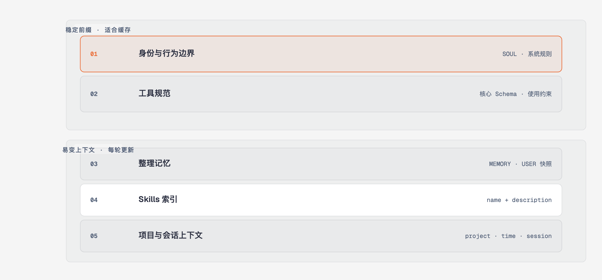

项目上下文按优先级只取一种：

```
.hermes.md / HERMES.md
  > AGENTS.md
  > CLAUDE.md
  > .cursorrules / .cursor/rules
```

文件会做：

- 注入扫描
- 长度截断
- Frontmatter 清理

详细顺序见 [Prompt 组装](https://hermes-agent.nousresearch.com/docs/zh-Hans/developer-guide/prompt-assembly)。

### 4.2 易变层不写进稳定前缀

下列信息只在当前 API 调用临时加入：

- 当前轮 ephemeral prompt
- prefill
- Gateway 临时会话上下文
- 当前用户消息触发的动态记忆召回
- 预算和压力提示

原因是 Prompt Cache 依赖前缀完全一致。如果把时间变化、实时召回和每轮状态放进系统 Prompt 中间，缓存会持续失效。

### 4.3 Memory 为什么是冻结快照

会话中调用 `memory` 会立即写磁盘，但当前会话的系统 Prompt 不重建；新记忆要到下一个会话才进入系统 Prompt。

这是一个有意的取舍：

> 稳定前缀冻结 · 动态召回按需加载 · 摘要与原文并存

Hermes 选择后者，并通过工具结果让 Agent 知道写入已经成功。

---


## 5. 上下文压缩：不是“删前文”，而是重建工作记忆


### 5.1 为什么大上下文仍然要压缩

上下文窗口变大并不代表可以无限堆内容：

- 工具输出会快速膨胀
- 旧信息稀释当前任务
- 模型注意力存在衰减
- 每轮重复输入成本高
- 长上下文会降低检索和决策准确率

Anthropic 将这类问题归到 Context Engineering：目标不是塞满窗口，而是保持**最小、高信号、足以决策的上下文**。[Effective context engineering](https://www.anthropic.com/engineering/effective-context-engineering-for-ai-agents)

### 5.2 Hermes 的双层压缩

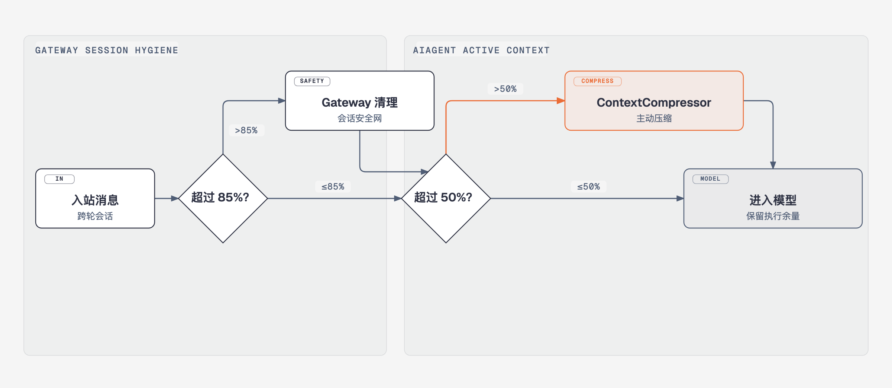

为什么是 50% 和 85%：

- 50% 给后续工具输出、模型回复和重试留余量
- 85% 捕获跨夜 Gateway 会话或逃过主压缩器的异常情况


### 5.3 四阶段算法


#### 阶段一：机械清理旧工具输出

保护区以外、超过一定长度的旧工具结果先替换成占位符：

```
[Old tool output cleared to save context space]
```

这是最便宜也最应该先做的一步，因为文件内容、日志、搜索结果通常可以重新获取。

#### 阶段二：确定保留边界

```
[头部固定区] [中间摘要区] [尾部逐字保留区]
```

- 前几条保留：系统 Prompt + 最初目标
- 中间轮次压缩
- 最近 N 条或 Token 预算内的尾部原样保留
- tool_call / tool_result 必须成组，不能从中间切开


#### 阶段三：结构化摘要

摘要不是一句“之前讨论了很多”，而是状态移交单：

```
Goal
Constraints & Preferences
Progress (Done / In Progress / Blocked)
Key Decisions
Relevant Files
Next Steps
Critical Context
```

这让压缩后的 Agent 能继续执行，而不仅是“知道发生过什么”。

#### 阶段四：重新组装和修复消息合法性

压缩后：

- 保留头部
- 插入摘要消息
- 保留尾部
- 删除孤立 Tool Result
- 给缺失结果的 Tool Call 注入存根
- 修复连续相同 Role


### 5.4 迭代重压缩

下一次压缩不会完全忘记旧摘要，而是把上次摘要交给摘要模型更新：

```
旧摘要 + 新的中间历史 → 新摘要
```

这类似滚动 Checkpoint，但它是有损的。

### 5.5 legacy 与 lean

Hermes 提供两种尾部策略：

- `legacy`：保留较大的逐字尾部，连续性好，但 Token 高
- `lean`：尾部更小，把更多连续性写进摘要，并机械提取路径、SHA、错误文本等锚点

lean 的思想很重要：

> **自然语言摘要负责语义，机械索引负责精确标识符。**

因为模型摘要可能把路径、错误码、数字、Commit SHA 写错；这类信息适合正则提取并逐字保存。

### 5.6 最大风险：摘要模型窗口比主模型小

官方文档指出，如果压缩模型的上下文窗口小于主模型，中间历史可能无法送入摘要模型；摘要失败后若继续丢弃中间消息，就会静默丢上下文。

因此生产设计应当：

1. 压缩模型上下文 ≥ 主模型
2. 摘要失败时 fail closed，不直接丢弃
3. 压缩前持久化完整原文
4. 记录摘要质量和来源范围
5. 保留 `session_search` 回查原始历史

完整算法见 [上下文压缩与缓存](https://hermes-agent.nousresearch.com/docs/zh-Hans/developer-guide/context-compression-and-caching)。

### 5.7 压缩与 Prompt Cache

Hermes 对 Anthropic 使用最多四个缓存断点：

```
系统 Prompt · 工具定义 · MEMORY 块 · 历史前缀（最多 4 个 Anthropic 缓存断点）
```

压缩会让中间历史缓存失效，但稳定系统 Prompt 仍可命中；滚动尾部通常在后续 1–2 轮重新建立缓存。

结论：

> **压缩解决“窗口和信号密度”，缓存解决“重复输入成本”；两者不是一回事。**

---


## 6. Tool Runtime：Agent 的真正能力来自工具，不来自聊天


### 6.1 工具的四个组成

一个 Hermes Tool 包含：

```
name · description · input_schema · handler
```

还可以带：

- toolset
- 所需环境变量
- 同步/异步标记
- 结果大小限制
- 显示元数据


### 6.2 自注册机制

工具模块在 import 时调用：

```python
registry.register(...)
```

启动时 `discover_builtin_tools()` 用 AST 扫描 `tools/*.py`，只导入包含顶层注册调用的文件。这样：

- 新增工具不需要维护中心 import 列表
- 辅助模块不会被无意执行
- 可选依赖加载失败不会阻塞全部工具

这是一种「插件式静态发现 + 运行时注册」。

### 6.3 Toolset 是能力授权单元

Toolset 不是只为了分类，它同时承担：

- 不同平台的能力预设
- 子 Agent 能力收窄
- ACP 精选工具集
- MCP Server 级别启用
- 禁用高风险工具

可以把 Toolset 理解成 Agent 的 Capability Set。

### 6.4 check_fn 是故障安全门

在把 Tool Schema 发给模型前，运行 `check_fn`：

- API Key 是否存在
- 外部服务是否可用
- 二进制是否安装
- 浏览器运行时是否就绪

不可用的工具不会出现在模型上下文中。

这比“工具留着，调用后再报错”更好：

- 减少模型误选
- 减少 Schema Token
- 减少无意义重试


### 6.5 Schema 是 Agent-Computer Interface

模型看不到 handler 源码，它只看 Schema。因此：


参数名、描述、边界、示例和错误格式会直接影响成功率。Anthropic 也强调，设计 Agent-Computer Interface（ACI）应像设计人机界面一样认真。[Building effective agents](https://www.anthropic.com/engineering/building-effective-agents)

### 6.6 错误必须回到模型，而不是炸掉循环

工具异常被包装成结构化错误字符串，再作为 Tool Result 返回：

```json
{"error": "Tool execution failed: TimeoutError: ..."}
```

模型可以：

- 修改参数重试
- 换工具
- 向用户说明阻塞
- 结束任务

Agent 的容错本质上依赖“环境错误也成为可推理观察”。

### 6.7 Agent 级工具为什么绕过 Registry

`todo`、`memory`、`session_search`、`delegate_task` 需要直接访问当前 Agent 的：

- Session
- Memory Store
- Todo Store
- 子 Agent 生命周期

所以它们保留 Schema 在 Registry 中供模型发现，但执行由 AIAgent 内核拦截。

这是务实设计，但也暴露一个架构问题：Registry 不是全部工具语义的唯一分发点。长期更理想的方式是给 handler 注入显式 `AgentContext`，减少内核特判。

### 6.8 Tool Search：工具也要渐进式披露

当 MCP/插件达到几百甚至几千个工具，全部 JSON Schema 每轮发送会吞掉上下文。

Hermes 用三个桥接工具替代延迟工具：

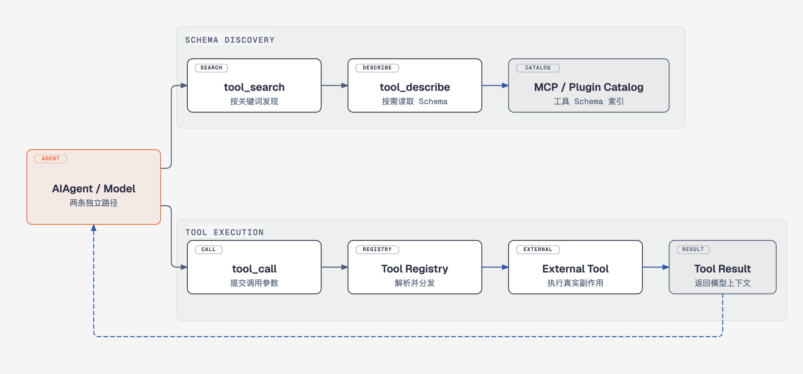

核心工具仍直接暴露，MCP 和非核心插件工具按需加载。

三级策略：

- 无延迟工具：全部 eager
- 目录放得下：展示工具名 + 短描述
- 目录太大：只展示 Server 名 + 工具数量，按搜索发现

检索采用 BM25，目录每轮从当前 Tool Definitions 重建，避免注册表变化后状态漂移。[Tool Search](https://hermes-agent.nousresearch.com/docs/zh-Hans/user-guide/features/tool-search)

这是 Skills 渐进式披露模式在 Tools 上的复用，也是非常主流的方向。

---


## 7. MCP 原理：Agent-to-Tool 协议，不是 Agent-to-Agent 协议


### 7.1 MCP 的三方角色

官方 MCP 架构：

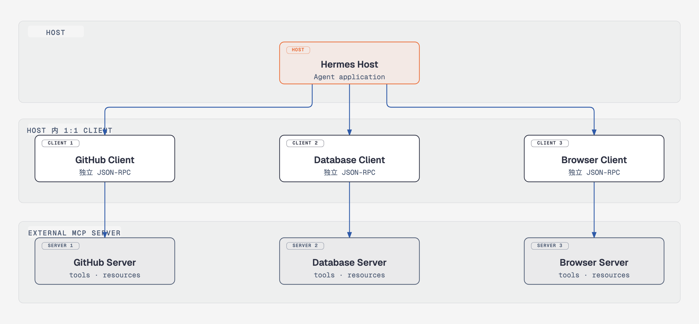

- Host：Agent 应用
- Client：Host 内为每个 Server 维护的连接
- Server：暴露能力的外部进程或服务

协议数据层使用 JSON-RPC，并通过能力协商决定支持哪些功能。[MCP Architecture](https://modelcontextprotocol.io/docs/learn/architecture)

### 7.2 三种核心原语

```
Tools（可调用） · Resources（可读取） · Prompts（可复用模板）
```

Hermes 会把 MCP 原语包装为普通 Tool，让 AIAgent 无需理解 MCP 传输细节。

### 7.3 两种传输

- Stdio：本地子进程，stdin/stdout JSON-RPC
- Streamable HTTP：远端服务，HTTP POST + 可选 SSE

Stdio 适合本地文件、CLI 封装；HTTP 适合企业 API 和托管集成。

### 7.4 Hermes 如何把 MCP 接进 Tool Registry

启动时：

```
mcp_servers 配置 → MCP Session → tools/list → 过滤 → 前缀 → ToolRegistry
```

命名：

```
mcp_<server_name>_<tool_name>
```

例如：

```
mcp_github_create_issue
```

这样内置工具和外部工具走同一条执行链：

- 同样的 Tool Schema
- 同样的 Hook
- 同样的审批
- 同样的结果回灌
- 同样的 Tool Search


### 7.5 动态发现

MCP Server 可发送：

```
notifications/tools/list_changed → 重新 tools/list → 更新 Registry
```

Hermes 收到后重新获取工具并更新 Registry，不需要重启。

这说明 Tool Registry 不能只在启动时构建一次，而要支持热变更和缓存失效。

### 7.6 MCP 安全边界

Hermes 支持：

- Server enable/disable
- 工具 include 白名单
- exclude 黑名单
- Resources/Prompts 单独开关
- Stdio 环境变量过滤
- HTTP Header / OAuth
- 并发开关
- Sampling 频率、Token、轮次限制

生产上建议：

> 对高风险 MCP 使用白名单，不要把 Server 的全部能力默认暴露给模型。


### 7.7 MCP Sampling

MCP Server 还可以反向向 Hermes 请求 LLM 推理：

```
MCP Server ── sampling/createMessage ──> Hermes Client ──> 模型 ──> 返回
```

这让 MCP Server 不必自己持有模型凭据，但会产生递归调用和成本失控风险，所以 Hermes 加入：

- RPM 限制
- Token 上限
- 超时
- 最大工具轮次
- 模型白名单
- 审计日志


### 7.8 Hermes 也能成为 MCP Server

Hermes 不只消费 MCP，也能通过 `hermes mcp serve` 向其他 Agent 暴露：

- 会话列表
- 历史消息
- 实时事件
- 跨平台发消息
- 审批

这时 Hermes 变成“消息平台能力 Server”，Cursor/Claude Code 等成为 Host。

完整行为见 [Hermes MCP](https://hermes-agent.nousresearch.com/docs/zh-Hans/user-guide/features/mcp)。

### 7.9 MCP 不解决什么

MCP 不负责：

- 谁是主 Agent
- 子任务生命周期
- 多 Agent 协商
- 长任务状态
- Artifact 交付
- Agent 身份和能力发现

这些更接近 A2A。A2A 以 Agent Card、Task、Message、Artifact 为核心，解决 Agent-to-Agent 协作。[A2A Protocol](https://a2a-protocol.org/v1.0.0/specification/)

一句话区分：

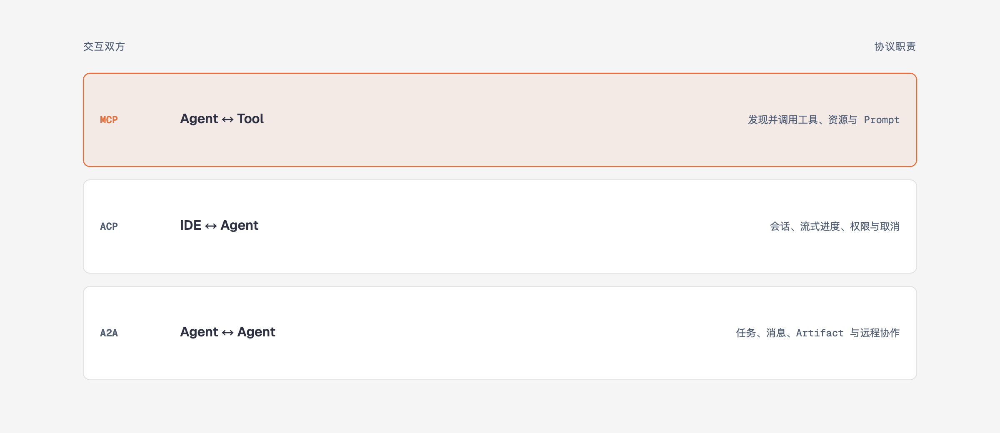

---


## 8. ACP 与程序化集成：把 Agent 内核变成可嵌入服务

Hermes 对外有三类协议：


| 协议          | 传输                           | 主要消费者                           |
| ----------- | ---------------------------- | ------------------------------- |
| ACP         | JSON-RPC / stdio             | VS Code、Zed、JetBrains 等 IDE     |
| TUI Gateway | JSON-RPC / stdio 或 WebSocket | 自定义 TUI、Desktop、Dashboard       |
| API Server  | HTTP + SSE                   | Web 前端、CI、OpenAI-Compatible 客户端 |


它们都调用同一个 AIAgent。[程序化集成](https://hermes-agent.nousresearch.com/docs/zh-Hans/developer-guide/programmatic-integration)

### 8.1 ACP 为什么像 Agent 时代的 LSP

传统：

```
传统：IDE 嵌入 Agent 逻辑
ACP：IDE 通过 JSON-RPC 驱动独立 Agent 进程
```

ACP：

```
session/new → prompt → session/update（流式）→ 完成
```

ACP 定义的不只是 Chat：

- Session new/load/fork
- Prompt
- 流式消息
- Tool Progress
- Diff / ToolCall 内容块
- 权限请求
- Cancel
- Workspace CWD

官方 ACP 说明见 [Agent Client Protocol](https://agentclientprotocol.com/get-started/introduction.md)。

### 8.2 同步内核如何接异步协议

Hermes 的 AIAgent 是同步编排，而 ACP 是异步 JSON-RPC：

```
ACP 异步 JSON-RPC ↔ AIAgent 同步编排（桥接层排队/回调）
```

这是典型的 Sync Core / Async Edge 适配。

### 8.3 CWD 绑定

IDE 的 Workspace CWD 绑定到 Agent Task ID，文件和终端工具以编辑器项目为根，而不是 ACP Server 启动目录。

这是编码 Agent 必须处理的细节，否则：

- 多工作区会串目录
- 并行 Session 会改错项目
- 工具相对路径不可预测


### 8.4 API Server 的边界

API Server 暴露 OpenAI-Compatible Chat/Responses 和有状态 Run：

- 启动 Run
- SSE 事件
- 查询状态
- 审批
- Stop
- Capabilities
- Models

它让 Agent Runtime 成为可独立部署的后端，而不只是 CLI 包。

---


## 9. 会话、记忆和技能：四种状态不要混为一谈

Hermes 至少有四种不同的“记住”。

### 9.1 工作记忆：当前 Context

当前 Prompt + 最近消息 + 工具结果。

- 最快
- 每轮都参与推理
- 容量有限
- 会被压缩


### 9.2 整理记忆：MEMORY.md / [USER.md](http://USER.md)


| 存储     | 用途           | 特点      |
| ------ | ------------ | ------- |
| MEMORY | 环境事实、项目约定、经验 | 有界、人工可读 |
| USER   | 用户身份、偏好、沟通方式 | 有界、人工可读 |


Hermes 对它们设置严格字符上限，以避免“长期记忆无限注入系统 Prompt”。

这是一种 Curated Memory，而不是原始历史堆积。[持久化记忆](https://hermes-agent.nousresearch.com/docs/zh-Hans/user-guide/features/memory)

### 9.3 情节记忆：SQLite Session + FTS5

完整对话保存在：

```
~/.hermes/state.db
```

主要表：

```
sessions · messages · messages_fts · messages_fts_trigram · state_meta · schema_version
```

特点：

- WAL 支持并发读和单写
- FTS5 全文检索
- trigram 支持 CJK/子串
- 保存工具、推理、Token、成本
- `parent_session_id` 保存压缩血缘
- `session_search` 返回原始消息，不依赖 LLM 摘要

这比把所有历史塞进 Vector DB 更可控：

- 明确关键词查询很快
- 原文可审计
- 不产生额外嵌入成本
- 可按平台和 Role 过滤

但语义召回能力有限，所以 Hermes 允许外部 Memory Provider 叠加。

详见 [会话存储](https://hermes-agent.nousresearch.com/docs/zh-Hans/developer-guide/session-storage)。

### 9.4 程序性记忆：Skills

Skill 不是事实，而是“怎么做”：

```
事实记忆：用户用 PostgreSQL
程序性记忆：如何安全迁移这套 PostgreSQL
```

Skill 使用渐进式披露：

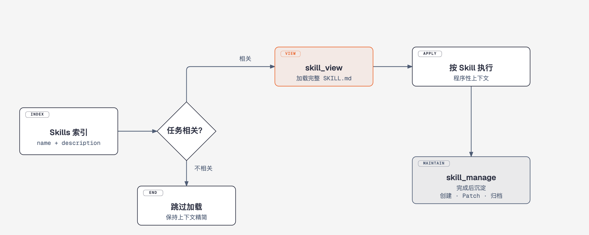

Agent 可用 `skill_manage` 创建、Patch、重写和归档 Skill。

触发场景包括：

- 完成复杂工作流
- 从错误中找到可行路径
- 用户纠正做法
- 发现可复用流程

这就是 Hermes 所谓“自我改进”的主要含义：

> **它通常不是在线修改模型权重，而是把成功经验固化成可复用的程序性上下文。**

详见 [Skills 系统](https://hermes-agent.nousresearch.com/docs/zh-Hans/user-guide/features/skills)。

### 9.5 为什么要分层

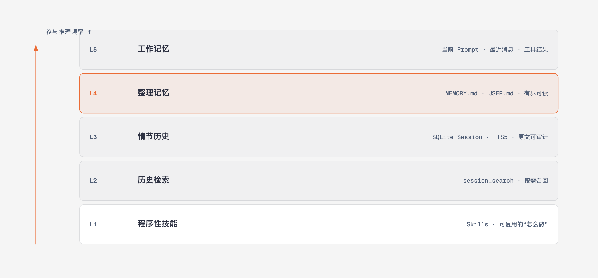

把四者混在一个向量库或一个超长 System Prompt 里，会导致：

- 检索目的不清
- Token 失控
- 错误记忆难修
- 程序与事实混淆
- 难以审计

---


## 10. 子 Agent：上下文隔离比“角色扮演”更重要

Hermes 的 `delegate_task` 会创建新的 AIAgent：

- 独立对话
- 独立终端 Session
- 继承但可收窄工具权限
- 不带父 Agent 全量历史
- 只得到明确的 goal/context
- 只把最终摘要返回父 Context

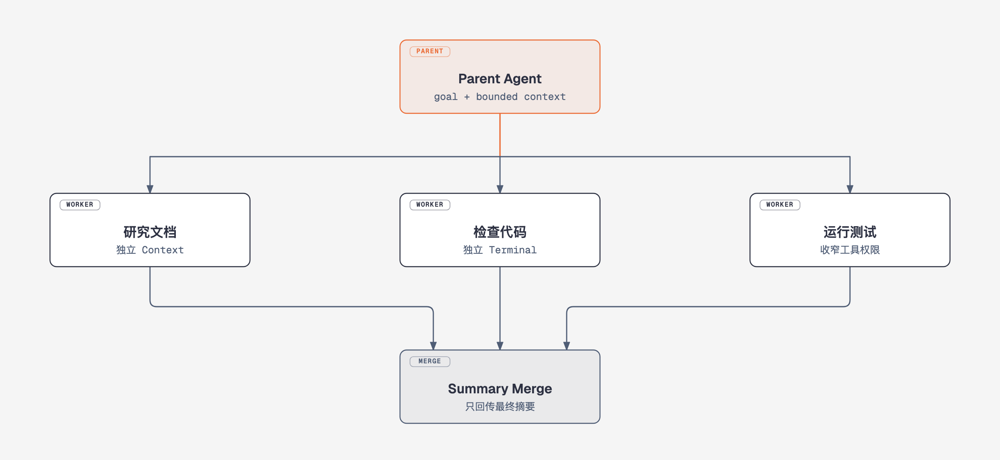

最大收益不是“多个角色看起来聪明”，而是：

1. **并行**
2. **避免中间工具输出污染父 Context**
3. **每个任务有干净的注意力窗口**
4. **能力最小化授权**

风险：

- 子 Agent 数量按深度指数增长
- 每个子 Agent 都有独立 Token 成本
- 结果摘要可能丢证据
- 进程退出后线程型子 Agent 不能恢复
- 并行写同一工作区会冲突

所以子 Agent 适合独立研究、只读分析、隔离 Worktree，不适合无约束地“多 Agent 群聊”。[子智能体委派](https://hermes-agent.nousresearch.com/docs/zh-Hans/user-guide/features/delegation)

---


## 11. Cron：调度的是 Agent Run，不是 Shell 命令

Hermes Cron 的任务记录包括：

- Prompt
- Schedule
- Skills
- Delivery Target
- Model/Provider
- 可选预处理脚本
- 状态和下一次时间

每次触发：

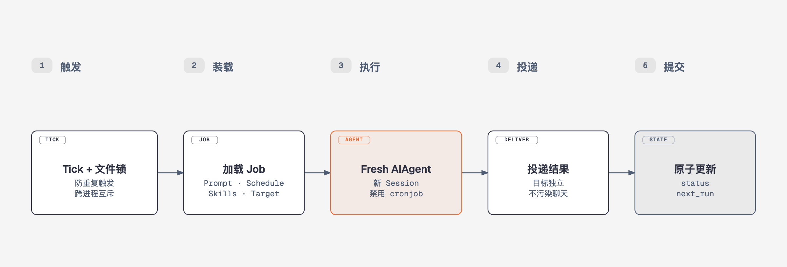

关键设计：

- 每次都是新 Session，Prompt 必须自包含
- 禁用 `cronjob` 工具，防止递归创建任务
- 跨进程文件锁，防止重复触发
- 原子写 `jobs.json`
- Cron 输出不污染聊天会话

这代表 Agent 从“被动聊天工具”变成“长期运行的数字员工”。[Cron 内部机制](https://hermes-agent.nousresearch.com/docs/zh-Hans/developer-guide/cron-internals)

生产上还应该进一步引入：

- Job 幂等键
- 重试策略与 Dead Letter
- 运行 Checkpoint
- 费用预算
- SLA 与超时
- Artifact 存储

---


## 12. 安全模型：审批不是沙箱，Prompt Injection 也不是唯一问题

Hermes 最新安全策略最值得记住的一句话：

> **对抗恶意 LLM 时，唯一真正的安全边界是操作系统级隔离。**


### 12.1 本地模式的真实含义

默认 Local Terminal：

```
Agent 的命令 = 当前操作系统用户的权限
```

危险命令正则、审批、输出脱敏都只是防误操作，不是对抗边界。

### 12.2 Terminal Backend 隔离不等于整个 Agent 隔离

只把 Terminal 放进 Docker 时，可隔离：

- Shell
- 通过 Terminal Contract 实现的文件工具

但可能仍在宿主 Agent 进程中的：

- Code Execution 子进程
- MCP 子进程
- Plugin
- Hook
- Skill Python/Script
- Agent 自身凭据

因此处理不可信网页、邮件、群聊和 MCP 时，更可靠的是：

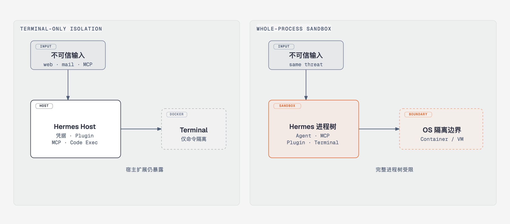

### 12.3 插件和 Skill 是代码，不是文档

第三方 Plugin/Skill 可能：

- 在 import 时执行 Python
- 读取 Agent 内存中的凭据
- 注册 Hook
- 修改工具
- 启动后台服务

所以安装前要审核脚本和 Python，不只是看 `SKILL.md`。

### 12.4 MCP 也是输入面

MCP Tool Result 会进入模型 Context。恶意 Server 可返回 Prompt Injection；MCP 子进程也可能访问环境和网络。

正确策略：

- Server 白名单
- Tool 白名单
- 环境最小化
- 远端认证
- 整进程沙箱
- 副作用工具审批
- 结果大小和类型限制

详见 [Hermes Security Policy](https://raw.githubusercontent.com/NousResearch/hermes-agent/main/SECURITY.md)。

---


## 13. 可观测性与轨迹：生产 Agent 需要的是“可重放”，不只是日志

Hermes 会记录：

- Session
- Message
- Tool Calls
- Tool Errors
- Reasoning 字段
- 输入/输出 Token
- Cache Read/Write Token
- 模型和 Provider
- 成本
- API 调用数
- 父子 Session 血缘

还可把轨迹导出为 ShareGPT JSONL，用于：

- 调试
- 回放
- 评估
- 训练数据
- RL 数据

这代表 Agent 平台的观测对象不是单个 HTTP Request，而是：

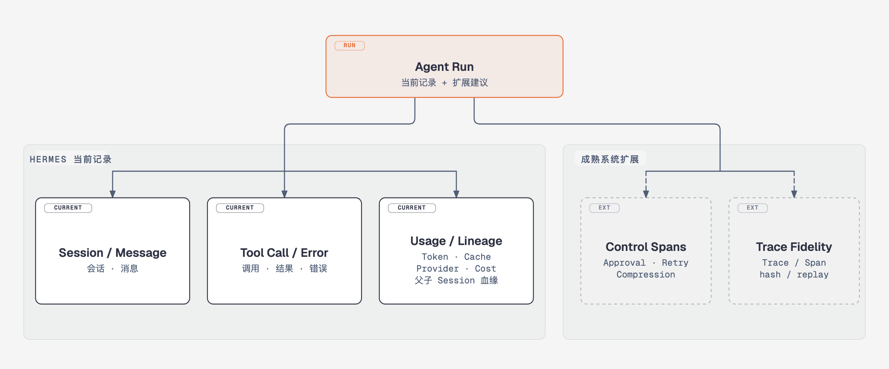

一个成熟系统还应提供：

- Trace ID / Span ID
- 每步输入摘要与输出哈希
- Tool 副作用审计
- Prompt 版本
- Tool Schema 版本
- 可重放 Fixture
- 任务成功率与人工接管率
- 单任务成本和延迟分位数
- 压缩前后质量回归

---


## 14. Hermes 与主流方向的对照


### 14.1 Anthropic：简单循环 + 好工具

Anthropic 把 Agent 定义为：

> LLM 根据环境反馈，自主决定工具和步骤，并在循环中完成任务。

这与 Hermes AIAgent 完全一致。Anthropic 同时强调从简单模式开始，只有在确实提升效果时才增加多 Agent 和复杂框架。[Building effective agents](https://www.anthropic.com/engineering/building-effective-agents)

### 14.2 OpenAI Agents SDK：Agent、Tool、Handoff、Guardrail、Session、Trace

OpenAI Agents SDK 的核心原语：

- Agent
- Runner/Loop
- Tools
- Agent as Tool / Handoff
- Guardrails
- Sessions
- Tracing

与 Hermes 的映射：


| OpenAI        | Hermes                                 |
| ------------- | -------------------------------------- |
| Runner        | AIAgent.run_conversation               |
| Function Tool | Tool Registry                          |
| Agent as Tool | delegate_task                          |
| Handoff       | Hermes 更偏 manager-worker，没有同等强的对话所有权转移 |
| Guardrails    | approval + hooks + tool filtering      |
| Session       | SQLite SessionDB                       |
| Tracing       | callbacks + trajectory                 |


OpenAI 官方建议区分：

- Handoff：专家接管对话
- Agent as Tool：主 Agent 保持最终回答权

Hermes 更接近第二种。[OpenAI Agents SDK](https://openai.github.io/openai-agents-python/) · [Orchestration](https://developers.openai.com/api/docs/guides/agents/orchestration)

### 14.3 LangGraph：显式图和 Durable Execution

LangGraph 把每个步骤写成显式 Graph Node，并在 Super-step 后 Checkpoint。

Hermes 更像动态 while-loop：

```
Hermes：模型决定下一步，流程灵活
LangGraph：图定义状态转移，流程可控
```

LangGraph 在持久执行上更强：

- 每步 Checkpoint
- Thread ID
- Interrupt 后恢复
- Time Travel
- Pending Writes

Hermes 有 Session 持久化，但长工具 Run 的“进程崩溃后从精确步骤恢复”仍不是其最强项。未来 Hermes 类 Runtime 应补齐 Durable Execution。[LangGraph Persistence](https://docs.langchain.com/oss/python/langgraph/persistence)

### 14.4 MCP：工具互操作

Hermes 对 MCP 的接入代表行业趋势：工具不再和 Agent 框架一一绑定。

但 MCP 只标准化连接和能力，不保证：

- 工具质量
- 权限合理
- Prompt Injection 安全
- 幂等性
- 事务
- 业务 SLA


### 14.5 ACP：宿主互操作

ACP 让 Agent 内核与 IDE UI 解耦。这是编码 Agent 领域非常重要的方向，类似 LSP 对语言服务器的影响。

### 14.6 A2A：远程 Agent 互操作

Hermes 的 `delegate_task` 是进程内/本机编排；A2A 则面向远程、异构、长任务 Agent：

- Agent Card
- Task Lifecycle
- Messages
- Artifacts
- Streaming

如果要把 Hermes 从个人 Agent 扩展为企业 Agent Mesh，A2A 比继续扩大 `delegate_task` 更合适。

---


## 15. Hermes 最值得学习的设计


### 15.1 单内核、多入口

不要为 Telegram、CLI、IDE、API 各写一套 Agent Loop。

### 15.2 规范内部消息模型

Provider 格式只在边缘转换，内核只理解一种消息语义。

### 15.3 工具注册表统一内置、MCP 和插件

模型不应知道工具来自本地 Python 还是远程 MCP。

### 15.4 上下文按生命周期分层

稳定 Prompt、动态召回、短期消息、长期记忆和技能必须分开。

### 15.5 工具结果是环境 Ground Truth

Agent 每一步都应依赖真实工具反馈，而不是在自然语言里模拟执行。

### 15.6 中断和审批是一等事件

不能把 Approval 当异常，也不能把 Interrupt 当进程 Kill；它们是 Run 状态机的一部分。

### 15.7 渐进式披露

Skills 和大型 Tool Catalog 都只先暴露索引，具体内容按需加载。

### 15.8 Session 原文与摘要并存

摘要负责继续工作，原文负责审计和回查。

---

## 16. 如果自己开发 Agent 内核，建议的模块边界

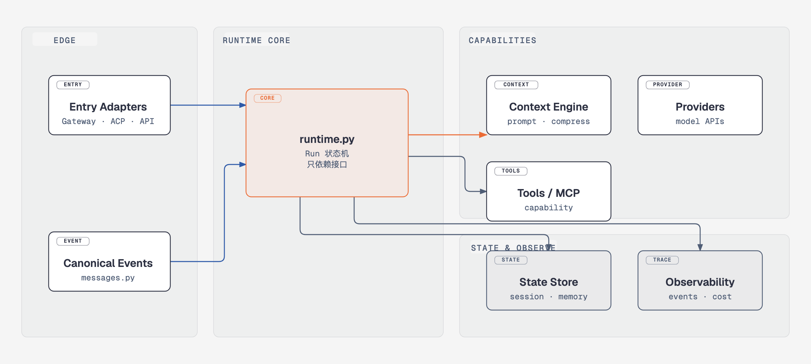

```
agent_runtime/
├── runtime.py          # Run 状态机
├── events.py           # 统一事件协议
├── messages.py         # Canonical Message
├── providers/
├── context/
├── tools/
├── state/
├── agents/
├── protocols/
└── observability/
```

核心原则：

> `runtime.py` 只能依赖接口，不能直接 import Telegram、Slack、OpenAI、SQLite 和 Docker 的具体实现。

---

## 17. 最后总结

Hermes 的核心不是某个“超级 Prompt”，而是下面这套闭环：

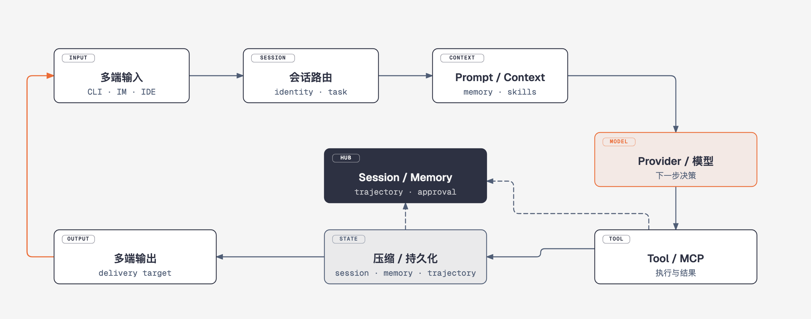

它代表的主流方向可以浓缩成五句话：

1. **Agent 是运行时，不是模型。**
2. **模型负责选择下一步，系统负责保证这一步可执行、可审计、可恢复。**
3. **上下文是有限计算资源，必须分层、检索、压缩和缓存。**
4. **工具、宿主、远程 Agent 会分别通过 MCP、ACP、A2A 走向标准化。**
5. **生产级 Agent 的上限由状态、安全、可观测性和评估决定，而不是由 while-loop 决定。**

如果要从 Hermes 选择一个最值得复用的内核思想，就是：

> **把模型放在一个有状态、有工具、有反馈、有边界的循环里；再让所有平台只做适配，不重新发明这个循环。**

---


## 18. 主要参考资料


### Hermes 官方

1. [架构概览](https://hermes-agent.nousresearch.com/docs/zh-Hans/developer-guide/architecture)
2. [Agent Loop 内部机制](https://hermes-agent.nousresearch.com/docs/zh-Hans/developer-guide/agent-loop)
3. [Gateway 内部机制](https://hermes-agent.nousresearch.com/docs/zh-Hans/developer-guide/gateway-internals)
4. [Prompt 组装](https://hermes-agent.nousresearch.com/docs/zh-Hans/developer-guide/prompt-assembly)
5. [上下文压缩与缓存](https://hermes-agent.nousresearch.com/docs/zh-Hans/developer-guide/context-compression-and-caching)
6. [工具运行时](https://hermes-agent.nousresearch.com/docs/zh-Hans/developer-guide/tools-runtime)
7. [Provider 运行时解析](https://hermes-agent.nousresearch.com/docs/zh-Hans/developer-guide/provider-runtime)
8. [会话存储](https://hermes-agent.nousresearch.com/docs/zh-Hans/developer-guide/session-storage)
9. [程序化集成](https://hermes-agent.nousresearch.com/docs/zh-Hans/developer-guide/programmatic-integration)
10. [ACP 内部机制](https://hermes-agent.nousresearch.com/docs/zh-Hans/developer-guide/acp-internals)
11. [Cron 内部机制](https://hermes-agent.nousresearch.com/docs/zh-Hans/developer-guide/cron-internals)
12. [MCP](https://hermes-agent.nousresearch.com/docs/zh-Hans/user-guide/features/mcp)
13. [Tool Search](https://hermes-agent.nousresearch.com/docs/zh-Hans/user-guide/features/tool-search)
14. [持久化记忆](https://hermes-agent.nousresearch.com/docs/zh-Hans/user-guide/features/memory)
15. [Skills 系统](https://hermes-agent.nousresearch.com/docs/zh-Hans/user-guide/features/skills)
16. [子智能体委派](https://hermes-agent.nousresearch.com/docs/zh-Hans/user-guide/features/delegation)
17. [Security Policy](https://raw.githubusercontent.com/NousResearch/hermes-agent/main/SECURITY.md)


### 行业协议与框架

1. [Anthropic：Building effective agents](https://www.anthropic.com/engineering/building-effective-agents)
2. [Anthropic：Effective context engineering for AI agents](https://www.anthropic.com/engineering/effective-context-engineering-for-ai-agents)
3. [MCP Architecture](https://modelcontextprotocol.io/docs/learn/architecture)
4. [Agent Client Protocol](https://agentclientprotocol.com/get-started/introduction.md)
5. [A2A Protocol](https://a2a-protocol.org/v1.0.0/specification/)
6. [LangGraph Persistence](https://docs.langchain.com/oss/python/langgraph/persistence)
7. [OpenAI Agents SDK](https://openai.github.io/openai-agents-python/)
8. [OpenAI Agent Orchestration](https://developers.openai.com/api/docs/guides/agents/orchestration)

