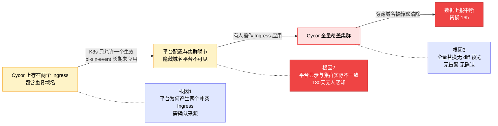

# 运维事件复盘：Ingress 域名配置覆盖导致数据上报中断

---

## 一、事件定级

| 维度 | 内容 |
|------|------|
| **事故等级** | P1（资损事故） |
| **事故时间** | 2026-04-20 18:32 ~ 2026-04-21 10:40 |
| **影响时长** | 约 16 小时 |
| **定级依据** | 生产环境核心数据链路中断，广告归因数据不可恢复，产生直接资损 |

---

## 二、事件描述

2026 年 4 月 20 日 18:32，业务同学在 IT 客服指导下，对 Cycor 平台上的 Ingress 配置执行了"删除重复域名 + 应用"操作。由于 Cycor 的 Ingress 更新采用**全量替换（update）机制**，此次应用将 Cycor 页面上的配置完全覆盖到 K8s 集群，导致仅在集群侧生效但未录入 Cycor 的域名绑定（`attr.funsgame.xyz`、`rev.gmoneygame.xyz`）被静默清除。

受影响域名对应 AF（AppsFlyer）、Adjust、Max 三个广告归因平台的数据上报入口，域名失效后数据上报链路全部中断。直至次日 10:40 人工发现并手动恢复配置，数据才恢复正常上报。

**背景信息**：该项目在 Cycor 上存在 `bi-sin-event` 和 `dataeye` 两个 Ingress，共享同一个 Ingress Class 和 LB 地址，且包含大量重复域名。由于 K8s 同一 Ingress Class 下同一域名只能有一条有效规则，`bi-sin-event` 长期应用报错，其配置一直在集群侧直接维护，与 Cycor 页面逐渐脱节。

---

## 三、用户影响

| 维度 | 详情 |
|------|------|
| **受影响平台** | AF（AppsFlyer）、Adjust、Max 三个广告归因平台 |
| **受影响域名** | `attr.funsgame.xyz`、`rev.gmoneygame.xyz` |
| **受影响服务** | `moon-af-push` 等数据上报服务 |
| **数据性质** | 广告归因实时数据，每秒持续产生 |
| **中断时长** | 约 16 小时（04-20 18:32 ~ 04-21 10:40） |
| **可恢复性** | **不可恢复** —— 数据为实时上报流，中断期间数据未被接收，无法补录 |
| **业务影响** | 广告归因数据缺失，影响投放效果评估与 ROI 计算；客户侧数据断档引发投诉；资损已发生，具体金额待业务侧核算 |

---

## 四、时间线

| 时间 | 事件 |
|------|------|
| 04-20 17:50 | Joe 联系 IT 客服，反馈 Cycor Ingress 应用报错"域名重复" |
| 04-20 17:57 | IT 客服 Achain 排查发现 `bi-sin-event` 和 `dataeye` 两个 Ingress 域名冲突 |
| 04-20 18:24 | Achain 指导删除 dataeye 中重复域名配置，保留 bi-sin-event，然后应用 |
| 04-20 18:32 | **Joe 执行删除并应用操作，Cycor 全量覆盖集群配置，隐藏域名绑定被清除** |
| 04-20 18:32 | **`attr.funsgame.xyz`、`rev.gmoneygame.xyz` 失效，数据上报中断（事故开始）** |
| 04-20 18:34 | Joe 确认操作完成，工单关闭 |
| 04-21 10:30 | Kinch 发现 `moon-af-push` 服务无数据进入，检查确认网络配置丢失 |
| 04-21 10:40 | **Kinch 手动添加缺失域名配置，数据上报恢复（事故结束）** |
| 04-21 11:25 | Kinch 群内通报事故，拉起排查 |
| 04-21 13:37 | **确认根因**：Cycor 全量替换覆盖了集群中不可见的域名配置 |
| 04-21 17:49 | 发现第二个受损域名 `rev.gmoneygame.xyz`，资损范围扩大 |
| 04-21 18:44 | 查询 180 天操作日志，确认受损域名从未通过 Cycor 管理 |

---

## 五、事件响应分析

**事件是如何被发现的？**

次日（04-21）上午 10:30，Kinch 在日常巡检中发现 `moon-af-push` 服务无任何数据进入，进而排查到 Ingress 域名配置丢失。属于**人工发现**，非监控告警触发。

**事件从发生到发现的时间是否可以缩短？**

事故持续约 16 小时才被发现。**可以大幅缩短**——如果数据上报链路有流量监控告警（流量归零即报警），发现时间可缩短到分钟级。当前缺失该监控，是响应延迟的主要原因。

**事件是如何被解决的？**

Kinch 在 Cycor Ingress 页面手动添加缺失的域名绑定配置，10 分钟内数据恢复上报。同时修正了被错配的 SSL 证书。

**事件从发现到解决的时间是否可以缩短？**

发现到恢复约 10 分钟，响应速度可接受。瓶颈在发现环节而非修复环节。

**事件的根因是如何找到的？**

Kinch 通报后，IT 客服 Achain 联合客服 90 号排查 Cycor 操作日志和集群实际配置，于 13:37 确认根因。从通报到定位根因约 2 小时，期间主要耗时在跨团队沟通和历史信息收集上。

**事件是否和某个已知的问题相关？**

是。`bi-sin-event` 和 `dataeye` 两个 Ingress 的域名冲突是已知的历史问题（IT-lemon 确认"bi-sin-event 应用报错，一直没让用"）。该问题长期未解决，最终导致本次事故。**如果此前清理了重复 Ingress，本次事故完全可以避免。**

---

## 六、5 Whys（刨根问底）



| # | 问题 | 回答 |
|---|------|------|
| 1 | **为什么数据上报中断了？** | 因为 `attr.funsgame.xyz`、`rev.gmoneygame.xyz` 域名绑定丢失，请求无法到达服务 |
| 2 | **为什么域名绑定会丢失？** | 因为 Cycor 执行 Ingress "应用"时采用全量替换，把集群中实际生效但 Cycor 页面不可见的域名配置覆盖清除了 |
| 3 | **为什么这些域名在 Cycor 页面上不可见？** | 因为 `bi-sin-event` 长期无法在 Cycor 上正常应用（会报错），这些域名一直在集群侧直接维护，从未同步到 Cycor 平台 |
| 4 | **为什么 bi-sin-event 在 Cycor 上应用会报错？** | 因为 `dataeye` 另一个 Ingress 中也配置了相同域名，同一 Ingress Class 下存在重复，K8s 不允许 |
| 5 | **为什么会存在两个 Ingress 配置了相同域名？** | 据 IT-lemon 反馈，`bi-sin-event` 最早只有 4 个域名是正常的，后来 `dataeye` 不知何故把 `bi-sin-event` 的配置同步过来了（疑似 Cycor 数据库同步），导致两个 Ingress 出现大量重复。**此问题需 Cycor 平台组确认来源** |
| 6 | **为什么这个已知冲突长期未解决？** | 当时发现报错后选择了"绕过"（不在 Cycor 操作 bi-sin-event，改为集群侧维护），而非根治。历史债务被搁置，最终在本次操作中引爆 |

---

## 七、经验总结

**1. 不可见 ≠ 不存在**

Cycor 平台上看不到某个域名配置，不代表集群中没有。"应用"操作的本质是全量覆盖——任何不在平台上的配置都会被静默清除。今后任何"应用"操作前，必须先与集群实际配置做 diff。

**2. 消除报错 ≠ 解决问题**

本次事故的触发点是"删除重复配置以消除应用报错"。报错消除了，但引入了更严重的问题——域名绑定丢失。消除表面报错之前，必须理解报错的完整上下文和操作的副作用。

**3. 历史债务会在最意想不到的时候爆发**

`bi-sin-event` 的"集群侧配置"是 2024 年甚至更早遗留的历史债务。它安静地运行了两年，直到有人触发了一次看似无关的操作。技术债务不会自动消失，只会在最坏的时机被引爆。

**4. 关键数据链路必须有独立监控**

本次事故持续 16 小时才被人工发现，期间无任何告警。如果数据上报流量有断崖检测，发现时间可从 16 小时缩短到分钟级，资损可大幅减少。

---

## 八、行动项

### 已完成（事故修复）

| 序号 | 措施 | 执行人 | 完成时间 |
|------|------|--------|---------|
| 1 | 手动添加 `attr.funsgame.xyz` 域名绑定到 Ingress | Kinch | 04-21 10:40 |
| 2 | 修正 `attr.funsgame.xyz` 的 SSL 证书 | Kinch | 04-21 13:41 |
| 3 | 添加 `rev.gmoneygame.xyz` 域名绑定 | Kinch | 04-21 17:49 |
| 4 | 验证当前所有可见域名配置均正常 | Kinch | 04-21 15:22 |

### 短期（本周内）

| 序号 | 行动项 | 负责人 | 截止日期 |
|------|--------|--------|---------|
| 5 | **Ingress 隔离**：为受损域名新建独立 Ingress，与 `bi-sin-event` 和 `dataeye` 解耦 | IT 运维 | 04-25 |
| 6 | **配置全量盘点**：对比 Cycor 平台与 K8s 集群实际配置，找出所有"平台不可见但集群生效"的域名 | IT 运维 + Kinch | 04-25 |
| 7 | **补录缺失配置**：将所有集群侧独立配置的域名录入 Cycor 平台 | IT 运维 | 04-25 |

### 中期（两周内）

| 序号 | 行动项 | 负责人 | 截止日期 |
|------|--------|--------|---------|
| 8 | **Cycor 平台优化**：向 Cycor 团队提交需求——Ingress 更新前增加 diff 预览，显示即将删除的配置 | IT 运维 | 05-05 |
| 9 | **数据上报监控告警**：为 AF/Adjust/Max 链路增加流量断崖检测，中断 5 分钟即告警 | Kinch | 05-05 |

---

## 九、识别到的风险

| 风险 | 说明 | 当前状态 |
|------|------|---------|
| **两个 Ingress 冲突根源未确认** | `dataeye` 为何同步了 `bi-sin-event` 的配置，是 Cycor 环境复制、数据库同步还是其他原因，尚未得到平台组明确答复 | 待 Cycor 平台组确认 |
| **其他项目可能存在同类问题** | 如果 Cycor 存在自动同步 Ingress 配置的行为，其他项目也可能存在两个 Ingress 冲突的隐患 | 未排查 |
| **全量替换机制短期无法修改** | Cycor 的 update 策略是平台级行为，diff 预览功能需排期开发，短期内仍存在误覆盖风险 | 通过人工 Checklist 临时缓解 |
| **历史集群侧配置可能还有遗漏** | 本次发现 2 个域名受损，IT-lemon 提到最早有 4 个域名在集群侧，可能还有未发现的 | 待配置盘点确认 |

---

## 十、相关链接

- Cycor Ingress 配置页面：`https://devops.cycor.io/t/10001/project/4028f84f90866e48019096b40b4d0e75/env/4028f84f90866e48019096d6d0940f81/settings/Ingress`
- 受影响服务（moon-af-push）：`https://devops.cycor.io/t/10001/project/4028f84f90866e48019096b40b4d0e75/env/4028f84f90866e48019096d6d0940f81/component/moon-af-push/pod`

---

## 附录 A：根因详解

**原因一：Cycor 平台上存在两个互相冲突的 Ingress —— 需追溯来源**

`bi-sin-event` 和 `dataeye` 两个 Ingress 共享同一个 Ingress Class，且包含重复的域名配置。在 K8s 中，同一 Ingress Class 下同一域名只能有一个有效规则——这不是 bug，而是 K8s Ingress 的基本机制。**真正的问题是：这两个互相冲突的 Ingress 是怎么产生的？**

据 IT-lemon 反馈：`bi-sin-event` 最早只有 4 个域名，配置是正常的。后来 `dataeye` 的配置不知何故把 `bi-sin-event` 的内容同步过来了（"cycor 数据库同步的，当时没查"），导致两个 Ingress 出现大量重复域名。此后 `bi-sin-event` 应用就会报错，于是一直没人敢在 Cycor 上操作它，转而在集群侧直接维护。

**此问题需要 Cycor 平台组确认**：两个 Ingress 配置的重复是环境复制、数据库同步、还是其他平台行为导致的？这是后续避免同类问题的关键。

**原因二：Cycor 平台与集群实际配置长期不一致**

由于原因一导致 `bi-sin-event` 长期无法在 Cycor 上正常"应用"，其集群侧实际运行的配置逐渐与 Cycor 页面脱节：
- `attr.funsgame.xyz`、`rev.gmoneygame.xyz` 等域名仅在集群中生效，Cycor 页面上看不到
- 180 天内 Cycor 操作日志中无这些域名的任何修改记录
- 所有操作人员只能看到 Cycor 页面，无法感知集群侧的真实状态

**平台显示 ≠ 实际生效**，但没有任何机制提示这种不一致的存在。

**原因三：Cycor 的全量替换机制放大了问题**

Cycor 执行 Ingress "应用"操作时，采用 **全量替换（update）** 策略——以 Cycor 平台当前页面的配置为准，**完全覆盖集群中的实际 Ingress 配置**。不在 Cycor 页面中的域名绑定会被静默清除，无 diff 预览、无确认提示、无告警通知。

单独看全量替换机制本身是合理的——前提是平台配置与集群配置保持一致。但当原因一（冲突导致长期未应用）和原因二（配置脱节）已经存在时，全量替换就变成了"定时炸弹"：**任何一次正常的应用操作都会触发隐藏域名的丢失，而操作者根本无从知晓。**

---

## 附录 B：网络配置维护规约（新增）

基于本次事故教训，制定以下网络配置维护规约，后续所有涉及 Ingress/域名/网络 的操作必须遵守：

### 规约一：配置唯一来源原则

> **所有 Ingress 配置必须且只能通过 Cycor 平台管理。**
> 禁止直接通过 kubectl 或其他方式在 K8s 集群中修改 Ingress 配置。

- 历史遗留的集群侧配置，必须迁移至 Cycor 平台统一管理
- 迁移前需对比确认，迁移后需验证域名可达性

### 规约二：Ingress 隔离原则

> **不同业务线的域名必须使用独立的 Ingress 资源。**

- 禁止多个业务在同一 Ingress 中混配域名
- 同一 Ingress Class 下，同一域名只能出现在一个 Ingress 中
- 新增域名前，先检查是否与其他 Ingress 存在冲突

### 规约三：变更前 Checklist

> **任何 Ingress 配置变更（增/删/改/应用），操作前必须完成以下检查：**

```
□ 1. 确认变更内容：新增/修改/删除了哪些域名？
□ 2. 确认影响面：该 Ingress 下所有域名是否都在 Cycor 页面可见？
□ 3. 集群对比：执行 kubectl get ingress <name> -o yaml
      对比集群实际配置与 Cycor 页面配置是否一致
□ 4. 如不一致：先将集群侧多出的配置补录到 Cycor，再执行变更
□ 5. 证书确认：涉及域名的 SSL 证书是否匹配正确？
□ 6. 知会相关方：通知该 Ingress 下所有域名的业务负责人
□ 7. 灰度验证：应用后立即验证所有域名可达性
```

### 规约四：高危操作审批制

> **以下操作属于高危操作，需至少两人确认后方可执行：**

- 删除 Ingress 中的域名配置
- "应用"存在历史遗留问题的 Ingress（如曾报错、长期未应用过的）
- 修改 SSL 证书绑定关系
- 新建或删除整个 Ingress 资源

### 规约五：监控兜底

> **关键数据链路必须有独立的流量监控和告警。**

- 数据上报类服务（AF/Adjust/Max 等）需配置请求量监控
- 流量降为 0 或骤降 50% 以上，5 分钟内触发告警
- 告警渠道：钉钉/企微群 + 短信 + 电话

---

## 附录 C：相关人员

| 角色 | 人员 | 职责 |
|------|------|------|
| 事故发现人 | Kinch（朱金奇） | 发现数据缺失，紧急恢复配置 |
| 操作执行人 | Joe（周正昊） | 在 IT 指导下执行 Ingress 变更 |
| IT 客服 | Achain（邢晨） | 指导操作，参与根因排查 |
| IT 客服 | Beta（安志强） | 协助处理应用报错 |
| IT 客服 | Lemon（刘新华） | 提供历史配置背景 |
| 平台运维 | 客服 90 号（张少云） | 查询 Ingress 操作日志，辅助定位 |
| 相关方 | Willian（王小伟） | 了解历史配置情况 |
| 相关方 | Quentin（韩骞） | 排除操作嫌疑（操作的是 funsdata.com） |

---

*复盘人：Kinch（朱金奇）*
*复盘日期：2026 年 4 月 21 日*
