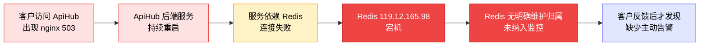

# 运维事件复盘：ApiHub 网关服务 503 异常

---

## 一、事件定级

| 维度 | 内容 |
|------|------|
| **事件等级** | 待定（建议按客户可感知服务异常定级） |
| **事件时间** | 反馈时间：当日 13:30；根因定位时间：当日 18:00 |
| **影响范围** | ApiHub 网关平台，美东区域 LB 后端服务 |
| **主要现象** | 客户在使用过程中频繁遇到 `nginx 503` |
| **定级依据** | 客户可感知的网关访问异常，服务端存在持续重启，依赖 Redis 宕机且无人维护 |

---

## 二、事件描述

ApiHub 是当前对外提供接口网关能力的平台，网络 LB 部署在美东区域。客户在使用 ApiHub 过程中，多次反馈请求出现 `nginx 503` 错误。

业务侧最初排查时发现 ApiHub 服务本身并未使用 Nginx，因此无法直接解释该错误来源。随后联系运维团队确认链路，运维排查发现该错误来自网关链路上游或 LB 后端的代理层表现，而真正的问题并不在 Nginx 本身，而是 ApiHub 后端服务处于持续重启状态。

进一步查看服务日志后发现，服务依赖的 Redis 地址 `119.12.165.98` 已宕机。该 Redis 实例无人明确维护，也没有被纳入当前标准运维监控体系。定位到问题后，业务侧立即将服务切换到当前正常运行、可维护的 Redis 实例，服务恢复稳定。

---

## 三、用户影响

| 维度 | 详情 |
|------|------|
| **受影响用户** | 使用 ApiHub 网关平台的客户 |
| **受影响区域** | 美东区域 |
| **用户感知现象** | 请求频繁出现 `nginx 503` |
| **技术表现** | ApiHub 后端服务持续重启，LB 或代理层返回 503 |
| **影响时长** | 至少从客户反馈开始至根因定位前持续存在；具体开始时间待补充 |
| **业务影响** | 客户 API 调用稳定性下降，部分请求失败，影响客户正常接入和使用体验 |
| **数据影响** | 暂未发现数据丢失；需结合调用日志确认是否有业务请求失败未补偿 |

---

## 四、时间线

| 时间 | 事件 |
|------|------|
| 13:30 | 客户反馈 ApiHub 使用过程中频繁出现 `nginx 503` |
| 13:30 - 18:00 | 业务侧与客户沟通排查，并确认 ApiHub 服务本身未直接使用 Nginx |
| 18:00 | 运维排查发现 ApiHub 服务持续重启 |
| 18:00 | 查看服务日志，定位到依赖 Redis `119.12.165.98` 宕机 |
| 18:00+ | 确认该 Redis 无明确维护人，未被当前团队纳入正常运维范围 |
| 18:00+ | 业务侧切换到当前正常运行维护的 Redis 实例 |
| 18:00+ | 服务恢复稳定，`nginx 503` 现象消失或明显缓解 |

---

## 五、事件响应分析

**事件是如何被发现的？**

本次事件由客户主动反馈发现。客户在使用 ApiHub 过程中频繁遇到 `nginx 503`，业务侧收到反馈后开始排查。

**事件从发生到发现的时间是否可以缩短？**

可以缩短。当前没有针对 ApiHub 服务重启、Redis 依赖可用性、网关 5xx 错误率的主动监控告警，导致问题依赖客户反馈才被发现。若已配置服务存活、重启次数、Redis 连接失败、5xx 错误率告警，理论上可以在分钟级发现。

**事件是如何被解决的？**

通过查看 ApiHub 服务日志，确认服务持续重启的根因是 Redis `119.12.165.98` 宕机。随后将服务依赖切换到当前正常运行、明确维护的 Redis 实例，恢复服务稳定性。

**事件从发现到解决的时间是否可以缩短？**

可以缩短。13:30 收到反馈，18:00 才定位到 Redis 宕机，主要耗时在错误来源判断和依赖链路排查上。后续如果补齐依赖拓扑、服务日志告警和 Redis 可用性监控，定位时间可以显著缩短。

**事件的根因是如何找到的？**

通过运维排查服务运行状态，发现 ApiHub 服务不断重启；进一步查看应用日志，发现 Redis 连接异常，最终定位到 `119.12.165.98` Redis 宕机。

**事件是否和某个已知问题相关？**

是。该问题暴露出两个已知风险：一是服务依赖的外部组件缺少统一登记和维护归属；二是关键服务及依赖缺少监控告警。如果这两个问题提前解决，本次事件可以更早发现，甚至可以避免。

---

## 六、5 Whys（刨根问底）

| # | 问题 | 回答 |
|---|------|------|
| 1 | **为什么客户看到 `nginx 503`？** | 因为 ApiHub 网关链路后端服务不可用，代理层或 LB 返回 503 |
| 2 | **为什么后端服务不可用？** | 因为 ApiHub 服务不断重启，无法稳定对外提供服务 |
| 3 | **为什么服务不断重启？** | 因为服务依赖的 Redis 连接失败，启动或运行过程中发生异常 |
| 4 | **为什么 Redis 连接失败？** | 因为 Redis `119.12.165.98` 已宕机 |
| 5 | **为什么 Redis 宕机没有被提前发现？** | 因为该 Redis 无明确维护人，未纳入当前监控和告警体系 |
| 6 | **为什么客户反馈后才发现问题？** | 因为 ApiHub 服务自身、Redis 依赖、网关 5xx 错误率均缺少有效主动监控 |

---

## 七、经验总结

**1. 客户看到的错误不一定是根因**

本次客户看到的是 `nginx 503`，但 ApiHub 服务本身并未使用 Nginx。该错误只是网关链路最终暴露给客户的表现，真正根因在后端服务依赖 Redis 宕机。后续排查类似问题时，需要从用户侧错误继续向后端服务状态、依赖组件、日志链路逐层排查。

**2. 服务依赖必须有明确归属**

`119.12.165.98` Redis 宕机后无人明确维护，说明依赖资产未被完整纳管。所有生产服务依赖的 Redis、数据库、MQ、第三方服务都必须登记维护人、用途、环境和告警方式。

**3. 没有监控就等于让客户替我们发现问题**

本次事件由客户反馈触发，而不是由系统告警触发。对于网关平台这类关键基础服务，必须建立主动监控，包括服务存活、重启次数、错误率、延迟、依赖可用性等。

**4. 临时依赖会变成长期风险**

如果某个 Redis 最初只是临时使用，但后续没有清理或迁移，就会成为隐藏风险。所有临时配置必须有过期时间和迁移计划。

---

## 八、行动项

### 已完成

| 序号 | 行动项 | 负责人 | 状态 |
|------|--------|--------|------|
| 1 | 将 ApiHub Redis 依赖从 `119.12.165.98` 切换到当前正常运行维护的 Redis 实例 | 业务侧 | 已完成 |
| 2 | 确认 `nginx 503` 的直接表现来自网关链路后端服务不可用 | 业务侧 + 运维 | 已完成 |

### 短期（本周内）

| 序号 | 行动项 | 负责人 | 截止时间 |
|------|--------|--------|---------|
| 3 | 为 ApiHub 服务增加进程存活、重启次数、接口 5xx 错误率监控 | 运维 + 业务侧 | 待补充 |
| 4 | 为 ApiHub 依赖 Redis 增加可用性和连接失败告警 | 运维 + 业务侧 | 待补充 |
| 5 | 梳理 ApiHub 当前所有外部依赖，包括 Redis、数据库、LB、域名、证书等，并登记维护人 | 业务侧 | 待补充 |

### 中期（两周内）

| 序号 | 行动项 | 负责人 | 截止时间 |
|------|--------|--------|---------|
| 6 | 建立 ApiHub 服务依赖拓扑文档，明确请求链路、LB、服务、Redis、数据库之间的关系 | 业务侧 | 待补充 |
| 7 | 制定生产依赖接入规范：未纳入监控、无维护人的 Redis/数据库/MQ 不允许被生产服务依赖 | 运维 + 业务侧 | 待补充 |
| 8 | 为网关平台增加客户侧可用性探测，从外部视角检测 5xx 和延迟异常 | 运维 | 待补充 |

---

## 九、识别到的风险

| 风险 | 说明 | 当前状态 |
|------|------|---------|
| **仍可能存在未登记依赖** | ApiHub 可能还有其他历史遗留依赖未被纳管 | 待排查 |
| **网关错误缺少统一定位链路** | 客户看到 503 后，业务侧需要人工判断错误来自 LB、代理层还是服务本身 | 待优化 |
| **监控体系不完整** | 当前至少缺少 Redis 可用性、服务重启、5xx 错误率告警 | 待补齐 |
| **Redis 切换后的稳定性需观察** | 新 Redis 当前正常，但仍需确认容量、连接数、持久化和高可用配置 | 待验证 |

---

## 十、相关链接

- ApiHub 服务地址：待补充
- 美东 LB 配置：待补充
- Redis `119.12.165.98` 相关信息：待补充
- 监控面板：待补充
- 事件沟通记录：待补充

---

*复盘人：待补充*

*复盘日期：2026 年 5 月 8 日*
