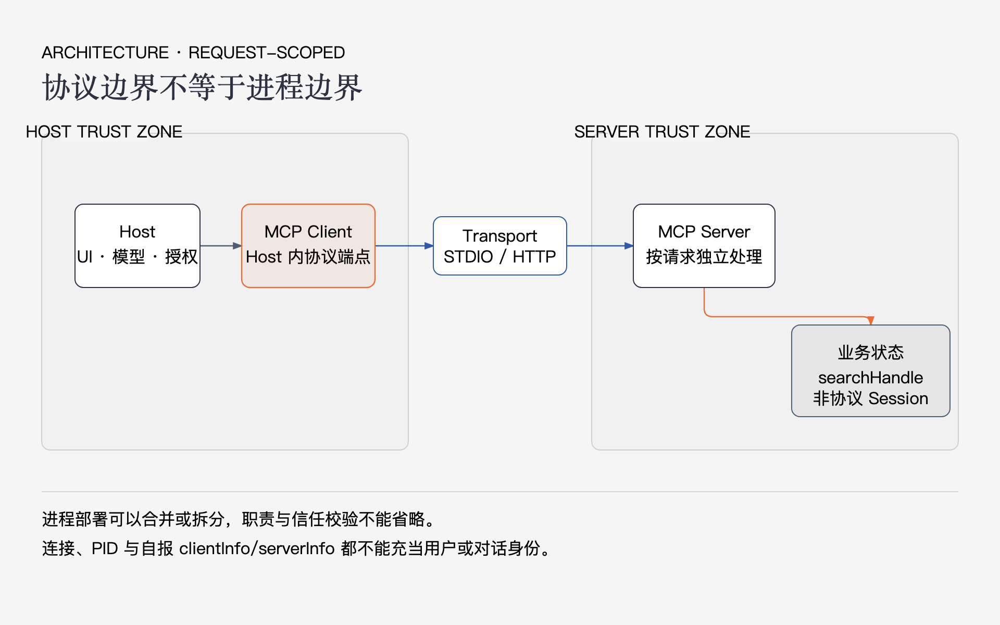
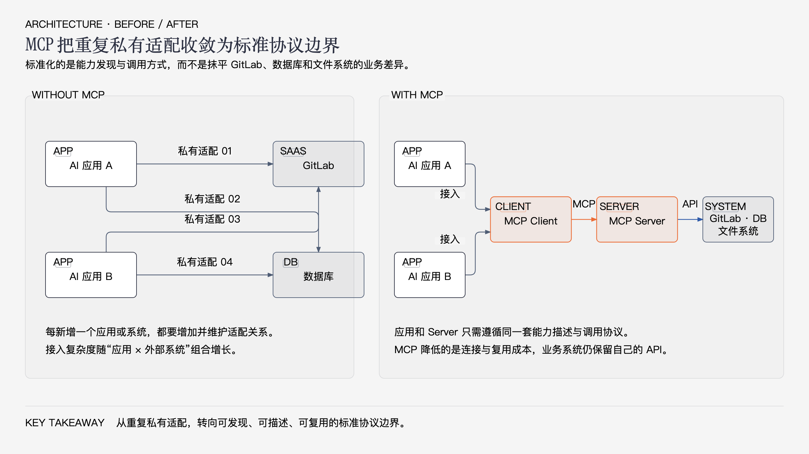
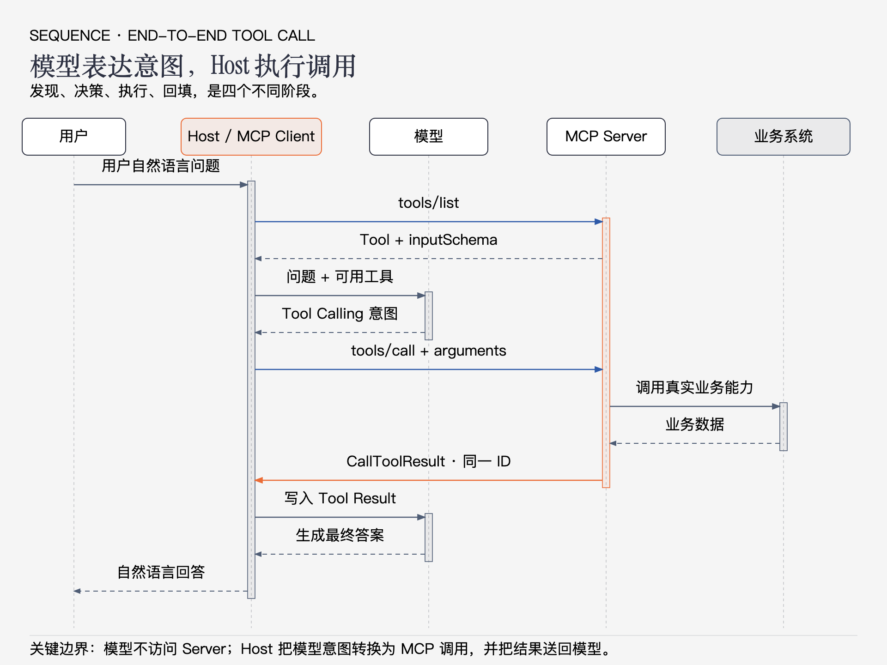
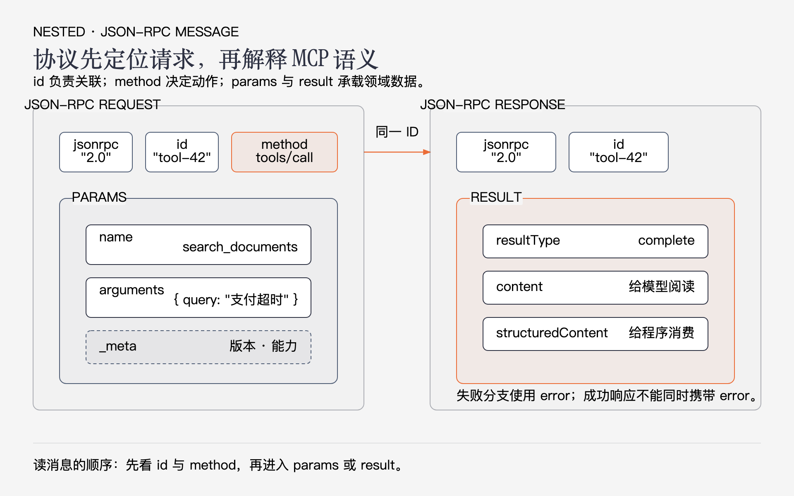
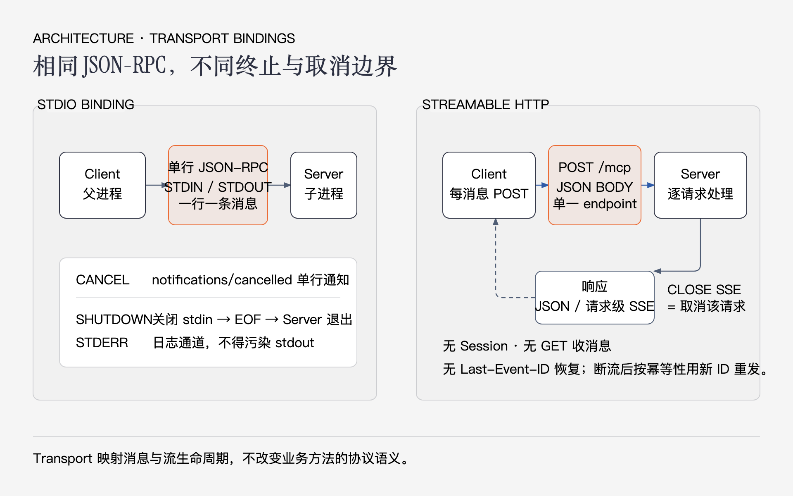

# MCP Java 核心原理与开发指南

MCP（Model Context Protocol，模型上下文协议）是一套让 AI 应用以统一方式连接外部数据、工具和工作流的协议。

这句话看起来简单，却很容易产生三个误解：

1. MCP 不是大模型本身具备的网络能力；
2. MCP Server 不直接和大模型通信；
3. MCP 也不是一种新的 Agent 框架。

MCP 真正标准化的是：**AI 应用如何发现外部能力、如何调用这些能力，以及如何把执行结果交还给模型。**

本文只围绕一个案例展开：为研发知识库开发一个 MCP Server，对外提供 `search_documents` 工具。读完后，你应该能回答：

- 用户说一句自然语言后，为什么模型知道可以使用这个工具？
- 究竟是谁向 MCP Server 发起调用？
- `tools/list` 和 `tools/call` 分别传什么？
- Server 执行结束后，结果怎样重新回到模型？
- stdio 和 Streamable HTTP 只是传输方式不同，还是协议也不同？
- Java 工程师开发一个 MCP Server，需要实现哪些部分？

> **版本说明（2026-08-27）**
>
> 本文按照 MCP `2026-07-28` 规范解释当前协议；Java 示例使用官方 MCP Java SDK `2.0.1`。该 SDK 当前实现的是 `2025-11-25` 协议，因此示例仍有 `initialize` 生命周期。两个版本的 Tools、Resources、Prompts 和核心调用模型是一致的，主要差异集中在初始化、请求元数据、双向请求和 HTTP Session。本文只在影响理解时指出差异，不让版本迁移打断主线。

---


## 1. 先用一句话建立 MCP 心智模型

可以把 MCP 看成 AI 应用的“能力总线”：

- MCP Server 把数据库、文件、内部 API 等业务能力包装成标准能力；
- MCP Client 负责和一个 MCP Server 通信；
- Host 管理模型、MCP Client、用户授权和上下文；
- 模型只负责判断“是否需要调用某个工具”以及“应该传什么参数”；
- 真正的网络请求、进程通信和工具执行都由普通程序完成。



### 1.1 MCP 解决的不是“模型不会调用 Java”

没有 MCP 时，每个 AI 应用都要为每个外部系统开发一套私有适配；引入 MCP 后，应用和外部能力可以围绕统一的能力描述与调用协议完成连接：



标准化以后，Client 不需要知道 Server 内部使用 Java、Python、REST 还是 JDBC。它只需要理解 MCP 消息。

### 1.2 MCP 不负责什么

理解边界比记 API 更重要：

- **MCP 不负责模型推理。** 是否调用工具由模型和 Host 的策略共同决定。
- **MCP 不负责 Agent 循环。** 规划、反思、记忆和最大迭代次数属于 Agent Runtime。
- **MCP 不替代业务 API。** Server 内部通常仍会调用 REST、RPC、数据库或本地库。
- **MCP 不自动提供权限。** Server 仍需认证、授权、审计和参数校验。
- **MCP 不保证调用一定成功。** 它只定义调用和返回的标准形状。

因此，一套实际系统通常是：

```text
Agent/AI 应用
  ├─ 模型调用与上下文管理
  ├─ MCP Client
  └─ Agent 循环
       ↓
MCP Server
  ├─ 协议适配
  ├─ 参数校验与权限控制
  └─ 业务服务
       ↓
数据库 / REST API / 文件 / SaaS
```

---


## 2. MCP 的四个参与者


### 2.1 Host：真正控制全局的应用

Host 是用户正在使用的 AI 应用，例如 IDE、桌面助手或企业 Agent 平台。它负责：

- 调用模型；
- 创建和管理 MCP Client；
- 决定连接哪些 Server；
- 把 Server 暴露的工具提供给模型；
- 执行用户确认和权限策略；
- 把工具结果写回模型上下文；
- 控制一次 Agent 循环何时结束。

**Host 才是整个调用链的控制者。**

### 2.2 MCP Client：一个 Server 的协议代理

MCP Client 通常运行在 Host 内部。它负责：

- 建立 stdio 或 HTTP 连接；
- 编码、发送和接收 JSON-RPC 消息；
- 生成请求 ID 并匹配响应；
- 获取 Server 能力；
- 调用 Tool、读取 Resource、获取 Prompt；
- 处理超时、取消和连接关闭。

从逻辑关系看，通常是：

```text
一个 Host
  ├─ 一个 MCP Client → 文件系统 Server
  ├─ 一个 MCP Client → GitLab Server
  └─ 一个 MCP Client → 研发知识库 Server
```


### 2.3 MCP Server：把业务能力翻译成 MCP

MCP Server 负责两件事：

1. 描述自己有哪些能力；
2. 收到调用后，把协议请求分派给业务处理函数。

Server 并不要求拥有独立数据库。它更常见的定位是适配层：

```text
tools/call
   ↓
MCP Tool Handler
   ↓
KnowledgeService.search()
   ↓
Elasticsearch / MySQL / 内部 REST API
```


### 2.4 Transport：只负责搬运消息

标准传输有两种：

- **stdio**：Client 启动 Server 子进程，通过 stdin/stdout 交换消息；
- **Streamable HTTP**：Client 向统一的 MCP Endpoint 发送 HTTP POST。

无论使用哪种传输，上层仍然是相同的 MCP 方法和 JSON-RPC 消息。Transport 决定“消息怎么送到”，不决定“消息是什么意思”。

---


## 3. 一次工具调用到底怎样发生

这是全文最重要的一章。

假设用户对 AI 助手说：

> 帮我查一下支付超时事故的复盘文档。

完整过程并不是“模型直接调用 MCP”，而是下面这条链路。



### 3.1 第一阶段：Client 先发现 Server 能力

在工具被调用之前，Host 必须先知道 Server 提供什么。

对 Tools 来说，核心方法是：

```text
tools/list
```

Server 返回类似下面的 Tool 定义：

```json
{
  "name": "search_documents",
  "description": "按照关键词检索研发知识库",
  "inputSchema": {
    "type": "object",
    "properties": {
      "query": {
        "type": "string",
        "description": "检索关键词"
      }
    },
    "required": ["query"],
    "additionalProperties": false
  }
}
```

这段定义的意义是：

- `name` 是稳定的机器标识；
- `description` 告诉模型“什么时候应该使用它”；
- `inputSchema` 告诉模型“调用时应该生成什么参数”；
- JSON Schema 同时帮助 Host 和 Server 校验参数。


### 3.2 第二阶段：Host 把 Tool 描述交给模型

Host 把用户消息、对话历史和可用 Tool 描述一起发送给模型。

模型看到的逻辑信息类似：

```text
用户问题：帮我查一下支付超时事故的复盘文档

可用工具：
- search_documents(query: string)
  按照关键词检索研发知识库
```

模型经过推理后，不直接访问网络，而是返回一个**工具调用意图**：

```json
{
  "name": "search_documents",
  "arguments": {
    "query": "支付超时事故"
  }
}
```

这一对象的具体外观取决于模型厂商的 Tool Calling API，它还不是 MCP 消息。

### 3.3 第三阶段：Host 把模型意图转换成 MCP 请求

Host 找到这个 Tool 所属的 MCP Client，由 Client 构造 `tools/call` 请求：

```json
{
  "jsonrpc": "2.0",
  "id": "tool-42",
  "method": "tools/call",
  "params": {
    "name": "search_documents",
    "arguments": {
      "query": "支付超时事故"
    },
    "_meta": {
      "io.modelcontextprotocol/protocolVersion": "2026-07-28",
      "io.modelcontextprotocol/clientCapabilities": {}
    }
  }
}
```

这里有两个完全不同的“调用”：

```text
模型 Tool Calling：模型 → Host，表达调用意图
MCP tools/call：Host 内 MCP Client → MCP Server，执行真实调用
```

MCP 连接了这两个边界，但没有把它们合并成同一件事。

### 3.4 第四阶段：Server 分派并执行 Java Handler

Server 收到请求后，通常按照以下顺序处理：

1. Transport 读取字节并解析 JSON；
2. JSON-RPC 层检查 `jsonrpc`、`id`、`method`；
3. MCP 层识别 `tools/call`；
4. 根据 `params.name` 找到 `search_documents`；
5. 根据 `inputSchema` 校验 `arguments`；
6. 执行注册的 Java Handler；
7. Handler 调用数据库或业务 API；
8. 把业务结果转换成 `CallToolResult`；
9. 使用原请求 ID 返回响应。

关键分派关系是：

```text
method = tools/call
params.name = search_documents
                ↓
注册表中名为 search_documents 的 Tool Handler
```

这就是 MCP Server“为什么能够被调用”的服务端答案：**Server 启动时已经把 Tool 名称、Schema 和 Handler 注册到了协议运行时。**

### 3.5 第五阶段：结果按原 ID 返回

执行成功后，现代协议响应可以是：

```json
{
  "jsonrpc": "2.0",
  "id": "tool-42",
  "result": {
    "resultType": "complete",
    "content": [
      {
        "type": "text",
        "text": "找到文档 KB-42：支付超时事故复盘"
      }
    ],
    "structuredContent": {
      "documentId": "KB-42",
      "title": "支付超时事故复盘"
    },
    "isError": false
  }
}
```

Client 依靠相同的 `"id": "tool-42"` 把响应和请求关联起来。

`content` 和 `structuredContent` 面向不同消费者：

- `content` 适合直接转换为模型可读内容；
- `structuredContent` 适合 Host、UI 或后续程序继续处理；
- 如果声明了 `outputSchema`，结构化结果应符合它。


### 3.6 第六阶段：Host 再次调用模型

MCP 响应还不是最终给用户的自然语言答案。

Host 会把工具结果作为 Tool Result 写入对话上下文，然后再次调用模型：

```text
用户消息
  ↓
模型第一次推理：决定调用 search_documents
  ↓
MCP tools/call
  ↓
Tool Result：找到 KB-42
  ↓
模型第二次推理：组织最终答案
  ↓
返回用户
```

因此，一次看似简单的问答，至少可能包含两次模型推理和一次 MCP 调用。

### 3.7 谁决定继续调用下一个工具

仍然是 Host 的 Agent 循环：

```text
while（模型还要求调用工具 && 未超过上限） {
    调用工具
    把结果写回上下文
    再次调用模型
}
```

MCP 不定义这个循环最多执行多少次，也不负责避免模型无限调用。迭代预算、总超时、Token 预算和人工确认都属于 Host。

---


## 4. MCP 协议内容解读


### 4.1 MCP 使用 JSON-RPC 2.0

MCP 把自己的方法定义建立在 JSON-RPC 2.0 消息结构上。



#### Request

```json
{
  "jsonrpc": "2.0",
  "id": "req-1",
  "method": "tools/list",
  "params": {}
}
```

- `jsonrpc`：固定为 `"2.0"`；
- `id`：请求标识，响应必须原样返回；
- `method`：MCP 方法名；
- `params`：方法参数。


#### Success Response

```json
{
  "jsonrpc": "2.0",
  "id": "req-1",
  "result": {
    "resultType": "complete",
    "tools": []
  }
}
```

成功响应使用 `result`，不能同时出现 `error`。

#### Error Response

```json
{
  "jsonrpc": "2.0",
  "id": "req-1",
  "error": {
    "code": -32602,
    "message": "Invalid params",
    "data": {
      "field": "query"
    }
  }
}
```

错误响应使用 `error`：

- `code`：机器可判断的整数错误码；
- `message`：简短说明；
- `data`：可选的结构化诊断信息。


#### Notification

```json
{
  "jsonrpc": "2.0",
  "method": "notifications/cancelled",
  "params": {
    "requestId": "req-1",
    "reason": "用户取消"
  }
}
```

Notification 没有 `id`，接收方也不会返回 Response。

### 4.2 最新规范为什么把元数据放到每个请求

在 `2026-07-28` 规范中，每个 Request 的 `params._meta` 都携带当前请求所需的协议信息：

```json
{
  "_meta": {
    "io.modelcontextprotocol/protocolVersion": "2026-07-28",
    "io.modelcontextprotocol/clientCapabilities": {},
    "io.modelcontextprotocol/clientInfo": {
      "name": "knowledge-host",
      "version": "1.0.0"
    }
  }
}
```

其中：

- `protocolVersion`：本次请求使用的协议版本；
- `clientCapabilities`：本次请求可以处理哪些 Client 能力；
- `clientInfo`：可选的客户端软件信息，不是用户身份，也不能代替认证。

这样设计的结果是：一个请求可以独立理解，Server 不应依赖“同一连接上的上一个请求曾经声明了什么”。

Java SDK `2.0.1` 当前仍使用旧版 `initialize` 协商版本和能力。开发者要区分“规范当前怎样定义”和“所用 SDK 当前实现到哪里”。

### 4.3 Tools：让模型请求执行动作

Tools 是最常被使用的 Server Feature。

核心方法：

```text
tools/list    获取工具定义
tools/call    调用指定工具
```

一个 Tool 最重要的字段是：

- `name`：稳定、唯一、适合机器使用；
- `description`：告诉模型使用场景、限制和副作用；
- `inputSchema`：输入 JSON Schema；
- `outputSchema`：可选的输出 JSON Schema；
- `annotations`：可选提示，例如只读性、破坏性等；它是提示，不是安全策略。

设计 Tool 时要把 description 当成“给模型看的 API 文档”。例如：

```text
差：搜索

好：按照标题和正文关键词检索研发知识库。
仅返回用户有权访问的文档，不修改任何数据。
```

Tool 返回错误有两种层次：

1. **协议错误**：方法不存在、参数结构非法，返回 JSON-RPC `error`；
2. **工具执行失败**：工具被正确调用，但业务执行失败，返回 `CallToolResult` 且 `isError: true`。

区分这两类错误可以让 Client 知道应该修复协议，还是让模型理解业务失败。

### 4.4 Resources：让应用读取可寻址内容

Resources 更像只读的数据接口。

核心方法：

```text
resources/list
resources/templates/list
resources/read
```

Resource 使用 URI 标识内容，例如：

```text
kb://documents/KB-42
file:///project/README.md
```

典型返回内容包括：

- `uri`；
- `mimeType`；
- `text` 或二进制 `blob`。

选择原则：

- “执行检索、创建工单、发送消息”使用 Tool；
- “读取一个已知 URI 的内容”使用 Resource；
- 不要为了让模型可见，就把所有只读数据都伪装成 Tool。


### 4.5 Prompts：让用户选择预定义工作流模板

Prompts 是 Server 暴露的消息模板。

核心方法：

```text
prompts/list
prompts/get
```

例如 `incident_analysis(documentId)` 可以返回一组用于事故分析的用户消息。Prompt 通常由用户明确选择，和“模型自主决定调用的 Tool”语义不同。

### 4.6 三类 Feature 不要混用

可以使用一个简单判断：

```text
需要执行动作或计算？
  → Tool

需要读取由 URI 标识的内容？
  → Resource

需要取得一组可复用的对话消息？
  → Prompt
```


### 4.7 需要补充输入时发生什么

当前规范使用 MRTR（Multi Round-Trip Requests）处理需要补充输入的调用。

Server 不会把半成品当最终结果，而是返回：

```json
{
  "jsonrpc": "2.0",
  "id": "search-1",
  "result": {
    "resultType": "input_required",
    "inputRequests": {
      "confirm": {
        "method": "elicitation/create",
        "params": {
          "mode": "form",
          "message": "请确认是否执行高成本检索"
        }
      }
    },
    "requestState": "<opaque-token>"
  }
}
```

Client 收集输入后，用**新请求 ID**重新调用原方法，并原样带回 `requestState`。旧请求已经结束，这不是在原响应上继续追加数据。

普通 MCP Server 入门时不必先实现 MRTR，但应知道它解决的是“调用中途需要用户或 Client 补充信息”的问题。

---


## 5. MCP 怎样通信



### 5.1 stdio

stdio 模式下，Client 启动 Server 子进程：

```text
Client ──stdin──> Server
Client <─stdout── Server
                 └─stderr：日志
```

关键规则：

- 每条 JSON-RPC 消息使用 UTF-8 编码并独占一行；
- stdout 只能写协议消息；
- 普通日志必须写 stderr；
- Client 通常负责 Server 进程的启动和关闭；
- 本地密钥可通过受控环境变量传入，但不要写进协议正文或日志。

stdio 的优点：

- 本地使用简单；
- 不需要监听端口；
- 进程边界清晰；
- 很适合 IDE、桌面客户端和命令行工具。

它的限制是：不适合多个远程用户共享同一个服务，也不适合直接部署成公网接口。

### 5.2 Streamable HTTP

现代 Streamable HTTP 使用一个 MCP Endpoint，例如：

```http
POST /mcp HTTP/1.1
Content-Type: application/json
Accept: application/json, text/event-stream
MCP-Protocol-Version: 2026-07-28
Mcp-Method: tools/call
Mcp-Name: search_documents
```

Body 仍然是完整 JSON-RPC 请求。Header 是为网关和中间层提供的镜像信息，Server 必须检查 Header 与 Body 是否一致。

Server 可以返回：

- `application/json`：直接返回一个 JSON-RPC Response；
- `text/event-stream`：先发送与该请求相关的进度或通知，最后发送 Response。

当前 `2026-07-28` 规范是请求级、无协议 Session 的 HTTP 模型。Java SDK `2.0.1` 实现的旧协议仍可能出现 `Mcp-Session-Id`、GET SSE 通道和 `initialize`，不要把旧 SDK 的线上行为当成最新规范。

### 5.3 如何选择

优先按部署关系选择：

- Client 和 Server 在同一台机器，由 Client 管理进程：选 stdio；
- Server 是独立部署、需要远程访问：选 Streamable HTTP；
- 业务代码不应依赖 transport，Tool Handler 在两种传输下应该相同。


### 5.4 超时和取消不是同一件事

调用方超时通常只表示“Client 不再等待”，并不天然意味着后端任务已经停止。

真正可靠的取消需要同时考虑：

- Client 发出取消信号或关闭响应流；
- Server 能将取消传播到 Handler；
- Handler 使用的数据库、HTTP Client 或任务系统支持取消；
- 已经产生的副作用是否需要幂等或补偿。

因此，对有副作用的 Tool，永远不要把“没有收到响应”理解成“肯定没有执行”。

---


## 6. 用 Java 开发一个 MCP Server

下面使用官方 MCP Java SDK `2.0.1` 开发一个 stdio Server。示例只实现一个 `search_documents` Tool，目的是展示从定义到注册的完整路径。

### 6.1 先设计协议，再写 Java 方法

在创建工程前先写清 Tool 契约：

```text
name:
  search_documents

description:
  按关键词检索研发知识库，只返回当前用户有权访问的文档。

input:
  query: string，必填，1～200 字符

output:
  documentId: string
  title: string

side effect:
  无，只读
```

一个容易被忽略的事实是：方法名和 description 会影响模型是否选中工具，Schema 会影响模型能否正确生成参数。协议设计本身就是模型调用效果的一部分。

### 6.2 Maven 依赖

```xml
<properties>
    <maven.compiler.release>17</maven.compiler.release>
    <mcp.version>2.0.1</mcp.version>
</properties>

<dependencyManagement>
    <dependencies>
        <dependency>
            <groupId>io.modelcontextprotocol.sdk</groupId>
            <artifactId>mcp-bom</artifactId>
            <version>${mcp.version}</version>
            <type>pom</type>
            <scope>import</scope>
        </dependency>
    </dependencies>
</dependencyManagement>

<dependencies>
    <dependency>
        <groupId>io.modelcontextprotocol.sdk</groupId>
        <artifactId>mcp</artifactId>
    </dependency>
</dependencies>
```


### 6.3 定义 Tool 和 Handler

```java
package dev.example.mcp;

import io.modelcontextprotocol.server.McpServerFeatures;
import io.modelcontextprotocol.spec.McpSchema;

import java.util.List;
import java.util.Map;

public final class KnowledgeTools {

    private KnowledgeTools() {
    }

    public static McpServerFeatures.SyncToolSpecification searchDocuments() {
        var inputSchema = Map.<String, Object>of(
                "type", "object",
                "properties", Map.of(
                        "query", Map.of(
                                "type", "string",
                                "description", "检索关键词")),
                "required", List.of("query"),
                "additionalProperties", false);

        var outputSchema = Map.<String, Object>of(
                "type", "object",
                "properties", Map.of(
                        "documentId", Map.of("type", "string"),
                        "title", Map.of("type", "string")),
                "required", List.of("documentId", "title"));

        var tool = McpSchema.Tool.builder("search_documents", inputSchema)
                .description("按关键词检索研发知识库，只返回有权访问的文档")
                .outputSchema(outputSchema)
                .build();

        return new McpServerFeatures.SyncToolSpecification(
                tool,
                (exchange, request) -> {
                    var query = String.valueOf(request.arguments().get("query")).trim();
                    if (query.isEmpty() || query.length() > 200) {
                        return McpSchema.CallToolResult.builder()
                                .addTextContent("query 必须为 1～200 个字符")
                                .isError(true)
                                .build();
                    }

                    // 实际项目中在这里调用 Service、数据库或远程 API。
                    var result = Map.<String, Object>of(
                            "documentId", "KB-42",
                            "title", "支付超时事故复盘");

                    return McpSchema.CallToolResult.builder()
                            .addTextContent("找到文档 KB-42：支付超时事故复盘")
                            .structuredContent(result)
                            .isError(false)
                            .build();
                });
    }
}
```

这段代码做了三件事：

1. 用 `inputSchema` 描述模型应该生成的参数；
2. 把 Tool 名称和描述注册给 MCP Runtime；
3. 把 `tools/call + search_documents` 映射到 Java Lambda。

在正式项目中，Lambda 不应该承载全部业务逻辑。推荐结构：

```text
MCP Tool Handler
  ├─ 协议参数解析
  ├─ 用户身份和权限检查
  ├─ 调用 Application Service
  └─ 业务结果 → CallToolResult
```


### 6.4 启动 stdio Server

```java
package dev.example.mcp;

import io.modelcontextprotocol.json.McpJsonDefaults;
import io.modelcontextprotocol.server.McpServer;
import io.modelcontextprotocol.server.transport.StdioServerTransportProvider;

import java.io.FilterInputStream;
import java.io.IOException;
import java.time.Duration;
import java.util.concurrent.CountDownLatch;

public final class KnowledgeMcpServer {

    public static void main(String[] args) throws InterruptedException {
        var eof = new CountDownLatch(1);

        var input = new FilterInputStream(System.in) {
            @Override
            public int read() throws IOException {
                int value = super.read();
                if (value < 0) {
                    eof.countDown();
                }
                return value;
            }

            @Override
            public int read(byte[] bytes, int offset, int length) throws IOException {
                int count = super.read(bytes, offset, length);
                if (count < 0) {
                    eof.countDown();
                }
                return count;
            }
        };

        var transport = new StdioServerTransportProvider(
                McpJsonDefaults.getMapper(), input, System.out);

        var server = McpServer.sync(transport)
                .serverInfo("knowledge-base", "1.0.0")
                .instructions("使用 search_documents 检索研发知识库")
                .tools(KnowledgeTools.searchDocuments())
                .requestTimeout(Duration.ofSeconds(10))
                .build();

        Runtime.getRuntime().addShutdownHook(new Thread(() -> {
            server.closeGracefully();
            eof.countDown();
        }, "mcp-shutdown"));

        try {
            eof.await();
        }
        finally {
            server.closeGracefully();
        }
    }
}
```

这里最重要的不是 Builder 语法，而是注册关系：

```text
Stdio Transport
     ↓
MCP Server Runtime
     ↓
search_documents Tool Specification
     ↓
Java Handler
```

注意：stdio Server 的 stdout 必须保持纯净。不要使用 `System.out.println()` 打日志，应使用 stderr 或配置日志框架输出到 stderr。

### 6.5 Host 怎样连接这个 Server

编译成可运行 JAR 后，Host 通常需要一份类似的配置：

```json
{
  "mcpServers": {
    "knowledge-base": {
      "command": "java",
      "args": [
        "-jar",
        "/absolute/path/knowledge-mcp-server.jar"
      ],
      "env": {
        "KNOWLEDGE_API_URL": "https://knowledge.internal"
      }
    }
  }
}
```

Host 会：

1. 启动 `java -jar ...` 子进程；
2. 创建 stdio MCP Client；
3. 完成 SDK 当前版本要求的初始化；
4. 调用 `tools/list`；
5. 把 `search_documents` 提供给模型；
6. 在模型选中它时发送 `tools/call`。

不同 Host 的配置文件位置和字段可能不同，但运行原理相同。

### 6.6 如何验证 Server，而不是只看“进程启动成功”

至少验证下面四层：

1. **进程层**：Server 能启动，stdout 没有普通日志；
2. **协议层**：Client 能完成版本协商并调用 `tools/list`；
3. **Schema 层**：Tool 名称、描述和输入 Schema 正确；
4. **业务层**：合法参数成功，非法参数、无权限和下游失败都返回可理解的错误。

使用 MCP Inspector 或一个真实 MCP Client 时，推荐按顺序检查：

```text
连接
  → 获取工具列表
  → 检查 inputSchema
  → 合法 tools/call
  → 缺少必填参数
  → 越权请求
  → 下游超时
  → 关闭 Client 后 Server 是否退出
```


### 6.7 Spring AI 在这条链路中做了什么

Spring AI 可以使用 `@McpTool`、`@McpResource` 和 `@McpPrompt` 扫描 Spring Bean，并转换成 Java SDK 的 Feature Specification。

它减少的是装配代码：

```text
注解方法
  → Spring AI 扫描
  → MCP Tool Specification
  → Java SDK Server
  → stdio / HTTP Transport
```

它不会改变 MCP 线上协议，也不会让普通 Java 方法天然变成模型可以调用的工具。真正让它可调用的，仍是“生成 Tool 描述 → `tools/list` 暴露 → Host 交给模型 → `tools/call` 分派”这条链路。

---


## 7. 工程化一个 MCP Server


### 7.1 Tool 设计

- 名称稳定，不随 Java 方法重构而改变；
- description 写清使用场景、限制和副作用；
- 输入字段尽量少，类型明确；
- 使用 `required` 和 `additionalProperties: false` 收紧输入；
- 输出同时提供人类可读内容和结构化内容；
- 一个 Tool 聚焦一个清晰动作，不要做成万能入口；
- 高风险操作要求用户确认，不能只依赖模型判断。


### 7.2 安全

MCP Server 是外部输入入口，至少要处理：

- 不信任模型生成的参数；
- 不信任 Resource 内容和其他 Server 返回的文本；
- 认证身份与 Tool 参数分离；
- 在 Server 内做资源级授权；
- 密钥不出现在 Tool Schema、响应正文或普通日志中；
- 文件路径、SQL 条件、URL 和 Shell 参数使用白名单；
- 有副作用的调用使用幂等键或业务去重；
- 远程 HTTP Server 配置认证、Origin 校验和网络访问边界。

`clientInfo`、Tool annotations 或模型声称的用户身份都不能代替认证。

### 7.3 超时、重试与幂等

为下面每一层分别设置超时：

```text
Host 总调用超时
MCP Client 请求超时
MCP Server Handler 超时
下游 HTTP / SQL 超时
```

重试前先判断操作是否幂等：

- 查询类 Tool 通常可以有限重试；
- 创建、付款、发消息等 Tool 必须携带业务幂等键；
- Client 超时不代表 Server 未执行；
- 不要让 SDK 默认重试替你决定业务语义。


### 7.4 错误设计

错误信息同时服务于程序、模型和工程师：

- JSON-RPC code 用于协议分支；
- `isError` 表示工具业务执行失败；
- `content` 给模型一个可理解、可修正的说明；
- 日志记录内部异常和关联 ID，但不泄露密钥；
- 不要把数据库堆栈直接返回给模型。

例如：

```text
差：NullPointerException

好：documentId 不存在，或当前用户无权访问该文档
```

---

## 8. 总结

MCP 的核心价值，不是让大模型直接获得访问数据库、文件系统或 GitLab 的能力，而是在 AI 应用与外部系统之间建立一套统一、可发现、可描述、可调用的协议边界。

一次完整调用可以归纳为：

```text
Server 注册能力
  → Client 发现能力
  → Host 把能力描述交给模型
  → 模型返回工具调用意图
  → Host 发起 MCP tools/call
  → Server 分派 Java Handler
  → Handler 调用真实业务系统
  → Server 返回 CallToolResult
  → Host 将结果写回模型上下文
  → 模型生成最终回答
```

在这条链路中，模型负责判断和生成参数，Host 负责控制调用过程，MCP Client 负责协议通信，MCP Server 负责能力暴露与请求分派，真正的业务操作仍由普通 Java 服务、数据库或远程 API 完成。

Tools、Resources 和 Prompts 分别解决“执行动作”“读取内容”和“复用消息模板”三个问题；stdio 与 Streamable HTTP 只是消息的传输方式，不改变上层 Feature 的语义。

对 Java 工程师来说，开发 MCP Server 的关键不是记住 Builder 或注解，而是设计好稳定的能力名称、清晰的描述、严格的输入输出 Schema，以及可靠的权限、超时、幂等和错误边界。框架可以减少装配代码，但不能替代对协议调用链的理解。

最后只需记住三句话：

1. **模型不直接调用 MCP Server，真正发起请求的是 Host 内的 MCP Client。**
2. **Tool 能被调用，是因为 Server 暴露描述，Host 将描述交给模型，并把模型意图转换成 `tools/call`。**
3. **MCP 标准化的是连接和调用方式，业务安全与执行结果仍由工程系统负责。**

