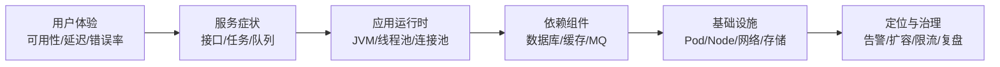
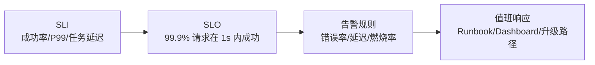
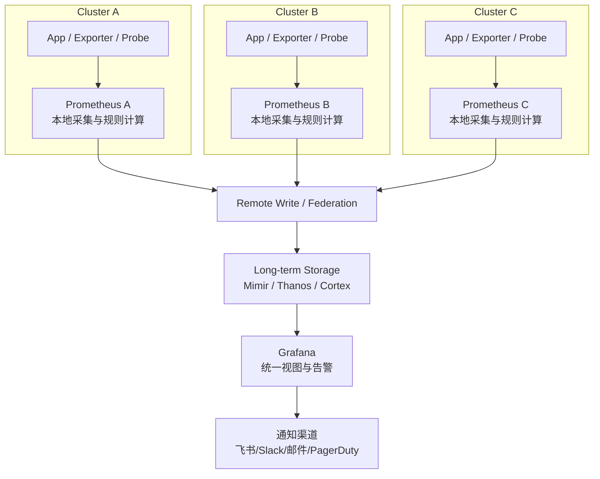
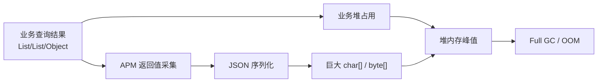
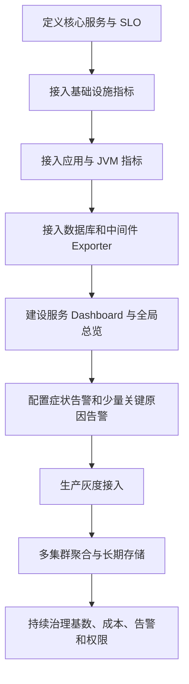

# 面向高并发互联网服务的可观测性体系建设：Prometheus 与 Grafana 架构实践

> 对高并发互联网服务而言，监控不是“上线之后再补一个大屏”，而是生产系统稳定性的一部分。
>
> 本文从技术负责人和架构师视角，讨论为什么 Prometheus 与 Grafana 会成为服务监控体系中的常见组合，如何用它们建设多集群、高并发场景下的可观测平台，以及接入监控后必须治理的性能、成本、安全和告警噪声问题。

---

## 一、先说结论

Prometheus 与 Grafana 的价值，不只是把指标画成图，而是帮助团队建立一套稳定性工程闭环：



一套成熟的监控体系需要同时回答五个问题：

| 问题 | 说明 |
|------|------|
| 为什么监控 | 在用户感知前发现风险，在故障中缩短定位路径，在故障后用数据复盘 |
| 为什么选择 Prometheus + Grafana | Prometheus 做指标事实源，Grafana 做统一可视化和协作入口 |
| 监控什么 | 入口、接口、JVM、数据库、中间件、集群资源、业务链路 |
| 如何科学告警 | 基于 SLO、错误率、延迟和用户影响，而不是对所有资源抖动报警 |
| 如何避免副作用 | 治理大对象序列化、标签基数、Exporter 开销、Dashboard 查询压力和告警噪声 |

如果只建设 Dashboard，而不治理指标基数、告警质量和采集开销，监控系统很容易从稳定性工具变成新的复杂度来源。

---

## 二、为什么选择 Prometheus 与 Grafana

高并发服务的监控系统通常有几个硬性要求：数据可信、查询灵活、生态成熟、可多集群扩展、成本可控，并且能被研发、SRE、架构师和管理者共同理解。

Prometheus 与 Grafana 的组合之所以被广泛采用，是因为它们分别解决了两个核心问题：

- **Prometheus**：负责指标采集、存储、查询、规则计算和告警触发，是指标事实源。
- **Grafana**：负责多数据源可视化、Dashboard 组织、交互式下钻和协作共享，是可观测入口。

### 2.1 选型收益

| 维度 | Prometheus + Grafana 的优势 | 实际收益 |
|------|-----------------------------|----------|
| 云原生适配 | 与 Kubernetes 服务发现、Exporter 生态天然契合 | 快速覆盖 Pod、Node、Ingress、应用和中间件 |
| 指标模型清晰 | 基于时间序列和标签建模 | 可按服务、环境、集群、版本、实例聚合分析 |
| 查询能力强 | PromQL 支持 rate、histogram、聚合和规则计算 | 能计算错误率、P99、饱和度、SLO 燃烧率 |
| 生态成熟 | 社区 Exporter、Dashboard、告警规则丰富 | 降低建设成本，减少重复造轮子 |
| 可视化灵活 | Grafana 支持变量、面板、目录、链接和多数据源 | 降低排障和跨团队沟通成本 |
| 开放标准 | 可与 OpenTelemetry、Loki、Tempo、Mimir、Thanos 协同 | 避免供应商锁定，方便长期演进 |
| 成本可控 | 可自建，也可按规模演进到云服务或企业版 | 初期投入低，后续按规模治理 |

### 2.2 市场定位

Prometheus 的市场定位是云原生指标监控事实标准。它适合采集和计算低基数、可聚合、可告警的时间序列指标。

Grafana 的市场定位是开放可观测数据的统一可视化入口。它不替代 Prometheus，而是把 Prometheus、日志系统、Trace 系统、数据库和其他数据源统一呈现，让不同角色能够围绕同一组事实协作。

二者的合理分工是：

| 能力 | Prometheus | Grafana |
|------|------------|---------|
| 指标采集 | 主要负责 | 不负责 |
| 时间序列存储 | 本地 TSDB / Remote Write | 通过数据源查询 |
| 查询计算 | PromQL | 调用数据源查询能力 |
| 告警规则 | Alerting Rules / Alertmanager | Unified Alerting / 通知策略 |
| 可视化 | 基础表达 | 核心能力 |
| 协作与共享 | 较弱 | 核心能力 |

### 2.3 它们不是万能工具

专业可观测体系不应该把所有数据都塞进 Prometheus。指标、日志、Trace、Profile 各有边界。

| 数据类型 | 适合承载的信息 | 典型工具 | 使用边界 |
|----------|----------------|----------|----------|
| Metrics | 聚合指标、趋势、告警、SLO | Prometheus / Mimir / Thanos | 低基数、可聚合、可长期趋势分析 |
| Logs | 异常上下文、审计记录、高维明细 | Loki / Elasticsearch | 适合高基数文本，不适合做高频聚合告警 |
| Traces | 单次请求链路、跨服务耗时 | Tempo / Jaeger | 适合请求级定位，不适合替代指标趋势 |
| Profiles | CPU、内存、锁竞争、热点函数 | Pyroscope / async-profiler | 适合代码级性能分析 |

一个常见错误是把 `requestId`、`userId`、完整 URL、SQL 原文放进 Prometheus 标签。这样会导致时间序列数量膨胀，最终拖慢 Prometheus 和 Grafana。

---

## 三、科学监控：从“看机器”到“看用户影响”

服务监控不是指标越多越专业，而是要围绕用户影响建立分层模型。

### 3.1 四个黄金信号

| 信号 | 含义 | 示例 |
|------|------|------|
| Latency | 请求耗时 | P95/P99 响应时间、任务完成延迟 |
| Traffic | 流量 | QPS、请求量、任务量、消息量 |
| Errors | 错误 | 5xx、异常率、任务失败率、超时率 |
| Saturation | 饱和度 | CPU、内存、线程池、连接池、队列积压 |

对于在线服务，最重要的不是 CPU 是否高，而是用户是否真的受到影响。CPU 高但服务稳定，不一定需要半夜叫醒人；错误率升高、P99 超过 SLO、核心任务积压，才是更接近用户痛感的信号。

### 3.2 RED、USE 与 SLO

请求类服务适合使用 RED 方法：

| 方法 | 关注点 | 示例指标 |
|------|--------|----------|
| Rate | 请求速率 | `http_requests_total` |
| Errors | 错误数或错误率 | 5xx、异常、超时 |
| Duration | 耗时分布 | `http_request_duration_seconds_bucket` |

资源类对象适合使用 USE 方法：

| 方法 | 关注点 | 示例对象 |
|------|--------|----------|
| Utilization | 使用率 | CPU、内存、磁盘、连接池 |
| Saturation | 饱和度 | 队列长度、线程池排队、连接等待 |
| Errors | 错误数 | IO 错误、拒绝数、连接失败 |

告警应围绕 SLI/SLO 设计：



Prometheus 官方实践也强调：告警应优先面向症状，而不是穷举所有可能原因。原因类指标更适合进入 Dashboard，用于定位和解释。

---

## 四、多集群高并发场景下的监控架构

单集群、小规模系统可以用一个 Prometheus 抓取所有指标。但在多集群、高并发、高服务数量场景下，单 Prometheus 会面临抓取目标过多、时间序列过多、查询变慢、单点故障和跨集群网络不稳定等问题。

更合理的架构是：**本地采集、全局聚合、长期存储、统一展示、分层告警**。



### 4.1 架构原则

| 原则 | 说明 |
|------|------|
| 本地自治 | 每个集群有本地 Prometheus，避免跨集群网络影响基础告警 |
| 全局聚合 | 跨集群趋势、容量和稳定性视图进入长期存储 |
| 分层告警 | 本地告警负责快速发现，全局告警负责业务和 SLO 聚合 |
| Dashboard 分层 | 全局总览看用户影响，服务视图看运行时，依赖视图看根因 |
| 成本治理 | 长期数据预聚合或降采样，避免原始指标无限增长 |

### 4.2 标签体系是地基

多集群监控能否聚合，取决于标签是否统一。

| 标签 | 示例 | 用途 |
|------|------|------|
| `env` | prod / staging | 区分环境 |
| `region` | cn-shanghai / us-east | 区分地域 |
| `cluster` | prod-a / prod-b | 区分集群 |
| `namespace` | order / payment | 区分命名空间 |
| `service` | order-api | 区分服务 |
| `role` | base / query / worker | 区分运行角色 |
| `lane` | stable / canary | 区分泳道 |
| `instance` | pod 或实例名 | 定位实例 |

不要把用户 ID、请求 ID、Trace ID、SQL 原文、完整 URL、文件名、动态任务 ID 作为指标标签。Prometheus 的性能瓶颈通常不是单个指标值，而是标签组合形成的时间序列数量。

---

## 五、监控对象应该怎么组织

监控对象不建议按“工具清单”组织，而应按故障定位路径组织：入口层、服务层、运行时、依赖层、资源层、业务链路。

| 监控层级 | 核心关注点 | 代表性指标 | 典型告警 | 设计要点 |
|----------|------------|------------|----------|----------|
| 域名与入口层 | 用户是否能访问系统 | DNS、证书、HTTP 状态码、外部探测、Ingress/LB 5xx | 域名不可解析、证书即将过期、外部探测失败、入口 5xx 升高 | 最接近用户，应作为症状告警第一入口 |
| 服务接口层 | 服务是否稳定响应 | QPS、错误率、P95/P99、状态码、限流数、超时数 | 核心接口错误率升高、P99 恶化、请求超时 | 使用 RED 方法，路由标签必须归一化 |
| JVM 运行时层 | Java 进程是否稳定 | Heap/Old Gen、GC、Full GC、线程数、Direct Memory、OOM、重启 | Old Gen 高水位、Full GC 频繁、Pod OOMKilled | 必须与 QPS、错误率、P99、下游依赖同屏分析 |
| 数据库层 | 数据库和应用访问方式是否健康 | 活跃连接、连接池等待、慢查询、锁等待、主从延迟、错误数 | 连接池耗尽、慢查询突增、SQL 超时、主从延迟过高 | 同时看数据库自身指标和应用侧连接池指标 |
| 中间件层 | 缓存、队列、搜索是否拖慢主链路 | Redis 命中率/eviction/slowlog，MQ 堆积/死信，搜索 rejected/shard 状态 | Redis 慢查询、MQ 积压、搜索线程池拒绝 | 中间件告警要关联到受影响服务 |
| 数据查询链路层 | 高并发查询是否造成资源放大 | 查询成功率、P99、大查询数量、返回行数/字节数、序列化耗时 | 大查询突增、结果过大、序列化耗时异常 | 对大结果集服务尤其关键，可提前发现 OOM 风险 |
| 业务链路层 | 技术异常是否影响业务结果 | 任务成功率、导出完成量、队列延迟、租户级资源占用 | 核心任务失败率升高、业务延迟超 SLO | 用来连接技术指标和业务影响 |

Dashboard 也应按这个路径设计：全局总览看少量关键症状指标，服务视图展开运行时和依赖细节，专项视图再展示诊断指标。不要把所有指标放到一张大屏里。

---

## 六、监控系统不能反噬业务系统

监控本身也是代码、网络请求、存储写入和查询负载。接入监控之后，最大的风险不是“没有数据”，而是监控系统在无意中改变了业务系统的资源模型。

### 6.1 大对象序列化风险

在 Java 服务中，APM、日志、Trace、审计和异常处理都可能采集方法入参、返回值或上下文。如果监控组件对大对象做完整 JSON 序列化，例如完整 DataFrame、ResultSet 包装对象、几十万行返回结果、大 List/Map，就可能在堆上额外创建巨大的 `char[]` 或 `byte[]`，导致内存瞬间暴涨。



治理原则是：监控只记录摘要，不记录完整大对象。返回值采集应默认关闭，按需白名单开启；对集合、字符串、数组设置最大长度；对 DataFrame、ResultSet、大 DTO 加黑名单；日志只记录 rows、columns、bytes、costMs、hash 等摘要。

推荐写法：

```text
query_result_summary viewId=xxx rows=12000 columns=18 bytes=25MB costMs=31020 sqlHash=abc123
```

不推荐写法：

```text
query_result={完整 JSON rows...}
```

### 6.2 标签基数与查询压力

Prometheus 的每一个“指标名 + 标签组合”都会形成一条时间序列。

错误示例：

```text
http_requests_total{route="/api/orders/123", user_id="u-001", request_id="abc"}
```

正确示例：

```text
http_requests_total{route="/api/orders/{id}", method="GET", status="200"}
```

高基数字段应该放到日志或 Trace，不应该放到指标标签。否则会导致 Prometheus 内存升高、TSDB 写入压力上升、Grafana 查询变慢、告警规则计算超时和远程存储成本上升。

### 6.3 常见反噬风险与治理方式

| 风险 | 典型表现 | 后果 | 治理方式 |
|------|----------|------|----------|
| Exporter 开销 | scrape 太频繁、Exporter 查询数据库太重 | 应用或依赖被监控流量拖慢 | 调整 scrape 间隔，指标提前缓存，避免 scrape 触发复杂查询 |
| Dashboard 压力 | 面板多、时间范围长、刷新快、变量扫全量标签 | Grafana 和 Prometheus 查询压力升高 | 分层 Dashboard，使用 recording rules，限制刷新频率 |
| 告警噪声 | 原因类告警过多、阈值过敏、重复告警 | 值班疲劳，真正故障被淹没 | 症状优先、`for` 过滤、聚合抑制、分级路由 |
| 数据安全 | URL、SQL、Token、租户信息进入指标或日志 | 敏感信息暴露，权限越界 | 脱敏、最小权限、禁止敏感标签、生产 Dashboard 只读 |
| 存储成本 | 指标多、标签高基数、保留周期长 | 远程存储成本持续上升 | 指标分级、降采样、预聚合、清理低价值指标 |
| 接入变更 | Agent 不兼容、字节码增强、Collector 配置错误 | 启动失败、性能下降、数据丢失 | 测试/预发验证，生产灰度，保留回滚开关 |

监控接入不能只看“数据有没有上来”，还要看业务性能有没有变化、监控系统压力有没有变化、告警是否可执行。

---

## 七、落地方法：从接入到治理

### 7.1 接入前评估

接入前先回答这些问题：

| 评估项 | 需要确认的问题 |
|--------|----------------|
| 核心链路 | 哪些用户路径和服务是 P0/P1？ |
| 指标边界 | 哪些指标用于告警，哪些只用于排查？ |
| 标签设计 | 是否存在 userId、requestId、SQL、动态 URL 等高基数标签？ |
| 性能影响 | scrape 间隔、Agent、Exporter 是否会增加 CPU、内存、GC 或连接压力？ |
| 安全风险 | 是否会采集请求体、响应体、Token、Cookie、SQL 原文？ |
| Dashboard | 是否需要 recording rules 预聚合重查询？ |
| 告警责任 | 告警由谁处理，Runbook 在哪里？ |
| 回滚方案 | 接入失败或性能异常时如何关闭采集或回滚规则？ |

### 7.2 建设顺序



这条路径的重点是：先定义服务目标，再接入指标；先灰度验证，再扩大范围；先保证告警质量，再追求覆盖率。

### 7.3 Dashboard 与告警设计

Dashboard 建议按四层组织：

| 层级 | 面向对象 | 内容 |
|------|----------|------|
| 全局总览 | 技术负责人 / 值班人 | SLO、错误率、P99、集群健康 |
| 集群视图 | SRE / 平台团队 | Node、Pod、Ingress、资源水位 |
| 服务视图 | 研发团队 | 接口、JVM、线程池、依赖 |
| 专项视图 | 问题负责人 | 大查询、导出、缓存、队列、数据库 |

告警建议分级：

| 等级 | 含义 | 示例 | 响应 |
|------|------|------|------|
| P0 | 用户大面积不可用 | 全站 5xx、核心域名不可用 | 立即响应 |
| P1 | 核心能力受损 | 核心接口错误率升高、数据库连接耗尽 | 快速响应 |
| P2 | 有风险但未严重影响用户 | JVM Old Gen 高、队列积压 | 工作时间处理 |
| P3 | 趋势或容量提醒 | 磁盘 70%、证书 14 天过期 | 计划处理 |

一条合格告警至少应包含：告警名称、等级、环境、集群、服务、实例、当前值、阈值、持续时间、Dashboard 链接、Runbook 链接和最近发布信息。

### 7.4 运行期治理

监控资产需要生命周期管理，否则会逐渐变成噪声。

| 治理对象 | 责任要求 | 生命周期动作 |
|----------|----------|--------------|
| 服务监控 | 每个服务有监控 owner | 服务上线、变更、下线时同步维护指标和告警 |
| 告警规则 | 每条告警有处理团队和 Runbook | 长期误报、无人处理、无动作价值的规则定期清理 |
| Dashboard | 每个 Dashboard 有维护人和目标读者 | 无人访问或重复建设的面板合并或下线 |
| 指标规范 | 命名、标签、单位、bucket 统一约束 | 新增高基数指标需要评审 |
| 事故复盘 | 复盘必须回看监控是否有效 | 重大事故后更新 Dashboard、告警和 Runbook |

没有 owner 的监控资产，最终会变成噪声和维护负担。

---

## 八、成熟度模型

| 阶段 | 特征 | 风险 |
|------|------|------|
| L0 无监控 | 靠用户反馈和人工查日志 | 发现晚、定位慢 |
| L1 基础监控 | 有机器和服务存活指标 | 只能看现象 |
| L2 服务监控 | 有接口、JVM、中间件指标 | 可定位大部分故障 |
| L3 SLO 监控 | 告警围绕用户影响和 SLO | 告警更少但更准 |
| L4 多集群观测 | 支持跨集群聚合、下钻、长期存储 | 支撑复杂架构 |
| L5 可观测治理 | 指标、日志、Trace、Profile 协同，并治理成本 | 监控成为工程能力 |

多数团队在完成 L2 到 L3 后，应继续向 L4 和 L5 演进：多集群统一视图、SLO 驱动告警、监控成本治理、APM 大对象治理和可观测数据分层。

---

## 九、结语

Prometheus 与 Grafana 的价值，不只是提供图表，而是帮助团队建立一套可验证、可追溯、可演进的稳定性工程体系。

对多集群、高并发、依赖复杂的互联网服务来说，专业可观测体系应坚持几个原则：

- 从用户体验出发，而不是从机器指标出发；
- Prometheus 做指标事实源，Grafana 做统一分析入口；
- 指标、日志、Trace、Profile 各司其职；
- Dashboard 分层设计，告警基于 SLO 和用户影响；
- 多集群监控采用本地采集、全局聚合、长期存储；
- 严格治理标签基数、Dashboard 查询压力、Exporter 开销和存储成本；
- 禁止监控系统对大对象做无约束序列化，避免监控反噬业务服务；
- 将安全脱敏、权限控制、灰度接入、回滚方案和 owner 机制纳入工程规范。

最终，监控体系的目标不是“看起来很完整”，而是：

> 在故障发生前看见趋势，在故障发生时快速定位，在故障结束后能用数据复盘，并且监控本身不成为新的风险源。

---

## 参考资料

- Prometheus 官方文档：<https://prometheus.io/docs/>
- Prometheus Alerting Practices：<https://prometheus.io/docs/practices/alerting/>
- The Zen of Prometheus：<https://prometheus.io/docs/practices/the_zen/>
- Grafana 官方文档：<https://grafana.com/docs/grafana/latest/>
- Grafana Dashboards：<https://grafana.com/docs/grafana/latest/dashboards/>
- Grafana OSS：<https://grafana.com/oss/>
