# SaaS 系统设计的本质：从多租户到高稳定性分布式工程治理

> SaaS 不只是多租户，不只是分库分表和高 QPS。它的本质是横向扩缩能力、技术稳定性、边缘节点与核心节点的高负载治理，以及数据最终一致性等一系列分布式工程问题的系统解决方案。
>
> 本文从架构师视角，拆解如何真正做好一个 SaaS 软件——从租户隔离、弹性伸缩、一致性模型、协同编辑，到平台化治理与 SLO 体系，给出完整的思考框架与工程实践。

---

## 一、先说结论：SaaS 的本质不是技术堆砌

很多工程师对 SaaS 的第一反应是：分库分表 + 多租户权限 + Kubernetes 扩缩容。

这个认知是正确的，但只触及了皮毛。

真正的 SaaS 工程挑战在于：

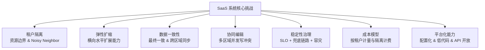

本文的核心主张：

| 层次 | 初级认知 | 升维认知 |
|------|----------|----------|
| 多租户 | 分库分表、Row-Level Security | 定义租户资源边界与成本模型，解决 Noisy Neighbor |
| 高并发 | 调优单点性能、Redis 缓存 | 定义 SLO + 设计兜底链路 + 降级策略 |
| 数据一致性 | 分布式事务 | 选择合适的一致性模型，业务可接受的最终一致边界 |
| 协同编辑 | 加锁 | OT/CRDT 算法 + 版本向量 + 冲突解决策略 |
| 稳定性 | 监控告警 | SLO 定义 + 错误预算 + 自动降级 + 混沌工程 |

---

## 二、租户隔离：不只是分库，是资源边界的定义

### 2.1 三种隔离模型的选择

SaaS 系统租户隔离有三种主流方案，没有绝对最优解，只有与业务契合度：

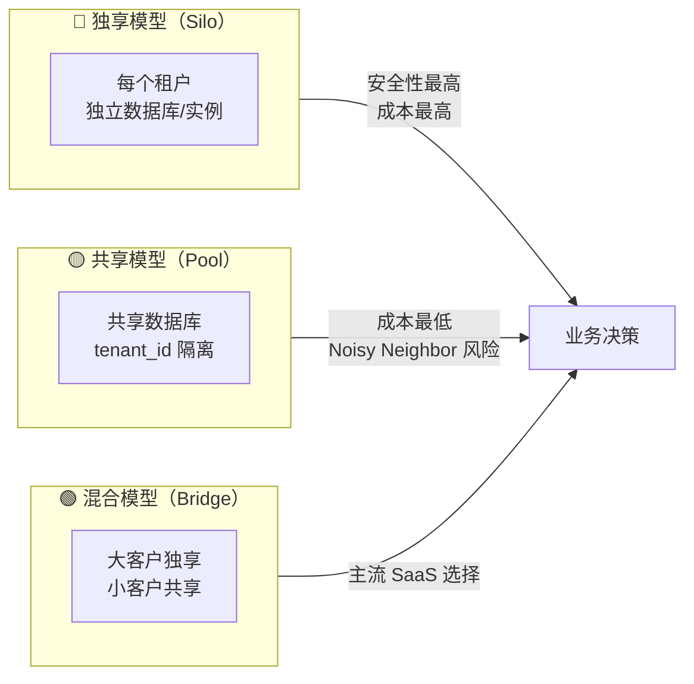

| 维度 | Silo（独享） | Pool（共享） | Bridge（混合） |
|------|-------------|-------------|--------------|
| 数据隔离性 | ⭐⭐⭐⭐⭐ | ⭐⭐ | ⭐⭐⭐⭐ |
| 资源利用率 | ⭐ | ⭐⭐⭐⭐⭐ | ⭐⭐⭐⭐ |
| 成本 | 高 | 低 | 中 |
| Noisy Neighbor | 无 | 严重 | 可控 |
| 运维复杂度 | 极高 | 低 | 中 |
| 适用场景 | 金融/医疗/政企 | 消费级 SaaS | 企业级 SaaS 主流 |

### 2.2 Noisy Neighbor 的工程解法

共享模型最大的风险是 Noisy Neighbor——某个租户占用大量资源导致其他租户受影响。

**核心解法：在每一个资源维度上都要有"租户维度的限额"**

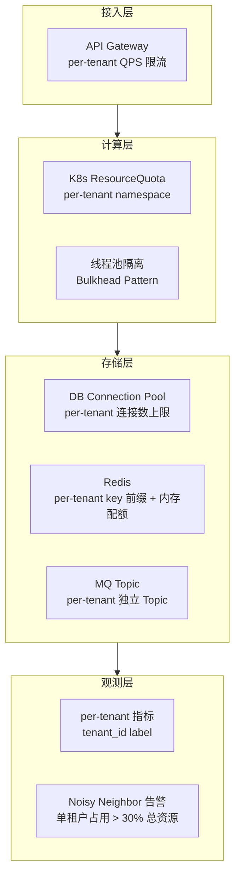

**实战举例：**

```yaml
# K8s ResourceQuota 按租户 namespace 限额
apiVersion: v1
kind: ResourceQuota
metadata:
  name: tenant-quota
  namespace: tenant-acme
spec:
  hard:
    requests.cpu: "4"
    requests.memory: 8Gi
    limits.cpu: "8"
    limits.memory: 16Gi
    pods: "50"
```

```java
// 线程池隔离：每个租户独立线程池（Bulkhead）
@Bean
public Map<String, ThreadPoolExecutor> tenantExecutorMap() {
    // 大客户：独享线程池
    ThreadPoolExecutor premiumPool = new ThreadPoolExecutor(20, 50, ...);
    // 普通客户：共享线程池
    ThreadPoolExecutor standardPool = new ThreadPoolExecutor(5, 20, ...);
    return Map.of("PREMIUM", premiumPool, "STANDARD", standardPool);
}
```

### 2.3 租户计费与成本模型

SaaS 平台真正的商业护城河在于"按用量精确计费"，这需要在工程层面做到**租户级资源计量**：

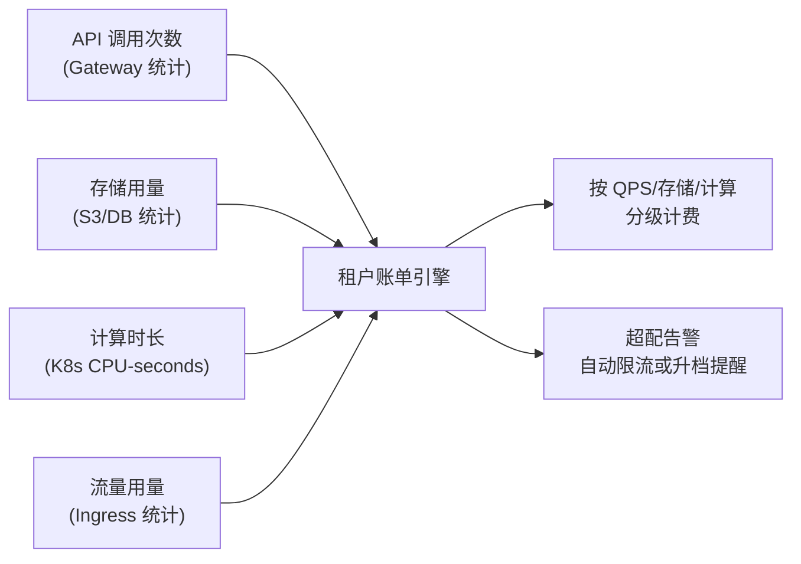

---

## 三、横向弹性扩缩：不是"加机器"，是"系统具备弹性"

### 3.1 弹性扩缩的层次模型

真正的弹性扩缩不是人工扩容，而是系统在流量变化时**自动、快速、无损**地调整资源。

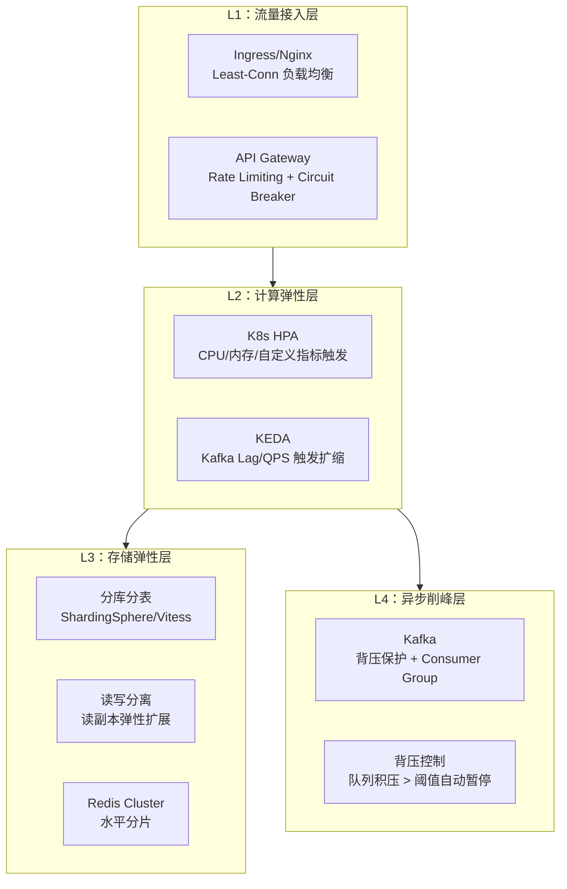

### 3.2 无状态化：弹性扩缩的前提

**弹性扩缩最大的障碍是有状态服务。** 只有无状态服务才能真正做到水平扩展。

| 状态类型 | 有状态问题 | 解耦方案 |
|----------|-----------|----------|
| 用户 Session | 强绑定单节点 | JWT 无状态 Token / Redis 集中存储 Session |
| 本地缓存 | 节点间数据不一致 | 本地缓存 + Redis L2 双级缓存，接受短暂不一致 |
| 文件上传 | 上传到本地磁盘 | 直传 OSS/S3，服务层无状态 |
| 定时任务 | 多节点重复执行 | 分布式调度（XXL-Job / Elastic-Job），任务状态外置 |
| WebSocket 长连接 | 推送路由绑定节点 | 引入消息总线（Redis Pub/Sub / Kafka），节点间消息路由 |

### 3.3 KEDA：基于业务指标的弹性扩缩

Kubernetes 原生 HPA 基于 CPU/内存，对于 SaaS 系统远远不够。KEDA（Kubernetes Event Driven Autoscaling）可以基于业务指标触发扩缩：

```yaml
# 基于 Kafka Consumer Lag 自动扩缩 Worker
apiVersion: keda.sh/v1alpha1
kind: ScaledObject
metadata:
  name: task-worker-scaler
  namespace: saas-platform
spec:
  scaleTargetRef:
    name: task-worker
  minReplicaCount: 2
  maxReplicaCount: 50
  triggers:
  - type: kafka
    metadata:
      bootstrapServers: kafka:9092
      consumerGroup: task-worker-group
      topic: saas-task-queue
      lagThreshold: "1000"     # 积压 1000 条/副本时触发扩容
      activationLagThreshold: "100"
```

---

## 四、边缘节点与核心节点：高负载下的稳定性架构

### 4.1 核心链路 vs 非核心链路的定义

SaaS 系统第一步是将所有接口分层：

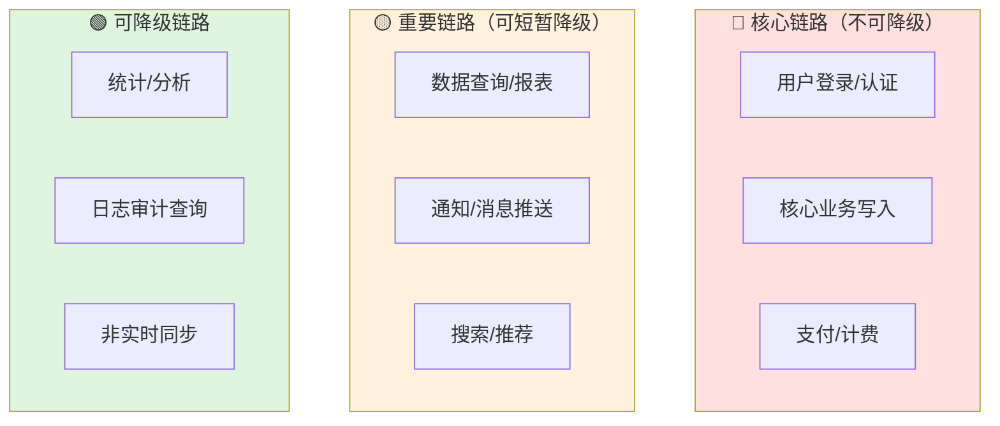

**工程实践：每条链路都要有 SLO 定义和降级预案**

```yaml
# SLO 配置示例（伪代码，可存入配置中心）
slo_config:
  user_login:
    availability: "99.99%"
    latency_p99: "200ms"
    fallback: "返回 503，展示维护页"  # 核心链路只能 fail-fast，不能降级
  
  report_query:
    availability: "99.9%"
    latency_p99: "2000ms"
    fallback: "返回缓存数据 + 提示'数据更新中'"  # 可降级
  
  notification:
    availability: "99%"
    latency_p99: "5000ms"
    fallback: "静默丢弃，异步补偿"  # 可降级
```

### 4.2 API 网关的降级兜底

API 网关不只是限流，更是降级兜底的核心组件：

```mermaid
sequenceDiagram
    participant Client
    participant Gateway
    participant Service
    participant Fallback["兜底数据源<br/>(Redis/静态)"]
    
    Client->>Gateway: 请求
    Gateway->>Gateway: 限流检查（per-tenant QPS）
    
    alt 服务正常
        Gateway->>Service: 转发请求
        Service-->>Gateway: 正常响应
    else 服务熔断（错误率 > 50%）
        Gateway->>Fallback: 读取兜底数据
        Fallback-->>Gateway: 静态/缓存数据
        Gateway-->>Client: 降级响应 + 降级标记
    else 超出 QPS 配额
        Gateway-->>Client: 429 Too Many Requests\n+ Retry-After 头
    end
```

```java
// Spring Cloud Gateway + Sentinel 降级配置
@Bean
public SentinelGatewayFilterFactory sentinelGatewayFilter() {
    return new SentinelGatewayFilterFactory();
}

// 降级处理器：熔断时返回兜底数据
@Component
public class GatewayFallbackHandler implements WebExceptionHandler {
    @Override
    public Mono<Void> handle(ServerWebExchange exchange, Throwable ex) {
        if (ex instanceof DegradeException) {
            // 从 Redis 读取最近一次缓存响应
            return serveCachedResponse(exchange);
        }
        return Mono.error(ex);
    }
}
```

### 4.3 边缘节点：CDN + Edge Computing

对于全球化 SaaS，边缘节点承担请求就近处理的职责：

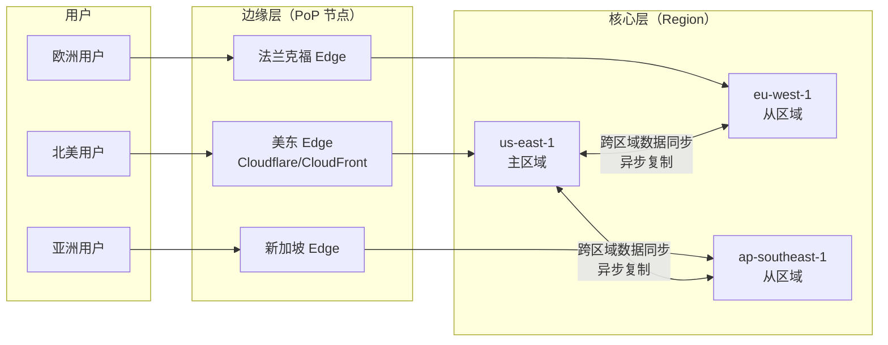

**边缘层职责：**
- 静态资源缓存（CSS/JS/图片）
- API 响应缓存（GET 类接口，TTL 30s~5min）
- 请求鉴权（JWT 验证，无需打穿到核心层）
- DDoS 防护和流量清洗

**核心层职责：**
- 写操作处理（单主或多主 + 冲突解决）
- 强一致性读（需要最新数据时）
- 业务逻辑处理
- 跨区域数据同步

---

## 五、数据最终一致性：选对模型比技术更重要

### 5.1 一致性模型谱系

CAP 定理告诉我们，分布式系统无法同时满足一致性（C）、可用性（A）、分区容错性（P）。在 SaaS 系统中，选择合适的一致性模型是架构决策的核心：

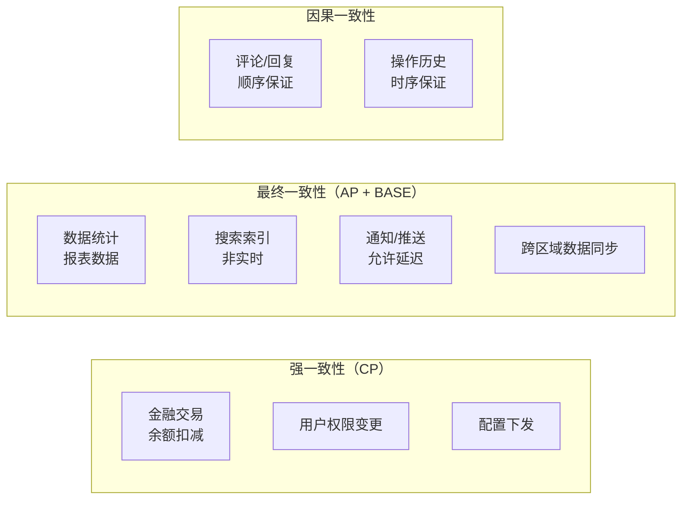

**关键原则：不要过度追求强一致性，80% 的业务场景最终一致性就足够。**

### 5.2 最终一致性的工程实现

**方案一：Outbox Pattern（事务性发件箱）**

解决本地事务与消息发送的原子性问题：

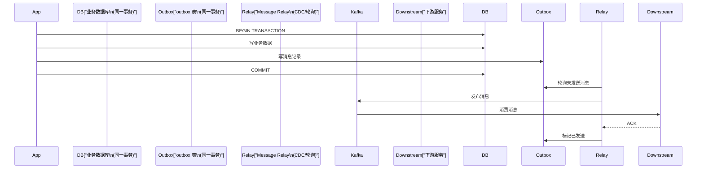

```sql
-- outbox 表设计
CREATE TABLE outbox_events (
    id          BIGINT PRIMARY KEY AUTO_INCREMENT,
    event_id    VARCHAR(36) NOT NULL UNIQUE,  -- 幂等性保证
    tenant_id   BIGINT NOT NULL,
    event_type  VARCHAR(100) NOT NULL,         -- e.g. 'ORDER_CREATED'
    payload     JSON NOT NULL,
    status      ENUM('PENDING','SENT','FAILED') DEFAULT 'PENDING',
    created_at  DATETIME NOT NULL,
    sent_at     DATETIME,
    retry_count INT DEFAULT 0,
    INDEX idx_status_created (status, created_at)
);
```

**方案二：Saga 模式（分布式长事务）**

对于跨服务的业务流程，用 Saga 替代分布式事务：

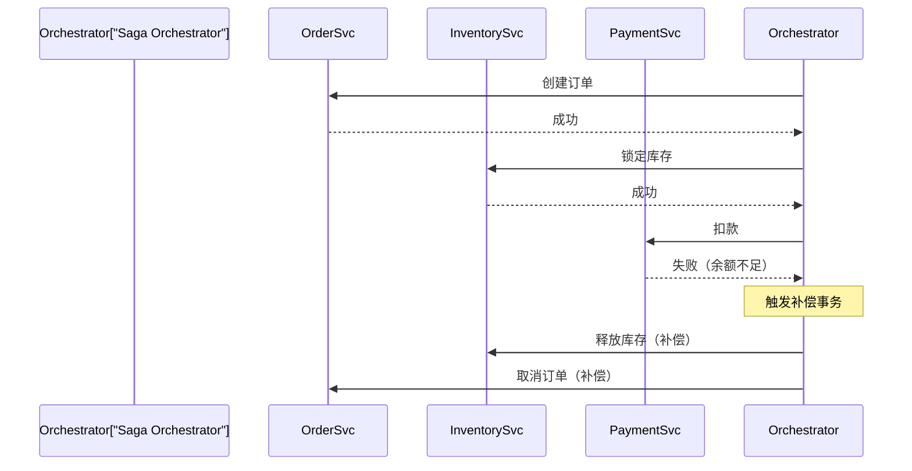

### 5.3 跨区域数据同步的一致性保障

SaaS 多区域部署时，跨区域数据同步是最复杂的一致性问题：

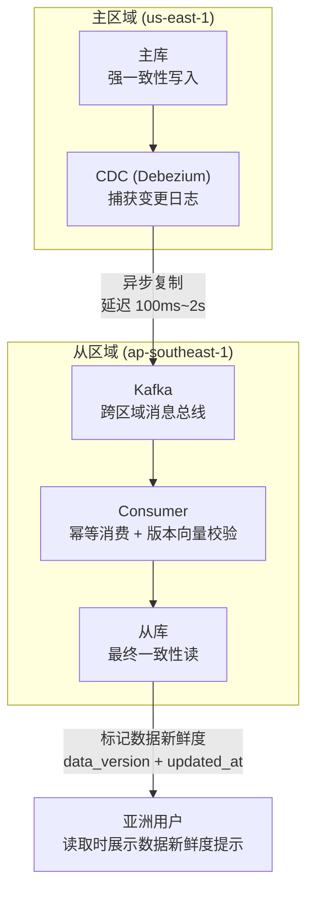

**关键设计要点：**

1. **版本向量（Version Vector）**：每条数据附带版本号，用于检测和解决冲突
2. **幂等消费**：Consumer 基于 `event_id` 去重，保证消息重复投递不影响结果  
3. **数据新鲜度标记**：从区域读取时，附带 `data_lag_ms` 字段，前端可展示"数据可能有 Xs 延迟"

---

## 六、多区域协同编辑：OT 与 CRDT 的工程选择

### 6.1 协同编辑的核心问题

多用户/多区域同时编辑同一文档，本质上是**并发写冲突解决**问题：

```
场景：用户A（北京）和用户B（纽约）同时编辑同一文档

初始状态："Hello World"

用户A 在位置 5 插入 "," → "Hello, World"
用户B 在位置 5 删除 " " → "HelloWorld"

两个操作同时到达服务端，哪个优先？合并后是什么？
```

### 6.2 OT（Operational Transformation）

OT 是 Google Docs 采用的算法，核心思想是**对并发操作进行变换，使其在不同节点以不同顺序应用后得到相同结果**。

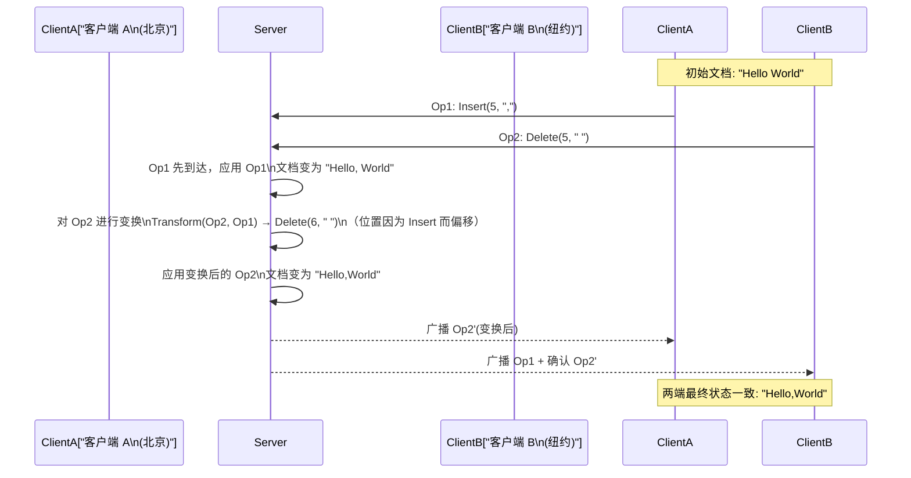

**OT 的局限性：**
- 需要中心化服务器协调操作顺序
- 算法实现复杂，边界情况多
- 不适合离线场景和去中心化架构

### 6.3 CRDT（Conflict-free Replicated Data Types）

CRDT 是更现代的解法，Figma、Notion、Linear 都在使用。核心思想：**数据结构本身保证任意顺序合并后结果一致**。

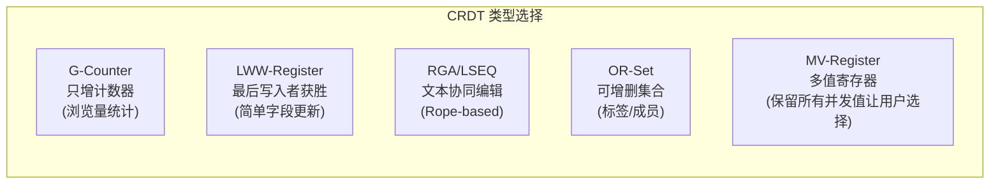

**CRDT 文本编辑示例（RGA 算法）：**

```typescript
// 每个字符都有全局唯一 ID（时间戳 + 节点ID）
interface RGANode {
  id: { timestamp: number; nodeId: string }; // 全局唯一 Lamport 时钟
  value: string;
  deleted: boolean;  // 逻辑删除（tombstone），不物理删除
  prevId: { timestamp: number; nodeId: string } | null;
}

class RGADocument {
  nodes: Map<string, RGANode> = new Map();

  // 插入操作：在 prevId 之后插入字符
  insert(value: string, prevId: string | null, localClock: number): RGANode {
    const node: RGANode = {
      id: { timestamp: localClock, nodeId: getLocalNodeId() },
      value,
      deleted: false,
      prevId: prevId ? parseId(prevId) : null,
    };
    this.nodes.set(nodeKey(node.id), node);
    return node;
  }

  // 删除操作：标记为 tombstone（不物理删除，保留位置信息）
  delete(nodeId: string): void {
    const node = this.nodes.get(nodeId);
    if (node) node.deleted = true;
  }

  // 合并：直接 merge，无需变换，CRDT 天然幂等
  merge(remoteNode: RGANode): void {
    const key = nodeKey(remoteNode.id);
    if (!this.nodes.has(key)) {
      this.nodes.set(key, remoteNode);
    }
    // 如果已存在，tombstone 优先（删除不可撤销）
    if (remoteNode.deleted) {
      this.nodes.get(key)!.deleted = true;
    }
  }
}
```

### 6.4 工程选型建议

| 场景 | 推荐方案 | 理由 |
|------|---------|------|
| 富文本文档编辑（类 Google Docs） | OT + 中心化服务器 | 实现成熟，Yjs/ShareDB 可用 |
| 协同设计工具（类 Figma） | CRDT（RGA/LSEQ） | 离线支持好，去中心化 |
| 简单字段编辑（表单/配置） | LWW-Register CRDT | 实现简单，"最后写入获胜"语义清晰 |
| 多区域同步（延迟 > 200ms） | CRDT | OT 在高延迟下变换链过长 |

**实际工程推荐：使用 [Yjs](https://github.com/yjs/yjs)**

```typescript
import * as Y from 'yjs'
import { WebsocketProvider } from 'y-websocket'

// 服务端：y-websocket 作为同步服务器
// 客户端：直接使用 Yjs CRDT，天然支持离线 + 多端同步
const doc = new Y.Doc()
const provider = new WebsocketProvider(
  'wss://your-saas.com/collaboration',
  `document-${documentId}`,
  doc
)

const yText = doc.getText('content')

// 插入操作（自动处理并发冲突）
yText.insert(0, 'Hello, World!')

// 监听远端变更
yText.observe(event => {
  updateEditor(yText.toString())
})
```

---

## 七、异步削峰与背压控制：消息不丢只是起点

### 7.1 背压（Backpressure）设计

仅仅保证"消息不丢"是远远不够的，更重要的是**系统在过载时的自我保护能力**：

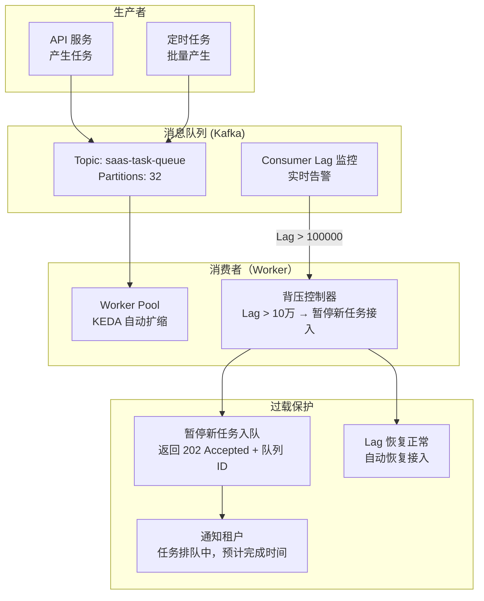

```java
// 背压控制器实现
@Component
public class BackpressureController {
    
    private static final long MAX_QUEUE_LAG = 100_000L;
    
    @Scheduled(fixedDelay = 5000)
    public void checkBackpressure() {
        long currentLag = kafkaLagMonitor.getTotalLag("saas-task-queue");
        
        if (currentLag > MAX_QUEUE_LAG) {
            // 暂停新任务入队：在 Redis 中设置熔断标志
            redisTemplate.opsForValue().set(
                "backpressure:task-queue:paused", 
                "true", 
                Duration.ofMinutes(5)
            );
            alertingService.sendAlert(
                "任务队列积压超过 10 万，已自动暂停新任务接入，当前积压: " + currentLag
            );
        } else if (currentLag < MAX_QUEUE_LAG * 0.5) {
            // 恢复：积压降到 50% 以下才恢复，避免抖动
            redisTemplate.delete("backpressure:task-queue:paused");
        }
    }
    
    public boolean isAcceptingNewTasks() {
        return !"true".equals(redisTemplate.opsForValue().get("backpressure:task-queue:paused"));
    }
}
```

### 7.2 可恢复性 SLA 设计

消息处理失败后，重试策略需要精心设计：

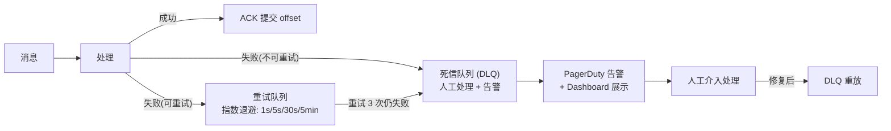

---

## 八、状态与频控：Redis 的正确使用姿势

### 8.1 广告频控：二级缓存 + 业务可接受的短暂超投

频率控制是 SaaS 广告/推送类系统的高频场景，纯 Redis 计数器在高并发下会有性能瓶颈：

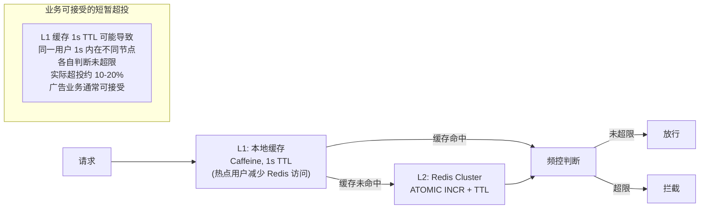

```lua
-- Redis Lua 脚本：原子性频控计数（滑动窗口）
local key = KEYS[1]
local window = tonumber(ARGV[1])  -- 时间窗口（秒）
local limit = tonumber(ARGV[2])   -- 限制次数
local now = tonumber(ARGV[3])     -- 当前时间戳（毫秒）

-- 清理窗口外的旧记录
redis.call('ZREMRANGEBYSCORE', key, 0, now - window * 1000)

-- 当前窗口内的请求数
local count = redis.call('ZCARD', key)

if count < limit then
    -- 未超限：添加本次请求记录
    redis.call('ZADD', key, now, now .. '-' .. math.random(1000000))
    redis.call('EXPIRE', key, window + 1)
    return 1  -- 允许
else
    return 0  -- 拦截
end
```

### 8.2 状态生命周期管理

**Redis 中的状态管理核心原则：每个 Key 都必须有明确的 TTL 和淘汰策略**

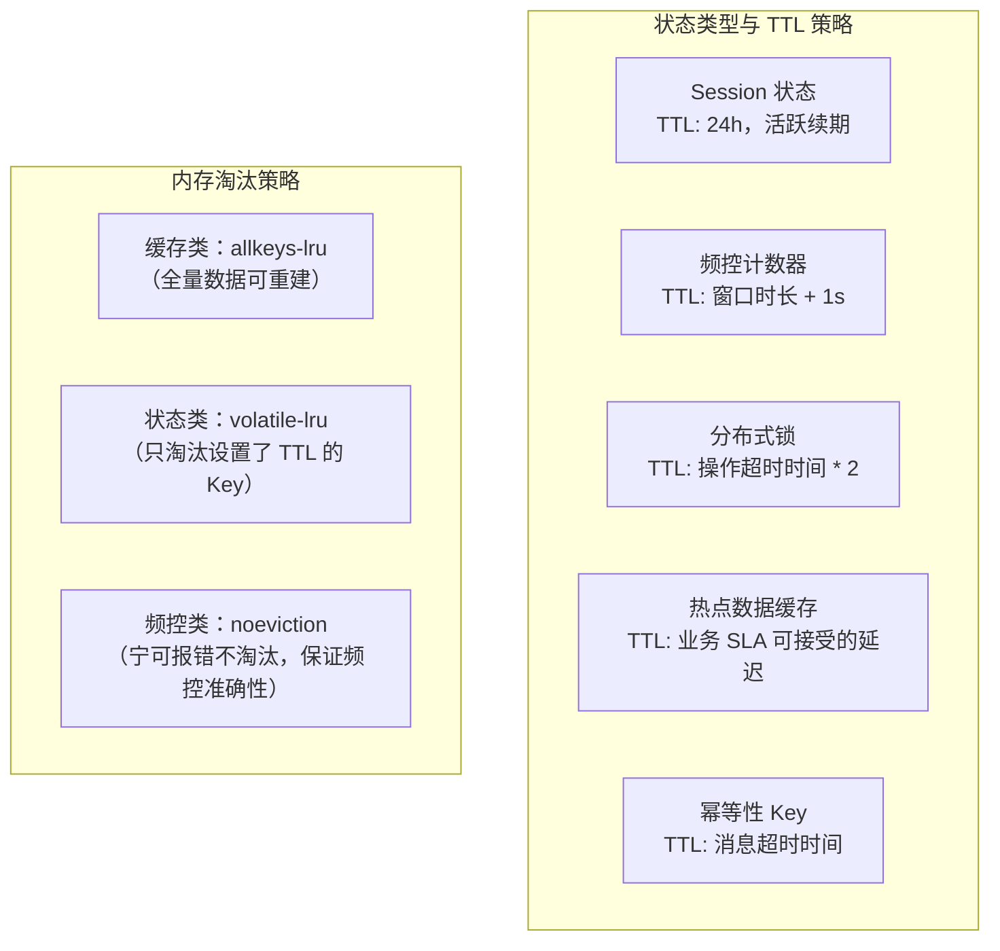

---

## 九、实时流处理：从"跑通 Pipeline"到端到端 SLA

### 9.1 Flink Watermark 与延迟的取舍

Flink 流处理中，Watermark 的设置直接影响结果准确性与延迟之间的平衡，这个决策必须与产品对齐：

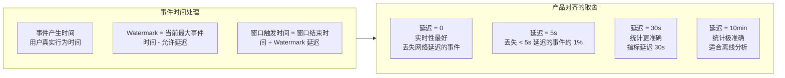

```java
// Flink Watermark 配置示例
DataStream<UserEvent> events = source
    .assignTimestampsAndWatermarks(
        WatermarkStrategy
            .<UserEvent>forBoundedOutOfOrderness(Duration.ofSeconds(5))  // 允许 5s 乱序
            .withTimestampAssigner((event, ts) -> event.getEventTime())
            .withIdleness(Duration.ofSeconds(30))  // 30s 无数据时推进 watermark
    );

// 允许延迟到达的数据（窗口关闭后还能更新结果）
events
    .keyBy(UserEvent::getTenantId)
    .window(TumblingEventTimeWindows.of(Time.minutes(1)))
    .allowedLateness(Time.seconds(10))     // 窗口关闭后再允许 10s 延迟
    .sideOutputLateData(lateTag)           // 超出容忍的延迟数据单独输出
    .aggregate(new TenantEventAggregator())
    .addSink(clickhouseSink);
```

**与产品对齐的模板：**

> "我们的实时统计允许 5 秒的数据延迟，这意味着网络延迟超过 5 秒的用户行为不计入实时数据，但会在 T+1 离线数据中修正。你们觉得这个可以接受吗？"

---

## 十、平台化与业务语义层：让运营不写 SQL

### 10.1 分析型系统的语义层设计

ClickHouse 查得快，但让运营直接写 SQL 是不现实的。**语义层的核心价值是将底层复杂性封装为业务语言**：

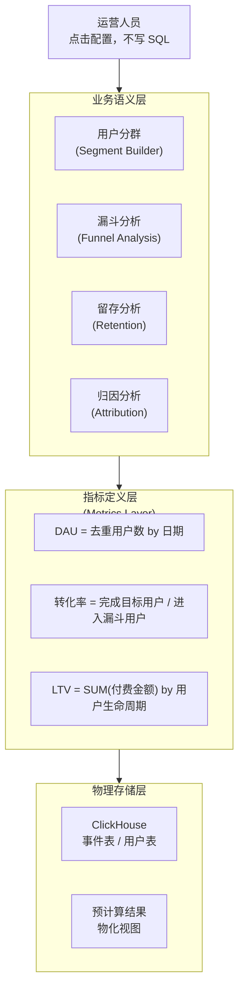

### 10.2 低代码配置化：SaaS 平台化的核心能力

真正的 SaaS 平台化，是让每个租户能**在不修改代码的前提下定制业务逻辑**：

| 配置化能力 | 实现方式 | 典型场景 |
|-----------|---------|---------|
| 工作流配置 | BPMN 引擎（Camunda/Flowable） | 审批流程自定义 |
| 字段扩展 | 动态表单 + EAV 模型 | 租户自定义字段 |
| 规则引擎 | Drools / Easy-Rules | 业务规则配置化 |
| 报表配置 | 低代码 BI（Metabase/DataEase） | 租户自定义看板 |
| API 开放 | OpenAPI + Webhook | 与租户系统集成 |

---

## 十一、SLO 体系与稳定性治理：架构师的主战场

### 11.1 SLO 定义框架

SLO（Service Level Objective）是稳定性工程的核心抓手。定义 SLO 之前，先问三个问题：

1. **用户的核心体验是什么？**（不是技术指标，是用户感知）
2. **什么程度的不可用是不可接受的？**（定义错误预算）
3. **当 SLO 被打破时，谁负责、怎么行动？**（定义 On-call 和响应流程）

```mermaid
flowchart TD
    subgraph SLI["SLI（Service Level Indicators）\n实际度量的指标"]
        I1["可用性：成功请求 / 总请求"]
        I2["延迟：P50/P95/P99"]
        I3["错误率：5xx / 总请求"]
        I4["饱和度：CPU/内存使用率"]
    end
    subgraph SLO["SLO（Service Level Objectives）\n服务水平目标"]
        O1["可用性 SLO：99.9%（允许 43.8min/月 不可用）"]
        O2["延迟 SLO：P99 < 500ms"]
        O3["错误率 SLO：< 0.1%"]
    end
    subgraph EB["Error Budget（错误预算）\n允许消耗的不稳定时间"]
        B1["每月 43.8min 的可用性预算"]
        B2["预算消耗 > 50% → 暂停新功能上线"]
        B3["预算消耗 > 80% → 全力修复稳定性"]
        B4["预算消耗 = 100% → SLA 违约，触发赔付"]
    end
    SLI --> SLO --> EB
```

### 11.2 灰度发布与变更管理

SaaS 系统稳定性的最大杀手是**变更**。完善的变更管理是稳定性的核心：

```mermaid
flowchart LR
    subgraph DEPLOY["发布流程"]
        D1["1% 灰度\n内部员工/测试租户"]
        D2["5% 灰度\n小租户"]
        D3["20% 灰度\n监控指标 30min"]
        D4["100% 全量\n监控指标 1h"]
    end
    subgraph GATE["发布门禁（每步检查）"]
        G1["错误率无明显上升\n基线 + 3σ 以内"]
        G2["P99 延迟无明显上升"]
        G3["无新增告警"]
        G4["核心业务 SLO 达标"]
    end
    subgraph ROLLBACK["回滚策略"]
        R1["一键回滚\n< 5min 完成"]
        R2["流量切回上一版本\nK8s 蓝绿/金丝雀"]
    end
    D1 --> D2 --> D3 --> D4
    GATE -.->|"不满足则暂停"| D1
    GATE -.->|"不满足则暂停"| D2
    GATE -.->|"不满足则暂停"| D3
    ROLLBACK -.->|"异常时触发"| D1
```

### 11.3 混沌工程：主动制造故障

**稳定性不是靠"不出故障"来证明的，而是靠"出了故障能快速恢复"来证明的。**

混沌工程的核心实践：

| 实验类型 | 工具 | 目标 |
|---------|------|------|
| 随机 Pod 杀死 | Chaos Monkey / ChaosBlade | 验证 K8s 自愈能力 |
| 网络延迟注入 | tc-netem / Toxiproxy | 验证超时配置和降级逻辑 |
| 磁盘/内存压力 | stress-ng | 验证资源告警和限流 |
| 数据库连接耗尽 | 人工触发 | 验证连接池配置 |
| 依赖服务不可用 | WireMock / ChaosBlade | 验证熔断和兜底 |

```yaml
# ChaosBlade 实验：对 saas-core 服务注入 100ms 延迟
apiVersion: chaosblade.io/v1alpha1
kind: ChaosBlade
metadata:
  name: delay-saas-core
spec:
  experiments:
  - scope: pod
    target: network
    action: delay
    desc: "注入 100ms 网络延迟验证超时配置"
    matchers:
    - name: names
      value: ["saas-core-*"]
    - name: namespace
      value: ["saas-platform"]
    - name: time
      value: ["100"]   # 100ms 延迟
    - name: percent
      value: ["50"]    # 50% 的流量注入延迟
```

---

## 十二、技术债治理：DDD 与架构取舍

### 12.1 DDD 在 SaaS 系统中的应用

SaaS 系统随着租户增多，业务复杂度会指数级增长。DDD（领域驱动设计）的价值在于**用业务语言组织代码，而不是用技术层次**：

```mermaid
flowchart TD
    subgraph STRATEGIC["战略设计"]
        BC1["租户管理\n(Tenant Context)"]
        BC2["订阅计费\n(Billing Context)"]
        BC3["核心业务\n(Core Domain)"]
        BC4["通知中心\n(Notification Context)"]
        BC1 -.->|"共享内核"| BC3
        BC3 -->|"发布领域事件"| BC4
        BC2 -->|"订阅租户变更"| BC1
    end
    subgraph TACTICAL["战术设计"]
        T1["聚合根\n(Aggregate Root)\n租户 / 订单 / 用户"]
        T2["领域事件\n(Domain Event)\nTenantCreated / OrderPaid"]
        T3["值对象\n(Value Object)\nTenantId / Money / Period"]
        T4["仓储\n(Repository)\n基础设施层"]
    end
```

### 12.2 技术债量化与治理节奏

技术债不治理就会利滚利。工程团队需要建立**技术债量化机制**：

```mermaid
flowchart LR
    subgraph DEBT_TYPES["技术债类型"]
        D1["架构债\n单体 → 微服务拆分"]
        D2["代码债\n重复代码 / 过时 API"]
        D3["测试债\n覆盖率 < 60%"]
        D4["基础设施债\nEOL 版本 / 未打 patch"]
    end
    subgraph GOVERNANCE["治理节奏"]
        G1["每迭代：消灭当次引入的债"]
        G2["每月：处理 1 个高优先级技术债"]
        G3["每季度：技术债专项 Sprint"]
        G4["每年：架构演进专项"]
    end
    subgraph METRIC["量化指标"]
        M1["技术债积压数量趋势"]
        M2["故障中技术债引起的比例"]
        M3["新功能 vs 技术债时间比"]
    end
    DEBT_TYPES --> GOVERNANCE --> METRIC
```

---

## 十三、完整架构总览

将以上所有层次组合成完整的 SaaS 系统架构：

```mermaid
flowchart TD
    subgraph CLIENT["客户端层"]
        WEB["Web App\nReact + WebSocket"]
        MOBILE["Mobile App"]
        API_CLIENT["API 客户端\nSDK / OpenAPI"]
    end
    
    subgraph EDGE["边缘层"]
        CDN["CDN / Edge\n静态缓存 + 鉴权"]
        GW["API Gateway\nQPS 限流 + 熔断 + 降级"]
    end
    
    subgraph COMPUTE["计算层（K8s）"]
        CORE_SVC["核心业务服务\nJava/Go + Spring"]
        COLLAB_SVC["协同编辑服务\nYjs + WebSocket"]
        WORKER["异步 Worker\nKEDA 弹性扩缩"]
        STREAM["实时流处理\nFlink"]
    end
    
    subgraph STORAGE["存储层"]
        MYSQL["MySQL Cluster\n主从 + 分库分表"]
        REDIS["Redis Cluster\n热点数据 + 频控 + Session"]
        KAFKA["Kafka\n事件总线 + 削峰"]
        CLICKHOUSE["ClickHouse\n分析查询"]
        OSS["对象存储\nS3/OSS"]
    end
    
    subgraph OBSERVE["可观测层"]
        PROM["Prometheus\n指标采集"]
        GRAF["Grafana\n可视化 + 告警"]
        TRACE["Jaeger/SkyWalking\n链路追踪"]
    end
    
    subgraph GOVERN["治理层"]
        SLO_SVC["SLO 看板\n错误预算实时消耗"]
        CHAOS["混沌工程\nChaosBlade"]
        RELEASE["发布系统\n灰度 + 一键回滚"]
    end
    
    CLIENT --> EDGE --> COMPUTE --> STORAGE
    COMPUTE --> OBSERVE
    OBSERVE --> GOVERN
```

---

## 十四、八个升维模型的实践总结

回到文章开头的八个模型，现在我们可以给出完整的升维路径：

| 模型 | 技术栈 | 从 → 到 | 核心实践 |
|------|--------|---------|---------|
| 高并发在线系统 | Java/Go、Redis、K8s | 调优单点 → SLO + 兜底链路 | API Gateway 降级兜底 + 错误预算 |
| 异步削峰 | Kafka、Worker Pool | 消息不丢 → 背压 + 可恢复性 SLA | 积压超阈值自动暂停 + DLQ + 重放 |
| 状态与频控 | Redis、Flink State | 存状态 → 状态生命周期 + 一致性边界 | L1+L2 双级缓存 + 业务可接受超投 |
| 实时流处理 | Flink、Kafka | 跑通 pipeline → 端到端延迟 vs 成本 | Watermark 与产品对齐 + 侧输出 |
| 分析型系统 | ClickHouse、Spark | 查得快 → 业务语义层 | 语义层封装 + 低代码 BI |
| 平台化&多租户 | 权限、配置化 | 支持多客户 → 租户资源边界 + 成本模型 | Noisy Neighbor 治理 + 按用量计费 |
| 交互与能力交付 | React、WebSocket | 前端展示 → 人机协同工作流 | CRDT 协同编辑 + 操作历史 |
| 技术治理 | SLO、灰度、DDD | 局部优化 → 架构取舍 + 风险兜底 | 混沌工程 + 技术债量化 + 灰度发布 |

---

## 十五、写在最后：做好 SaaS 的核心思维

做好一个 SaaS 系统，技术只是 50%，另外 50% 是思维方式的转变：

**1. 从"做功能"到"定义边界"**

每个技术决策都要问：这个东西的边界在哪里？租户的资源边界、数据的一致性边界、服务的可用性边界。没有边界的系统是不可运营的。

**2. 从"不出故障"到"快速恢复"**

故障是必然发生的。MTTR（平均恢复时间）比 MTBF（平均故障间隔）更重要。系统设计要首先考虑：出了故障怎么办？

**3. 从"技术正确"到"业务可接受"**

最终一致性不是技术选择，是业务决策。数据延迟多少秒可以接受？偶发的短暂超投业务能不能容忍？这些问题需要和产品、业务对齐，而不是技术单方面决定。

**4. 从"解决问题"到"定义问题"**

架构师最大的价值不是给出解决方案，而是帮助团队定义正确的问题。多租户隔离不是一个技术问题，是一个业务模型问题；数据一致性不是一个分布式算法问题，是一个用户体验问题。

**5. 从"单点优化"到"系统化治理"**

Redis 调优、Flink 调优、MySQL 调优，这些都是局部优化。系统化治理意味着：SLO 体系、错误预算、灰度发布、混沌工程、技术债量化——构建一个**可持续演进**的工程文化。

---

> **SaaS 系统的终极目标不是"不出问题"，而是"出了问题用户感知不到，或感知到了也不影响核心业务"。**
>
> 这需要工程团队从编写代码的执行者，进化为系统可靠性的设计者。

---

*如果你在做 SaaS 系统，欢迎在评论区分享你遇到的具体挑战——是租户隔离、数据一致性、还是协同编辑？我们可以进一步深入探讨。*
