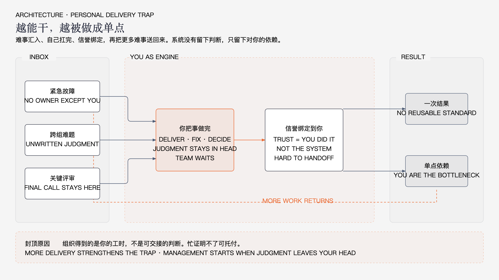
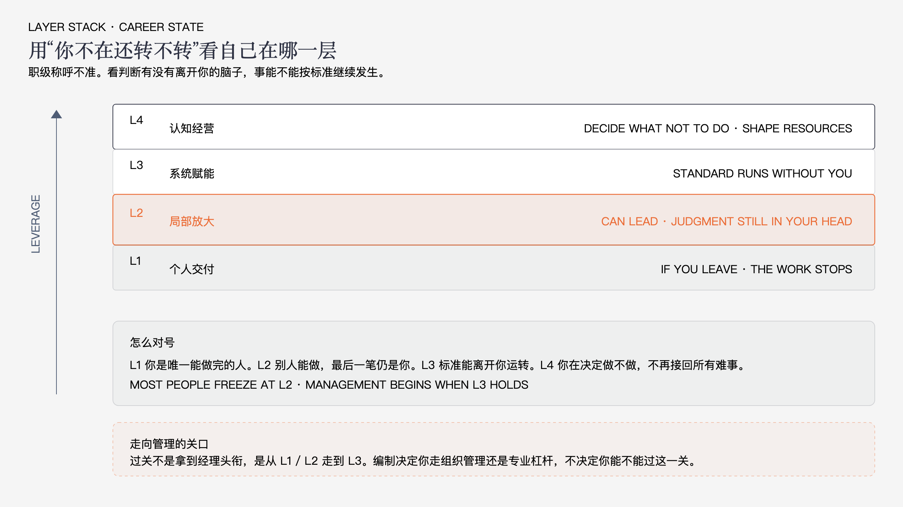

# 走向管理先过能干这关

技术人走到中后期，最容易被自己的优点困住。你会做、能扛、出活快，组织就越来越把难事交给你。看起来是信任，其实是把你钉在执行位上。

走向管理，不是先要一个经理头衔。编制有限，不是人人都能管人。但要往上走，无论是带团队，还是做能影响多人的专家，都得先过同一关：别再靠“更会干活”证明自己值。

这篇只看病。你读完应该能判断自己卡在哪一层、还在用哪套旧办法赚钱。怎么转，下一篇再展开。

---

## 1. 卡点不是技术浅，是个人交付到顶了

很多人把瓶颈理解错了。以为是框架不够新、深度不够、英语不好、没当上领导。这些都可能存在，但中后期最常见的卡法不是这些。

你已经把“自己把事情做完”练到了上限。组织离不开你，也正因为此，不会把更大的盘子交给你。更大的盘子要的是：你不亲手做，正确的事还能持续发生。

个人交付这套模型很简单：问题来了，你接住，你做对，你收尾。早期这是信誉来源。做久了会变成闭环：

难事汇到你这里，你扛下来，信誉上升，更多难事再汇过来。你越来越忙，判断越来越沉在脑子里，别人越来越接不住。最后你变成单点。单点很重要，但很难升，也很难托付。

加时长解决不了这个结构。再深挖一个技术点，也只是让单点更硬，不会让系统更转。AI 把“多写一段、多查一截、多改一轮”变便宜了，执行溢价还在往下掉。还在用“我比别人更能干”换职级和话语权，会越来越贵，越来越不值。

---

## 2. 走向管理，先分清职位和能力

管理岗是编制。管人头、预算、考核、晋升、部门墙。这种位子少，卡住很正常。

管理能力是另一回事：让目标清楚，让取舍可见，让别人能按标准独立产出，让上级能做决定而不是猜你在忙什么。这个不依赖头衔。Tech Lead、架构、平台、质量、效能，都要会。

所以“走向管理”在这篇文章里不是“去当官”。它是换一种价值创造方式：

- 以前证明你行，靠你把事做对。
- 以后证明你行，靠正确的事在更多地方发生。

两条出路都算走向管理，只是权力来源不同。

一条是组织管理者。有人、有权、对结果负责。能力核心是选人、拿结果、把风险提前放到台面上。

一条是专业杠杆者。Staff、架构、平台、技术方向、跨团队标准。没有行政权，靠判断和系统影响多人。

两条路都过同一关：个人交付必须让位。当不上经理，不构成停在执行层的理由。当上了经理还自己改代码救火，只是换了个座位继续当单点。

---

## 3. 四层状态，对上自己的号

不要用职级称呼自己。用你不在场时系统还转不转来看。

**个人交付。** 你不在，这件事停。方案在你脑子里，细节只有你熟，验收也是你说了算。团队把你当最强执行器，你也接受这个角色。典型信号是：请假要先把活搬完，线上问题第一时间找你，你不改就不放心。

**局部放大。** 你能带项目、带新人、定接口、主持评审。周边因你变快。但标准和判断还在你脑子里。别人做完你还要重看、重改、重拍。你不在，项目能推进几天，质量很快漂。这是技术骨干最容易长停的一层：已经不像纯执行，也还没留下可运转的系统。

**系统赋能。** 有人能按你定的标准独立产出。评审是在训练判断，不是你最后再做一遍。规范、清单、门禁、复盘结论能离开你继续用。你休假两周，关键链路不塌。这一层才算过了能干这关。

**认知经营。** 你主要决定做什么、不做什么。影响资源和方向，而不是把所有难事接回来。向上给的是选项和代价，不是工作量。组织因为你少做了错事、少耗了等待，而不只是因为你又救了一场火。

大多数准备走向管理的人，卡在前两层之间。很能救火，很能扛事，也很委屈：明明谁都靠我，为什么更大的事轮不到我。因为靠你，和托付你，不是一回事。

---

## 4. 怎么判断自己还在吃老本

对照这几条。中了三条以上，就还在用个人交付赚钱。

做完一件事，只留下一次结果，没有留下别人下次能用的判断、流程或标准。

你一走，质量和方向明显往下掉。不是短暂交接阵痛，是没人知道什么叫好。

向上汇报先报自己做了多少、有多忙、细节多深。很少报选项、风险、你建议停掉什么。

你觉得难，主要难在没人能接、没有标准可依。技术本身往往已经不是最大头。

AI 让你更快了，但只有你会用。团队没有因此多出一块稳定产能。

还有一种更隐蔽的吃老本：所有难事你都接。短期信誉很好，长期你在训练组织继续把你当执行器。这不是责任感，是用勤奋巩固瓶颈。

---

## 5. 下一篇只展开四句话

看病看到这里就够了。药方指向如下，做法放到下一篇。

卡在个人交付，先把脑子里的判断写出来，少接一类已经会重复出现的难事。

卡在局部放大，停止当最终审批器。评审、方案、复盘是用来复制判断的，不是把活收回来重做。

走专业杠杆，选一个能让多人多次受益的问题，别再接“这个只有我能做”的需求当成就。

走组织管理，先让上级觉得可托付，再谈要人、要权、要对结果负责。

过能干这关，不是让你变懒，也不是让你技术生疏。是承认一件事：继续靠自己做完，走不到管理，也走不到更大的专业影响力。
