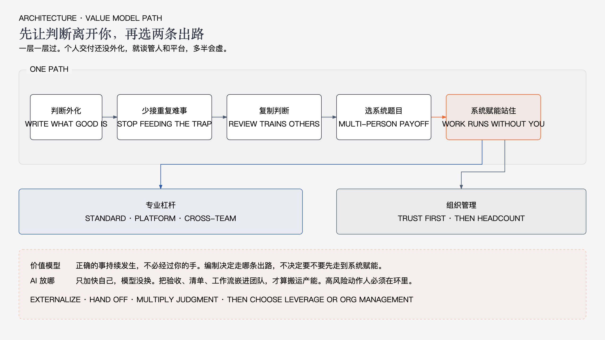

# 管理靠什么价值模型怎么走通

上一篇把病看清楚了：走向管理，先过能干这关。卡点不是技术浅，是个人交付到了顶。职位和能力不是一回事。你多半停在个人交付或局部放大。

这篇把那四句指向写成走法。要换的不是头衔，是赚钱方式。从“我把事做对”，换成“让正确的事持续发生”。

---

## 1. 先换模型，再谈路径

个人交付的账很好算。你投入时间，换一次结果，换一截信誉。管理这套账不一样。一次投入要能被别人反复用：标准、机制、可交接的判断、能跑起来的工作流。

所以高价值工作长得很朴素。做完以后，别人少问你一次，少等你一次，少在同一类问题上返工。你不在场，质量和方向也不先塌。

旧模型停掉的标志也很朴素。有一类难事你不再是第一接盘人。有一套说法离开你还能被执行。上级找你，是来做决定，不是来听你有多忙。

AI 放在这条路上，只是一种搬运产能的手段。只让自己更快，模型没换。能把你的判断做成别人和系统都能用的东西，才算走通了一截。权限、资金、删除、对外承诺，人必须留在环里。

下面按你所在的层走。别跳层。个人交付还没外化，就去谈管人、谈平台，多半会虚。

---

## 2. 卡在个人交付，先把手里的判断拿出来

这一层的事实是：你不在，事就停。要转，不是先带十个人，是先让一件事可以离开你。

先挑一类已经重复出现的难事。不是最难的那件，是够常见、你闭着眼睛也知道怎么判的那类。线上排查、方案评审、需求裁剪、事故复盘，都常见。挑一类，写清楚什么叫好、什么不能做、做到哪算完、什么时候该升级。写到一个没做过这件事的人，能按它走完第一遍，并且知道何时停下来问你。

写不出来，就还没外化。还在你脑子里的经验，带不走，也管不了人。

同时从你手里拿掉一类活。不是全扔。留下高风险、判断暂时讲不清、做错不可逆的。拿掉的是你已经能讲清、别人做了你只是不放心的。不放心是习惯，不是证据。证据在验收，不在你重做一遍。

转的时候质量会晃。这是正常的。你要做的是把验收标准提前说死，做错了按标准回炉，而不是默默接回来连夜改。一接回来，组织就学会了：最后还是你会扛。信誉靠这一下能保住，模型换不成。

这一层走通的标志：至少一类事，别人能按你的标准做完，你只看例外。你请假三天，这类事不必先堵在你桌上。

---

## 3. 卡在局部放大，别再当最后那一笔

这一层更难受。你已经在带人、带项目，看起来像管理了。其实判断还没交出去。别人做完，你改标题、改方案、改代码、改结论。团队在增长对你的依赖，不是在增长判断力。

停当最终审批器，不是放任质量。是改验收方式。评审时先问他怎么想、依据是什么、放弃了什么，再给结论。你直接改成品，他只学会了你的口味，没学会你的判据。下一次还得你来。

带人时要分清两种“还不会”。标准没给够，是你的问题，补标准，再让他做一次。标准在，重复栽在同一处，是他的问题，收窄范围或换人扛。两种都当成“还是我来”，你会把自己做回个人交付。

什么时候拒绝接回，看三件事。这件事会不会反复出现；判断能不能讲清楚；接回来是不是只因为快。会反复、能讲清、只是快，就别接。接一次，系统退一步。

方案、评审、复盘，都按这个用。写方案是为了让别人能按同一套结构想问题。评审是为了让下一次少犯同一类错。复盘是为了留下可执行的改法，不是留下“下次注意”。注意不是标准。

这一层走通的标志：你不改最终成品，项目质量仍在线。有人能主持你定过的评审，结论你大体认。你开始有时间碰下一层的题目，而不是把所有晚上留给收尾。

---

## 4. 高价值工作怎么选，旧活怎么停

过了前两层，你会空出一点时间。别立刻填回最难的需求。那是旧模型最熟悉的食物。

接下来一个季度，只认一类题目：做完能让多人多次少出错、少等待、少问你。平台、规范、质量门禁、可复用工作流、跨团队的接口约定，都可能是。散落的咨询、救火、个人演示，不算。

怎么判断是“一件”而不是散活。有明确边界，有验收，有人会用，离开你还能转。做了三个月只有你自己觉得世界清净了，那是自嗨，不是系统。

必须减的活，往往长得很光荣。每个评审你都最后拍板。每个故障你都值夜班。每个跨组需求你都当翻译。每个新技术你都自己先啃再当顾问。这些能维持“我很重要”，也会把你钉死。

减的方法不是宣言，是替换。这类评审改成按清单过；这类故障先由一线按手册处理，升到你这里的必须带证据；跨组翻译沉淀成接口说明；新技术先变成团队能用的最小工作流，再谈研究。减不掉的，说明标准还没写够，回到第 2、3 节，别硬扛着喊转型。

---

## 5. 两条出路，分开走

专业杠杆和组织管理，都从系统赋能往上长。不要混成一种活法。

走专业杠杆，选系统问题。一个规范、一层平台、一套质量门禁、一条被多个团队采用的工作流。你的产品是判断被复用，不是你又做了一个最难的需求。没有行政权，就更要让标准自己说话：写成文，卡在流程里，挂在门禁上。别人遵守，不是因为怕你，是因为不遵守会立刻痛。向上要资源时，讲的是减少了多少返工和事故，不是你研究有多深。

走组织管理，先经营可托付。上级要能从你这儿得到三样东西：现在最要紧的一个问题，两到三个选项和代价，你的建议。他做完决定能睡，才谈得上给你人和权。先要编制再谈方法，多半要来一堆人，活还是汇到你桌上。对结果负责的意思是，你不再用“我已经提醒过他们”脱身。选谁扛、标准在不在、风险有没有提前说，都是你的账。

两条路都会碰到向上和带队。它们是手段，不是第三篇文章。向上是给决策，不是报忙碌。带队是交判断，不是派工。专业杠杆少不了向上要窗口；组织管理少不了把判断交给人。只是主产品不同：一个交出系统，一个交出可托付的团队结果。

没编制就走专业杠杆，不必等任命。有编制也先检查自己是不是还在当最强执行器。座位换了，模型没换，只是瓶颈换了名字。

---

## 6. 这条路怎么算走通

不必等升职信。看行为。

至少一类重复难事离开你还能做完。你主持的评审开始出现别人的合格判断，而不只是你的批注。你向上开口，能把问题收成选项。你这个季度能指出一件留下的系统产出，而不只是一串做完的需求。AI 如果用了，是嵌在团队怎么验收里，不是嵌在你个人速度里。

走不通的样子也清楚。标准写了没人用。活交出去又全部接回。向上仍在报工时。平台项目做成了你的副业演示。团队人人都会用 AI 出活，却没有同一套对错。

管理靠的价值模型就这一句：正确的事持续发生，不必经过你的手。走通的路径也短：判断外化，少接重复难事，复制判断，选系统题目，按编制现实走专业杠杆或组织管理。一层一层过。能干这关不过，后面都是加戏。
